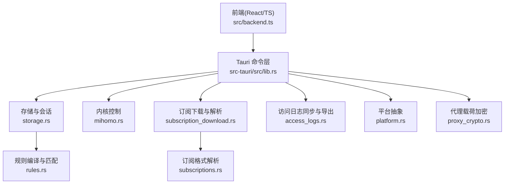
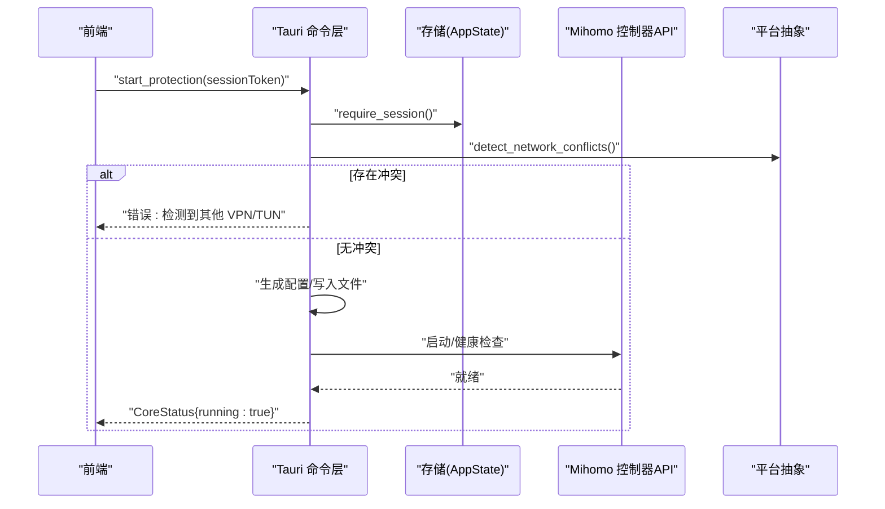
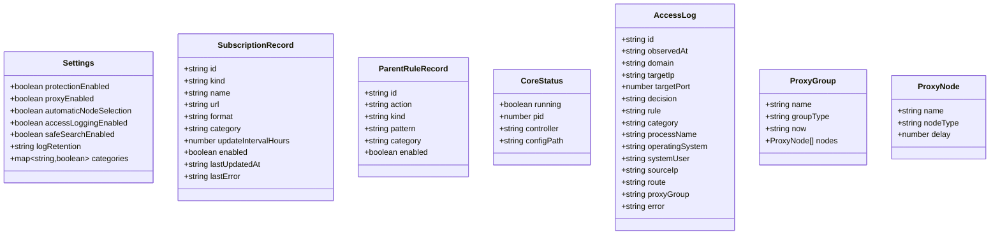
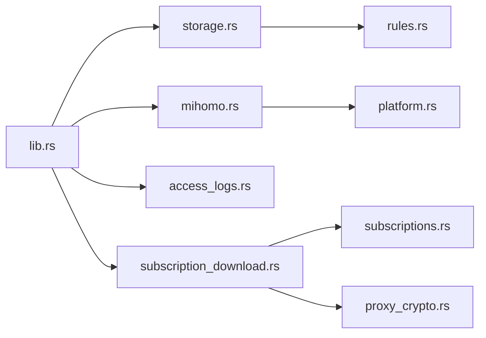

# API 参考

<cite>
**本文引用的文件**
- [lib.rs](file://src-tauri/src/lib.rs)
- [main.rs](file://src-tauri/src/main.rs)
- [storage.rs](file://src-tauri/src/storage.rs)
- [mihomo.rs](file://src-tauri/src/mihomo.rs)
- [access_logs.rs](file://src-tauri/src/access_logs.rs)
- [subscription_download.rs](file://src-tauri/src/subscription_download.rs)
- [subscriptions.rs](file://src-tauri/src/subscriptions.rs)
- [rules.rs](file://src-tauri/src/rules.rs)
- [platform.rs](file://src-tauri/src/platform.rs)
- [proxy_crypto.rs](file://src-tauri/src/proxy_crypto.rs)
- [backend.ts](file://src/backend.ts)
- [tauri.conf.json](file://src-tauri/tauri.conf.json)
- [README.md](file://README.md)
- [architecture.md](file://docs/architecture.md)
</cite>

## 目录
1. [简介](#简介)
2. [项目结构](#项目结构)
3. [核心组件](#核心组件)
4. [架构总览](#架构总览)
5. [详细组件分析](#详细组件分析)
6. [依赖关系分析](#依赖关系分析)
7. [性能考虑](#性能考虑)
8. [故障排查指南](#故障排查指南)
9. [结论](#结论)
10. [附录](#附录)

## 简介
本文件为 CleanWeb 的完整 API 参考，覆盖以下接口与通信方式：
- Tauri 命令接口（方法签名、参数、返回值、错误码）
- HTTP 控制器接口（请求/响应格式、认证、状态码）
- IPC 通信（消息格式、事件类型、实时交互模式）
- 协议特定示例（订阅解析、代理节点导入）
- 错误处理策略与版本兼容信息
- 常用用例、客户端实现指南与性能优化建议
- 调试工具与监控方法
- 已弃用功能的迁移指南

CleanWeb 采用 Tauri 2 + React/TypeScript 前端，Rust 后端通过 tauri::command 暴露能力；Mihomo 作为独立内核通过外部控制器 API 管理。

章节来源
- [README.md:1-34](file://README.md#L1-L34)
- [tauri.conf.json:1-28](file://src-tauri/tauri.conf.json#L1-L28)

## 项目结构
- 前端 TypeScript 封装位于 src/backend.ts，统一调用 Tauri invoke 或浏览器预览模式
- Rust 后端模块位于 src-tauri/src，按功能划分：存储、订阅下载、规则引擎、访问日志、平台抽象、代理加密等
- Tauri 入口在 lib.rs 中注册所有命令并启动应用

图表来源
- [lib.rs:46-79](file://src-tauri/src/lib.rs#L46-L79)
- [backend.ts:1-137](file://src/backend.ts#L1-L137)

章节来源
- [lib.rs:1-83](file://src-tauri/src/lib.rs#L1-L83)
- [backend.ts:1-137](file://src/backend.ts#L1-L137)

## 核心组件
- 会话与设置：密码初始化、解锁/锁定、设置读写、受保护操作校验
- 订阅管理：创建/删除/启用、推荐源、刷新与增量更新
- 规则系统：多格式导入、父级规则、匹配优先级
- 代理内核：启动/停止/重载、节点选择、延迟测试、冲突检测
- 访问日志：拉取连接记录、本地持久化、清理与导出 CSV
- 安全：代理载荷 AES-GCM 加密，密钥存放系统 Keychain

章节来源
- [storage.rs:383-800](file://src-tauri/src/storage.rs#L383-L800)
- [subscription_download.rs:40-146](file://src-tauri/src/subscription_download.rs#L40-L146)
- [subscriptions.rs:44-95](file://src-tauri/src/subscriptions.rs#L44-L95)
- [rules.rs:67-147](file://src-tauri/src/rules.rs#L67-L147)
- [mihomo.rs:118-563](file://src-tauri/src/mihomo.rs#L118-L563)
- [access_logs.rs:74-217](file://src-tauri/src/access_logs.rs#L74-L217)
- [proxy_crypto.rs:24-136](file://src-tauri/src/proxy_crypto.rs#L24-L136)

## 架构总览
CleanWeb 将策略与内核解耦：UI 仅通过 Tauri 命令与后端交互；后端负责策略存储、规则编译、内核生命周期与日志采集。Mihomo 以独立进程运行并通过外部控制器 API 进行配置与查询。

图表来源
- [mihomo.rs:157-258](file://src-tauri/src/mihomo.rs#L157-L258)
- [platform.rs:49-73](file://src-tauri/src/platform.rs#L49-L73)
- [lib.rs:46-79](file://src-tauri/src/lib.rs#L46-L79)

章节来源
- [architecture.md:1-52](file://docs/architecture.md#L1-L52)

## 详细组件分析

### Tauri 命令接口总览
所有命令均通过 tauri::generate_handler! 注册，返回 Result<T, String>，错误以字符串形式返回。需要权限的命令需携带 session_token，并在服务端校验有效期。

- 通用约定
  - 认证：session_token 由 unlock 返回，默认 TTL 15 分钟，每次使用会续期
  - 错误：字符串描述，包含具体原因（如“管理密码错误”、“订阅不存在”等）
  - 字段命名：Rust 侧使用 serde rename_all = "camelCase"，前后端一致

章节来源
- [lib.rs:46-79](file://src-tauri/src/lib.rs#L46-L79)
- [storage.rs:21-41](file://src-tauri/src/storage.rs#L21-L41)

#### 引导与会话
- get_bootstrap_state
  - 入参：无
  - 出参：BootstrapState{password_configured: boolean}
  - 用途：判断是否已设置管理密码
- initialize_password(password: string)
  - 入参：password（至少8字符）
  - 出参：空
  - 错误：密码长度不足、已设置过密码
- unlock(password: string)
  - 入参：password
  - 出参：UnlockResult{session_token, expires_in_seconds}
  - 错误：未设置密码、密码错误
- lock(session_token: string)
  - 入参：session_token
  - 出参：空
  - 行为：立即失效指定会话

章节来源
- [storage.rs:383-466](file://src-tauri/src/storage.rs#L383-L466)

#### 设置管理
- get_settings
  - 入参：无
  - 出参：Settings{protection_enabled, proxy_enabled, automatic_node_selection, access_logging_enabled, safe_search_enabled, log_retention, categories}
- update_setting(session_token, key, value)
  - 入参：session_token, key, value
  - 出参：Settings
  - 校验：key/value 白名单；开启 proxy_enabled 时要求存在可用 Clash 代理数据
  - 错误：不支持的设置或值、缺少可用代理节点

章节来源
- [storage.rs:468-506](file://src-tauri/src/storage.rs#L468-L506)

#### 订阅管理
- list_subscriptions(session_token, kind?)
  - 入参：kind 可选 rule|proxy
  - 出参：SubscriptionRecord[]
- create_subscription(session_token, input: NewSubscription)
  - 入参：kind(rule|proxy), name, url(http/https), format?, category?, update_interval_hours?(6|12|24|168)
  - 出参：SubscriptionRecord
  - 错误：名称无效、URL 非法、更新周期无效
- set_subscription_enabled(session_token, id, enabled)
  - 出参：空
  - 错误：订阅不存在
- delete_subscription(session_token, id)
  - 出参：空
  - 错误：订阅不存在
- get_recommended_sources
  - 出参：RecommendedSource[]（内置 hosts/adblock/domain-list/ip-list/clash 等）

章节来源
- [storage.rs:508-624](file://src-tauri/src/storage.rs#L508-L624)

#### 订阅刷新
- refresh_subscription(session_token, id)
  - 行为：下载文本 -> 识别格式 -> 规则导入或代理载荷解密存储 -> 更新元数据
  - 出参：RefreshReport{detected_format, imported_count, ignored_count, proxy_count, group_count}
  - 限制：最大 20MB；UTF-8 文本；支持 Clash YAML、URI 列表、SafeSearch Manifest
- refresh_due_subscriptions()
  - 行为：批量刷新到期的订阅
  - 出参：成功更新的订阅数量

章节来源
- [subscription_download.rs:40-146](file://src-tauri/src/subscription_download.rs#L40-L146)
- [subscription_download.rs:148-234](file://src-tauri/src/subscription_download.rs#L148-L234)
- [subscription_download.rs:236-300](file://src-tauri/src/subscription_download.rs#L236-L300)

#### 规则与父级规则
- list_parent_rules(session_token)
  - 出参：ParentRuleRecord[]
- create_parent_rule(session_token, input: NewParentRule)
  - 入参：action(allow|block|proxy), kind(exact|suffix|contains|wildcard|regex|ip|cidr), pattern, category?
  - 行为：编译验证规则，保存并返回
  - 错误：规则内容含逗号/换行、动作/类型无效、正则/网络格式非法
- set_parent_rule_enabled(session_token, id, enabled)
- delete_parent_rule(session_token, id)

章节来源
- [storage.rs:626-754](file://src-tauri/src/storage.rs#L626-L754)
- [rules.rs:67-147](file://src-tauri/src/rules.rs#L67-L147)

#### 代理内核控制
- get_core_status
  - 出参：CoreStatus{running, pid?, controller, config_path}
- start_protection(session_token)
  - 行为：冲突检测 -> 准备二进制与配置 -> 启动 -> 健康检查 -> 返回状态
  - 错误：存在其他 VPN/TUN、启动失败、超时
- auto_start_protection
  - 行为：若 protection_enabled 则尝试启动，否则直接返回当前状态
- stop_protection(session_token)
- reload_protection(session_token)
  - 行为：生成新配置 -> 校验 -> 通过控制器 PUT /configs 热重载
- test_proxy_group(session_token, group="CleanWeb")
  - 出参：DelayResult{delay}
- get_proxies(session_token)
  - 出参：ProxyGroup[]（仅显示组类型）
- get_subscription_proxies(session_token, subscription_id)
  - 出参：SubscriptionProxyInfo{proxies[], groups[]}
- select_proxy(session_token, group, name)
  - 行为：PUT /proxies/{group} 选择节点，并持久化选择
- test_all_proxy_delays(session_token, group="CleanWeb")
  - 出参：ProxyDelayResult{delays: Record<string,number>}
- get_network_conflicts
  - 出参：NetworkConflicts{has_conflict, interfaces[], vpn_services[]}

章节来源
- [mihomo.rs:118-563](file://src-tauri/src/mihomo.rs#L118-L563)
- [platform.rs:49-73](file://src-tauri/src/platform.rs#L49-L73)

#### 访问日志
- sync_access_logs
  - 行为：从控制器 GET /connections 拉取连接，落库并清理过期记录
  - 出参：本次插入条数
- list_access_logs(session_token, decision?, search?, limit=500)
  - 出参：AccessLog[]
- clear_access_logs(session_token)
  - 出参：删除行数
- export_access_logs_csv(session_token)
  - 出参：CSV 文本（首行为表头）

章节来源
- [access_logs.rs:74-217](file://src-tauri/src/access_logs.rs#L74-L217)

### HTTP 控制器接口（Mihomo 外部 API）
CleanWeb 通过 Bearer Token 访问 Mihomo 控制器（地址与密钥由后端生成）。以下为关键路径与用法说明。

- 认证
  - Header: Authorization: Bearer <secret>
  - secret 由后端生成并写入配置，供内部调用
- 常用路径
  - GET /proxies：获取全部代理与分组信息
  - GET /proxies/{group}/delay?url=...&timeout=...：测速单个组
  - GET /group/{group}/delay?url=...&timeout=...：测速组内所有节点
  - PUT /proxies/{group}：选择节点 {name}
  - PUT /configs?force=true：热重载配置 {path}
- 典型状态码
  - 200：成功
  - 4xx/5xx：请求错误或内核异常（后端会将错误转为字符串错误返回给前端）

注意：以上路径与参数由后端构造，前端无需直接调用。

章节来源
- [mihomo.rs:315-563](file://src-tauri/src/mihomo.rs#L315-L563)

### IPC 通信（Tauri invoke）
- 通道：@tauri-apps/api/core.invoke
- 消息格式：命令名 + JSON 参数；返回 JSON 结果或抛出错误字符串
- 事件：当前版本未暴露自定义事件；后台定时任务在 Rust 侧执行（访问日志同步）
- 实时交互：通过轮询命令获取最新状态（如 get_proxies、list_access_logs）

章节来源
- [lib.rs:46-79](file://src-tauri/src/lib.rs#L46-L79)
- [backend.ts:1-137](file://src/backend.ts#L1-L137)

### 协议与订阅解析
- 支持的规则订阅格式
  - Clash 规则行（DOMAIN/DOMAIN-SUFFIX/DOMAIN-KEYWORD/IP-CIDR 等）
  - hosts 条目（忽略 localhost/broadcasthost/local）
  - domain-list（纯域名）
  - ip-list（IPv4/IPv6/CIDR）
  - Adblock（仅域名规则，支持 @@ 放行）
  - SafeSearch Manifest（YAML，映射搜索引擎域到强制安全搜索目标）
- 代理订阅
  - 支持 Clash YAML 与 URI 列表（ss/ssr/vmess/vless/trojan/hysteria/tuic/socks/http(s)/wireguard）
  - 代理载荷以 AES-GCM 加密存储，密钥保存在系统 Keychain

章节来源
- [subscriptions.rs:44-95](file://src-tauri/src/subscriptions.rs#L44-L95)
- [subscription_download.rs:236-300](file://src-tauri/src/subscription_download.rs#L236-L300)
- [proxy_crypto.rs:24-136](file://src-tauri/src/proxy_crypto.rs#L24-L136)

### 类图（核心数据结构）

图表来源
- [storage.rs:44-89](file://src-tauri/src/storage.rs#L44-L89)
- [mihomo.rs:46-104](file://src-tauri/src/mihomo.rs#L46-L104)
- [access_logs.rs:54-72](file://src-tauri/src/access_logs.rs#L54-L72)

## 依赖关系分析
- 命令注册：lib.rs 集中注册 storage/mihomo/access_logs/subscription_download 模块命令
- 运行时依赖：SQLite（rusqlite）、HTTP（reqwest）、加密（aes-gcm/keyring）、平台命令（osascript/taskkill 等）
- 模块耦合：
  - mihomo 依赖 platform 与 storage（读取设置、写 PID/配置）
  - subscription_download 依赖 subscriptions 与 proxy_crypto
  - access_logs 依赖 mihomo 控制器与 storage

图表来源
- [lib.rs:1-83](file://src-tauri/src/lib.rs#L1-L83)

章节来源
- [lib.rs:1-83](file://src-tauri/src/lib.rs#L1-L83)

## 性能考虑
- 订阅刷新
  - 单次大小上限 20MB，避免大文件阻塞
  - 自动刷新基于 update_interval_hours 计算到期时间，减少不必要下载
- 规则编译
  - 精确/后缀优先于通配/正则，降低匹配成本
- 访问日志
  - 后台线程每 750ms 同步一次，限制查询上限 5000 条
  - 支持按保留策略清理旧记录（7d/30d/90d/forever）
- 代理选择
  - 手动选择后关闭自动选择，避免频繁切换

章节来源
- [subscription_download.rs:16](file://src-tauri/src/subscription_download.rs#L16)
- [subscription_download.rs:127-146](file://src-tauri/src/subscription_download.rs#L127-L146)
- [rules.rs:126-147](file://src-tauri/src/rules.rs#L126-L147)
- [access_logs.rs:219-241](file://src-tauri/src/access_logs.rs#L219-L241)
- [lib.rs:21-25](file://src-tauri/src/lib.rs#L21-L25)

## 故障排查指南
- 启动失败
  - 常见错误：存在其他 VPN/TUN、Mihomo 启动后立即退出、等待 TUN 就绪超时
  - 定位：查看返回的错误字符串与 mihomo.log 最后若干行
- 代理不可用
  - 确认已导入有效 Clash 订阅且至少一个节点可用
  - 使用 test_proxy_group/test_all_proxy_delays 验证连通性
- 规则不生效
  - 检查父级规则优先级与匹配类型
  - 确认订阅刷新成功且 imported_count > 0
- 访问日志为空
  - 确认 access_logging_enabled 为 true
  - 检查控制器 /connections 可达性与鉴权

章节来源
- [mihomo.rs:182-258](file://src-tauri/src/mihomo.rs#L182-L258)
- [mihomo.rs:270-313](file://src-tauri/src/mihomo.rs#L270-L313)
- [access_logs.rs:74-126](file://src-tauri/src/access_logs.rs#L74-L126)

## 结论
CleanWeb 通过清晰的 Tauri 命令边界与独立的 Mihomo 内核，实现了可维护、可扩展的家庭网络过滤与代理管理能力。API 设计强调安全性（会话、加密）、可观测性（访问日志）与易用性（推荐源、一键刷新）。后续可在 Windows 上增强网络冲突检测与进程身份绑定，进一步提升抗绕过能力。

## 附录

### 客户端实现指南（TypeScript）
- 使用 @tauri-apps/api/core.invoke 调用命令
- 在浏览器预览模式下，backend.ts 提供等价模拟实现，便于开发联调
- 建议对耗时操作（刷新订阅、批量测速）增加进度提示与重试机制

章节来源
- [backend.ts:1-137](file://src/backend.ts#L1-L137)

### 版本兼容与打包
- 产品标识 app.cleanweb.desktop，版本号 0.1.0
- 资源包含 mihomo 二进制与 safe-search 清单
- Windows 发布构建自动请求管理员权限（TUN 需要）

章节来源
- [tauri.conf.json:1-28](file://src-tauri/tauri.conf.json#L1-L28)
- [main.rs:92-98](file://src-tauri/src/main.rs#L92-L98)

### 已弃用/迁移指南
- 代理载荷明文存储已弃用
  - 现象：proxy_payloads.payload 不以 cw1:aes-256-gcm: 开头
  - 迁移：应用启动时自动扫描并加密存量明文记录
  - 参考：encrypt_existing_proxy_payloads 流程

章节来源
- [proxy_crypto.rs:72-103](file://src-tauri/src/proxy_crypto.rs#L72-L103)