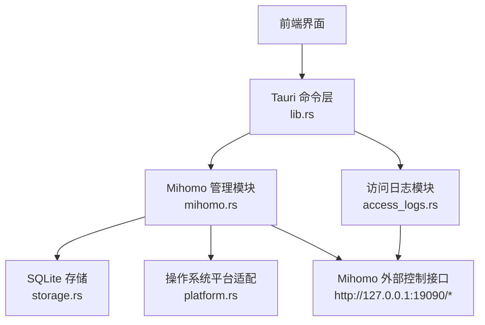
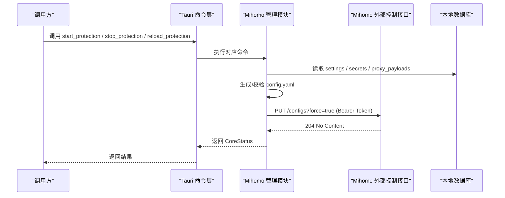
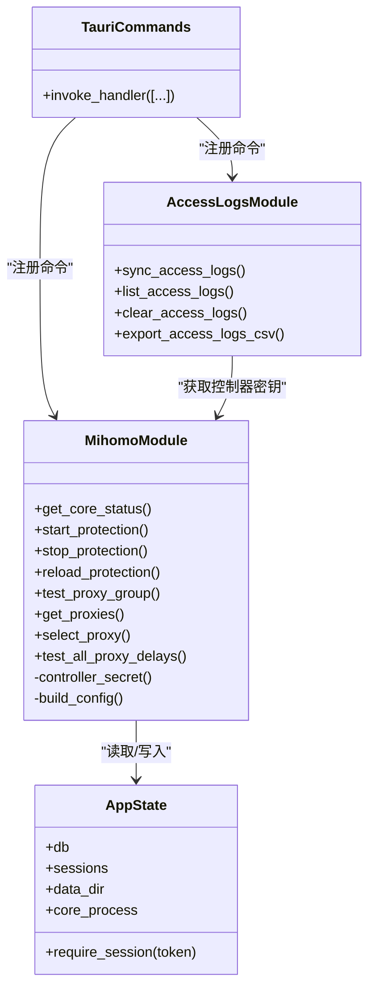

# HTTP 控制器接口

<cite>
**本文引用的文件**   
- [mihomo.rs](file://src-tauri/src/mihomo.rs)
- [access_logs.rs](file://src-tauri/src/access_logs.rs)
- [lib.rs](file://src-tauri/src/lib.rs)
- [storage.rs](file://src-tauri/src/storage.rs)
</cite>

## 目录
1. [简介](#简介)
2. [项目结构](#项目结构)
3. [核心组件](#核心组件)
4. [架构总览](#架构总览)
5. [详细组件分析](#详细组件分析)
6. [依赖关系分析](#依赖关系分析)
7. [性能与可用性考虑](#性能与可用性考虑)
8. [故障排查指南](#故障排查指南)
9. [结论](#结论)
10. [附录：客户端集成与 curl 示例](#附录客户端集成与-curl-示例)

## 简介
本文件为 CleanWeb 的 Mihomo 内核外部控制接口提供 API 文档。CleanWeb 通过 Tauri 命令层暴露能力，内部以本地回环地址访问 Mihomo 的外部控制接口（HTTP），并封装为应用侧可用的操作，包括状态查询、配置重载、代理列表与选择、延迟测试等。所有对 Mihomo 的 HTTP 调用均使用 Bearer Token 认证，Token 由应用侧生成并持久化在数据库的 app_secrets 表中。

## 项目结构
- 后端 Rust 模块负责：
  - 启动/停止/重载 Mihomo 进程
  - 生成并写入 Mihomo 配置文件
  - 通过 reqwest 调用 Mihomo 外部控制接口
  - 将连接日志同步到本地 SQLite
- 前端通过 Tauri invoke 调用后端命令，间接实现对 Mihomo 的控制。

图表来源
- [lib.rs:46-79](file://src-tauri/src/lib.rs#L46-L79)
- [mihomo.rs:44-44](file://src-tauri/src/mihomo.rs#L44-L44)
- [access_logs.rs:13-13](file://src-tauri/src/access_logs.rs#L13-L13)

章节来源
- [lib.rs:14-82](file://src-tauri/src/lib.rs#L14-L82)
- [mihomo.rs:182-313](file://src-tauri/src/mihomo.rs#L182-L313)
- [access_logs.rs:74-126](file://src-tauri/src/access_logs.rs#L74-L126)

## 核心组件
- 会话与会话令牌
  - 管理密码解锁后返回 session_token，有效期固定时长；后续需要权限的命令需携带该 token。
- 控制器密钥
  - 每次运行或首次使用时从数据库读取或生成 controller_secret，用于访问 Mihomo 外部控制接口的 Bearer Token。
- 进程与配置
  - 根据设置动态生成 Mihomo 配置文件，校验通过后通过外部控制接口热重载。
- 代理与分组
  - 拉取代理组信息、选择节点、测速等。

章节来源
- [storage.rs:265-276](file://src-tauri/src/storage.rs#L265-L276)
- [mihomo.rs:1059-1079](file://src-tauri/src/mihomo.rs#L1059-L1079)
- [mihomo.rs:270-313](file://src-tauri/src/mihomo.rs#L270-L313)

## 架构总览
CleanWeb 作为宿主进程，负责：
- 生命周期管理：下载/校验/解压官方 Mihomo 二进制，按平台拉起进程
- 配置管理：合并订阅、规则、安全搜索映射，输出 config.yaml
- 外部控制：通过 http://127.0.0.1:19090 访问 Mihomo 外部控制接口，统一加 Bearer Token

图表来源
- [mihomo.rs:270-313](file://src-tauri/src/mihomo.rs#L270-L313)
- [mihomo.rs:612-916](file://src-tauri/src/mihomo.rs#L612-L916)
- [mihomo.rs:1059-1079](file://src-tauri/src/mihomo.rs#L1059-L1079)

## 详细组件分析

### 认证机制
- 管理会话
  - 通过 unlock 获取 session_token，有效期固定时长；后续写操作需携带该 token。
- 控制器密钥
  - 每个运行实例维护一个 controller_secret，用于访问 Mihomo 外部控制接口。
  - 若不存在则自动生成并持久化。

章节来源
- [storage.rs:430-456](file://src-tauri/src/storage.rs#L430-L456)
- [storage.rs:265-276](file://src-tauri/src/storage.rs#L265-L276)
- [mihomo.rs:1059-1079](file://src-tauri/src/mihomo.rs#L1059-L1079)

### 状态查询
- 功能：获取 Mihomo 内核运行状态、PID、控制器地址、配置文件路径。
- 实现要点：
  - 检查当前进程句柄或 PID 文件判断是否运行
  - 返回固定控制器地址与配置文件路径

章节来源
- [mihomo.rs:124-155](file://src-tauri/src/mihomo.rs#L124-L155)
- [mihomo.rs:594-607](file://src-tauri/src/mihomo.rs#L594-L607)

### 配置管理
- 重载配置
  - 生成新配置 -> 校验 -> 通过外部控制接口 PUT /configs?force=true 热重载
  - 请求体包含 path 字段指向生成的配置文件路径
  - 使用 Bearer Token 认证
- 相关错误：
  - 配置校验失败时返回具体错误信息
  - 网络请求失败或响应非成功状态码会转换为错误

章节来源
- [mihomo.rs:270-313](file://src-tauri/src/mihomo.rs#L270-L313)
- [mihomo.rs:612-916](file://src-tauri/src/mihomo.rs#L612-L916)

### 代理操作
- 获取代理组列表
  - GET /proxies，解析 proxies 对象，仅展示代理组类型
  - 返回组名、类型、当前选中节点、成员列表及最近延迟
- 选择代理节点
  - PUT /proxies/{group}，请求体 { name }
  - 成功后更新本地选择记录，并在特定组下关闭自动选择
- 测试单个代理组延迟
  - GET /proxies/{group}/delay?url=...&timeout=...
  - 返回 delay 数值
- 测试组内所有节点延迟
  - GET /group/{group}/delay?url=...&timeout=...
  - 返回各节点延迟映射

章节来源
- [mihomo.rs:349-416](file://src-tauri/src/mihomo.rs#L349-L416)
- [mihomo.rs:487-524](file://src-tauri/src/mihomo.rs#L487-L524)
- [mihomo.rs:316-347](file://src-tauri/src/mihomo.rs#L316-L347)
- [mihomo.rs:527-563](file://src-tauri/src/mihomo.rs#L527-L563)

### 连接日志同步
- 定时任务
  - 后台线程周期性调用 sync_access_logs_inner
- 数据源
  - GET /connections，使用 Bearer Token 认证
- 处理逻辑
  - 解析 connections 列表，计算 decision、route、proxy_group 等
  - 写入本地 access_logs 表，并按保留策略清理旧记录

章节来源
- [access_logs.rs:74-126](file://src-tauri/src/access_logs.rs#L74-L126)
- [access_logs.rs:219-241](file://src-tauri/src/access_logs.rs#L219-L241)

## 依赖关系分析
- 模块耦合
  - mihomo.rs 依赖 storage.rs 的 AppState 和数据库读写
  - access_logs.rs 依赖 mihomo.rs 的 controller_secret 与 platform 信息
  - lib.rs 注册所有 Tauri 命令，形成对外入口
- 外部依赖
  - Mihomo 外部控制接口（HTTP）
  - SQLite 本地数据库
  - 系统平台能力（进程管理、权限提升等）

图表来源
- [lib.rs:46-79](file://src-tauri/src/lib.rs#L46-L79)
- [storage.rs:23-27](file://src-tauri/src/storage.rs#L23-L27)
- [mihomo.rs:118-121](file://src-tauri/src/mihomo.rs#L118-L121)
- [access_logs.rs:74-77](file://src-tauri/src/access_logs.rs#L74-L77)

章节来源
- [lib.rs:46-79](file://src-tauri/src/lib.rs#L46-L79)
- [storage.rs:23-27](file://src-tauri/src/storage.rs#L23-L27)
- [mihomo.rs:118-121](file://src-tauri/src/mihomo.rs#L118-L121)
- [access_logs.rs:74-77](file://src-tauri/src/access_logs.rs#L74-L77)

## 性能与可用性考虑
- 配置重载前进行语法校验，避免无效配置导致内核异常
- 启动流程中轮询健康日志，快速失败并给出可读错误
- 代理测速使用短超时与固定探测 URL，减少阻塞时间
- 连接日志同步采用增量去重插入，定期清理历史数据

[本节为通用指导，不直接分析具体文件]

## 故障排查指南
- 启动失败
  - 检测其他 VPN/TUN 冲突，返回明确提示
  - 等待 TUN 就绪超时或立即退出时，返回最后若干行日志
- 配置重载失败
  - 返回校验失败的 stderr 内容
- 代理操作失败
  - 检查控制器地址与 Bearer Token 是否正确
  - 确认代理组名称与成员存在

章节来源
- [mihomo.rs:182-258](file://src-tauri/src/mihomo.rs#L182-L258)
- [mihomo.rs:270-313](file://src-tauri/src/mihomo.rs#L270-L313)
- [mihomo.rs:316-347](file://src-tauri/src/mihomo.rs#L316-L347)

## 结论
CleanWeb 通过 Tauri 命令层封装了 Mihomo 外部控制接口，提供了安全的本地管理能力。所有敏感操作均受会话令牌保护，对 Mihomo 的 HTTP 调用均使用 Bearer Token 认证。通过完善的错误处理与日志输出，便于定位问题与持续优化。

[本节为总结性内容，不直接分析具体文件]

## 附录：客户端集成与 curl 示例

说明
- 以下 curl 示例演示如何直接与 Mihomo 外部控制接口交互。实际应用中建议通过 CleanWeb 提供的 Tauri 命令层调用，以获得更好的安全性与一致性。
- 所有请求均需携带 Authorization: Bearer <controller_secret>。
- 控制器地址固定为 http://127.0.0.1:19090。

常用端点
- 获取代理列表
  - 方法：GET
  - 路径：/proxies
  - 请求头：Authorization: Bearer <token>
  - 响应：JSON，包含 proxies 对象
- 选择代理节点
  - 方法：PUT
  - 路径：/proxies/{group}
  - 请求头：Authorization: Bearer <token>
  - 请求体：{ "name": "<node>" }
  - 响应：204 No Content
- 测试代理组延迟
  - 方法：GET
  - 路径：/proxies/{group}/delay
  - 查询参数：url=https://www.gstatic.com/generate_204, timeout=5000
  - 请求头：Authorization: Bearer <token>
  - 响应：JSON，包含 delay 数值
- 测试组内所有节点延迟
  - 方法：GET
  - 路径：/group/{group}/delay
  - 查询参数：url=https://www.gstatic.com/generate_204, timeout=5000
  - 请求头：Authorization: Bearer <token>
  - 响应：JSON，键为节点名，值为延迟毫秒数
- 重载配置
  - 方法：PUT
  - 路径：/configs?force=true
  - 请求头：Authorization: Bearer <token>, Content-Type: application/json
  - 请求体：{ "path": "<config.yaml 绝对路径>" }
  - 响应：204 No Content
- 获取连接列表（用于日志同步）
  - 方法：GET
  - 路径：/connections
  - 请求头：Authorization: Bearer <token>
  - 响应：JSON，包含 connections 数组

curl 示例
- 获取代理列表
  - curl -H "Authorization: Bearer <token>" http://127.0.0.1:19090/proxies
- 选择代理节点
  - curl -X PUT -H "Authorization: Bearer <token>" -H "Content-Type: application/json" -d '{"name":"node-a"}' http://127.0.0.1:19090/proxies/CleanWeb
- 测试代理组延迟
  - curl -H "Authorization: Bearer <token>" "http://127.0.0.1:19090/proxies/CleanWeb/delay?url=https://www.gstatic.com/generate_204&timeout=5000"
- 测试组内所有节点延迟
  - curl -H "Authorization: Bearer <token>" "http://127.0.0.1:19090/group/CleanWeb/delay?url=https://www.gstatic.com/generate_204&timeout=5000"
- 重载配置
  - curl -X PUT -H "Authorization: Bearer <token>" -H "Content-Type: application/json" -d '{"path":"/Users/<user>/Library/Application Support/<app>/cleanweb.db/../mihomo/config.yaml"}' "http://127.0.0.1:19090/configs?force=true"
- 获取连接列表
  - curl -H "Authorization: Bearer <token>" http://127.0.0.1:19090/connections

注意事项
- 控制器密钥由应用侧生成并持久化，请勿泄露
- 配置路径为绝对路径，确保 Mihomo 进程有读取权限
- 所有请求均在本地回环地址上，避免跨域与远程访问风险

章节来源
- [mihomo.rs:349-416](file://src-tauri/src/mihomo.rs#L349-L416)
- [mihomo.rs:487-524](file://src-tauri/src/mihomo.rs#L487-L524)
- [mihomo.rs:316-347](file://src-tauri/src/mihomo.rs#L316-L347)
- [mihomo.rs:527-563](file://src-tauri/src/mihomo.rs#L527-L563)
- [mihomo.rs:270-313](file://src-tauri/src/mihomo.rs#L270-L313)
- [access_logs.rs:74-126](file://src-tauri/src/access_logs.rs#L74-L126)