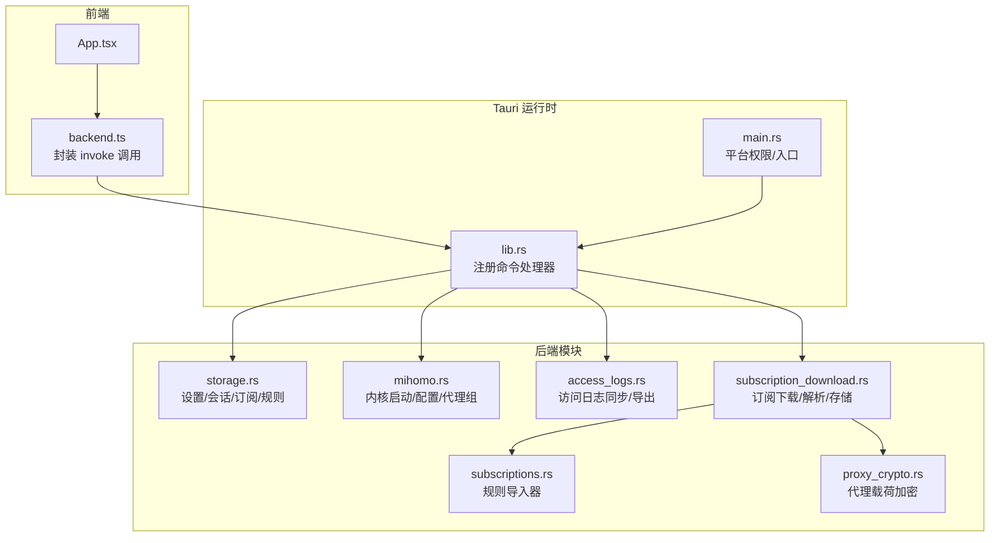
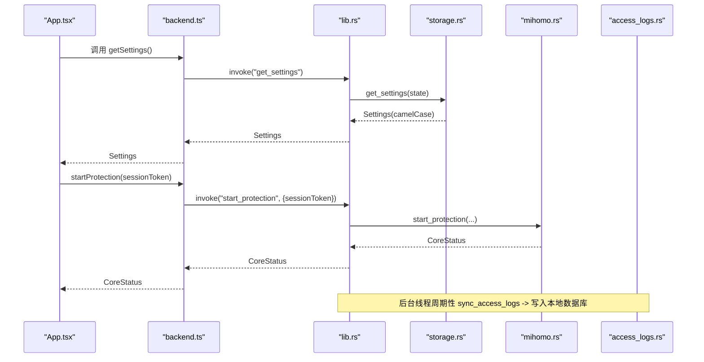
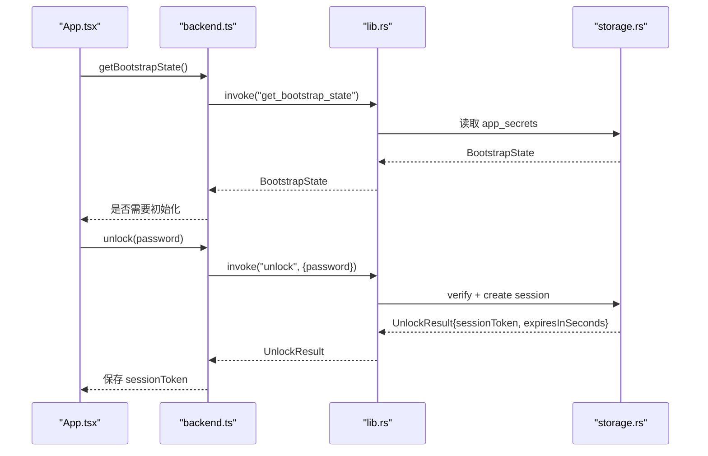
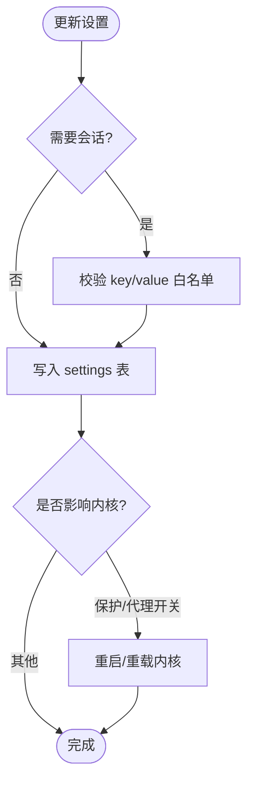
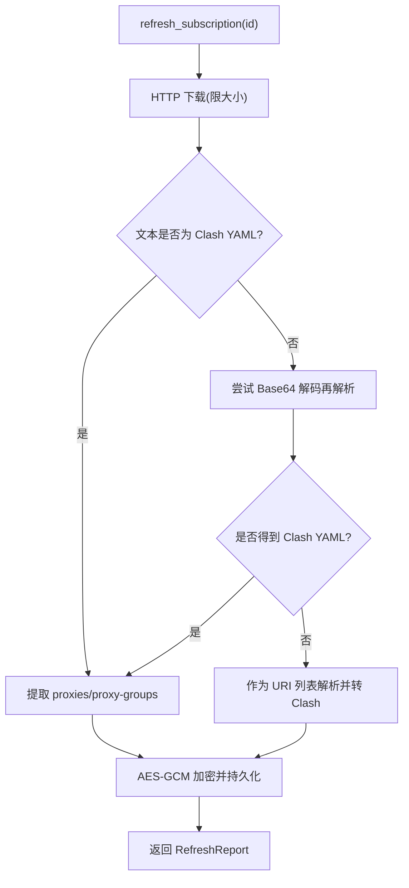
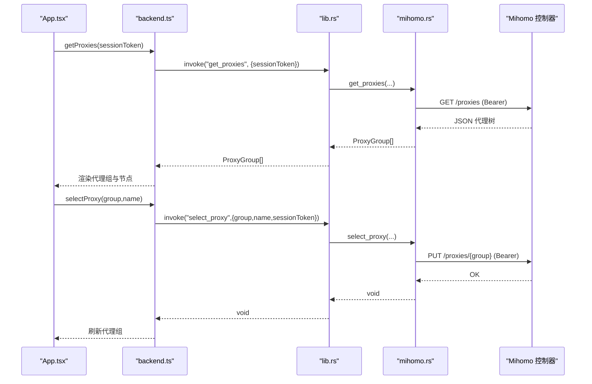
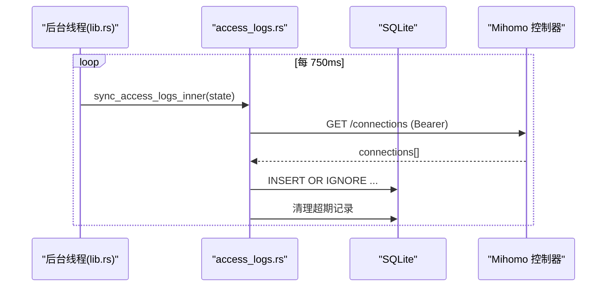
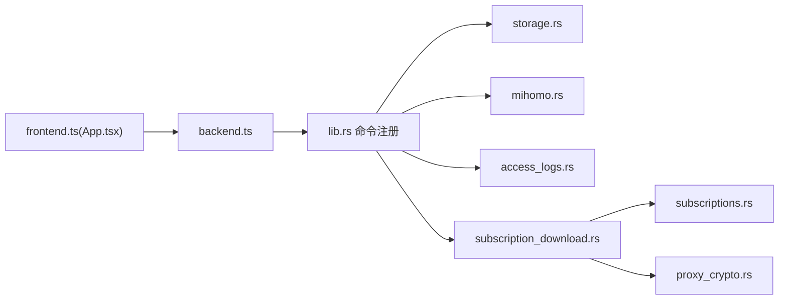

# IPC 通信协议

<cite>
**本文引用的文件列表**
- [lib.rs](file://src-tauri/src/lib.rs)
- [main.rs](file://src-tauri/src/main.rs)
- [storage.rs](file://src-tauri/src/storage.rs)
- [mihomo.rs](file://src-tauri/src/mihomo.rs)
- [access_logs.rs](file://src-tauri/src/access_logs.rs)
- [subscription_download.rs](file://src-tauri/src/subscription_download.rs)
- [subscriptions.rs](file://src-tauri/src/subscriptions.rs)
- [proxy_crypto.rs](file://src-tauri/src/proxy_crypto.rs)
- [backend.ts](file://src/backend.ts)
- [App.tsx](file://src/App.tsx)
- [tauri.conf.json](file://src-tauri/tauri.conf.json)
</cite>

## 目录
1. [简介](#简介)
2. [项目结构](#项目结构)
3. [核心组件](#核心组件)
4. [架构总览](#架构总览)
5. [详细组件分析](#详细组件分析)
6. [依赖关系分析](#依赖关系分析)
7. [性能与监控建议](#性能与监控建议)
8. [故障排查指南](#故障排查指南)
9. [结论](#结论)
10. [附录：消息契约与数据映射](#附录消息契约与数据映射)

## 简介
本文件为 CleanWeb 的前后端 IPC 通信协议文档，聚焦 Tauri 命令通道（invoke/handler）的消息格式、事件类型、实时交互模式、状态同步机制、错误传播方式与连接管理。同时给出序列化/反序列化规则、数据类型映射、版本兼容性策略，以及调试工具使用方法和性能监控建议，并总结常见通信问题的排查与解决方案。

## 项目结构
CleanWeb 采用 Tauri 架构：前端 React 通过 @tauri-apps/api/core.invoke 调用后端 Rust 暴露的 tauri::command；后端在 lib.rs 中集中注册命令处理器，并在 storage、mihomo、access_logs、subscription_download 等模块实现业务逻辑。

图表来源
- [lib.rs:14-82](file://src-tauri/src/lib.rs#L14-L82)
- [main.rs:92-98](file://src-tauri/src/main.rs#L92-L98)
- [storage.rs:383-754](file://src-tauri/src/storage.rs#L383-L754)
- [mihomo.rs:118-563](file://src-tauri/src/mihomo.rs#L118-L563)
- [access_logs.rs:74-217](file://src-tauri/src/access_logs.rs#L74-L217)
- [subscription_download.rs:40-146](file://src-tauri/src/subscription_download.rs#L40-L146)
- [subscriptions.rs:44-95](file://src-tauri/src/subscriptions.rs#L44-L95)
- [proxy_crypto.rs:24-66](file://src-tauri/src/proxy_crypto.rs#L24-L66)

章节来源
- [lib.rs:14-82](file://src-tauri/src/lib.rs#L14-L82)
- [main.rs:92-98](file://src-tauri/src/main.rs#L92-L98)
- [tauri.conf.json:1-28](file://src-tauri/tauri.conf.json#L1-L28)

## 核心组件
- 前端桥接层 backend.ts：统一封装所有 Tauri 命令调用，提供 TypeScript 类型定义，并在非 Tauri 环境提供预览回退。
- 后端命令注册 lib.rs：集中声明所有可被前端调用的命令名与参数/返回类型。
- 存储与会话 storage.rs：负责密码初始化、解锁/锁定、会话校验、设置读写、订阅与规则 CRUD。
- 内核控制 mihomo.rs：负责 Mihomo 进程生命周期、配置文件生成、控制器 API 调用（测速、选择节点、获取代理组）。
- 访问日志 access_logs.rs：定时从控制器拉取连接记录，落库并提供查询与 CSV 导出。
- 订阅下载 subscription_download.rs：下载订阅、自动检测格式、解析规则或代理载荷、持久化与加密。
- 规则导入 subscriptions.rs：将多种规则源转换为内部规则模型。
- 代理载荷加密 proxy_crypto.rs：对代理订阅明文进行 AES-GCM 加密并安全存储。

章节来源
- [backend.ts:1-137](file://src/backend.ts#L1-L137)
- [lib.rs:46-79](file://src-tauri/src/lib.rs#L46-L79)
- [storage.rs:23-277](file://src-tauri/src/storage.rs#L23-L277)
- [mihomo.rs:118-563](file://src-tauri/src/mihomo.rs#L118-L563)
- [access_logs.rs:74-217](file://src-tauri/src/access_logs.rs#L74-L217)
- [subscription_download.rs:40-146](file://src-tauri/src/subscription_download.rs#L40-L146)
- [subscriptions.rs:44-95](file://src-tauri/src/subscriptions.rs#L44-L95)
- [proxy_crypto.rs:24-66](file://src-tauri/src/proxy_crypto.rs#L24-L66)

## 架构总览
前后端通过 Tauri 的 invoke/handler 机制进行 RPC 式通信。前端以 Promise 风格调用后端命令，后端以 Result<T, String> 形式返回成功结果或错误信息字符串。所有请求体与响应体均基于 serde 的 JSON 序列化，字段命名采用 camelCase。

图表来源
- [App.tsx:21-36](file://src/App.tsx#L21-L36)
- [backend.ts:34-57](file://src/backend.ts#L34-L57)
- [lib.rs:46-79](file://src-tauri/src/lib.rs#L46-L79)
- [storage.rs:468-506](file://src-tauri/src/storage.rs#L468-L506)
- [mihomo.rs:157-258](file://src-tauri/src/mihomo.rs#L157-L258)
- [access_logs.rs:74-126](file://src-tauri/src/access_logs.rs#L74-L126)

## 详细组件分析

### 认证与会话管理
- 流程要点
  - 首次运行检查是否已设置管理密码；未设置则引导用户初始化。
  - 解锁成功后返回 sessionToken 与过期秒数；后续写操作需携带该 token。
  - 会话有效期固定 TTL，每次访问刷新到期时间；锁定后失效。
- 关键命令
  - get_bootstrap_state：返回是否已配置密码。
  - initialize_password：设置密码（长度校验）。
  - unlock：验证密码，创建会话，返回 token 与过期时间。
  - lock：销毁当前会话。
- 错误传播
  - 密码相关错误直接以字符串错误返回，前端展示。
- 时序图

图表来源
- [storage.rs:383-466](file://src-tauri/src/storage.rs#L383-L466)
- [backend.ts:34-50](file://src/backend.ts#L34-L50)
- [App.tsx:21-28](file://src/App.tsx#L21-L28)

章节来源
- [storage.rs:23-277](file://src-tauri/src/storage.rs#L23-L277)
- [storage.rs:383-466](file://src-tauri/src/storage.rs#L383-L466)
- [backend.ts:34-50](file://src/backend.ts#L34-L50)
- [App.tsx:21-28](file://src/App.tsx#L21-L28)

### 设置与规则管理
- 设置项
  - 布尔开关：protection_enabled、proxy_enabled、automatic_node_selection、access_logging_enabled、safe_search_enabled。
  - 分类开关：category.* 键值对。
  - 保留策略：log_retention（7d/30d/90d/forever）。
- 规则
  - 家长规则：支持 allow/block/proxy，匹配类型包含 exact/suffix/contains/wildcard/regex/ip/cidr。
  - 订阅规则：支持 Clash、Hosts、Domain-list、IP-list、Adblock、SafeSearch。
- 关键命令
  - get_settings / update_setting：读/写设置，update_setting 会校验 key/value 白名单。
  - list_parent_rules / create_parent_rule / set_parent_rule_enabled / delete_parent_rule。
  - list_subscriptions / create_subscription / set_subscription_enabled / delete_subscription。
  - refresh_subscription / refresh_due_subscriptions：拉取并解析订阅。
- 数据流

图表来源
- [storage.rs:468-506](file://src-tauri/src/storage.rs#L468-L506)
- [mihomo.rs:270-313](file://src-tauri/src/mihomo.rs#L270-L313)
- [App.tsx:30-37](file://src/App.tsx#L30-L37)

章节来源
- [storage.rs:468-506](file://src-tauri/src/storage.rs#L468-L506)
- [storage.rs:508-619](file://src-tauri/src/storage.rs#L508-L619)
- [storage.rs:626-754](file://src-tauri/src/storage.rs#L626-L754)
- [subscription_download.rs:40-146](file://src-tauri/src/subscription_download.rs#L40-L146)
- [subscriptions.rs:44-95](file://src-tauri/src/subscriptions.rs#L44-L95)
- [App.tsx:30-52](file://src/App.tsx#L30-L52)

### 代理订阅与载荷加密
- 下载与解析
  - 自动检测格式：Clash YAML、URI 列表、Base64 包裹的 Clash YAML。
  - URI 列表转换：ss/ssr/vmess/vless/trojan/hysteria/tuic/socks/http(s) 等统一转为 Clash proxies。
- 存储与安全
  - 代理载荷以 AES-256-GCM 加密存储，密钥保存在系统 Keychain。
  - 旧明文载荷在应用启动时迁移至密文。
- 关键命令
  - refresh_subscription：按订阅 ID 拉取并解析，返回报告（格式、导入数量、忽略数量、代理/组计数）。
  - get_subscription_proxies：解密并返回订阅中的节点与分组清单。
- 流程图

图表来源
- [subscription_download.rs:40-146](file://src-tauri/src/subscription_download.rs#L40-L146)
- [subscription_download.rs:236-300](file://src-tauri/src/subscription_download.rs#L236-L300)
- [proxy_crypto.rs:24-66](file://src-tauri/src/proxy_crypto.rs#L24-L66)
- [proxy_crypto.rs:72-103](file://src-tauri/src/proxy_crypto.rs#L72-L103)

章节来源
- [subscription_download.rs:40-146](file://src-tauri/src/subscription_download.rs#L40-L146)
- [subscription_download.rs:236-300](file://src-tauri/src/subscription_download.rs#L236-L300)
- [proxy_crypto.rs:24-66](file://src-tauri/src/proxy_crypto.rs#L24-L66)
- [proxy_crypto.rs:72-103](file://src-tauri/src/proxy_crypto.rs#L72-L103)

### 内核控制与代理组交互
- 进程管理
  - 启动前检测网络冲突（VPN/TUN），准备二进制与配置文件，启动进程并轮询健康日志。
  - 停止时清理 PID 文件与进程句柄。
- 控制器 API
  - 通过 http://127.0.0.1:19090 与 Mihomo 控制器通信，使用 bearer token 鉴权。
  - 常用接口：/proxies、/proxies/{group}/delay、/group/{group}/delay、/configs。
- 关键命令
  - get_core_status / start_protection / stop_protection / reload_protection / auto_start_protection。
  - test_proxy_group / get_proxies / select_proxy / test_all_proxy_delays。
- 序列图

图表来源
- [mihomo.rs:349-524](file://src-tauri/src/mihomo.rs#L349-L524)
- [backend.ts:125-128](file://src/backend.ts#L125-L128)
- [App.tsx:115-154](file://src/App.tsx#L115-L154)

章节来源
- [mihomo.rs:118-313](file://src-tauri/src/mihomo.rs#L118-L313)
- [mihomo.rs:349-524](file://src-tauri/src/mihomo.rs#L349-L524)
- [backend.ts:113-128](file://src/backend.ts#L113-L128)
- [App.tsx:115-154](file://src/App.tsx#L115-L154)

### 访问日志同步与导出
- 同步机制
  - 后台线程每 750ms 触发一次 sync_access_logs_inner，若开启访问日志则从控制器拉取 connections 列表，去重写入本地数据库，并按保留策略清理旧记录。
- 查询与导出
  - list_access_logs：支持按 decision 过滤、模糊搜索、限制条数。
  - export_access_logs_csv：导出 CSV 供外部分析。
- 时序图

图表来源
- [lib.rs:20-25](file://src-tauri/src/lib.rs#L20-L25)
- [access_logs.rs:74-126](file://src-tauri/src/access_logs.rs#L74-L126)
- [access_logs.rs:219-241](file://src-tauri/src/access_logs.rs#L219-L241)

章节来源
- [lib.rs:20-25](file://src-tauri/src/lib.rs#L20-L25)
- [access_logs.rs:74-217](file://src-tauri/src/access_logs.rs#L74-L217)

## 依赖关系分析
- 前端依赖
  - App.tsx 通过 backend.ts 提供的函数发起 IPC 调用，并在非 Tauri 环境下使用内存回退。
- 后端依赖
  - lib.rs 集中注册命令，分发到各模块处理。
  - storage.rs 依赖 rusqlite 与 Argon2 做密码哈希与会话管理。
  - mihomo.rs 依赖 reqwest 与 Mihomo 控制器 HTTP API。
  - subscription_download.rs 依赖 subsriptions.rs 的规则导入器与 proxy_crypto.rs 的加密能力。
- 潜在耦合点
  - 控制器地址与鉴权 secret 由 mihomo.rs 维护，access_logs.rs 复用同一 secret。
  - 订阅解析与存储强依赖 proxy_crypto.rs 的加解密格式约定。

图表来源
- [lib.rs:46-79](file://src-tauri/src/lib.rs#L46-L79)
- [backend.ts:1-137](file://src/backend.ts#L1-L137)
- [mihomo.rs:118-563](file://src-tauri/src/mihomo.rs#L118-L563)
- [access_logs.rs:74-217](file://src-tauri/src/access_logs.rs#L74-L217)
- [subscription_download.rs:40-146](file://src-tauri/src/subscription_download.rs#L40-L146)
- [subscriptions.rs:44-95](file://src-tauri/src/subscriptions.rs#L44-L95)
- [proxy_crypto.rs:24-66](file://src-tauri/src/proxy_crypto.rs#L24-L66)

章节来源
- [lib.rs:46-79](file://src-tauri/src/lib.rs#L46-L79)
- [backend.ts:1-137](file://src/backend.ts#L1-L137)

## 性能与监控建议
- 前端轮询频率
  - 核心状态每 5 秒刷新；访问日志每 3 秒刷新；代理组每 10 秒刷新；订阅刷新每 15 分钟。可根据设备性能与用户需求调整。
- 后端批量与去重
  - 访问日志同步使用 INSERT OR IGNORE 避免重复；订阅导入使用事务批量写入。
- 资源限制
  - 订阅下载最大 20MB；超时 30 秒；代理延迟测试默认 5 秒。
- 建议
  - 在大量规则或代理节点场景下，适当降低前端轮询频率，或在 UI 上增加“暂停刷新”选项。
  - 对高频命令（如 get_proxies）考虑在前端缓存最近一次结果，仅在必要时刷新。

[本节为通用指导，不直接分析具体文件]

## 故障排查指南
- 无法启动内核
  - 现象：start_protection 返回错误，提示存在 VPN/TUN 冲突或启动失败。
  - 排查：确认无其他 TUN/VPN 占用；查看 mihomo.log 最后若干行；检查管理员权限（Windows Release 构建会自动提权）。
- 会话过期或无效
  - 现象：写操作报“会话已过期”。
  - 排查：重新调用 unlock 获取新 token；注意前端需在有效期内传递 sessionToken。
- 代理订阅解析失败
  - 现象：refresh_subscription 报错“未找到支持的代理节点/组”或“不是有效 UTF-8”。
  - 排查：确认订阅 URL 可达且内容小于 20MB；尝试手动 Base64 解码；检查 URI 列表头是否以支持的协议开头。
- 访问日志为空
  - 现象：访问记录为空。
  - 排查：确认 access_logging_enabled 为 true；检查控制器 /connections 是否可访问；观察后台线程是否正常运行。
- 选择代理节点失败
  - 现象：select_proxy 报错。
  - 排查：确认 group/name 存在；检查控制器鉴权 secret 是否正确；确认内核处于运行状态。

章节来源
- [mihomo.rs:182-258](file://src-tauri/src/mihomo.rs#L182-L258)
- [storage.rs:265-276](file://src-tauri/src/storage.rs#L265-L276)
- [subscription_download.rs:40-146](file://src-tauri/src/subscription_download.rs#L40-L146)
- [access_logs.rs:74-126](file://src-tauri/src/access_logs.rs#L74-L126)
- [mihomo.rs:486-524](file://src-tauri/src/mihomo.rs#L486-L524)

## 结论
CleanWeb 的 IPC 通信基于 Tauri 命令通道，采用 JSON 序列化与 camelCase 命名规范，前后端职责清晰：前端负责交互与轮询，后端负责安全校验、持久化与内核控制。通过会话令牌保障敏感操作安全，通过后台任务与控制器 API 实现实时状态与日志同步。整体设计具备良好的可扩展性与可维护性。

[本节为总结，不直接分析具体文件]

## 附录：消息契约与数据映射

### 命令清单与参数/返回类型
- 认证与会话
  - get_bootstrap_state -> BootstrapState
  - initialize_password(password) -> void
  - unlock(password) -> UnlockResult
  - lock(sessionToken) -> void
- 设置
  - get_settings -> Settings
  - update_setting(key, value, sessionToken) -> Settings
- 订阅
  - list_subscriptions(sessionToken, kind?) -> SubscriptionRecord[]
  - create_subscription(input, sessionToken) -> SubscriptionRecord
  - set_subscription_enabled(id, enabled, sessionToken) -> void
  - delete_subscription(id, sessionToken) -> void
  - get_recommended_sources() -> RecommendedSource[]
  - refresh_subscription(id, sessionToken) -> RefreshReport
  - refresh_due_subscriptions() -> number
- 内核与代理
  - get_core_status() -> CoreStatus
  - start_protection(sessionToken) -> CoreStatus
  - stop_protection(sessionToken) -> CoreStatus
  - reload_protection(sessionToken) -> CoreStatus
  - auto_start_protection() -> CoreStatus
  - test_proxy_group(group, sessionToken) -> DelayResult
  - get_proxies(sessionToken) -> ProxyGroup[]
  - get_subscription_proxies(subscriptionId, sessionToken) -> SubscriptionProxyInfo
  - select_proxy(group, name, sessionToken) -> void
  - test_all_proxy_delays(group, sessionToken) -> ProxyDelayResult
- 访问日志
  - sync_access_logs() -> number
  - list_access_logs(sessionToken, decision?, search?, limit?) -> AccessLog[]
  - clear_access_logs(sessionToken) -> number
  - export_access_logs_csv(sessionToken) -> string
- 家长规则
  - list_parent_rules(sessionToken) -> ParentRuleRecord[]
  - create_parent_rule(input, sessionToken) -> ParentRuleRecord
  - set_parent_rule_enabled(id, enabled, sessionToken) -> void
  - delete_parent_rule(id, sessionToken) -> void

章节来源
- [lib.rs:46-79](file://src-tauri/src/lib.rs#L46-L79)
- [storage.rs:383-754](file://src-tauri/src/storage.rs#L383-L754)
- [mihomo.rs:118-563](file://src-tauri/src/mihomo.rs#L118-L563)
- [access_logs.rs:74-217](file://src-tauri/src/access_logs.rs#L74-L217)

### 数据结构与字段映射
- 通用命名
  - 所有结构体字段使用 serde rename_all = "camelCase"，前后端一致。
- 关键字段示例
  - Settings：protectionEnabled、proxyEnabled、automaticNodeSelection、accessLoggingEnabled、safeSearchEnabled、logRetention、categories。
  - SubscriptionRecord：id、kind、name、url、format、category、updateIntervalHours、enabled、lastUpdatedAt、lastError。
  - CoreStatus：running、pid、controller、configPath。
  - ProxyGroup：name、groupType、now、nodes[]。
  - AccessLog：id、observedAt、domain、targetIp、targetPort、decision、rule、category、processName、operatingSystem、systemUser、sourceIp、route、proxyGroup、error。
  - ParentRuleRecord：id、action、kind、pattern、category、enabled。
  - RefreshReport：detectedFormat、importedCount、ignoredCount、proxyCount、groupCount。

章节来源
- [storage.rs:30-89](file://src-tauri/src/storage.rs#L30-L89)
- [storage.rs:228-246](file://src-tauri/src/storage.rs#L228-L246)
- [mihomo.rs:46-104](file://src-tauri/src/mihomo.rs#L46-L104)
- [access_logs.rs:54-72](file://src-tauri/src/access_logs.rs#L54-L72)
- [subscription_download.rs:18-26](file://src-tauri/src/subscription_download.rs#L18-L26)

### 序列化/反序列化规则
- 传输格式：JSON。
- 命名规范：camelCase。
- 布尔与枚举：以字符串或布尔值表示，枚举值严格匹配后端允许集合（如 action=allow|block|proxy；kind=suffix|contains|wildcard|regex|ip|cidr）。
- 日期时间：ISO 8601 字符串。
- 可选字段：可为 null 或省略，前端需兼容。

章节来源
- [storage.rs:30-89](file://src-tauri/src/storage.rs#L30-L89)
- [mihomo.rs:46-104](file://src-tauri/src/mihomo.rs#L46-L104)
- [access_logs.rs:54-72](file://src-tauri/src/access_logs.rs#L54-L72)

### 版本兼容性与扩展策略
- 向后兼容
  - 新增可选字段不应破坏现有前端解析；前端应忽略未知字段。
  - 枚举值仅追加，不删除已有值。
- 向前兼容
  - 后端在解析时应对缺失字段提供默认值。
- 变更发布
  - 当引入破坏性变更时，可通过版本号或特性开关控制行为，并在前端根据环境判断分支。

[本节为通用指导，不直接分析具体文件]

### 调试工具与技巧
- 前端
  - 在非 Tauri 环境（浏览器预览）下，backend.ts 提供内存回退，便于联调 UI。
  - 使用浏览器控制台打印错误堆栈，定位 invoke 调用失败原因。
- 后端
  - Windows 下查看 mihomo.log 末尾日志；macOS 下通过 privileged 启动路径输出健康日志。
  - 使用 curl 直接访问控制器接口（需 bearer token）验证后端转发是否正确。
- 日志
  - 导出 CSV 进行离线分析；关注 decision=block 或 warning 的记录。

章节来源
- [backend.ts:32-46](file://src/backend.ts#L32-L46)
- [mihomo.rs:204-258](file://src-tauri/src/mihomo.rs#L204-L258)
- [access_logs.rs:184-217](file://src-tauri/src/access_logs.rs#L184-L217)