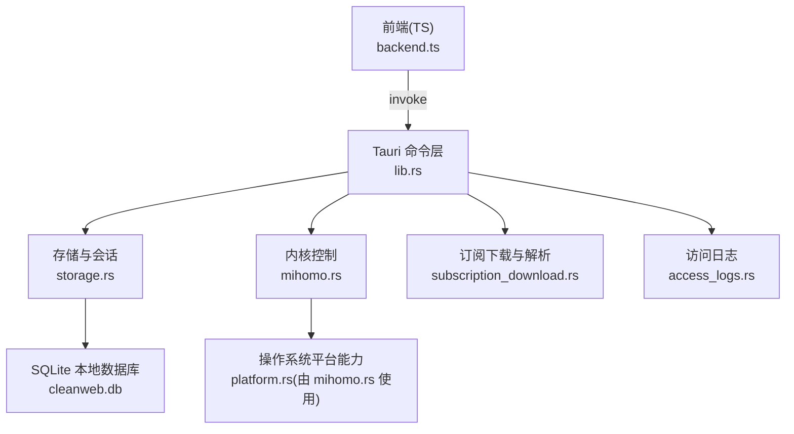
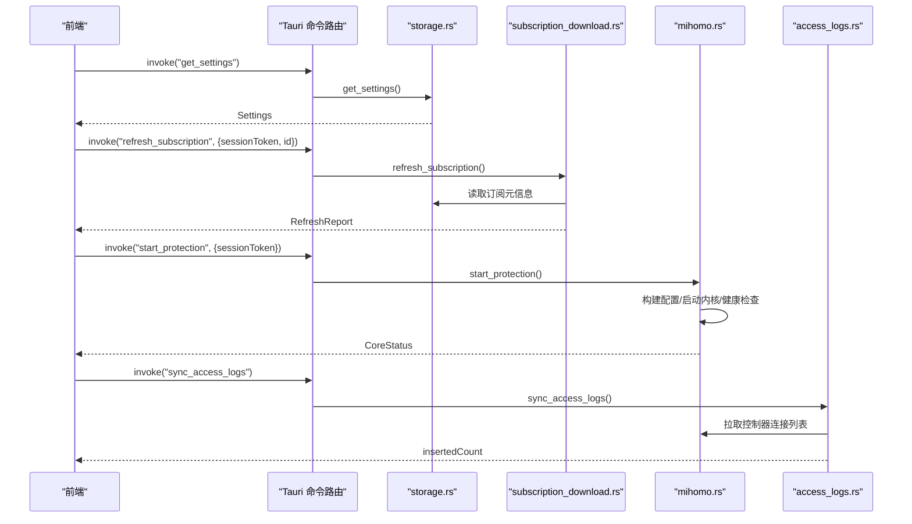
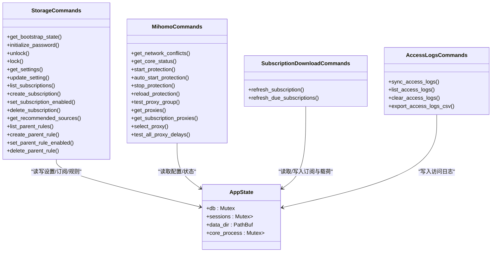

# Tauri 命令接口

<cite>
**本文引用的文件**
- [lib.rs](file://src-tauri/src/lib.rs)
- [storage.rs](file://src-tauri/src/storage.rs)
- [mihomo.rs](file://src-tauri/src/mihomo.rs)
- [subscription_download.rs](file://src-tauri/src/subscription_download.rs)
- [access_logs.rs](file://src-tauri/src/access_logs.rs)
- [backend.ts](file://src/backend.ts)
</cite>

## 目录
1. [简介](#简介)
2. [项目结构](#项目结构)
3. [核心组件](#核心组件)
4. [架构总览](#架构总览)
5. [详细命令文档](#详细命令文档)
6. [依赖关系分析](#依赖关系分析)
7. [性能与并发特性](#性能与并发特性)
8. [故障排查指南](#故障排查指南)
9. [结论](#结论)
10. [附录：TypeScript 类型定义与调用模式](#附录typescript-类型定义与调用模式)

## 简介
本文件为 CleanWeb 的 Tauri 命令接口提供完整 API 文档。所有通过 tauri::generate_handler! 暴露的命令均在此说明，涵盖 storage、mihomo、subscription_download、access_logs 四大模块的方法名、参数类型、返回值类型、错误处理语义、前端调用示例与 TypeScript 类型定义。同时解释命令的执行上下文（会话令牌校验、数据库访问、外部进程控制）以及异步处理方式。

## 项目结构
CleanWeb 后端基于 Tauri，Rust 侧通过 generate_handler! 将函数注册为前端可调用命令；前端通过 @tauri-apps/api/core.invoke 调用这些命令。关键文件职责如下：
- src-tauri/src/lib.rs：应用初始化、状态注入、命令注册、后台任务启动
- src-tauri/src/storage.rs：设置、订阅、规则、密码与会话管理
- src-tauri/src/mihomo.rs：Mihomo 内核生命周期、配置生成、代理组与节点操作
- src-tauri/src/subscription_download.rs：订阅下载、解析、导入与加密存储
- src-tauri/src/access_logs.rs：访问日志同步、查询、清理与导出
- src/backend.ts：前端封装与 TypeScript 类型定义

图表来源
- [lib.rs:46-79](file://src-tauri/src/lib.rs#L46-L79)
- [storage.rs:23-28](file://src-tauri/src/storage.rs#L23-L28)
- [mihomo.rs:118-155](file://src-tauri/src/mihomo.rs#L118-L155)
- [subscription_download.rs:40-113](file://src-tauri/src/subscription_download.rs#L40-L113)
- [access_logs.rs:74-126](file://src-tauri/src/access_logs.rs#L74-L126)

章节来源
- [lib.rs:14-82](file://src-tauri/src/lib.rs#L14-L82)

## 核心组件
- 应用状态 AppState：持有 SQLite 连接、会话缓存、数据目录、子进程句柄等
- 会话机制：unlock 返回 session_token，后续写操作需携带该 token；默认 TTL 为 15 分钟
- Mihomo 控制器：本地 HTTP 控制器地址固定为 127.0.0.1:19090，secret 自动管理
- 订阅系统：支持多种规则与代理格式，自动检测或指定格式，结果持久化并可选加密

章节来源
- [storage.rs:23-28](file://src-tauri/src/storage.rs#L23-L28)
- [storage.rs:265-276](file://src-tauri/src/storage.rs#L265-L276)
- [mihomo.rs:118-155](file://src-tauri/src/mihomo.rs#L118-L155)
- [subscription_download.rs:40-113](file://src-tauri/src/subscription_download.rs#L40-L113)

## 架构总览
下图展示命令到具体实现的调用路径与关键交互点。

图表来源
- [lib.rs:46-79](file://src-tauri/src/lib.rs#L46-L79)
- [storage.rs:468-506](file://src-tauri/src/storage.rs#L468-L506)
- [subscription_download.rs:40-113](file://src-tauri/src/subscription_download.rs#L40-L113)
- [mihomo.rs:157-258](file://src-tauri/src/mihomo.rs#L157-L258)
- [access_logs.rs:74-126](file://src-tauri/src/access_logs.rs#L74-L126)

## 详细命令文档

### 通用约定
- 错误模型：所有命令统一以字符串作为错误消息返回（Result<T, String>），前端应捕获并提示用户
- 会话令牌：带 session_token 参数的命令会校验会话有效性，过期或缺失将返回“会话已过期”类错误
- 返回值命名：Rust 侧使用 camelCase 序列化，TS 侧类型与之对应
- 异步命令：部分命令为 async，前端 await 即可

章节来源
- [lib.rs:46-79](file://src-tauri/src/lib.rs#L46-L79)
- [storage.rs:265-276](file://src-tauri/src/storage.rs#L265-L276)

---

### 模块：storage

#### get_bootstrap_state
- 方法名：get_bootstrap_state
- 参数：无
- 返回：BootstrapState
  - passwordConfigured: boolean
- 错误：无
- 说明：用于判断是否已设置管理密码

章节来源
- [storage.rs:383-398](file://src-tauri/src/storage.rs#L383-L398)

#### initialize_password
- 方法名：initialize_password
- 参数：password: string
- 返回：void
- 错误：密码长度/强度不合法、已存在密码时拒绝
- 说明：首次设置管理密码

章节来源
- [storage.rs:400-427](file://src-tauri/src/storage.rs#L400-L427)

#### unlock
- 方法名：unlock
- 参数：password: string
- 返回：UnlockResult
  - sessionToken: string
  - expiresInSeconds: number
- 错误：未设置密码、密码错误
- 说明：验证密码后发放短期会话令牌

章节来源
- [storage.rs:429-456](file://src-tauri/src/storage.rs#L429-L456)

#### lock
- 方法名：lock
- 参数：sessionToken: string
- 返回：void
- 错误：无
- 说明：主动销毁会话

章节来源
- [storage.rs:458-466](file://src-tauri/src/storage.rs#L458-L466)

#### get_settings
- 方法名：get_settings
- 参数：无
- 返回：Settings
  - protectionEnabled: boolean
  - proxyEnabled: boolean
  - automaticNodeSelection: boolean
  - accessLoggingEnabled: boolean
  - safeSearchEnabled: boolean
  - logRetention: string (如 "7d"/"30d"/"90d"/"forever")
  - categories: Record<string, boolean>
- 错误：无

章节来源
- [storage.rs:468-472](file://src-tauri/src/storage.rs#L468-L472)
- [storage.rs:44-53](file://src-tauri/src/storage.rs#L44-L53)

#### update_setting
- 方法名：update_setting
- 参数：
  - sessionToken: string
  - key: string
  - value: string
- 返回：Settings
- 错误：
  - 会话无效/过期
  - 不支持的设置键或值
  - 开启代理但未导入可用代理节点
- 说明：仅允许白名单键，布尔值必须为 "true"/"false"，log_retention 有固定枚举

章节来源
- [storage.rs:474-506](file://src-tauri/src/storage.rs#L474-L506)

#### list_subscriptions
- 方法名：list_subscriptions
- 参数：
  - sessionToken: string
  - kind?: "rule" | "proxy"
- 返回：SubscriptionRecord[]
  - id: string
  - kind: "rule" | "proxy"
  - name: string
  - url: string
  - format?: string
  - category?: string
  - updateIntervalHours?: number
  - enabled: boolean
  - lastUpdatedAt?: string
  - lastError?: string
- 错误：会话无效/过期

章节来源
- [storage.rs:508-544](file://src-tauri/src/storage.rs#L508-L544)

#### create_subscription
- 方法名：create_subscription
- 参数：
  - sessionToken: string
  - input: NewSubscription
    - kind: "rule" | "proxy"
    - name: string
    - url: string (http/https)
    - format?: string
    - category?: string
    - updateIntervalHours?: 6 | 12 | 24 | 168
- 返回：SubscriptionRecord
- 错误：
  - 会话无效/过期
  - 订阅类型无效
  - 名称为空或过长
  - URL 非 http/https
  - 更新周期不在允许集合
  - 保存失败

章节来源
- [storage.rs:546-577](file://src-tauri/src/storage.rs#L546-L577)

#### set_subscription_enabled
- 方法名：set_subscription_enabled
- 参数：
  - sessionToken: string
  - id: string
  - enabled: boolean
- 返回：void
- 错误：会话无效/过期、订阅不存在

章节来源
- [storage.rs:579-600](file://src-tauri/src/storage.rs#L579-L600)

#### delete_subscription
- 方法名：delete_subscription
- 参数：
  - sessionToken: string
  - id: string
- 返回：void
- 错误：会话无效/过期、订阅不存在

章节来源
- [storage.rs:602-619](file://src-tauri/src/storage.rs#L602-L619)

#### get_recommended_sources
- 方法名：get_recommended_sources
- 参数：无
- 返回：RecommendedSource[]
  - name: string
  - url: string
  - format: string
  - category: string
  - description: string
- 错误：无

章节来源
- [storage.rs:621-624](file://src-tauri/src/storage.rs#L621-L624)

#### list_parent_rules
- 方法名：list_parent_rules
- 参数：
  - sessionToken: string
- 返回：ParentRuleRecord[]
  - id: string
  - action: "allow" | "block" | "proxy"
  - kind: string
  - pattern: string
  - category: string
  - enabled: boolean
- 错误：会话无效/过期

章节来源
- [storage.rs:626-653](file://src-tauri/src/storage.rs#L626-L653)

#### create_parent_rule
- 方法名：create_parent_rule
- 参数：
  - sessionToken: string
  - input: NewParentRule
    - action: "allow" | "block" | "proxy"
    - kind: string (exact/suffix/contains/wildcard/regex/ip/cidr)
    - pattern: string
    - category?: string
- 返回：ParentRuleRecord
- 错误：
  - 会话无效/过期
  - 规则内容包含非法字符
  - 动作/匹配类型无效
  - 规则编译失败
  - 保存失败

章节来源
- [storage.rs:655-710](file://src-tauri/src/storage.rs#L655-L710)

#### set_parent_rule_enabled
- 方法名：set_parent_rule_enabled
- 参数：
  - sessionToken: string
  - id: string
  - enabled: boolean
- 返回：void
- 错误：会话无效/过期、规则不存在

章节来源
- [storage.rs:712-734](file://src-tauri/src/storage.rs#L712-L734)

#### delete_parent_rule
- 方法名：delete_parent_rule
- 参数：
  - sessionToken: string
  - id: string
- 返回：void
- 错误：会话无效/过期、规则不存在

章节来源
- [storage.rs:736-754](file://src-tauri/src/storage.rs#L736-L754)

---

### 模块：subscription_download

#### refresh_subscription
- 方法名：refresh_subscription
- 参数：
  - sessionToken: string
  - id: string
- 返回：RefreshReport
  - detectedFormat: string
  - importedCount: number
  - ignoredCount: number
  - proxyCount: number
  - groupCount: number
- 错误：
  - 会话无效/过期
  - 订阅不存在
  - 下载失败/响应非成功
  - 超过大小限制
  - 编码/解析失败
  - 安全搜索映射校验失败
- 说明：根据订阅类型走规则或代理分支；代理载荷会被加密存储

章节来源
- [subscription_download.rs:40-113](file://src-tauri/src/subscription_download.rs#L40-L113)
- [subscription_download.rs:115-125](file://src-tauri/src/subscription_download.rs#L115-L125)

#### refresh_due_subscriptions
- 方法名：refresh_due_subscriptions
- 参数：无
- 返回：number（成功更新的订阅数量）
- 错误：内部错误会中止当前项并继续其他项

章节来源
- [subscription_download.rs:127-146](file://src-tauri/src/subscription_download.rs#L127-L146)

---

### 模块：mihomo

#### get_network_conflicts
- 方法名：get_network_conflicts
- 参数：无
- 返回：NetworkConflicts
  - hasConflict: boolean
  - interfaces: string[]
  - vpnServices: string[]
- 错误：无

章节来源
- [mihomo.rs:118-121](file://src-tauri/src/mihomo.rs#L118-L121)

#### get_core_status
- 方法名：get_core_status
- 参数：无
- 返回：CoreStatus
  - running: boolean
  - pid?: number
  - controller: string
  - configPath: string
- 错误：无

章节来源
- [mihomo.rs:123-155](file://src-tauri/src/mihomo.rs#L123-L155)

#### start_protection
- 方法名：start_protection
- 参数：
  - sessionToken: string
- 返回：CoreStatus
- 错误：
  - 会话无效/过期
  - 检测到网络冲突
  - 二进制资源缺失或校验失败
  - 启动失败/超时/TUN 启动失败
- 说明：若已运行则先停止再重启；macOS 下使用特权方式启动

章节来源
- [mihomo.rs:157-258](file://src-tauri/src/mihomo.rs#L157-L258)

#### auto_start_protection
- 方法名：auto_start_protection
- 参数：无
- 返回：CoreStatus
- 错误：同 start_protection
- 说明：仅在保护开关开启时启动，否则直接返回当前状态

章节来源
- [mihomo.rs:167-180](file://src-tauri/src/mihomo.rs#L167-L180)

#### stop_protection
- 方法名：stop_protection
- 参数：
  - sessionToken: string
- 返回：CoreStatus
- 错误：会话无效/过期

章节来源
- [mihomo.rs:260-268](file://src-tauri/src/mihomo.rs#L260-L268)

#### reload_protection
- 方法名：reload_protection
- 参数：
  - sessionToken: string
- 返回：CoreStatus
- 错误：
  - 会话无效/过期
  - 配置校验失败
  - 控制器通信失败
- 说明：生成新配置并通过控制器热重载

章节来源
- [mihomo.rs:270-313](file://src-tauri/src/mihomo.rs#L270-L313)

#### test_proxy_group
- 方法名：test_proxy_group
- 参数：
  - group: string
  - sessionToken: string
- 返回：DelayResult
  - delay: number
- 错误：会话无效/过期、控制器通信失败

章节来源
- [mihomo.rs:315-347](file://src-tauri/src/mihomo.rs#L315-L347)

#### get_proxies
- 方法名：get_proxies
- 参数：
  - sessionToken: string
- 返回：ProxyGroup[]
  - name: string
  - groupType: string
  - now: string
  - nodes: ProxyNode[]
    - name: string
    - nodeType: string
    - delay?: number
- 错误：会话无效/过期、控制器通信失败

章节来源
- [mihomo.rs:349-416](file://src-tauri/src/mihomo.rs#L349-L416)

#### get_subscription_proxies
- 方法名：get_subscription_proxies
- 参数：
  - subscriptionId: string
  - sessionToken: string
- 返回：SubscriptionProxyInfo
  - proxies: SubscriptionProxyNode[]
  - groups: SubscriptionProxyGroup[]
- 错误：会话无效/过期、未导入代理数据、解密/解析失败

章节来源
- [mihomo.rs:418-484](file://src-tauri/src/mihomo.rs#L418-L484)

#### select_proxy
- 方法名：select_proxy
- 参数：
  - group: string
  - name: string
  - sessionToken: string
- 返回：void
- 错误：会话无效/过期、控制器通信失败
- 说明：选择后将自动关闭“自动节点选择”（当 group 为 CleanWeb）

章节来源
- [mihomo.rs:486-524](file://src-tauri/src/mihomo.rs#L486-L524)

#### test_all_proxy_delays
- 方法名：test_all_proxy_delays
- 参数：
  - group: string
  - sessionToken: string
- 返回：ProxyDelayResult
  - delays: Record<string, number>
- 错误：会话无效/过期、控制器通信失败

章节来源
- [mihomo.rs:526-563](file://src-tauri/src/mihomo.rs#L526-L563)

---

### 模块：access_logs

#### sync_access_logs
- 方法名：sync_access_logs
- 参数：无
- 返回：number（本次插入的记录数）
- 错误：无（若控制器不可用或日志关闭则返回 0）
- 说明：后台每 750ms 触发一次同步；按保留策略清理旧记录

章节来源
- [access_logs.rs:74-126](file://src-tauri/src/access_logs.rs#L74-L126)
- [lib.rs:21-25](file://src-tauri/src/lib.rs#L21-L25)

#### list_access_logs
- 方法名：list_access_logs
- 参数：
  - sessionToken: string
  - decision?: "allow" | "block" | "warning"
  - search?: string
  - limit?: number (上限 5000)
- 返回：AccessLog[]
  - id: string
  - observedAt: string
  - domain?: string
  - targetIp?: string
  - targetPort?: number
  - decision: "allow" | "block" | "warning"
  - rule?: string
  - category?: string
  - processName?: string
  - operatingSystem: string
  - systemUser: string
  - sourceIp?: string
  - route?: string
  - proxyGroup?: string
  - error?: string
- 错误：会话无效/过期

章节来源
- [access_logs.rs:128-168](file://src-tauri/src/access_logs.rs#L128-L168)

#### clear_access_logs
- 方法名：clear_access_logs
- 参数：
  - sessionToken: string
- 返回：number（删除的行数）
- 错误：会话无效/过期

章节来源
- [access_logs.rs:170-182](file://src-tauri/src/access_logs.rs#L170-L182)

#### export_access_logs_csv
- 方法名：export_access_logs_csv
- 参数：
  - sessionToken: string
- 返回：string（CSV 文本）
- 错误：会话无效/过期

章节来源
- [access_logs.rs:184-217](file://src-tauri/src/access_logs.rs#L184-L217)

## 依赖关系分析

图表来源
- [storage.rs:23-28](file://src-tauri/src/storage.rs#L23-L28)
- [lib.rs:46-79](file://src-tauri/src/lib.rs#L46-L79)

章节来源
- [lib.rs:46-79](file://src-tauri/src/lib.rs#L46-L79)

## 性能与并发特性
- 后台同步：应用启动后每 750ms 在独立线程中调用 access_logs::sync_access_logs_inner，避免阻塞 UI
- 数据库锁：AppState 内 db 字段使用 Mutex 保护，命令执行期间加锁，注意避免长时间持锁
- 异步 I/O：订阅下载、控制器通信采用 reqwest 异步客户端，减少阻塞
- 大文件限制：订阅最大 20MB，防止内存压力
- 配置原子写入：通过临时文件+rename 保证配置一致性

章节来源
- [lib.rs:21-25](file://src-tauri/src/lib.rs#L21-L25)
- [subscription_download.rs:16](file://src-tauri/src/subscription_download.rs#L16)
- [mihomo.rs:1122-1128](file://src-tauri/src/mihomo.rs#L1122-L1128)

## 故障排查指南
- 会话相关
  - 现象：调用需要 session_token 的命令报错“会话已过期”
  - 处理：重新调用 unlock 获取新的 sessionToken，并在后续请求中携带
- 订阅刷新失败
  - 现象：返回“服务器返回 xxx”、“订阅文件超过20MB限制”、“未找到支持的代理节点或代理组”
  - 处理：检查 URL 可达性、文件大小、订阅格式；查看 subscriptions.last_error 字段
- 代理模式无法开启
  - 现象：开启 proxy_enabled 时报错“请先导入包含可用节点的 Clash/Mihomo 代理订阅”
  - 处理：先导入有效的代理订阅，或关闭代理后再开启保护
- 内核启动失败
  - 现象：返回“检测到其他 VPN/TUN”、“Mihomo 启动后立即退出”、“等待 Mihomo TUN 就绪超时”
  - 处理：关闭冲突的网络服务；检查权限与日志；确认资源文件完整性
- 访问日志为空
  - 现象：sync_access_logs 返回 0
  - 处理：确认 access_logging_enabled 为 true，且 Mihomo 控制器可达

章节来源
- [storage.rs:474-506](file://src-tauri/src/storage.rs#L474-L506)
- [subscription_download.rs:76-92](file://src-tauri/src/subscription_download.rs#L76-L92)
- [mihomo.rs:182-258](file://src-tauri/src/mihomo.rs#L182-L258)
- [access_logs.rs:74-126](file://src-tauri/src/access_logs.rs#L74-L126)

## 结论
CleanWeb 的 Tauri 命令体系围绕“会话鉴权 + 本地持久化 + 外部内核控制”展开。前端通过统一的 backend.ts 封装，屏蔽了 Tauri 细节并提供完整的 TypeScript 类型。开发者可按本文档逐项对接，遵循错误处理与异步调用规范，确保跨平台一致体验。

## 附录：TypeScript 类型定义与调用模式
以下类型来自前端封装，便于在 TS 项目中直接使用：

- Settings
  - protectionEnabled: boolean
  - proxyEnabled: boolean
  - automaticNodeSelection: boolean
  - accessLoggingEnabled: boolean
  - safeSearchEnabled: boolean
  - logRetention: string
  - categories: Record<string, boolean>
- Subscription
  - id: string
  - kind: "rule" | "proxy"
  - name: string
  - url: string
  - format?: string
  - category?: string
  - updateIntervalHours?: number
  - enabled: boolean
  - lastUpdatedAt?: string
  - lastError?: string
- NewSubscription
  - 与 Subscription 相同，但排除 id/enabled/lastUpdatedAt/lastError
- RefreshReport
  - detectedFormat: string
  - importedCount: number
  - ignoredCount: number
  - proxyCount: number
  - groupCount: number
- CoreStatus
  - running: boolean
  - pid?: number
  - controller: string
  - configPath: string
- AccessLog
  - id: string
  - observedAt: string
  - domain?: string
  - targetIp?: string
  - targetPort?: number
  - decision: "allow" | "block" | "warning"
  - rule?: string
  - category?: string
  - processName?: string
  - operatingSystem: string
  - systemUser: string
  - sourceIp?: string
  - route?: string
  - proxyGroup?: string
  - error?: string
- ParentRule
  - id: string
  - action: "allow" | "block" | "proxy"
  - kind: string
  - pattern: string
  - category: string
  - enabled: boolean
- NewParentRule
  - action: "allow" | "block" | "proxy"
  - kind: string
  - pattern: string
  - category?: string
- ProxyNode
  - name: string
  - nodeType: string
  - delay?: number | null
- ProxyGroup
  - name: string
  - groupType: string
  - now: string
  - nodes: ProxyNode[]
- SubscriptionProxyNode
  - name: string
  - nodeType: string
- SubscriptionProxyGroup
  - name: string
  - groupType: string
  - members: string[]
- SubscriptionProxyInfo
  - proxies: SubscriptionProxyNode[]
  - groups: SubscriptionProxyGroup[]
- ProxyDelayResult
  - delays: Record<string, number>

调用模式示例（概念性）
- 解锁并获取设置
  - 调用 unlock(password) 得到 sessionToken
  - 使用 sessionToken 调用 get_settings()
- 刷新订阅
  - 调用 refresh_subscription(sessionToken, id)
  - 根据返回的 RefreshReport 显示导入统计
- 启动保护
  - 调用 start_protection(sessionToken)
  - 捕获错误并提示用户（如网络冲突、内核启动失败）
- 获取代理组与延迟
  - 调用 get_proxies(sessionToken)
  - 对目标组调用 test_proxy_group(sessionToken, group) 或 test_all_proxy_delays(sessionToken, group)
- 访问日志
  - 定时调用 sync_access_logs()
  - 使用 list_access_logs(sessionToken, ...) 分页查询
  - 使用 export_access_logs_csv(sessionToken) 导出 CSV

章节来源
- [backend.ts:3-18](file://src/backend.ts#L3-L18)
- [backend.ts:34-136](file://src/backend.ts#L34-L136)