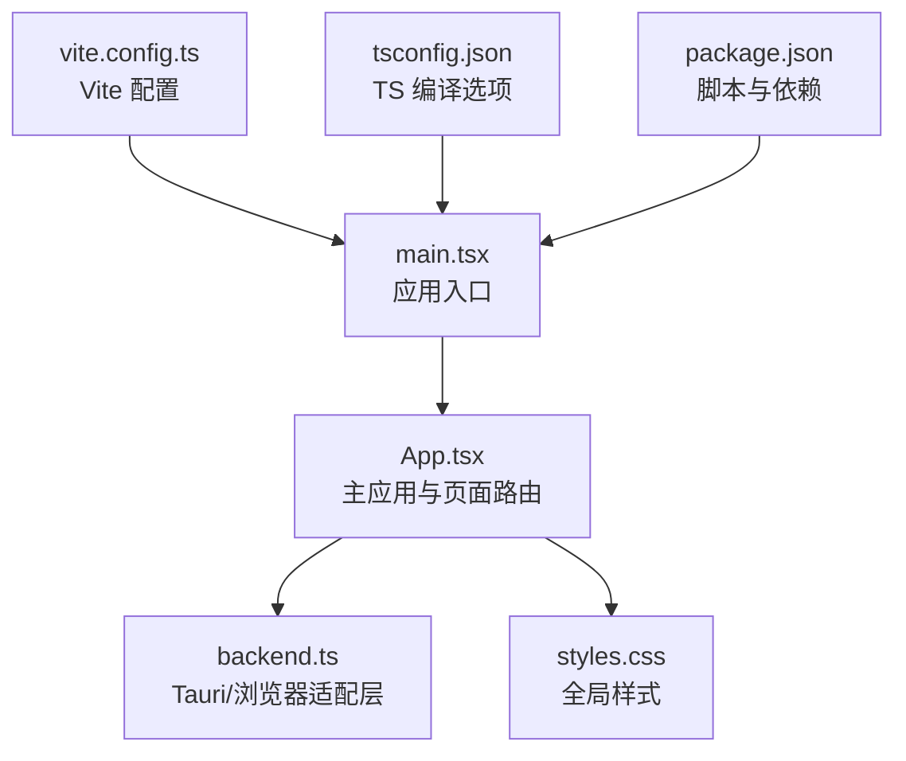
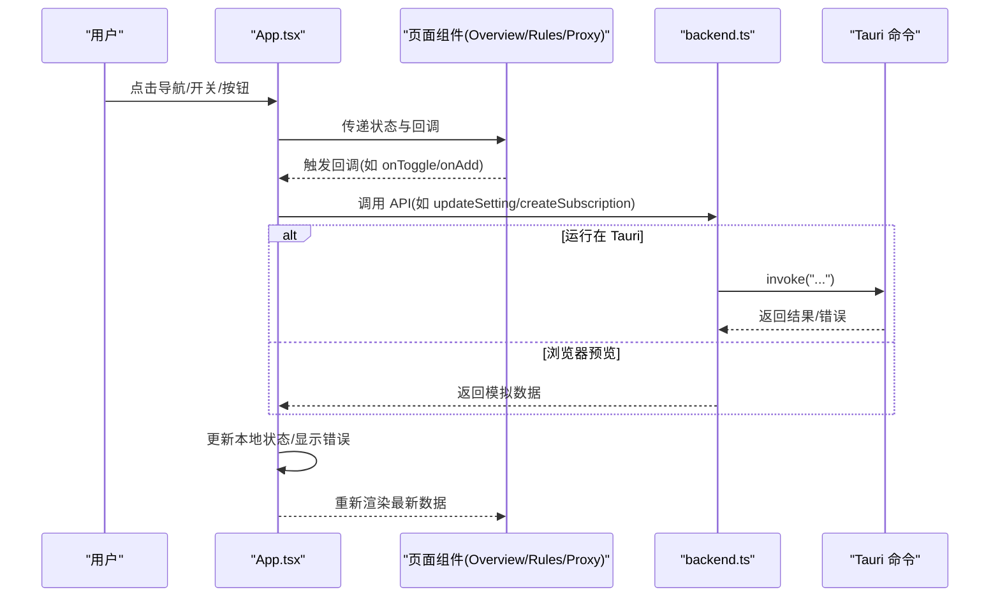
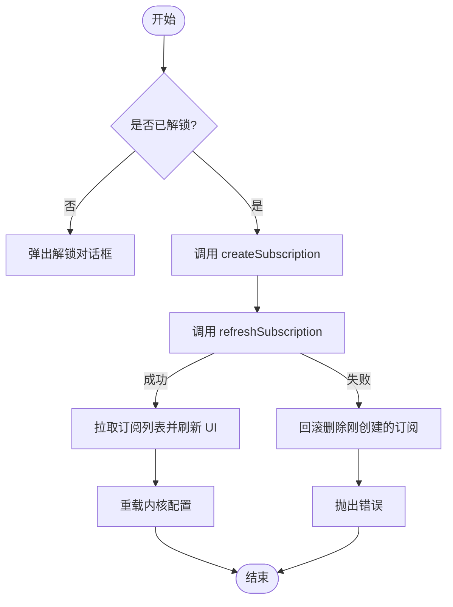
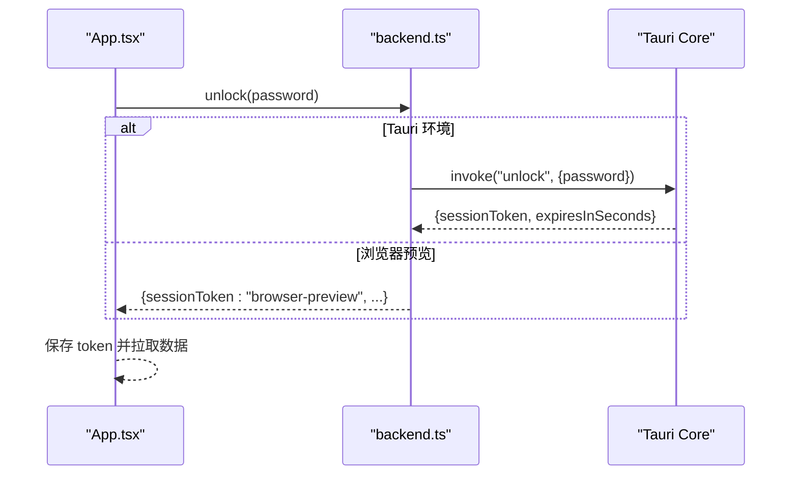
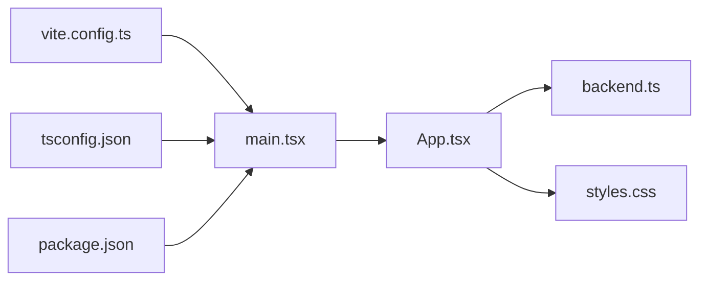

# 前端架构

<cite>
**本文引用的文件**
- [src/App.tsx](file://src/App.tsx)
- [src/backend.ts](file://src/backend.ts)
- [src/main.tsx](file://src/main.tsx)
- [tsconfig.json](file://tsconfig.json)
- [tsconfig.node.json](file://tsconfig.node.json)
- [vite.config.ts](file://vite.config.ts)
- [package.json](file://package.json)
- [src/styles.css](file://src/styles.css)
</cite>

## 目录
1. [简介](#简介)
2. [项目结构](#项目结构)
3. [核心组件](#核心组件)
4. [架构总览](#架构总览)
5. [详细组件分析](#详细组件分析)
6. [依赖关系分析](#依赖关系分析)
7. [性能考虑](#性能考虑)
8. [故障排查指南](#故障排查指南)
9. [结论](#结论)
10. [附录](#附录)

## 简介
本文件面向 CleanWeb 的前端架构，聚焦于 React 组件设计模式、状态管理模式与 Tauri 命令封装策略。文档重点说明 App.tsx 主应用组件的职责、路由管理（基于本地状态）与状态同步机制；解释 backend.ts 中 Tauri 命令调用的封装方式与错误处理策略；记录 TypeScript 配置与构建优化设置；并提供组件间通信模式、事件处理与性能优化实践建议。

## 项目结构
CleanWeb 采用单页应用结构，入口为 main.tsx，渲染根组件 App.tsx。样式通过 styles.css 全局引入。后端交互统一由 backend.ts 封装，屏蔽浏览器预览与 Tauri 环境的差异。构建工具链使用 Vite + React 插件，TypeScript 严格模式编译。

图表来源
- [src/main.tsx:1-9](file://src/main.tsx#L1-L9)
- [src/App.tsx:1-78](file://src/App.tsx#L1-L78)
- [src/backend.ts:1-137](file://src/backend.ts#L1-L137)
- [vite.config.ts:1-13](file://vite.config.ts#L1-L13)
- [tsconfig.json:1-22](file://tsconfig.json#L1-L22)
- [package.json:1-31](file://package.json#L1-L31)

章节来源
- [src/main.tsx:1-9](file://src/main.tsx#L1-L9)
- [src/App.tsx:1-78](file://src/App.tsx#L1-L78)
- [src/backend.ts:1-137](file://src/backend.ts#L1-L137)
- [vite.config.ts:1-13](file://vite.config.ts#L1-L13)
- [tsconfig.json:1-22](file://tsconfig.json#L1-L22)
- [package.json:1-31](file://package.json#L1-L31)

## 核心组件
- App 组件：负责整体布局、页面切换、会话锁定/解锁、运行时错误展示、数据初始化与定时刷新、以及各子页面的数据与回调分发。
- Overview/Rules/Proxy 等页面组件：以受控形式接收 props 并向上抛出事件回调，保持“单向数据流”。
- 对话框组件（UnlockDialog、SetupDialog、SubscriptionDialog、ParentRuleDialog）：集中处理表单输入与提交，错误信息在组件内局部维护。
- 通用 UI 组件（Switch、SettingCard）：无状态或极简状态，仅用于提升复用性。

章节来源
- [src/App.tsx:5-78](file://src/App.tsx#L5-L78)
- [src/App.tsx:80-96](file://src/App.tsx#L80-L96)
- [src/App.tsx:101-113](file://src/App.tsx#L101-L113)
- [src/App.tsx:115-226](file://src/App.tsx#L115-L226)
- [src/App.tsx:228-290](file://src/App.tsx#L228-L290)

## 架构总览
CleanWeb 前端采用“轻量状态 + 集中式副作用”的架构：
- 状态集中在 App 组件，通过 props 向下传递，通过回调函数向上传递。
- 所有与后端的交互统一由 backend.ts 提供，内部根据运行环境选择 Tauri invoke 或浏览器预览实现。
- 页面路由通过 page 状态驱动，无需第三方路由库。
- 定时任务通过 useEffect 与 setInterval 管理，确保资源释放。

图表来源
- [src/App.tsx:20-53](file://src/App.tsx#L20-L53)
- [src/backend.ts:32-137](file://src/backend.ts#L32-L137)

## 详细组件分析

### App.tsx 主应用组件
职责概览
- 页面路由：通过 page 状态在 overview/rules/proxy 之间切换。
- 会话管理：locked/sessionToken 控制管理台锁定状态，解锁后加载访问日志、订阅与父规则。
- 初始化与自动启动：首次读取引导状态、当前设置与内核状态，必要时自动启动保护。
- 定时刷新：每 5 秒轮询内核状态；每 15 分钟刷新到期订阅并拉取订阅列表；每 3 秒刷新访问日志。
- 设置变更：setValue/toggle 统一处理设置项更新，特殊键 protection_enabled 会直接启停内核。
- 订阅与父规则：创建、启用/禁用、删除、刷新等操作均先校验 sessionToken，失败时回滚或提示。
- 错误处理：runtimeError 集中展示运行时错误。

关键流程（示例：创建订阅）

图表来源
- [src/App.tsx:39-44](file://src/App.tsx#L39-L44)

章节来源
- [src/App.tsx:5-78](file://src/App.tsx#L5-L78)
- [src/App.tsx:20-53](file://src/App.tsx#L20-L53)
- [src/App.tsx:30-48](file://src/App.tsx#L30-L48)

### 页面组件：Overview / Rules / Proxy
- Overview：展示保护状态、设置卡片、访问日志面板，支持导出 CSV 与清空日志。
- Rules：展示家庭自定义规则与规则订阅，支持增删改查与批量刷新。
- Proxy：导入代理订阅，展开查看节点与组，支持测速与手动选择节点。

组件间通信模式
- 父组件持有状态，子组件只接收 props 并通过回调通知父组件。
- 对话框组件通过 onClose/onSubmit 与父组件解耦。

章节来源
- [src/App.tsx:80-96](file://src/App.tsx#L80-L96)
- [src/App.tsx:101-113](file://src/App.tsx#L101-L113)
- [src/App.tsx:115-226](file://src/App.tsx#L115-L226)
- [src/App.tsx:228-290](file://src/App.tsx#L228-L290)

### backend.ts：Tauri 命令封装与环境适配
设计要点
- 类型定义：Settings、Subscription、CoreStatus、AccessLog、ParentRule、ProxyGroup 等，前后端契约清晰。
- 环境检测：isTauri() 判断是否在 Tauri 环境中，否则走浏览器预览逻辑。
- 默认值与预览数据：defaults、previewSubscriptions、previewRecommendedSources 等用于开发体验。
- 统一接口：每个业务操作暴露一个异步函数，内部决定 invoke 或内存操作。
- 错误处理：Tauri 调用异常透传；浏览器模式下对部分参数做简单校验并抛错。

典型调用序列（示例：解锁）

图表来源
- [src/backend.ts:42-46](file://src/backend.ts#L42-L46)
- [src/App.tsx:27](file://src/App.tsx#L27)

章节来源
- [src/backend.ts:1-137](file://src/backend.ts#L1-L137)

## 依赖关系分析
- 运行时依赖：React 19、ReactDOM 19、@tauri-apps/api 2、lucide-react 图标库。
- 开发依赖：Vite 6、@vitejs/plugin-react、TypeScript 5、vitest 测试框架、jsdom 测试环境。
- 构建与脚本：dev/build/test/tauri 脚本分别对应开发、构建、测试与 Tauri CLI。

图表来源
- [src/App.tsx:1-4](file://src/App.tsx#L1-L4)
- [src/main.tsx:1-9](file://src/main.tsx#L1-L9)
- [vite.config.ts:1-13](file://vite.config.ts#L1-L13)
- [tsconfig.json:1-22](file://tsconfig.json#L1-L22)
- [package.json:1-31](file://package.json#L1-L31)

章节来源
- [package.json:1-31](file://package.json#L1-L31)

## 性能考虑
- 最小化重渲染：页面组件遵循“受控组件 + 回调”模式，避免不必要的状态提升。
- 定时器清理：所有 setInterval 均在 useEffect 返回清理函数中清除，防止内存泄漏。
- 批量更新：解锁后使用 Promise.all 并行拉取多份数据，减少首屏等待时间。
- 条件渲染：仅在 running 且存在 sessionToken 时发起高频请求（如获取代理组）。
- 延迟计算缓存：测速结果按节点名缓存，避免重复计算。
- 构建优化：Vite 关闭清屏、固定端口、忽略 Tauri target 目录监听，提升开发体验。

[本节为通用指导，不直接分析具体文件]

## 故障排查指南
常见问题与定位思路
- 未解锁即执行敏感操作：setValue 等会在无 sessionToken 时弹出解锁对话框，检查 dialog 状态与 handleUnlock 流程。
- 设置变更后未生效：setValue 中对 protection_enabled 分支会直接启停内核，其他设置会 reloadProtection，确认 reloadRuntime 是否被调用。
- 订阅添加失败：createSubscription 成功后若 refreshSubscription 失败会回滚删除，检查网络与后端可用性。
- 代理列表为空：仅在 running 且 sessionToken 存在时拉取，确认 getProxies 调用时机与条件。
- 运行时错误：runtimeError 统一展示，注意捕获来自 backend 的错误字符串。

章节来源
- [src/App.tsx:30-37](file://src/App.tsx#L30-L37)
- [src/App.tsx:39-44](file://src/App.tsx#L39-L44)
- [src/App.tsx:123-125](file://src/App.tsx#L123-L125)
- [src/App.tsx:67](file://src/App.tsx#L67)

## 结论
CleanWeb 前端采用简洁清晰的架构：App 作为唯一状态中心，页面组件以受控形式呈现，后端交互通过 backend.ts 统一封装并兼容浏览器预览。该设计降低了耦合度，提升了可测试性与可维护性。配合严格的 TypeScript 配置与 Vite 构建优化，既保证了开发效率，也兼顾了运行时的稳定性与用户体验。

[本节为总结性内容，不直接分析具体文件]

## 附录

### TypeScript 配置与构建优化
- tsconfig.json：目标 ES2022，启用 strict、isolatedModules、jsx react-jsx，模块解析为 Bundler，包含 src。
- tsconfig.node.json：针对 Vite 配置的独立 TS 配置，允许 .ts 扩展名导入。
- vite.config.ts：启用 @vitejs/plugin-react，固定开发端口 1420，忽略 Tauri target 目录监听。
- package.json：提供 dev/build/test/tauri 脚本，依赖 React 19、Tauri API 2、Vite 6、TypeScript 5、vitest 2。

章节来源
- [tsconfig.json:1-22](file://tsconfig.json#L1-L22)
- [tsconfig.node.json:1-11](file://tsconfig.node.json#L1-L11)
- [vite.config.ts:1-13](file://vite.config.ts#L1-L13)
- [package.json:1-31](file://package.json#L1-L31)

### 组件设计与最佳实践清单
- 单一职责：App 负责编排与副作用，页面组件专注展示与交互。
- 受控组件：表单与开关均由父组件状态驱动，避免双重状态。
- 错误边界：对话框组件内部维护 error 状态，便于快速定位问题。
- 副作用隔离：所有定时器与副作用在 useEffect 中声明与清理。
- 类型安全：backend.ts 明确定义所有数据结构，前后端契约一致。

[本节为通用指导，不直接分析具体文件]