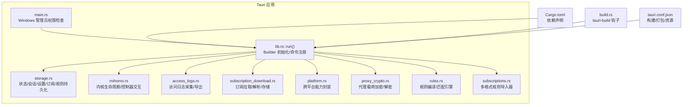
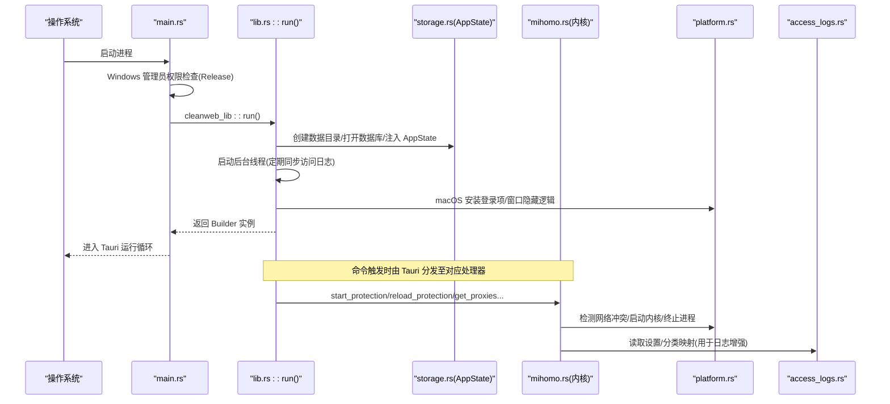
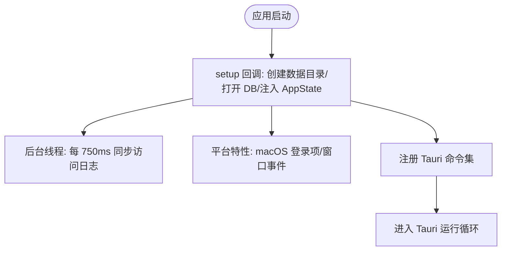
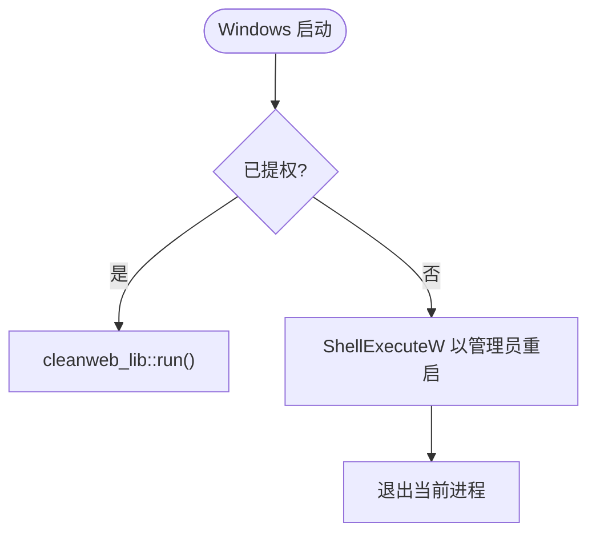
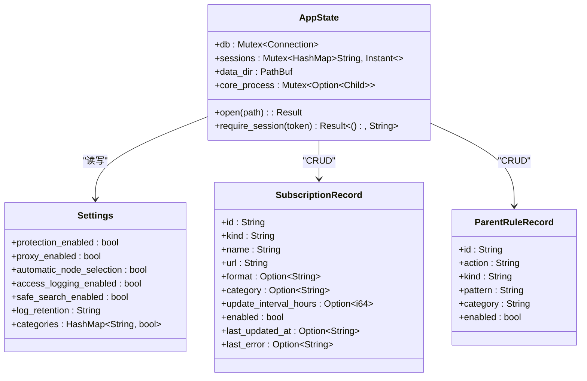
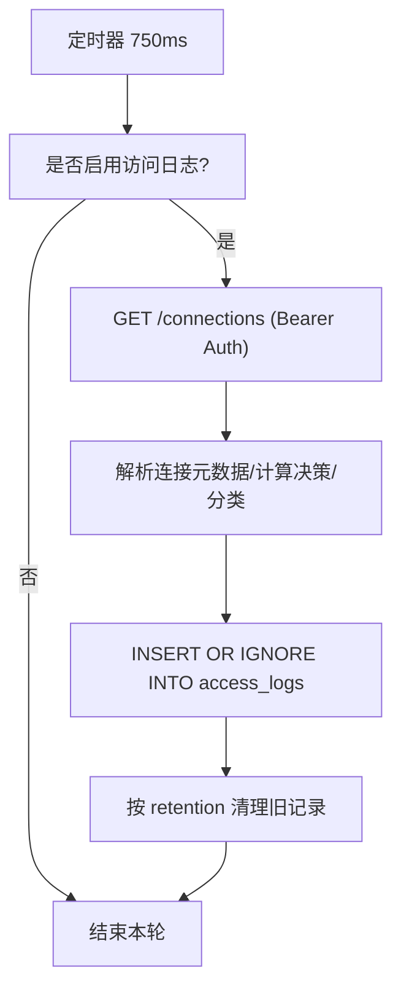
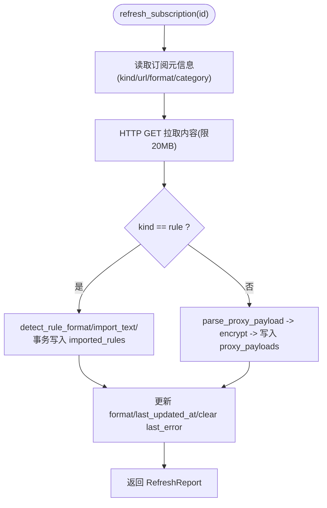
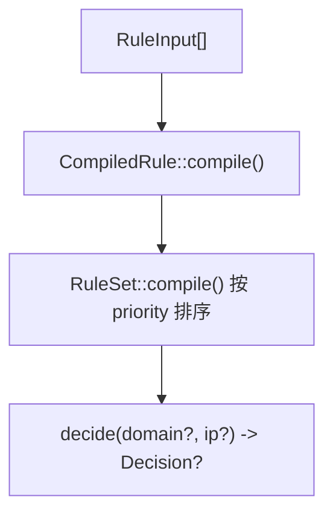
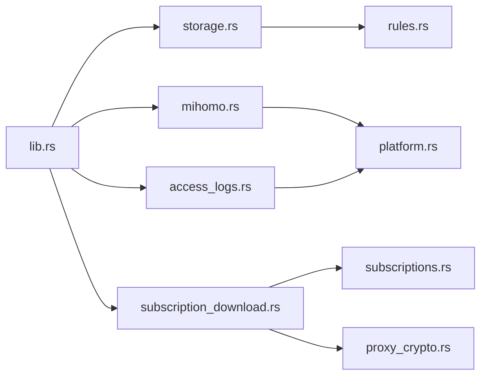

# 后端架构

<cite>
**本文引用的文件**
- [src-tauri/src/lib.rs](file://src-tauri/src/lib.rs)
- [src-tauri/src/main.rs](file://src-tauri/src/main.rs)
- [src-tauri/Cargo.toml](file://src-tauri/Cargo.toml)
- [src-tauri/build.rs](file://src-tauri/build.rs)
- [src-tauri/tauri.conf.json](file://src-tauri/tauri.conf.json)
- [src-tauri/src/storage.rs](file://src-tauri/src/storage.rs)
- [src-tauri/src/mihomo.rs](file://src-tauri/src/mihomo.rs)
- [src-tauri/src/platform.rs](file://src-tauri/src/platform.rs)
- [src-tauri/src/access_logs.rs](file://src-tauri/src/access_logs.rs)
- [src-tauri/src/subscriptions.rs](file://src-tauri/src/subscriptions.rs)
- [src-tauri/src/rules.rs](file://src-tauri/src/rules.rs)
- [src-tauri/src/proxy_crypto.rs](file://src-tauri/src/proxy_crypto.rs)
- [src-tauri/src/subscription_download.rs](file://src-tauri/src/subscription_download.rs)
</cite>

## 目录
1. [简介](#简介)
2. [项目结构](#项目结构)
3. [核心组件](#核心组件)
4. [架构总览](#架构总览)
5. [详细组件分析](#详细组件分析)
6. [依赖关系分析](#依赖关系分析)
7. [性能考量](#性能考量)
8. [故障排查指南](#故障排查指南)
9. [结论](#结论)
10. [附录](#附录)

## 简介
本文件面向 CleanWeb 的后端（Rust + Tauri v2）实现，系统性梳理应用初始化流程、命令注册机制与异步处理模式；深入解析 lib.rs 的命令处理器设计、main.rs 的入口点与平台特定封装；说明 Rust 模块组织与依赖管理；记录构建脚本配置与打包流程；并总结错误处理策略、日志记录与性能监控实践。文档同时提供扩展指导与可视化图示，帮助读者快速理解与二次开发。

## 项目结构
CleanWeb 采用“前端 Vite + React”与“后端 Tauri v2 + Rust”的分层架构。后端位于 src-tauri 目录，以库 crate cleanweb_lib 暴露 Tauri 命令，main.rs 作为桌面进程入口负责平台前置条件校验与启动。



图表来源
- [src-tauri/src/lib.rs:14-82](file://src-tauri/src/lib.rs#L14-L82)
- [src-tauri/src/main.rs:92-98](file://src-tauri/src/main.rs#L92-L98)
- [src-tauri/Cargo.toml:1-37](file://src-tauri/Cargo.toml#L1-L37)
- [src-tauri/build.rs:1-4](file://src-tauri/build.rs#L1-L4)
- [src-tauri/tauri.conf.json:1-28](file://src-tauri/tauri.conf.json#L1-L28)

章节来源
- [src-tauri/src/lib.rs:14-82](file://src-tauri/src/lib.rs#L14-L82)
- [src-tauri/src/main.rs:1-99](file://src-tauri/src/main.rs#L1-L99)
- [src-tauri/Cargo.toml:1-37](file://src-tauri/Cargo.toml#L1-L37)
- [src-tauri/build.rs:1-4](file://src-tauri/build.rs#L1-L4)
- [src-tauri/tauri.conf.json:1-28](file://src-tauri/tauri.conf.json#L1-L28)

## 核心组件
- 应用初始化与命令注册：在 lib.rs 中通过 tauri::Builder 完成数据目录准备、AppState 注入、后台任务启动、平台特性安装与窗口事件绑定，并通过 generate_handler! 集中注册所有 Tauri 命令。
- 状态与持久化：storage.rs 维护 AppState（数据库连接、会话表、核心进程句柄、数据目录），并提供密码初始化、解锁/锁定、设置读写、订阅与父级规则 CRUD、推荐源等命令。
- 内核管理：mihomo.rs 负责 Mihomo 二进制下载/校验、配置文件生成、进程启停、健康检查、控制器 API 调用（获取代理列表、测速、选择节点、重载配置）。
- 平台抽象：platform.rs 统一封装进程信号、冲突检测、macOS 特权启动、登录项安装等跨平台差异。
- 访问日志：access_logs.rs 定时轮询控制器 /connections，写入本地 SQLite，支持查询、清理与 CSV 导出。
- 订阅系统：subscription_download.rs 负责远程拉取、格式识别、安全搜索清单校验、代理载荷加密存储；subscriptions.rs 提供多种规则文本解析器；rules.rs 提供规则编译与匹配引擎。
- 代理载荷安全：proxy_crypto.rs 使用 AES-256-GCM 与系统 Keychain 保护敏感代理信息。

章节来源
- [src-tauri/src/lib.rs:14-82](file://src-tauri/src/lib.rs#L14-L82)
- [src-tauri/src/storage.rs:23-277](file://src-tauri/src/storage.rs#L23-L277)
- [src-tauri/src/mihomo.rs:118-313](file://src-tauri/src/mihomo.rs#L118-L313)
- [src-tauri/src/platform.rs:1-301](file://src-tauri/src/platform.rs#L1-L301)
- [src-tauri/src/access_logs.rs:74-126](file://src-tauri/src/access_logs.rs#L74-L126)
- [src-tauri/src/subscription_download.rs:40-146](file://src-tauri/src/subscription_download.rs#L40-L146)
- [src-tauri/src/subscriptions.rs:44-95](file://src-tauri/src/subscriptions.rs#L44-L95)
- [src-tauri/src/rules.rs:67-147](file://src-tauri/src/rules.rs#L67-L147)
- [src-tauri/src/proxy_crypto.rs:24-130](file://src-tauri/src/proxy_crypto.rs#L24-L130)

## 架构总览
下图展示了从应用启动到命令调用的整体路径，以及关键子系统之间的交互。



图表来源
- [src-tauri/src/main.rs:92-98](file://src-tauri/src/main.rs#L92-L98)
- [src-tauri/src/lib.rs:14-82](file://src-tauri/src/lib.rs#L14-L82)
- [src-tauri/src/storage.rs:248-277](file://src-tauri/src/storage.rs#L248-L277)
- [src-tauri/src/mihomo.rs:182-258](file://src-tauri/src/mihomo.rs#L182-L258)
- [src-tauri/src/platform.rs:49-73](file://src-tauri/src/platform.rs#L49-L73)
- [src-tauri/src/access_logs.rs:79-126](file://src-tauri/src/access_logs.rs#L79-L126)

## 详细组件分析

### 应用初始化与命令注册（lib.rs）
- 初始化步骤
  - 创建应用数据目录，打开或初始化 SQLite 数据库，并将 AppState 注入 Tauri 全局状态。
  - 启动后台线程周期性调用 access_logs::sync_access_logs_inner，将控制器连接日志落盘。
  - macOS 分支：安装登录项、拦截窗口关闭事件改为最小化、支持 --background 参数静默启动。
- 命令注册
  - 通过 tauri::generate_handler! 集中注册 storage、subscription_download、mihomo、access_logs 四大模块的命令。
  - 命令签名统一为 Result<T, String> 或 async fn，便于 Tauri 自动序列化与错误传播。



图表来源
- [src-tauri/src/lib.rs:14-82](file://src-tauri/src/lib.rs#L14-L82)

章节来源
- [src-tauri/src/lib.rs:14-82](file://src-tauri/src/lib.rs#L14-L82)

### 应用入口与平台特定封装（main.rs）
- Windows 管理员权限
  - Release 构建下自动检测 UAC 提升，若未提权则通过 ShellExecuteW 以 runas 方式重启自身并退出当前进程。
  - Debug 模式跳过，建议以管理员终端运行 npm run tauri dev。
- 入口职责
  - main 仅做平台前置校验，随后调用 cleanweb_lib::run 进入 Tauri 主循环。



图表来源
- [src-tauri/src/main.rs:1-90](file://src-tauri/src/main.rs#L1-L90)
- [src-tauri/src/main.rs:92-98](file://src-tauri/src/main.rs#L92-L98)

章节来源
- [src-tauri/src/main.rs:1-99](file://src-tauri/src/main.rs#L1-L99)

### 状态管理与持久化（storage.rs）
- AppState 字段
  - 数据库连接（Mutex<Connection>）、会话缓存（HashMap<String, Instant>）、数据目录、Mihomo 子进程句柄。
- 会话鉴权
  - unlock 验证 Argon2 哈希后发放 session_token，require_session 基于 TTL 刷新有效期。
- 设置与规则
  - get_settings/update_setting 提供布尔开关与类别开关，update_setting 对 proxy_enabled=true 进行可用性校验。
  - list/create/set/delete parent_rules 支持精确/后缀/包含/通配/正则/IP/CIDR 等多类型规则。
- 订阅管理
  - list/create/set/delete subscriptions，支持 kind(rule/proxy)、更新间隔、启用状态等。
- 数据库初始化
  - initialize_schema 批量建表，默认插入基础设置项。



图表来源
- [src-tauri/src/storage.rs:23-277](file://src-tauri/src/storage.rs#L23-L277)
- [src-tauri/src/storage.rs:279-381](file://src-tauri/src/storage.rs#L279-L381)

章节来源
- [src-tauri/src/storage.rs:23-277](file://src-tauri/src/storage.rs#L23-L277)
- [src-tauri/src/storage.rs:279-381](file://src-tauri/src/storage.rs#L279-L381)
- [src-tauri/src/storage.rs:383-754](file://src-tauri/src/storage.rs#L383-L754)

### 内核生命周期与控制器交互（mihomo.rs）
- 启动流程
  - 检测网络冲突，确保无其他 VPN/TUN 占用。
  - 准备运行时目录，确保二进制存在（含平台特定版本与 SHA256 校验常量）。
  - 生成配置（混合端口、外部控制器、DNS、TUN、Sniffer、SafeSearch 映射等），原子写入 config.yaml。
  - macOS 走特权启动，非 macOS 直接 spawn 子进程并重定向日志。
  - 健康检查循环读取日志，判断是否就绪或失败，必要时清理 PID 文件并返回错误。
- 控制器 API
  - reload_protection：先 -t 校验配置，再 PUT /configs?force=true 热重载。
  - test_proxy_group/test_all_proxy_delays：GET /proxies/{group}/delay 或 /group/{group}/delay。
  - get_proxies/select_proxy：获取组与节点、选择目标节点并持久化选择。
- 停止流程
  - stop_child 尝试优雅终止，必要时强制 kill，清理 PID 文件。

```mermaid
sequenceDiagram
participant UI as "前端"
participant Cmd as "mihomo : : start_protection"
participant Plat as "platform"
participant FS as "文件系统"
participant Proc as "Mihomo 进程"
participant Ctrl as "控制器API"
UI->>Cmd : 请求开启保护
Cmd->>Plat : detect_network_conflicts()
alt 存在冲突
Cmd-->>UI : 返回错误
else 无冲突
Cmd->>FS : ensure_binary()/atomic_write(config.yaml)
Cmd->>Proc : 启动(平台相关)
loop 健康检查
Cmd->>FS : 读取健康日志
alt 启动失败/超时
Cmd->>Plat : kill_process(pid)
Cmd-->>UI : 返回错误
else 就绪
break
end
end
Cmd->>Ctrl : 可选后续操作
Cmd-->>UI : 返回 CoreStatus
end
```

图表来源
- [src-tauri/src/mihomo.rs:182-258](file://src-tauri/src/mihomo.rs#L182-L258)
- [src-tauri/src/mihomo.rs:270-313](file://src-tauri/src/mihomo.rs#L270-L313)
- [src-tauri/src/platform.rs:154-204](file://src-tauri/src/platform.rs#L154-L204)

章节来源
- [src-tauri/src/mihomo.rs:118-313](file://src-tauri/src/mihomo.rs#L118-L313)
- [src-tauri/src/mihomo.rs:565-607](file://src-tauri/src/mihomo.rs#L565-L607)

### 访问日志采集与导出（access_logs.rs）
- 同步流程
  - 后台线程每 750ms 调用 sync_access_logs_inner，若未开启访问日志则跳过。
  - 通过控制器 GET /connections 获取活跃连接，结合规则分类映射与系统信息写入 access_logs 表。
  - 根据 log_retention 执行清理。
- 查询与导出
  - list_access_logs 支持按 decision 过滤与模糊搜索，限制最大条数。
  - export_access_logs_csv 输出标准 CSV，包含时间、域名、IP、决策、规则、进程、系统、用户、路由、代理组等字段。



图表来源
- [src-tauri/src/lib.rs:21-25](file://src-tauri/src/lib.rs#L21-L25)
- [src-tauri/src/access_logs.rs:79-126](file://src-tauri/src/access_logs.rs#L79-L126)
- [src-tauri/src/access_logs.rs:219-241](file://src-tauri/src/access_logs.rs#L219-L241)

章节来源
- [src-tauri/src/access_logs.rs:74-126](file://src-tauri/src/access_logs.rs#L74-L126)
- [src-tauri/src/access_logs.rs:128-217](file://src-tauri/src/access_logs.rs#L128-L217)
- [src-tauri/src/access_logs.rs:219-241](file://src-tauri/src/access_logs.rs#L219-L241)

### 订阅下载与解析（subscription_download.rs + subscriptions.rs）
- 下载与大小限制
  - 通过 reqwest 拉取，限制 Content-Length 与响应体大小不超过 20MB。
- 规则订阅
  - 支持 Clash/Hosts/DomainList/IpList/Adblock/SafeSearch 等格式。
  - SafeSearch 清单需严格校验 domain/target 白名单与版本。
  - 规则导入后写入 imported_rules，保留来源行号以便溯源。
- 代理订阅
  - 支持 Clash YAML、URI 列表（ss/ssr/vmess/vless/trojan/hysteria/tuic/socks/http(s)/wireguard）等多种格式。
  - 解析结果经 AES-256-GCM 加密后存入 proxy_payloads，避免明文泄露。
- 定时刷新
  - refresh_due_subscriptions 扫描到期订阅并逐个刷新。



图表来源
- [src-tauri/src/subscription_download.rs:40-146](file://src-tauri/src/subscription_download.rs#L40-L146)
- [src-tauri/src/subscription_download.rs:148-234](file://src-tauri/src/subscription_download.rs#L148-L234)
- [src-tauri/src/subscription_download.rs:236-300](file://src-tauri/src/subscription_download.rs#L236-L300)
- [src-tauri/src/subscriptions.rs:44-95](file://src-tauri/src/subscriptions.rs#L44-L95)

章节来源
- [src-tauri/src/subscription_download.rs:40-146](file://src-tauri/src/subscription_download.rs#L40-L146)
- [src-tauri/src/subscription_download.rs:148-234](file://src-tauri/src/subscription_download.rs#L148-L234)
- [src-tauri/src/subscription_download.rs:236-300](file://src-tauri/src/subscription_download.rs#L236-L300)
- [src-tauri/src/subscriptions.rs:44-95](file://src-tauri/src/subscriptions.rs#L44-L95)

### 规则编译与匹配（rules.rs）
- 支持的匹配类型
  - Exact/Suffix/Contains/Wildcard/Regex/Ip/Cidr。
- 编译与优先级
  - CompiledRule 预编译匹配器，RuleSet 按 priority 升序排序，优先命中者决定动作。
- 域名规范化
  - 去尾点、转小写、IDNA 转换，非法输入抛出错误。



图表来源
- [src-tauri/src/rules.rs:67-147](file://src-tauri/src/rules.rs#L67-L147)

章节来源
- [src-tauri/src/rules.rs:67-147](file://src-tauri/src/rules.rs#L67-L147)

### 代理载荷加密（proxy_crypto.rs）
- 密钥管理
  - 使用系统 Keychain 存储 32 字节 AES-256-GCM 密钥，首次缺失则随机生成并保存。
- 密文信封
  - 前缀 cw1:aes-256-gcm:base64(nonce):base64(ciphertext)。
- 迁移能力
  - encrypt_existing_proxy_payloads 扫描历史明文载荷并批量加密。

章节来源
- [src-tauri/src/proxy_crypto.rs:24-130](file://src-tauri/src/proxy_crypto.rs#L24-L130)
- [src-tauri/src/proxy_crypto.rs:72-103](file://src-tauri/src/proxy_crypto.rs#L72-L103)

## 依赖关系分析
- 包与构建
  - Cargo.toml 声明 cleanweb_lib 为 staticlib/cdylib/rlib，供 Tauri 集成；依赖包括 rusqlite、reqwest、serde、argon2、aes-gcm、keyring、regex、ipnet、uuid 等。
  - build.rs 调用 tauri_build::build() 生成前端资源与 schema。
  - tauri.conf.json 定义产物名称、版本、标识符、前后端构建命令、前端资源目录、打包目标与图标资源。
- 模块耦合
  - lib.rs 聚合各模块命令；storage.rs 被 mihomo.rs、access_logs.rs、subscription_download.rs 广泛引用；platform.rs 被 mihomo.rs 与 access_logs.rs 使用；proxy_crypto.rs 被 subscription_download.rs 与 storage.rs 使用。



图表来源
- [src-tauri/src/lib.rs:1-8](file://src-tauri/src/lib.rs#L1-L8)
- [src-tauri/src/storage.rs:18-20](file://src-tauri/src/storage.rs#L18-L20)
- [src-tauri/src/mihomo.rs:21-25](file://src-tauri/src/mihomo.rs#L21-L25)
- [src-tauri/src/access_logs.rs:7-11](file://src-tauri/src/access_logs.rs#L7-L11)
- [src-tauri/src/subscription_download.rs:10-14](file://src-tauri/src/subscription_download.rs#L10-L14)

章节来源
- [src-tauri/Cargo.toml:1-37](file://src-tauri/Cargo.toml#L1-L37)
- [src-tauri/build.rs:1-4](file://src-tauri/build.rs#L1-L4)
- [src-tauri/tauri.conf.json:1-28](file://src-tauri/tauri.conf.json#L1-L28)

## 性能考量
- 数据库
  - 使用 WAL 模式与外键约束，减少锁竞争并保证一致性。
  - 访问日志写入采用 INSERT OR IGNORE，避免重复键冲突开销。
- 网络
  - 订阅下载设置 30s 超时与 20MB 上限，防止大体积拖慢启动。
  - 控制器 API 使用 reqwest 异步客户端，避免阻塞事件循环。
- 进程管理
  - 健康检查采用固定次数与短间隔轮询，失败快速回滚并清理 PID 文件。
- 内存与 CPU
  - 规则编译一次性完成并按优先级排序，匹配阶段线性查找，适合中小规模规则集。
  - 后台日志同步周期 750ms，兼顾实时性与资源占用。

[本节为通用性能讨论，不直接分析具体文件]

## 故障排查指南
- 启动失败（Windows）
  - 确认 Release 构建是否具备管理员权限；Debug 模式请以管理员终端运行 npm run tauri dev。
- 无法开启保护
  - 检查是否存在其他 VPN/TUN 接口或服务冲突；查看 platform::detect_network_conflicts 返回信息。
- 内核启动后立即退出
  - 查看 mihomo.log 最后若干行，定位 TUN 初始化失败原因；必要时清理 PID 文件重试。
- 代理订阅导入失败
  - 确认格式是否为受支持的 Clash YAML 或 URI 列表；检查 base64 编码与 UTF-8 合法性；关注 20MB 限制。
- 访问日志为空
  - 确认 access_logging_enabled 设置；检查控制器 /connections 可达性与 secret 是否正确。

章节来源
- [src-tauri/src/main.rs:1-90](file://src-tauri/src/main.rs#L1-L90)
- [src-tauri/src/mihomo.rs:182-258](file://src-tauri/src/mihomo.rs#L182-L258)
- [src-tauri/src/platform.rs:49-73](file://src-tauri/src/platform.rs#L49-L73)
- [src-tauri/src/subscription_download.rs:67-93](file://src-tauri/src/subscription_download.rs#L67-L93)
- [src-tauri/src/access_logs.rs:79-126](file://src-tauri/src/access_logs.rs#L79-L126)

## 结论
CleanWeb 后端以 Tauri v2 为核心，围绕 AppState 统一管理状态与持久化，通过清晰的模块边界与平台抽象，实现了内核生命周期管理、规则与订阅系统、访问日志采集与导出等功能。其错误处理策略明确、日志可观测性强，并在多处引入异步与并发控制以提升稳定性与性能。该架构具备良好的可扩展性，便于新增规则格式、代理协议与平台能力。

[本节为总结性内容，不直接分析具体文件]

## 附录

### 构建与打包流程
- 开发
  - 前端：npm run dev
  - 后端：npm run tauri dev（自动调用 tauri.conf.json 中的 beforeDevCommand 与 devUrl）
- 构建
  - 前端：npm run build
  - 后端：tauri build（调用 build.rs 的 tauri_build::build()）
- 打包产物
  - tauri.conf.json 指定 targets 为 app/dmg，并配置图标与资源目录 resources。

章节来源
- [src-tauri/tauri.conf.json:6-26](file://src-tauri/tauri.conf.json#L6-L26)
- [src-tauri/build.rs:1-4](file://src-tauri/build.rs#L1-L4)

### 错误处理策略
- 命令返回值统一为 Result<T, String>，错误信息直接透传至前端。
- 数据库操作通过 map_err(error) 包装为字符串错误，保持调用侧简洁。
- 关键路径（如内核启动、配置校验、网络冲突检测）均返回明确错误消息，便于前端提示。

章节来源
- [src-tauri/src/storage.rs:383-754](file://src-tauri/src/storage.rs#L383-L754)
- [src-tauri/src/mihomo.rs:270-313](file://src-tauri/src/mihomo.rs#L270-L313)
- [src-tauri/src/access_logs.rs:268-270](file://src-tauri/src/access_logs.rs#L268-L270)

### 日志记录与性能监控
- 内核日志
  - 非 macOS：mihomo.log 追加 stdout/stderr；macOS：系统目录下的 mihomo.log。
- 访问日志
  - 本地 SQLite 表 access_logs，支持按时间、决策、关键词检索与 CSV 导出。
- 性能指标
  - 可通过控制器延迟测试接口评估节点质量；访问日志统计 allow/block/warning 比例。

章节来源
- [src-tauri/src/mihomo.rs:204-258](file://src-tauri/src/mihomo.rs#L204-L258)
- [src-tauri/src/access_logs.rs:128-217](file://src-tauri/src/access_logs.rs#L128-L217)

### 扩展指导
- 新增命令
  - 在对应模块实现 #[tauri::command] 函数，并在 lib.rs 的 generate_handler! 中注册。
- 新增规则格式
  - 在 subscriptions.rs 中添加解析器，并在 subscription_download.rs 的 detect_rule_format 中识别新格式。
- 新增代理协议
  - 在 subscription_download.rs 的 parse_single_uri 中增加协议分支，转换为 Clash YAML 条目。
- 平台能力扩展
  - 在 platform.rs 中补充目标平台的实现，保持其余模块跨平台编译。

章节来源
- [src-tauri/src/lib.rs:46-79](file://src-tauri/src/lib.rs#L46-L79)
- [src-tauri/src/subscription_download.rs:318-368](file://src-tauri/src/subscription_download.rs#L318-L368)
- [src-tauri/src/platform.rs:1-301](file://src-tauri/src/platform.rs#L1-L301)