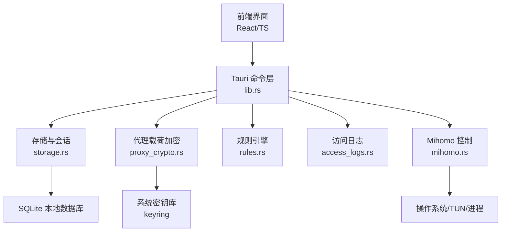
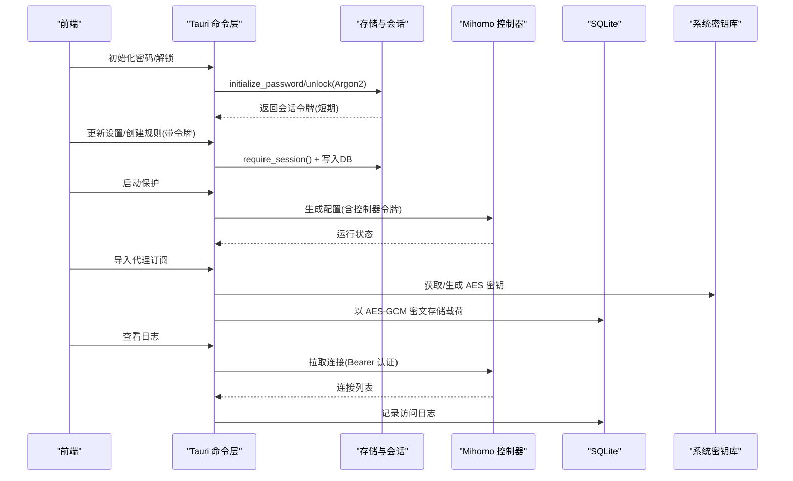
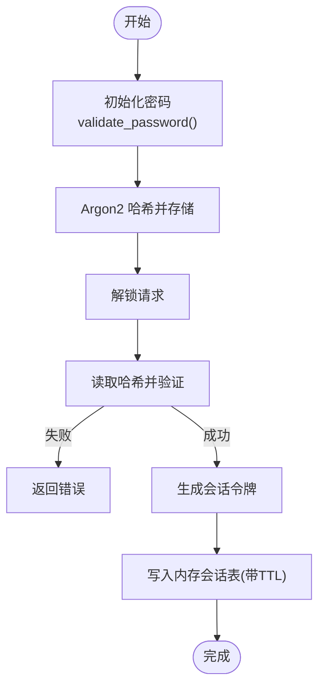
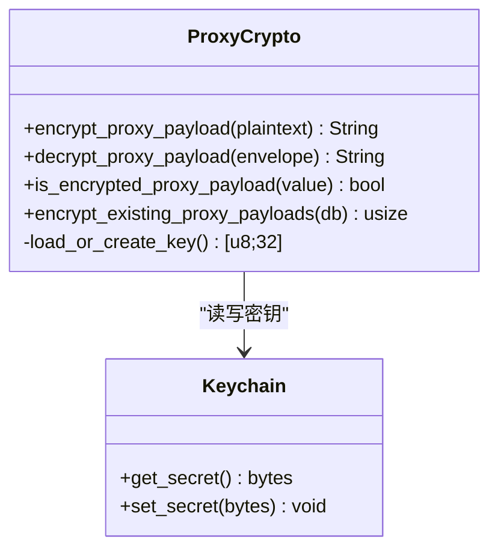
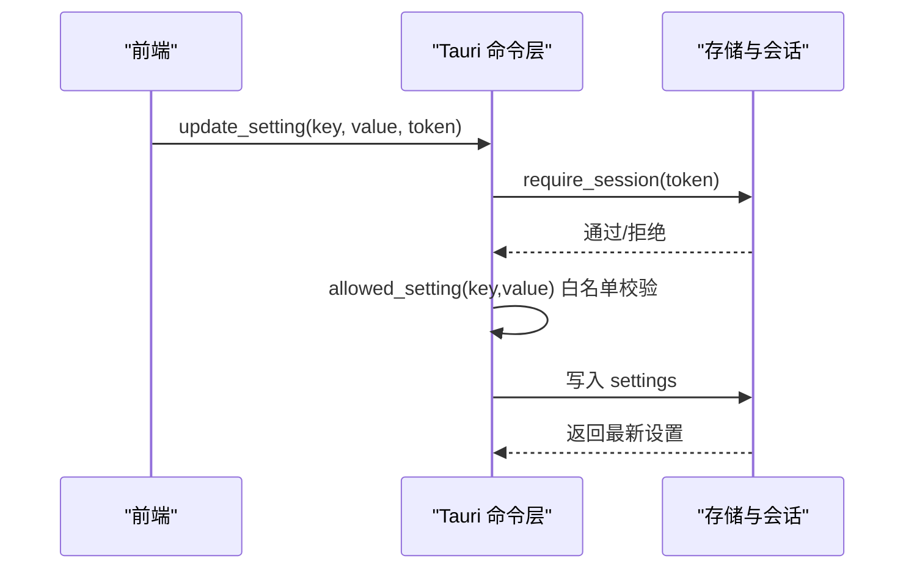
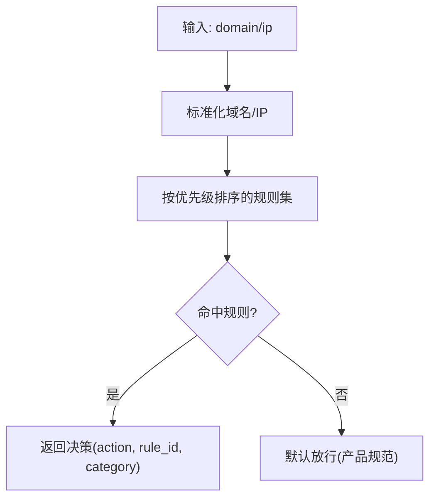
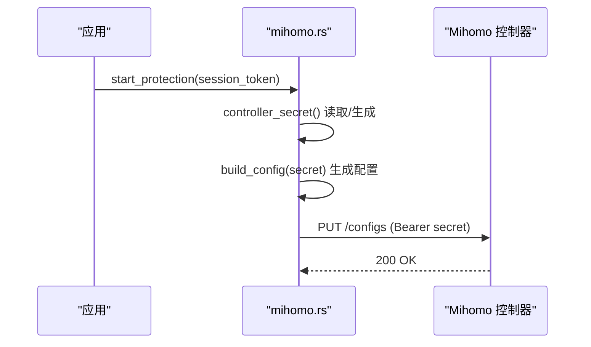
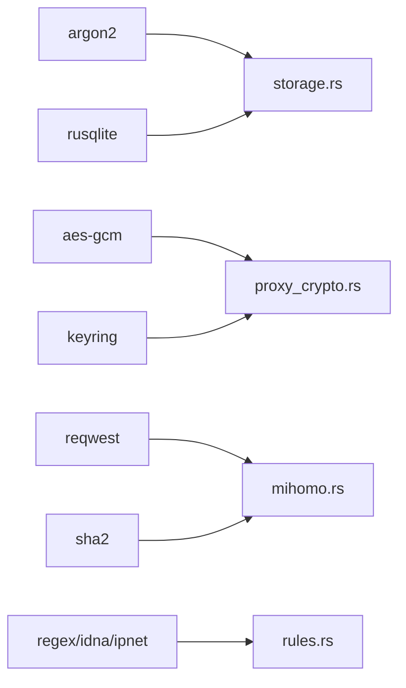

# 安全设计

<cite>
**本文引用的文件**   
- [storage.rs](file://src-tauri/src/storage.rs)
- [proxy_crypto.rs](file://src-tauri/src/proxy_crypto.rs)
- [mihomo.rs](file://src-tauri/src/mihomo.rs)
- [access_logs.rs](file://src-tauri/src/access_logs.rs)
- [rules.rs](file://src-tauri/src/rules.rs)
- [policy.ts](file://src/policy.ts)
- [lib.rs](file://src-tauri/src/lib.rs)
- [Cargo.toml](file://src-tauri/Cargo.toml)
- [architecture.md](file://docs/architecture.md)
- [product-spec.md](file://docs/product-spec.md)
</cite>

## 目录
1. [简介](#简介)
2. [项目结构](#项目结构)
3. [核心组件](#核心组件)
4. [架构总览](#架构总览)
5. [详细组件分析](#详细组件分析)
6. [依赖分析](#依赖分析)
7. [性能考虑](#性能考虑)
8. [故障排除指南](#故障排除指南)
9. [结论](#结论)
10. [附录](#附录)

## 简介
本文件面向 CleanWeb 的安全设计，聚焦以下方面：
- 密码加密存储机制（Argon2）
- 敏感数据保护策略（AES-GCM + 系统密钥库）
- 家长锁定与权限控制（会话、白名单设置项、命令级鉴权）
- 网络安全考虑（控制器令牌、TUN/代理边界、输入校验）
- 威胁模型、风险评估与缓解措施
- 安全配置选项与最佳实践
- 安全相关故障排除与调试方法

## 项目结构
CleanWeb 采用 Tauri 2 桌面应用架构：前端 React/TypeScript 通过 Tauri 调用 Rust 后端命令。Rust 侧负责策略存储、规则编译、日志采集、内核生命周期管理以及与 Mihomo 的受控通信。

图示来源
- [lib.rs:1-83](file://src-tauri/src/lib.rs#L1-L83)
- [storage.rs:1-120](file://src-tauri/src/storage.rs#L1-L120)
- [proxy_crypto.rs:1-140](file://src-tauri/src/proxy_crypto.rs#L1-L140)
- [mihomo.rs:1-120](file://src-tauri/src/mihomo.rs#L1-L120)
- [access_logs.rs:1-120](file://src-tauri/src/access_logs.rs#L1-L120)
- [rules.rs:1-120](file://src-tauri/src/rules.rs#L1-L120)

章节来源
- [lib.rs:1-83](file://src-tauri/src/lib.rs#L1-L83)
- [architecture.md:1-52](file://docs/architecture.md#L1-L52)

## 核心组件
- 认证与会话
  - 使用 Argon2 对管理密码进行哈希并持久化；解锁成功后生成短期会话令牌，所有写操作需携带有效令牌。
- 敏感数据保护
  - 代理订阅载荷使用 AES-256-GCM 加密，密钥由系统密钥库保管；启动时自动迁移明文载荷为密文。
- 规则与策略
  - 规则引擎支持多种匹配模式，按优先级决策；父级规则与安全类别组合形成最终策略。
- 内核控制与网络安全
  - 与 Mihomo 控制器通信使用随机生成的控制器令牌并通过 Bearer 认证；仅允许最小必要 API 访问。
- 访问日志
  - 定时从控制器拉取连接信息，落盘到 SQLite，支持保留期清理与导出。

章节来源
- [storage.rs:383-466](file://src-tauri/src/storage.rs#L383-L466)
- [proxy_crypto.rs:24-136](file://src-tauri/src/proxy_crypto.rs#L24-L136)
- [rules.rs:67-147](file://src-tauri/src/rules.rs#L67-L147)
- [mihomo.rs:1059-1079](file://src-tauri/src/mihomo.rs#L1059-L1079)
- [access_logs.rs:74-126](file://src-tauri/src/access_logs.rs#L74-L126)

## 架构总览
CleanWeb 将“策略权威”与“网络转发”解耦：策略在本地服务中计算，Mihomo 作为独立二进制执行流量转发与过滤。UI 仅暴露受保护的命令接口，所有变更均需家长解锁后的会话令牌。

图示来源
- [storage.rs:400-466](file://src-tauri/src/storage.rs#L400-L466)
- [proxy_crypto.rs:24-136](file://src-tauri/src/proxy_crypto.rs#L24-L136)
- [mihomo.rs:157-258](file://src-tauri/src/mihomo.rs#L157-L258)
- [access_logs.rs:74-126](file://src-tauri/src/access_logs.rs#L74-L126)

## 详细组件分析

### 密码与认证（Argon2）
- 密码初始化
  - 校验长度范围后，使用 Argon2 默认参数生成盐并哈希，结果存入 app_secrets。
- 解锁流程
  - 读取已存哈希，验证输入密码；成功则生成 UUID 会话令牌，写入内存会话表，设置过期时间。
- 会话校验
  - 每次写操作前调用 require_session，检查令牌存在且未过期，同时刷新 TTL。

图示来源
- [storage.rs:400-466](file://src-tauri/src/storage.rs#L400-L466)
- [storage.rs:798-806](file://src-tauri/src/storage.rs#L798-L806)

章节来源
- [storage.rs:383-466](file://src-tauri/src/storage.rs#L383-L466)
- [storage.rs:798-806](file://src-tauri/src/storage.rs#L798-L806)

### 敏感数据保护（AES-GCM + 系统密钥库）
- 密钥管理
  - 使用 keyring 访问系统密钥库，首次缺失时生成 32 字节随机密钥并保存。
- 载荷加密
  - 使用 AES-256-GCM 对代理订阅明文进行 AEAD 加密，附带随机 nonce，输出信封格式。
- 迁移机制
  - 启动时扫描 proxy_payloads，将未加密的行批量迁移为密文。

图示来源
- [proxy_crypto.rs:24-136](file://src-tauri/src/proxy_crypto.rs#L24-L136)

章节来源
- [proxy_crypto.rs:24-136](file://src-tauri/src/proxy_crypto.rs#L24-L136)
- [proxy_crypto.rs:72-103](file://src-tauri/src/proxy_crypto.rs#L72-L103)

### 家长锁定与权限控制
- 会话令牌
  - 所有需要权限的命令均要求 session_token，并在服务端校验有效期。
- 设置项白名单
  - update_setting 仅允许特定键名与值域（布尔或固定枚举），防止注入任意键。
- 规则创建校验
  - 父级规则动作与匹配类型严格枚举，pattern 包含非法字符直接拒绝。

图示来源
- [storage.rs:474-506](file://src-tauri/src/storage.rs#L474-L506)
- [storage.rs:785-796](file://src-tauri/src/storage.rs#L785-L796)

章节来源
- [storage.rs:474-506](file://src-tauri/src/storage.rs#L474-L506)
- [storage.rs:655-710](file://src-tauri/src/storage.rs#L655-L710)

### 规则引擎与策略优先级
- 匹配模式
  - 支持精确、后缀、包含、通配符、正则、IP、CIDR；域名标准化与大小写归一。
- 优先级
  - 编译时按 priority 排序，低数值优先；父级 allow/block/proxy 与订阅规则组合。
- 决策输出
  - 返回 action、rule_id、category，便于审计与展示。

图示来源
- [rules.rs:67-147](file://src-tauri/src/rules.rs#L67-L147)
- [policy.ts:1-22](file://src/policy.ts#L1-L22)

章节来源
- [rules.rs:67-147](file://src-tauri/src/rules.rs#L67-L147)
- [product-spec.md:53-67](file://docs/product-spec.md#L53-L67)

### 网络安全与内核控制
- 控制器令牌
  - 首次启动生成随机 controller_secret 并持久化；后续通过 Bearer 认证访问控制器 API。
- 配置生成
  - 构建 config.yaml 时注入 external-controller 与 secret；禁止 allow-lan；启用 fake-ip DNS 与嗅探。
- 资源完整性
  - 解压前对内置 Mihomo 二进制进行 SHA-256 校验，失败即中止。
- 网络冲突检测
  - 启动前检测其他 VPN/TUN，避免冲突导致保护失效。

图示来源
- [mihomo.rs:157-258](file://src-tauri/src/mihomo.rs#L157-L258)
- [mihomo.rs:1059-1079](file://src-tauri/src/mihomo.rs#L1059-L1079)
- [mihomo.rs:1081-1120](file://src-tauri/src/mihomo.rs#L1081-L1120)

章节来源
- [mihomo.rs:157-258](file://src-tauri/src/mihomo.rs#L157-L258)
- [mihomo.rs:1059-1079](file://src-tauri/src/mihomo.rs#L1059-L1079)
- [mihomo.rs:1081-1120](file://src-tauri/src/mihomo.rs#L1081-L1120)

### 访问日志与隐私
- 采集与落盘
  - 后台线程周期性拉取控制器连接信息，写入 access_logs，包含进程、用户、OS、路由等元数据。
- 保留策略
  - 根据 log_retention 定期清理旧日志，支持导出 CSV。
- 权限控制
  - 查询与导出均需有效会话令牌。

章节来源
- [access_logs.rs:74-126](file://src-tauri/src/access_logs.rs#L74-L126)
- [access_logs.rs:128-168](file://src-tauri/src/access_logs.rs#L128-L168)
- [access_logs.rs:219-241](file://src-tauri/src/access_logs.rs#L219-L241)

## 依赖分析
关键安全相关依赖与用途：
- argon2：密码哈希
- aes-gcm：对称加密（AEAD）
- keyring：系统密钥库访问
- rusqlite：本地数据存储
- reqwest：HTTP 客户端（TLS 启用）
- regex/idna/ipnet：规则解析与匹配
- sha2：二进制完整性校验

图示来源
- [Cargo.toml:10-31](file://src-tauri/Cargo.toml#L10-L31)
- [storage.rs:1-20](file://src-tauri/src/storage.rs#L1-L20)
- [proxy_crypto.rs:1-10](file://src-tauri/src/proxy_crypto.rs#L1-L10)
- [mihomo.rs:1-20](file://src-tauri/src/mihomo.rs#L1-L20)
- [rules.rs:1-10](file://src-tauri/src/rules.rs#L1-L10)

章节来源
- [Cargo.toml:10-31](file://src-tauri/Cargo.toml#L10-L31)

## 性能考虑
- 会话清理
  - require_session 会定期清理过期条目，避免内存泄漏。
- 规则编译
  - 编译阶段预构建匹配器并按优先级排序，运行时快速决策。
- 日志清理
  - 基于配置的保留期删除旧记录，控制磁盘增长。
- 加密开销
  - AES-GCM 加解密开销可控，仅在导入/加载代理订阅时触发。

[本节为通用指导，不直接分析具体文件]

## 故障排除指南
- 无法启动保护
  - 检查是否检测到其他 VPN/TUN 冲突；查看健康日志关键字判断 TUN 启动失败原因。
- 控制器不可用
  - 确认外部控制器地址与 Bearer 令牌一致；检查配置文件是否被原子写入成功。
- 代理节点不可用
  - 开启代理时必须存在可用节点；否则构建配置会报错。
- 登录/解锁失败
  - 确认密码长度与复杂度；检查会话是否过期。
- 日志为空
  - 确认 access_logging_enabled 开关；检查控制器连接是否正常。

章节来源
- [mihomo.rs:182-258](file://src-tauri/src/mihomo.rs#L182-L258)
- [mihomo.rs:1232-1241](file://src-tauri/src/mihomo.rs#L1232-L1241)
- [mihomo.rs:612-716](file://src-tauri/src/mihomo.rs#L612-L716)
- [storage.rs:400-466](file://src-tauri/src/storage.rs#L400-L466)
- [access_logs.rs:74-126](file://src-tauri/src/access_logs.rs#L74-L126)

## 结论
CleanWeb 的安全设计围绕“家长锁定 + 强密码哈希 + 敏感数据 AEAD 加密 + 最小权限命令接口 + 内核隔离”展开。通过严格的输入校验、白名单设置项、短期会话令牌与控制器令牌认证，降低了越权与泄露风险。建议在生产环境中持续评估 WFP 替代方案以提升抗绕过能力，并完善崩溃恢复与远程告警机制。

[本节为总结性内容，不直接分析具体文件]

## 附录

### 安全威胁模型与风险评估
- 威胁主体
  - 普通用户（儿童）、恶意软件、具备本地提权的攻击者。
- 主要威胁
  - 密码破解：通过 Argon2 增加成本缓解。
  - 敏感数据泄露：AES-GCM + 系统密钥库降低风险。
  - 权限提升：会话令牌与白名单限制减少误用面。
  - 绕过防护：TUN 冲突与 fail-open 行为需明确告知并监控。
- 风险等级与缓解
  - 高：内核绕过 → 建议未来引入 WFP callout 或服务态强制拦截。
  - 中高：密钥丢失 → 系统密钥库依赖平台可用性，提供回退提示。
  - 中：会话劫持 → 缩短 TTL、限制跨窗口共享。
  - 低：日志泄露 → 本地存储、保留期清理、导出需鉴权。

[本节为概念性内容，不直接分析具体文件]

### 安全配置选项与最佳实践
- 配置项
  - protection_enabled：是否启用保护
  - proxy_enabled：是否启用代理（需有可用节点）
  - automatic_node_selection：自动选择节点
  - access_logging_enabled：是否记录访问日志
  - safe_search_enabled：是否强制安全搜索
  - log_retention：日志保留周期（7d/30d/90d/forever）
  - category.*：分类开关
- 最佳实践
  - 使用强密码（≥8 字符，≤128 字符）
  - 保持系统密钥库可用（Windows DPAPI/Keychain）
  - 定期审查规则与订阅来源
  - 谨慎开启代理，确保节点可信
  - 合理设置日志保留期，避免长期留存敏感信息

章节来源
- [storage.rs:355-381](file://src-tauri/src/storage.rs#L355-L381)
- [storage.rs:785-796](file://src-tauri/src/storage.rs#L785-L796)
- [product-spec.md:79-95](file://docs/product-spec.md#L79-L95)