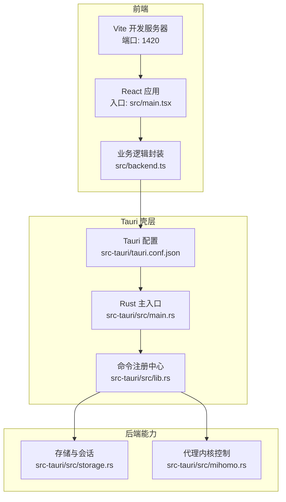
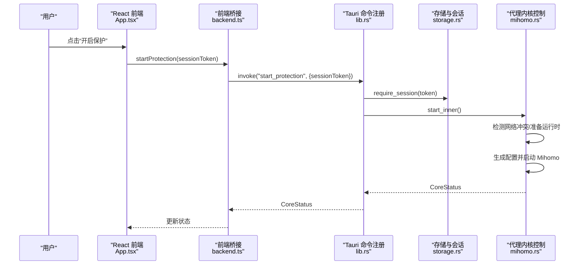
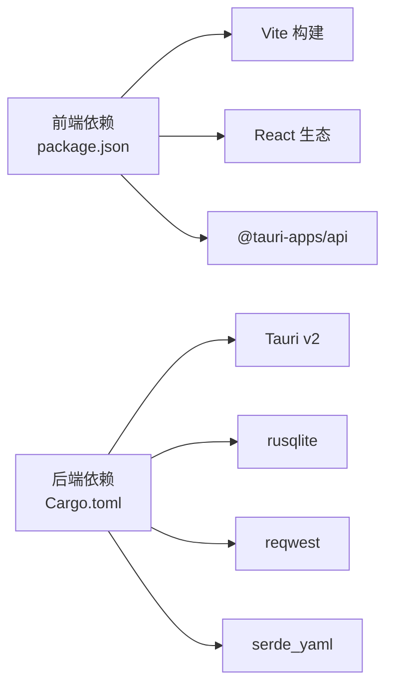

# 快速开始

<cite>
**本文引用的文件**   
- [README.md](file://README.md)
- [package.json](file://package.json)
- [vite.config.ts](file://vite.config.ts)
- [tsconfig.json](file://tsconfig.json)
- [src-tauri/tauri.conf.json](file://src-tauri/tauri.conf.json)
- [src-tauri/Cargo.toml](file://src-tauri/Cargo.toml)
- [src-tauri/src/main.rs](file://src-tauri/src/main.rs)
- [src-tauri/src/lib.rs](file://src-tauri/src/lib.rs)
- [src-tauri/src/storage.rs](file://src-tauri/src/storage.rs)
- [src-tauri/src/mihomo.rs](file://src-tauri/src/mihomo.rs)
- [src/backend.ts](file://src/backend.ts)
- [src/App.tsx](file://src/App.tsx)
</cite>

## 目录
1. [简介](#简介)
2. [项目结构](#项目结构)
3. [核心组件](#核心组件)
4. [架构总览](#架构总览)
5. [详细组件分析](#详细组件分析)
6. [依赖关系分析](#依赖关系分析)
7. [性能与构建特性](#性能与构建特性)
8. [故障排查指南](#故障排查指南)
9. [结论](#结论)
10. [附录：命令速查](#附录命令速查)

## 简介
CleanWeb 是一款面向 Windows 的家庭网络过滤客户端，结合本地策略引擎与独立代理内核（Mihomo），在启用网络代理的同时仍可对域名、IP 和 CIDR 进行精细过滤。本项目采用 Tauri + React + TypeScript 的前后端一体化桌面应用架构，前端通过 Tauri 调用 Rust 后端能力，实现系统级网络接管、规则管理、订阅导入与访问日志等功能。

本快速开始指南将帮助你从零搭建开发环境，完成从克隆到首次运行的全过程，并提供开发、测试与生产构建的常用命令说明。

## 项目结构
仓库采用“前端 Vite + React”与“后端 Tauri + Rust”的双端结构：
- 前端位于 src 目录，使用 Vite 提供开发服务器与构建产物；React 作为 UI 框架，TypeScript 提供类型安全。
- 后端位于 src-tauri 目录，基于 Tauri v2 暴露命令接口给前端，持久化数据使用 SQLite，核心网络代理由 Mihomo 进程驱动。

图表来源
- [vite.config.ts:7-11](file://vite.config.ts#L7-L11)
- [src-tauri/tauri.conf.json:6-11](file://src-tauri/tauri.conf.json#L6-L11)
- [src-tauri/src/main.rs:92-98](file://src-tauri/src/main.rs#L92-L98)
- [src-tauri/src/lib.rs:14-82](file://src-tauri/src/lib.rs#L14-L82)

章节来源
- [README.md:20-33](file://README.md#L20-L33)
- [package.json:6-11](file://package.json#L6-L11)
- [vite.config.ts:1-13](file://vite.config.ts#L1-L13)
- [src-tauri/tauri.conf.json:1-28](file://src-tauri/tauri.conf.json#L1-L28)

## 核心组件
- 前端应用
  - 入口与路由：React 应用入口挂载根节点，页面包含概览、规则管理与代理节点三大模块。
  - 后端桥接：统一封装 Tauri invoke 调用，并在浏览器预览模式下提供轻量模拟数据。
- Tauri 壳层
  - 启动流程：根据目标平台决定是否提升权限，随后初始化 Tauri 应用并注册命令。
  - 命令注册：集中注册存储、订阅下载、代理内核控制、访问日志等命令。
- 后端能力
  - 存储与会话：SQLite 持久化设置、订阅、规则、访问日志；Argon2 密码哈希与短期会话令牌。
  - 代理内核控制：检测冲突、拉取/校验二进制、生成配置、启动/停止/重载 Mihomo，并通过 REST API 查询与控制代理组与节点。

章节来源
- [src/App.tsx:5-78](file://src/App.tsx#L5-L78)
- [src/backend.ts:1-137](file://src/backend.ts#L1-L137)
- [src-tauri/src/main.rs:1-99](file://src-tauri/src/main.rs#L1-L99)
- [src-tauri/src/lib.rs:14-82](file://src-tauri/src/lib.rs#L14-L82)
- [src-tauri/src/storage.rs:23-277](file://src-tauri/src/storage.rs#L23-L277)
- [src-tauri/src/mihomo.rs:124-313](file://src-tauri/src/mihomo.rs#L124-L313)

## 架构总览
下图展示了从用户操作到后端执行的关键路径：前端发起请求，经 Tauri 命令分发至 Rust 模块，最终与数据库或外部进程交互。

图表来源
- [src/App.tsx:21-36](file://src/App.tsx#L21-L36)
- [src/backend.ts:114-117](file://src/backend.ts#L114-L117)
- [src-tauri/src/lib.rs:46-79](file://src-tauri/src/lib.rs#L46-L79)
- [src-tauri/src/storage.rs:468-506](file://src-tauri/src/storage.rs#L468-L506)
- [src-tauri/src/mihomo.rs:157-258](file://src-tauri/src/mihomo.rs#L157-L258)

## 详细组件分析

### 前端应用（React + TypeScript）
- 入口与渲染：React StrictMode 下挂载 App 组件。
- 页面与状态：概览页展示保护开关、日志与设置；规则页管理家庭规则与订阅；代理页导入订阅、选择节点与测速。
- 错误提示：运行时错误通过状态变量显示于界面。

章节来源
- [src/main.tsx:1-9](file://src/main.tsx#L1-L9)
- [src/App.tsx:5-78](file://src/App.tsx#L5-L78)
- [tsconfig.json:1-22](file://tsconfig.json#L1-L22)

### 前端桥接（Tauri 调用封装）
- 运行环境判断：通过全局对象检测是否在 Tauri 环境中，否则返回默认值用于浏览器预览。
- 方法映射：所有后端能力均通过 invoke 调用，参数与返回值类型在前端定义，保证前后端契约一致。

章节来源
- [src/backend.ts:32-46](file://src/backend.ts#L32-L46)
- [src/backend.ts:52-137](file://src/backend.ts#L52-L137)

### Tauri 壳层与命令注册
- 主入口：Windows 发布版自动提权；开发模式需管理员终端运行。
- 初始化：创建数据目录、打开 SQLite、后台线程同步访问日志；macOS 安装登录项与窗口行为控制。
- 命令注册：集中声明所有可被前端调用的命令。

章节来源
- [src-tauri/src/main.rs:92-98](file://src-tauri/src/main.rs#L92-L98)
- [src-tauri/src/lib.rs:14-82](file://src-tauri/src/lib.rs#L14-L82)

### 存储与会话（storage.rs）
- 会话机制：基于内存 Map 维护短期令牌，过期自动清理。
- 密码管理：Argon2 哈希存储，最小长度校验。
- 设置与分类：键值型设置，支持布尔与枚举值白名单校验。
- 订阅与规则：CRUD 操作，含格式校验与唯一约束。

章节来源
- [src-tauri/src/storage.rs:23-277](file://src-tauri/src/storage.rs#L23-L277)
- [src-tauri/src/storage.rs:383-466](file://src-tauri/src/storage.rs#L383-L466)
- [src-tauri/src/storage.rs:468-506](file://src-tauri/src/storage.rs#L468-L506)
- [src-tauri/src/storage.rs:546-619](file://src-tauri/src/storage.rs#L546-L619)
- [src-tauri/src/storage.rs:621-754](file://src-tauri/src/storage.rs#L621-L754)

### 代理内核控制（mihomo.rs）
- 启动流程：检测冲突、准备运行时目录、确保二进制可用、生成配置、启动进程、健康检查。
- 配置生成：合并代理订阅、去重命名、注入 DNS/TUN/Sniffer 等策略。
- 控制接口：通过控制器 REST API 获取代理组、选择节点、批量测速、重载配置。

章节来源
- [src-tauri/src/mihomo.rs:124-258](file://src-tauri/src/mihomo.rs#L124-L258)
- [src-tauri/src/mihomo.rs:270-313](file://src-tauri/src/mihomo.rs#L270-L313)
- [src-tauri/src/mihomo.rs:349-416](file://src-tauri/src/mihomo.rs#L349-L416)
- [src-tauri/src/mihomo.rs:486-563](file://src-tauri/src/mihomo.rs#L486-L563)
- [src-tauri/src/mihomo.rs:612-800](file://src-tauri/src/mihomo.rs#L612-L800)

## 依赖关系分析
- 前端依赖
  - React 与 ReactDOM 提供 UI 渲染。
  - @tauri-apps/api 用于调用后端命令。
  - Vite 与 TypeScript 提供开发与构建工具链。
- 后端依赖
  - Tauri v2 提供跨平台壳层与命令通道。
  - rusqlite 提供嵌入式数据库。
  - reqwest 与 serde_yaml 负责 HTTP 与 YAML 处理。
  - 其他库用于加密、压缩、正则匹配与 UUID 生成。

图表来源
- [package.json:12-29](file://package.json#L12-L29)
- [src-tauri/Cargo.toml:10-37](file://src-tauri/Cargo.toml#L10-L37)

章节来源
- [package.json:1-31](file://package.json#L1-L31)
- [src-tauri/Cargo.toml:1-37](file://src-tauri/Cargo.toml#L1-L37)

## 性能与构建特性
- 开发体验
  - Vite 开发服务器固定端口 1420，严格占用端口避免冲突。
  - Tauri 开发时自动启动前端 dev server，并指向该地址。
- 构建产物
  - 前端构建输出到 dist 目录，Tauri 打包时将其内嵌为资源。
- 平台差异
  - Windows 发布版自动提权；macOS 安装登录项与后台隐藏窗口。

章节来源
- [vite.config.ts:7-11](file://vite.config.ts#L7-L11)
- [src-tauri/tauri.conf.json:6-11](file://src-tauri/tauri.conf.json#L6-L11)
- [src-tauri/src/lib.rs:26-44](file://src-tauri/src/lib.rs#L26-L44)
- [src-tauri/src/main.rs:92-98](file://src-tauri/src/main.rs#L92-L98)

## 故障排查指南
- 无法启动或立即退出
  - 现象：启动后很快退出或提示“等待就绪超时”。
  - 可能原因：存在其他 VPN/TUN 冲突、Mihomo 二进制缺失或损坏、配置文件校验失败。
  - 建议：关闭冲突软件；检查 mihomo.log 最后若干行；确认控制器地址与密钥正确。
- 代理功能不可用
  - 现象：开启代理时报错“没有可用的代理节点”。
  - 可能原因：未导入 Clash/Mihomo 格式的代理订阅或订阅未成功刷新。
  - 建议：先导入有效订阅并刷新，再开启代理。
- 会话过期或锁定
  - 现象：修改设置或管理规则时提示“管理会话已过期”。
  - 可能原因：长时间未操作导致令牌失效。
  - 建议：重新输入密码解锁。
- 权限问题（Windows）
  - 现象：非管理员运行无法启动内核。
  - 建议：以管理员身份运行开发终端或使用发布版自动提权。

章节来源
- [src-tauri/src/mihomo.rs:182-258](file://src-tauri/src/mihomo.rs#L182-L258)
- [src-tauri/src/storage.rs:468-506](file://src-tauri/src/storage.rs#L468-L506)
- [src-tauri/src/main.rs:92-98](file://src-tauri/src/main.rs#L92-L98)

## 结论
CleanWeb 通过 Tauri 将现代 Web 技术与高性能 Rust 后端结合，实现了家庭网络过滤与代理管理的完整闭环。遵循本快速开始指南，你可以快速搭建开发环境并完成首次运行；后续可根据需求扩展规则源、优化配置生成与调试内核日志。

## 附录：命令速查
- 安装依赖
  - npm install
- 开发
  - 仅前端开发：npm run dev
  - 全栈开发（需要 Rust 工具链与 Tauri 系统依赖）：npm run tauri dev
- 测试
  - 运行测试套件：npm test
- 构建
  - 前端构建：npm run build
  - Tauri 打包（会触发前端构建）：npm run tauri build

章节来源
- [README.md:20-33](file://README.md#L20-L33)
- [package.json:6-11](file://package.json#L6-L11)
- [src-tauri/tauri.conf.json:6-11](file://src-tauri/tauri.conf.json#L6-L11)