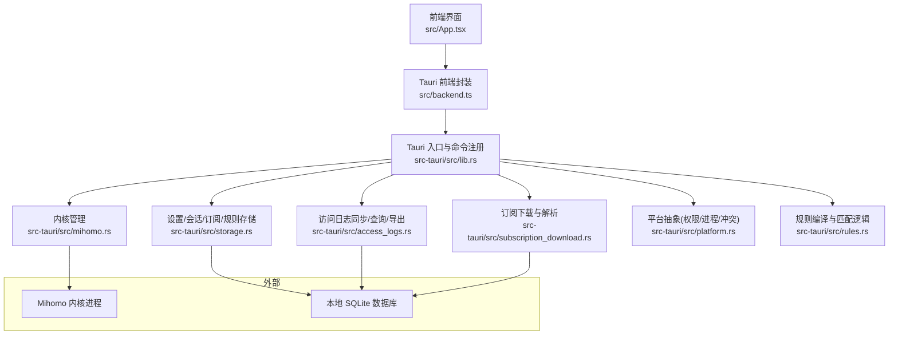
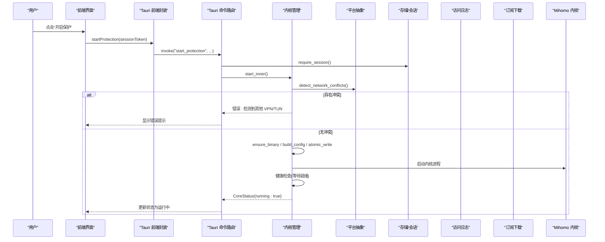
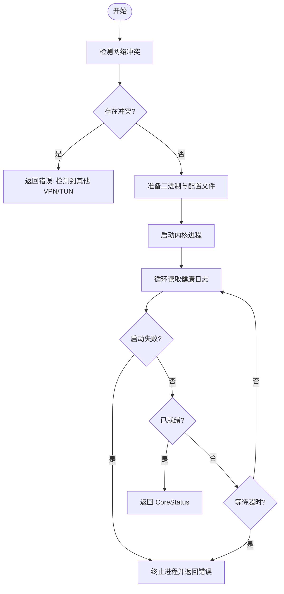
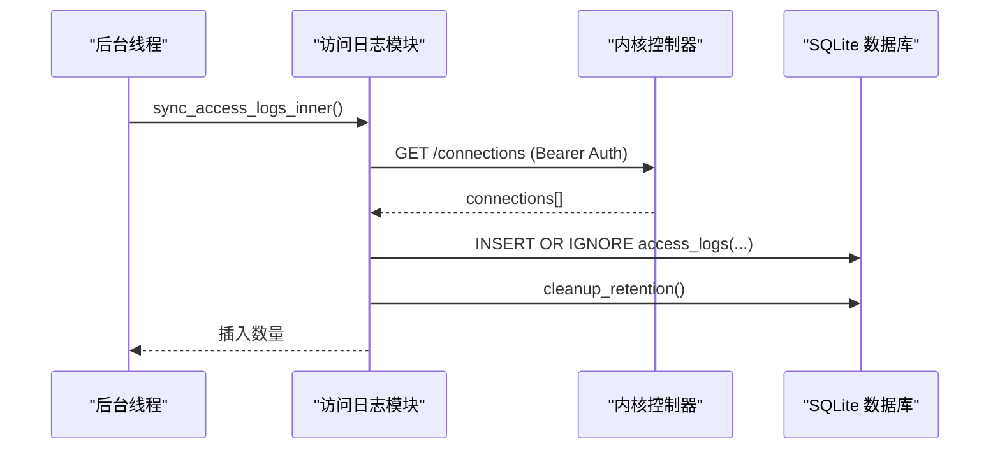
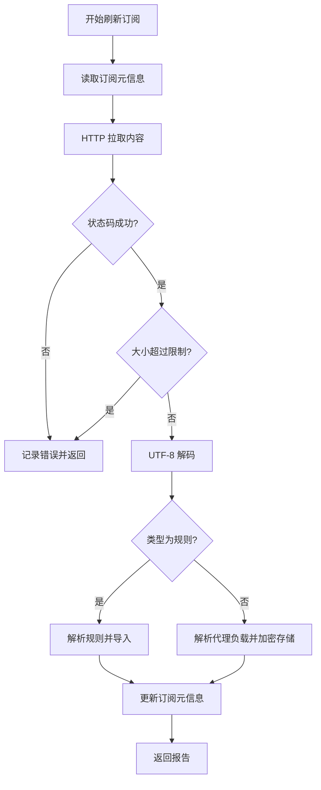
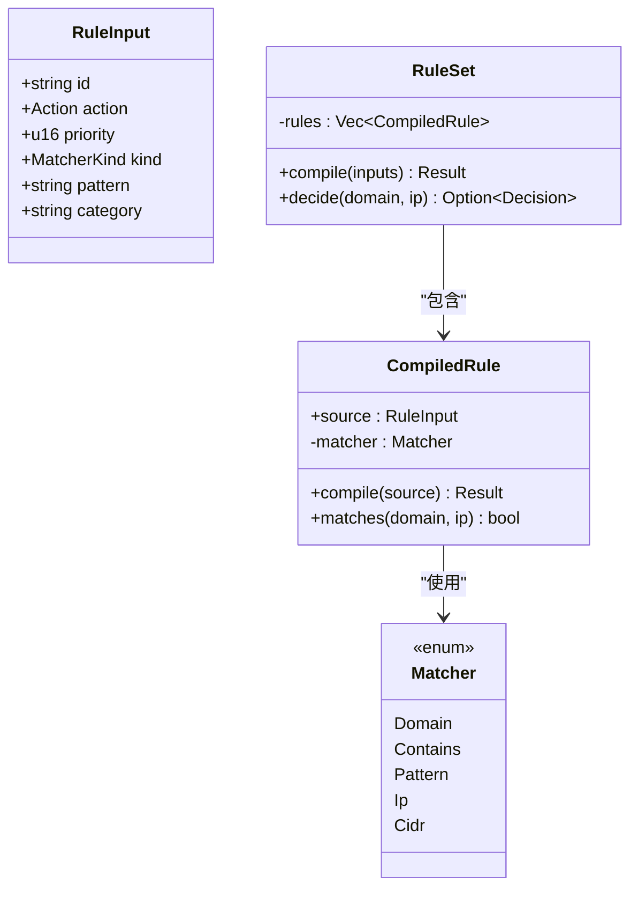
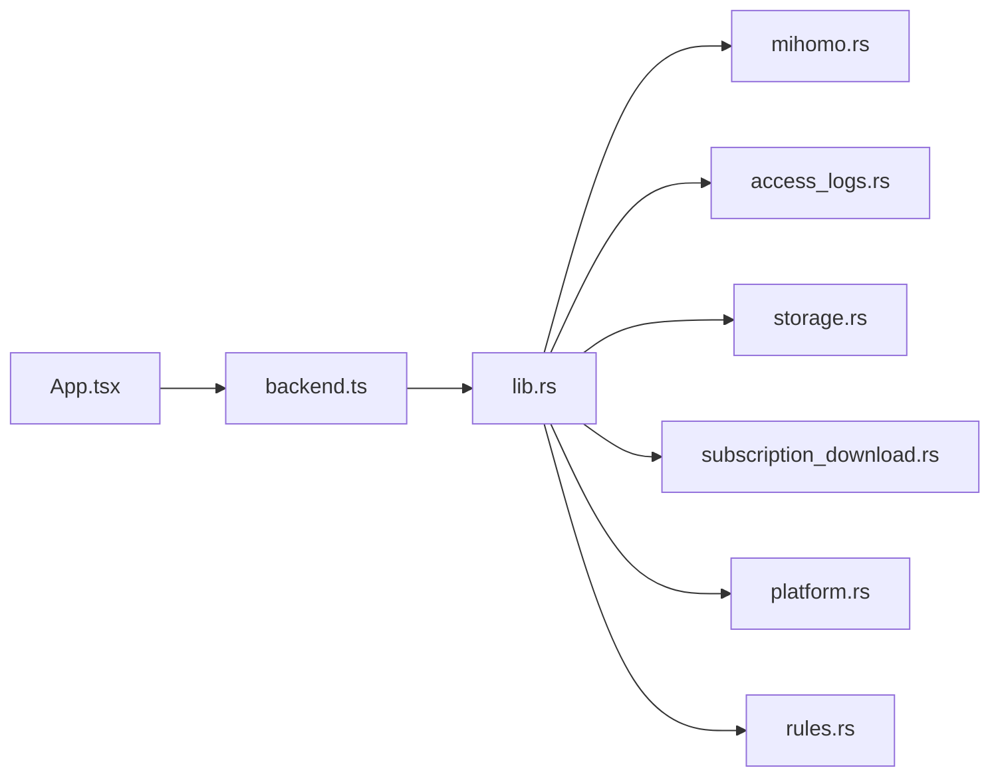

# 故障排除

<cite>
**本文引用的文件**   
- [README.md](file://README.md)
- [src/App.tsx](file://src/App.tsx)
- [src/backend.ts](file://src/backend.ts)
- [src-tauri/src/lib.rs](file://src-tauri/src/lib.rs)
- [src-tauri/src/main.rs](file://src-tauri/src/main.rs)
- [src-tauri/src/mihomo.rs](file://src-tauri/src/mihomo.rs)
- [src-tauri/src/access_logs.rs](file://src-tauri/src/access_logs.rs)
- [src-tauri/src/rules.rs](file://src-tauri/src/rules.rs)
- [src-tauri/src/storage.rs](file://src-tauri/src/storage.rs)
- [src-tauri/src/platform.rs](file://src-tauri/src/platform.rs)
- [src-tauri/src/subscription_download.rs](file://src-tauri/src/subscription_download.rs)
</cite>

## 目录
1. [简介](#简介)
2. [项目结构](#项目结构)
3. [核心组件](#核心组件)
4. [架构总览](#架构总览)
5. [详细组件分析](#详细组件分析)
6. [依赖关系分析](#依赖关系分析)
7. [性能考虑](#性能考虑)
8. [故障排除指南](#故障排除指南)
9. [结论](#结论)
10. [附录](#附录)

## 简介
本指南面向 CleanWeb 用户与运维人员，聚焦于常见问题的定位与解决，包括网络连接问题、规则匹配异常、代理节点故障等。文档提供日志分析方法、关键日志位置说明、性能调优建议、系统兼容性注意事项、调试工具与诊断脚本使用指导，以及错误代码含义与对应处理步骤，帮助用户自助解决问题。

## 项目结构
CleanWeb 采用 Tauri 桌面应用架构：前端 React UI 通过 Tauri 调用 Rust 后端能力，后端负责内核（Mihomo）管理、订阅下载与解析、规则编译与持久化、访问日志采集与导出、平台相关操作（权限、进程、网络冲突检测）等。

图表来源
- [src-tauri/src/lib.rs:46-79](file://src-tauri/src/lib.rs#L46-L79)
- [src-tauri/src/mihomo.rs:118-155](file://src-tauri/src/mihomo.rs#L118-L155)
- [src-tauri/src/access_logs.rs:74-126](file://src-tauri/src/access_logs.rs#L74-L126)
- [src-tauri/src/storage.rs:279-381](file://src-tauri/src/storage.rs#L279-L381)
- [src-tauri/src/subscription_download.rs:40-113](file://src-tauri/src/subscription_download.rs#L40-L113)
- [src-tauri/src/platform.rs:49-73](file://src-tauri/src/platform.rs#L49-L73)
- [src-tauri/src/rules.rs:126-147](file://src-tauri/src/rules.rs#L126-L147)

章节来源
- [README.md:1-34](file://README.md#L1-L34)
- [src-tauri/src/lib.rs:14-82](file://src-tauri/src/lib.rs#L14-L82)

## 核心组件
- 前端界面与状态管理：负责展示概览、规则、代理页面，轮询内核状态，触发解锁、开关保护、更新订阅、选择节点等操作。
- Tauri 命令层：将前端调用映射到后端函数，统一会话校验与错误返回。
- 内核管理：启动/停止/重载 Mihomo，生成配置，健康检查，控制器通信。
- 订阅下载与解析：拉取并解析规则/代理订阅，支持多种格式与安全搜索映射。
- 规则引擎：编译与匹配域名/IP/CIDR/正则/通配符/包含等模式，输出决策。
- 访问日志：从内核连接接口拉取实时连接，落库并支持筛选、导出 CSV。
- 平台抽象：跨平台权限提升、进程管理、网络冲突检测、登录项安装等。

章节来源
- [src/App.tsx:21-78](file://src/App.tsx#L21-L78)
- [src/backend.ts:34-137](file://src/backend.ts#L34-L137)
- [src-tauri/src/lib.rs:46-79](file://src-tauri/src/lib.rs#L46-L79)
- [src-tauri/src/mihomo.rs:182-258](file://src-tauri/src/mihomo.rs#L182-L258)
- [src-tauri/src/subscription_download.rs:40-113](file://src-tauri/src/subscription_download.rs#L40-L113)
- [src-tauri/src/rules.rs:126-147](file://src-tauri/src/rules.rs#L126-L147)
- [src-tauri/src/access_logs.rs:74-126](file://src-tauri/src/access_logs.rs#L74-L126)
- [src-tauri/src/platform.rs:49-73](file://src-tauri/src/platform.rs#L49-L73)

## 架构总览
CleanWeb 的运行时交互流程如下：

图表来源
- [src-tauri/src/mihomo.rs:182-258](file://src-tauri/src/mihomo.rs#L182-L258)
- [src-tauri/src/platform.rs:49-73](file://src-tauri/src/platform.rs#L49-L73)
- [src-tauri/src/lib.rs:46-79](file://src-tauri/src/lib.rs#L46-L79)

## 详细组件分析

### 内核管理与健康检查
- 启动流程：检测网络冲突→准备二进制与配置→启动进程→健康检查→返回状态。
- 健康检查：读取健康日志，判断是否失败或超时；若进程退出则清理 PID 文件并返回错误。
- 控制器通信：通过 HTTP 控制端口进行配置重载、测速、获取代理组与节点信息。

图表来源
- [src-tauri/src/mihomo.rs:182-258](file://src-tauri/src/mihomo.rs#L182-L258)

章节来源
- [src-tauri/src/mihomo.rs:118-155](file://src-tauri/src/mihomo.rs#L118-L155)
- [src-tauri/src/mihomo.rs:270-313](file://src-tauri/src/mihomo.rs#L270-L313)
- [src-tauri/src/mihomo.rs:349-416](file://src-tauri/src/mihomo.rs#L349-L416)

### 访问日志同步与导出
- 定时任务：后台线程每 750ms 尝试同步一次连接数据。
- 同步逻辑：调用控制器连接接口，解析连接元数据，写入本地数据库，按保留策略清理旧记录。
- 查询与导出：支持按决策类型和关键词过滤，导出 CSV。

图表来源
- [src-tauri/src/lib.rs:21-25](file://src-tauri/src/lib.rs#L21-L25)
- [src-tauri/src/access_logs.rs:74-126](file://src-tauri/src/access_logs.rs#L74-L126)
- [src-tauri/src/access_logs.rs:219-241](file://src-tauri/src/access_logs.rs#L219-L241)

章节来源
- [src-tauri/src/access_logs.rs:128-217](file://src-tauri/src/access_logs.rs#L128-L217)

### 订阅下载与解析
- 刷新流程：校验会话→拉取订阅→大小限制→文本解码→按类型解析→持久化。
- 规则订阅：自动检测或指定格式，导入到 imported_rules 表。
- 代理订阅：支持 Clash YAML 与 URI 列表，转换为内部结构并加密存储。
- 安全搜索：解析映射清单，校验目标域白名单后入库。

图表来源
- [src-tauri/src/subscription_download.rs:40-113](file://src-tauri/src/subscription_download.rs#L40-L113)
- [src-tauri/src/subscription_download.rs:148-182](file://src-tauri/src/subscription_download.rs#L148-L182)
- [src-tauri/src/subscription_download.rs:184-234](file://src-tauri/src/subscription_download.rs#L184-L234)
- [src-tauri/src/subscription_download.rs:236-300](file://src-tauri/src/subscription_download.rs#L236-L300)

章节来源
- [src-tauri/src/subscription_download.rs:127-146](file://src-tauri/src/subscription_download.rs#L127-L146)

### 规则编译与匹配
- 支持精确域名、后缀、包含、通配符、正则、IP、CIDR。
- 编译阶段规范化域名与构建匹配器，按优先级排序。
- 决策时优先匹配低优先级编号的规则。

图表来源
- [src-tauri/src/rules.rs:25-48](file://src-tauri/src/rules.rs#L25-L48)
- [src-tauri/src/rules.rs:67-119](file://src-tauri/src/rules.rs#L67-L119)
- [src-tauri/src/rules.rs:121-147](file://src-tauri/src/rules.rs#L121-L147)

章节来源
- [src-tauri/src/rules.rs:126-147](file://src-tauri/src/rules.rs#L126-L147)

### 平台兼容性与权限
- Windows：Release 构建自动请求管理员权限（TUN 需要），Debug/Dev 需手动以管理员终端运行。
- macOS：通过 root 权限复制并启动内核，安装登录项，关闭窗口时隐藏而非退出。
- 网络冲突检测：macOS 扫描 utun/ppp/ipsec 接口与 VPN 服务；Windows 当前为空集（fail-open）。

章节来源
- [src-tauri/src/main.rs:1-99](file://src-tauri/src/main.rs#L1-L99)
- [src-tauri/src/platform.rs:152-204](file://src-tauri/src/platform.rs#L152-L204)
- [src-tauri/src/platform.rs:211-235](file://src-tauri/src/platform.rs#L211-L235)
- [src-tauri/src/platform.rs:237-273](file://src-tauri/src/platform.rs#L237-L273)

## 依赖关系分析
- 前端依赖 Tauri 命令封装，所有敏感操作均需会话令牌。
- 后端各模块通过 AppState 共享数据库与会话状态。
- 内核管理依赖平台抽象进行进程与权限操作。
- 访问日志与订阅下载均依赖数据库持久化。

图表来源
- [src-tauri/src/lib.rs:46-79](file://src-tauri/src/lib.rs#L46-L79)

章节来源
- [src-tauri/src/lib.rs:14-82](file://src-tauri/src/lib.rs#L14-L82)

## 性能考虑
- 内核健康检查循环：最多轮询约 5 秒（50 次×100ms），避免长时间阻塞。
- 访问日志同步间隔：后台线程每 750ms 执行一次，注意在高流量场景下对 CPU 的影响。
- 日志保留策略：可按 7/30/90 天或永久清理，减少数据库膨胀。
- 订阅刷新周期：支持 6/12/24/168 小时，合理设置避免频繁网络请求。
- 代理测速：批量延迟测试会发起多次 HTTP 请求，建议在空闲时段执行。

[本节为通用性能建议，不直接分析具体文件]

## 故障排除指南

### 一、网络连接问题
常见问题
- 无法启动内核：提示检测到其他 VPN/TUN。
- 启动后立即退出：健康日志显示错误或进程退出。
- 控制器不可用：无法获取代理组或测速失败。

诊断步骤
- 查看内核状态：在概览页确认“保护运行中”与 PID。
- 检查网络冲突：调用 get_network_conflicts，查看是否有其他 VPN/TUN 接口或服务。
- 查看内核日志：
  - Windows：data_dir/mihomo/mihomo.log
  - macOS：/Library/Application Support/CleanWeb/mihomo.log
- 验证控制器端口：默认 127.0.0.1:19090，确保未被占用。
- 权限问题：
  - Windows：Release 自动提权；Debug 需管理员终端运行。
  - macOS：确认授权弹窗未取消，必要时重新安装登录项。

解决步骤
- 关闭冲突的 VPN/TUN 软件或禁用其服务。
- 清理残留 PID 文件并重启应用。
- 检查防火墙/杀毒软件是否拦截内核进程或控制器端口。
- 重新生成配置并重载内核。

章节来源
- [src-tauri/src/mihomo.rs:182-258](file://src-tauri/src/mihomo.rs#L182-L258)
- [src-tauri/src/platform.rs:49-73](file://src-tauri/src/platform.rs#L49-L73)
- [src-tauri/src/main.rs:92-98](file://src-tauri/src/main.rs#L92-L98)
- [src-tauri/src/platform.rs:152-204](file://src-tauri/src/platform.rs#L152-L204)

### 二、规则匹配异常
常见问题
- 规则未生效：域名或 IP 未命中预期动作。
- 规则冲突：家长规则与订阅规则优先级不一致。
- 正则/通配符无效：语法错误或范围过宽。

诊断步骤
- 检查规则编译：创建家庭规则时会进行编译校验，失败会返回错误信息。
- 查看匹配顺序：低优先级编号优先匹配，家长规则通常具有更高优先级。
- 验证模式类型：确认 exact/suffix/contains/wildcard/regex/ip/cidr 与实际输入一致。
- 观察访问日志：根据 decision 字段判断是否被 block 或 allow。

解决步骤
- 修正规则语法，避免空字符串或非法字符。
- 调整优先级，确保期望的规则先匹配。
- 使用更精确的模式，避免误伤正常域名。

章节来源
- [src-tauri/src/storage.rs:655-710](file://src-tauri/src/storage.rs#L655-L710)
- [src-tauri/src/rules.rs:67-119](file://src-tauri/src/rules.rs#L67-L119)
- [src-tauri/src/rules.rs:126-147](file://src-tauri/src/rules.rs#L126-L147)
- [src-tauri/src/access_logs.rs:128-168](file://src-tauri/src/access_logs.rs#L128-L168)

### 三、代理节点故障
常见问题
- 节点不可用：测速超时或延迟极高。
- 组内节点切换失败：选择节点后未生效。
- 自动选点失效：启用后仍固定使用某节点。

诊断步骤
- 获取代理组与节点：调用 get_proxies，检查 groupType 与 now 字段。
- 测速单个组：test_proxy_group 返回 delay，判断连通性。
- 批量测速：test_all_proxy_delays 返回各节点延迟，识别慢节点。
- 检查选择持久化：proxy_selections 表记录最近选择，若手动选择会关闭自动选点。

解决步骤
- 更换可用节点或调整组内成员。
- 若自动选点不生效，检查是否曾手动选择导致自动选点被关闭。
- 清理过期或无效的代理订阅，重新导入。

章节来源
- [src-tauri/src/mihomo.rs:349-416](file://src-tauri/src/mihomo.rs#L349-L416)
- [src-tauri/src/mihomo.rs:315-347](file://src-tauri/src/mihomo.rs#L315-L347)
- [src-tauri/src/mihomo.rs:526-563](file://src-tauri/src/mihomo.rs#L526-L563)
- [src-tauri/src/mihomo.rs:486-524](file://src-tauri/src/mihomo.rs#L486-L524)

### 四、日志分析方法与关键位置
- 访问日志：
  - 同步：后台线程每 750ms 拉取连接数据并入库。
  - 查询：支持按 decision 与关键词过滤，最大返回 5000 条。
  - 导出：CSV 包含时间、域名、IP、端口、决策、规则、分类、进程、系统、用户、源 IP、路由、代理组、错误。
- 内核日志：
  - Windows：data_dir/mihomo/mihomo.log
  - macOS：/Library/Application Support/CleanWeb/mihomo.log
- 关键表：
  - access_logs：访问记录
  - proxy_selections：代理选择
  - settings：系统设置
  - subscriptions/imported_rules/proxy_payloads：订阅与规则数据

章节来源
- [src-tauri/src/lib.rs:21-25](file://src-tauri/src/lib.rs#L21-L25)
- [src-tauri/src/access_logs.rs:74-126](file://src-tauri/src/access_logs.rs#L74-L126)
- [src-tauri/src/access_logs.rs:128-217](file://src-tauri/src/access_logs.rs#L128-L217)
- [src-tauri/src/storage.rs:279-381](file://src-tauri/src/storage.rs#L279-L381)

### 五、性能调优与瓶颈识别
- 降低日志同步频率：如需降低 CPU 占用，可调整后台线程睡眠间隔（需谨慎）。
- 调整日志保留策略：设置为 7d/30d/90d 定期清理，避免数据库过大。
- 控制订阅刷新周期：避免过于频繁的拉取，推荐 24h 或更长。
- 代理测速时机：在网络空闲时执行，避免影响业务体验。
- 监控内核健康日志：关注启动失败与退出原因，及时修复配置。

[本节为通用性能建议，不直接分析具体文件]

### 六、系统兼容性问题与解决方案
- Windows：
  - 必须管理员权限：Release 自动提权；Debug 需手动管理员终端运行。
  - 网络冲突检测：当前实现为空集，可能存在 fail-open 行为。
- macOS：
  - 需要 root 权限启动内核：授权弹窗需确认。
  - 登录项安装：首次启动会安装，确保路径正确。
  - 冲突检测：扫描 utun/ppp/ipsec 接口与 VPN 服务。

章节来源
- [src-tauri/src/main.rs:1-99](file://src-tauri/src/main.rs#L1-L99)
- [src-tauri/src/platform.rs:152-204](file://src-tauri/src/platform.rs#L152-L204)
- [src-tauri/src/platform.rs:211-235](file://src-tauri/src/platform.rs#L211-L235)
- [src-tauri/src/platform.rs:237-273](file://src-tauri/src/platform.rs#L237-L273)

### 七、调试工具与诊断脚本使用指导
- 前端控制台：
  - 打开浏览器开发者工具，查看 runtimeError 与网络请求。
  - 使用 backend.ts 暴露的方法进行手动调用（如 getCoreStatus、getProxies）。
- Tauri 命令：
  - 通过 lib.rs 注册的命令进行调试，如 test_proxy_group、test_all_proxy_delays。
- 日志导出：
  - 使用 exportAccessLogsCsv 导出 CSV，便于离线分析。
- 内核日志：
  - 直接查看 mihomo.log，定位启动失败与运行时错误。

章节来源
- [src/App.tsx:21-78](file://src/App.tsx#L21-L78)
- [src/backend.ts:113-132](file://src/backend.ts#L113-L132)
- [src-tauri/src/lib.rs:46-79](file://src-tauri/src/lib.rs#L46-L79)

### 八、错误代码含义与解决步骤
以下为常见错误信息与处理建议（基于后端返回的错误消息）：
- “检测到其他 VPN/TUN，CleanWeb 未启动”：关闭冲突的 VPN/TUN 软件或禁用其服务。
- “无法启动 Mihomo”：检查二进制文件完整性与路径权限。
- “Mihomo 启动后立即退出”：查看内核日志，修复配置或环境问题。
- “等待 Mihomo TUN 就绪超时”：健康检查失败，检查系统网络栈与权限。
- “Mihomo 配置校验失败”：修正 config.yaml 中的语法或参数。
- “已开启网络代理，但没有可用的代理节点”：导入有效的代理订阅后再开启代理。
- “管理密码错误/尚未设置管理密码”：确认密码长度与一致性，或初始化密码。
- “管理会话已过期，请重新解锁”：重新解锁并刷新页面。
- “订阅下载失败/服务器返回非成功状态码”：检查 URL 可达性与认证。
- “订阅文件超过 20MB 限制”：更换较小或分片订阅。
- “未找到支持的代理节点或代理组”：确认订阅格式与内容。
- “安全搜索订阅版本无效或没有映射”：检查 YAML 结构与映射条目。

章节来源
- [src-tauri/src/mihomo.rs:182-258](file://src-tauri/src/mihomo.rs#L182-L258)
- [src-tauri/src/mihomo.rs:270-313](file://src-tauri/src/mihomo.rs#L270-L313)
- [src-tauri/src/storage.rs:474-506](file://src-tauri/src/storage.rs#L474-L506)
- [src-tauri/src/storage.rs:429-456](file://src-tauri/src/storage.rs#L429-L456)
- [src-tauri/src/subscription_download.rs:40-113](file://src-tauri/src/subscription_download.rs#L40-L113)
- [src-tauri/src/subscription_download.rs:184-234](file://src-tauri/src/subscription_download.rs#L184-L234)

## 结论
本指南提供了 CleanWeb 在常见场景下的系统化排障方法，涵盖网络、规则、代理、日志、性能与兼容性等方面。通过结合前端状态、后端命令与内核日志，用户可以快速定位问题并采取相应措施。建议在日常使用中合理配置日志保留与订阅刷新周期，并在网络空闲时执行测速与配置重载，以获得稳定高效的体验。

## 附录
- 开发环境搭建：参考 README 中的 npm 与 Tauri 依赖说明。
- 产品边界与架构：详见 docs/product-spec.md 与 docs/architecture.md。

章节来源
- [README.md:20-34](file://README.md#L20-L34)