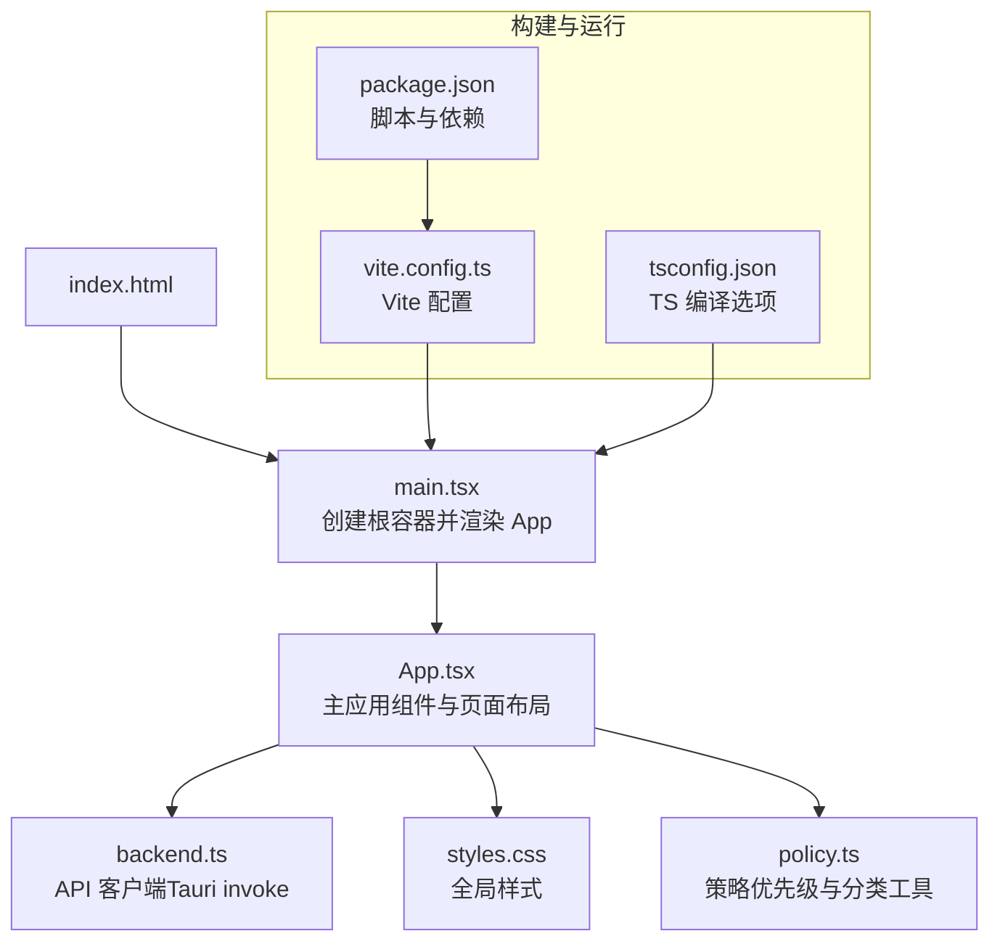
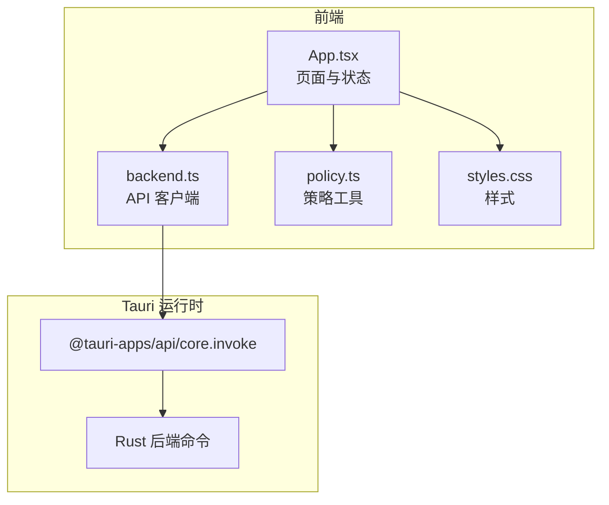
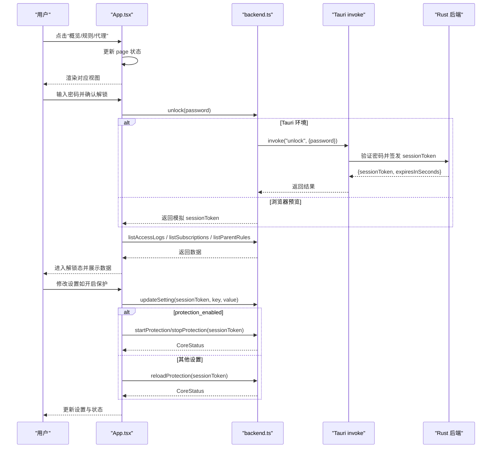
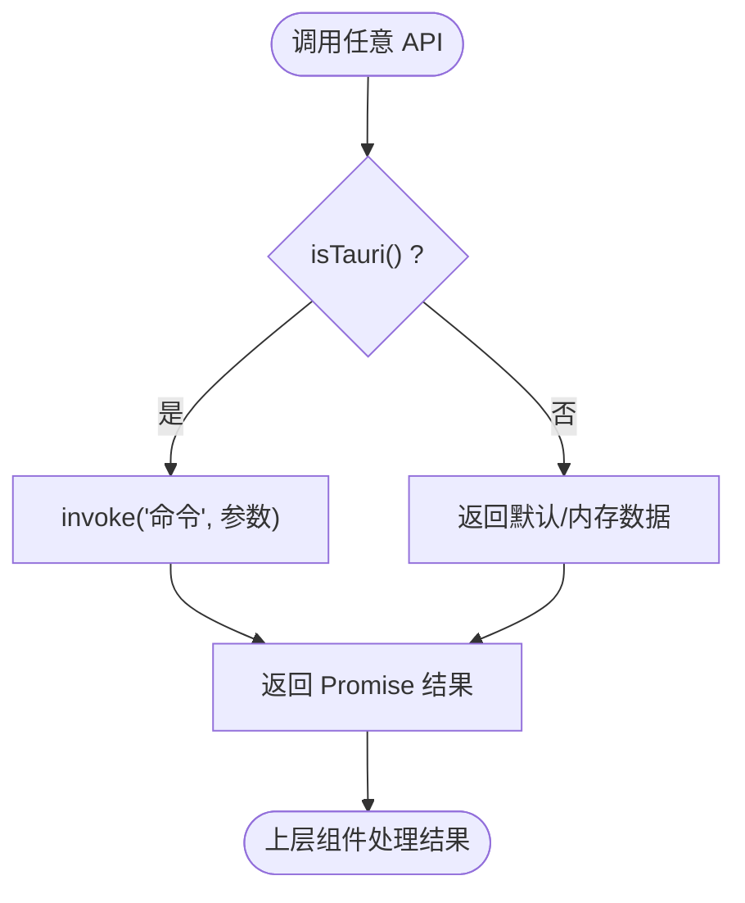
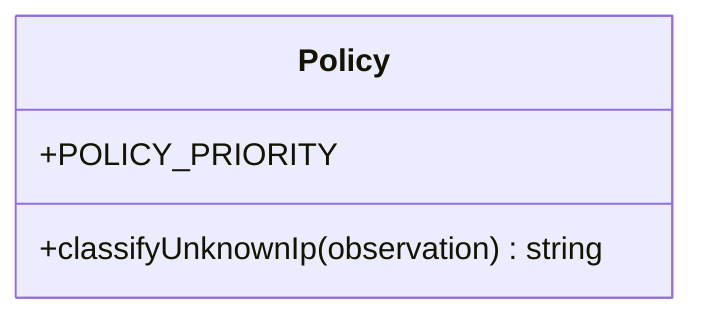
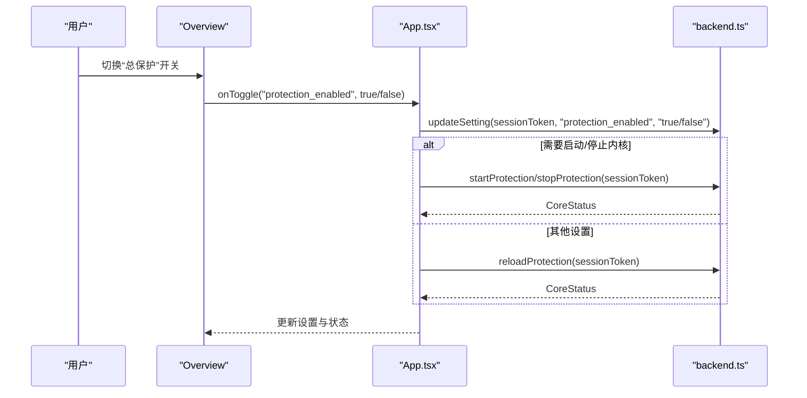
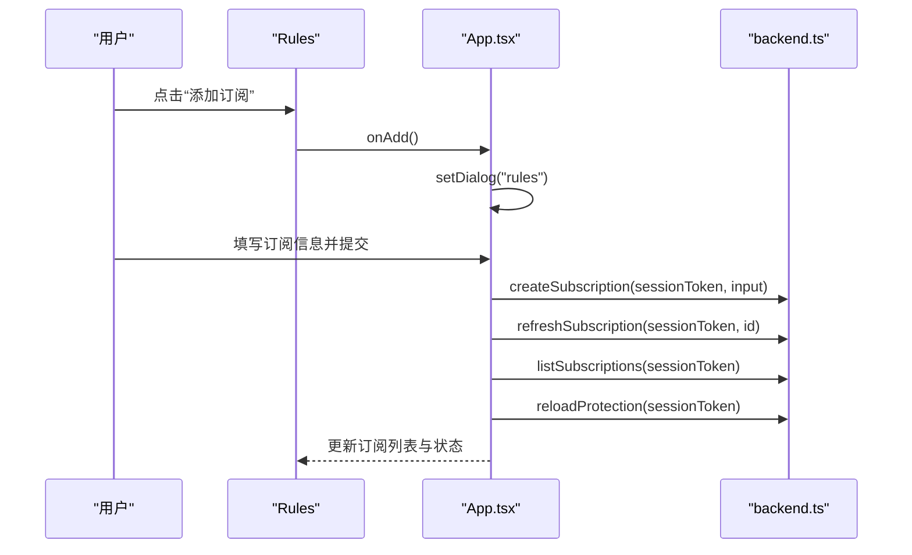
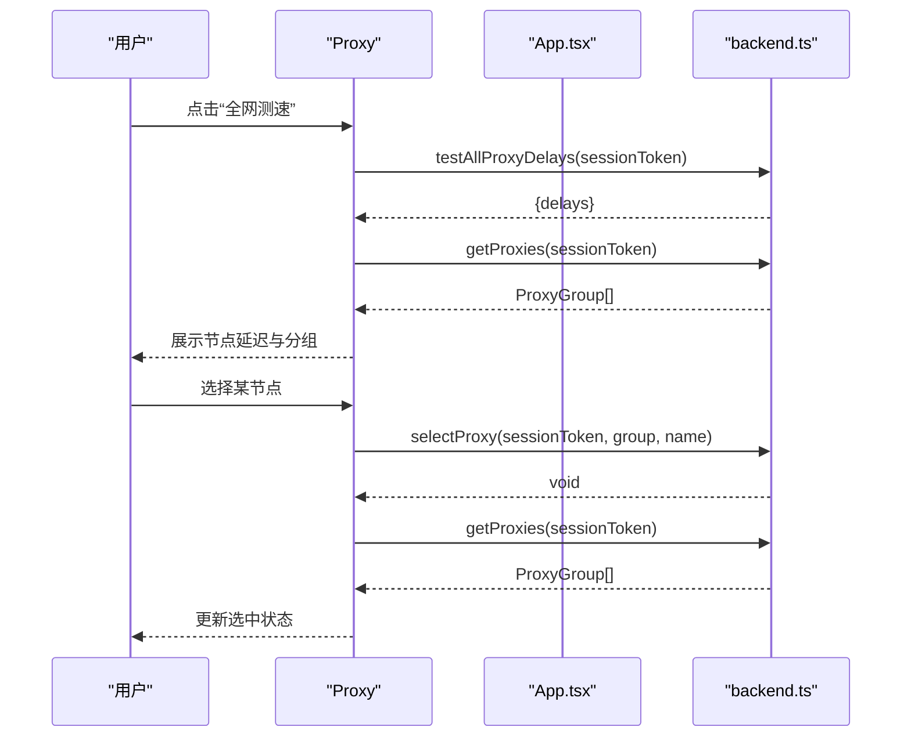
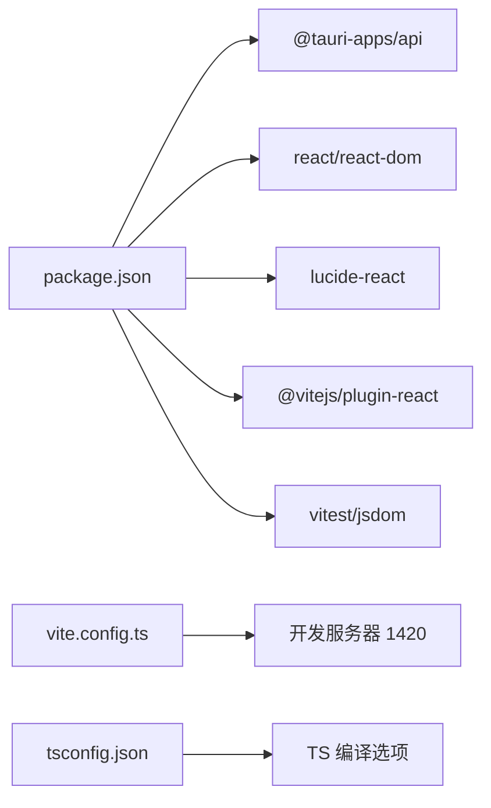

# 前端架构设计

<cite>
**本文引用的文件列表**
- [src/App.tsx](file://src/App.tsx)
- [src/backend.ts](file://src/backend.ts)
- [src/main.tsx](file://src/main.tsx)
- [src/styles.css](file://src/styles.css)
- [package.json](file://package.json)
- [vite.config.ts](file://vite.config.ts)
- [tsconfig.json](file://tsconfig.json)
- [README.md](file://README.md)
- [src/policy.ts](file://src/policy.ts)
</cite>

## 目录
1. [简介](#简介)
2. [项目结构](#项目结构)
3. [核心组件](#核心组件)
4. [架构总览](#架构总览)
5. [详细组件分析](#详细组件分析)
6. [依赖关系分析](#依赖关系分析)
7. [性能考量](#性能考量)
8. [故障排查指南](#故障排查指南)
9. [结论](#结论)
10. [附录](#附录)

## 简介
本文件为 CleanWeb 前端的架构设计文档，面向基于 React 19 + TypeScript 的桌面端应用（Tauri）。文档聚焦以下目标：
- 组件层次结构与职责划分
- 状态管理模式与页面状态同步策略
- API 客户端封装设计与 Tauri 后端通信机制
- 前端路由管理、用户交互流程与错误处理
- 模块依赖关系图与关键交互时序图

CleanWeb 是一个以 Windows 为主的家长网络过滤客户端，通过本地策略引擎与独立代理内核协同工作，实现系统级流量捕获、规则订阅、代理节点管理与访问日志等功能。

**章节来源**
- [README.md:1-34](file://README.md#L1-L34)

## 项目结构
前端采用单页应用模式，入口由 Vite 构建，React 渲染根组件 App，并通过 CSS 提供整体样式。主要文件职责如下：
- src/main.tsx：应用启动与挂载
- src/App.tsx：主应用组件，包含页面导航、全局状态、业务逻辑与子视图
- src/backend.ts：统一 API 客户端，封装对 Tauri 后端的调用并提供浏览器预览回退
- src/styles.css：全局样式与主题
- package.json：脚本与依赖声明
- vite.config.ts：Vite 开发服务器配置
- tsconfig.json：TypeScript 编译选项

**图表来源**
- [src/main.tsx:1-9](file://src/main.tsx#L1-L9)
- [src/App.tsx:1-78](file://src/App.tsx#L1-L78)
- [src/backend.ts:1-137](file://src/backend.ts#L1-L137)
- [src/styles.css:1-50](file://src/styles.css#L1-L50)
- [package.json:1-31](file://package.json#L1-L31)
- [vite.config.ts:1-13](file://vite.config.ts#L1-L13)
- [tsconfig.json:1-22](file://tsconfig.json#L1-L22)

**章节来源**
- [src/main.tsx:1-9](file://src/main.tsx#L1-L9)
- [src/App.tsx:1-78](file://src/App.tsx#L1-L78)
- [src/backend.ts:1-137](file://src/backend.ts#L1-L137)
- [src/styles.css:1-50](file://src/styles.css#L1-L50)
- [package.json:1-31](file://package.json#L1-L31)
- [vite.config.ts:1-13](file://vite.config.ts#L1-L13)
- [tsconfig.json:1-22](file://tsconfig.json#L1-L22)

## 核心组件
- App 主应用组件
  - 负责页面路由切换（概览/规则管理/代理节点）、解锁锁定状态、运行时错误提示、设置项与订阅数据加载、定时刷新等
  - 通过 backend.ts 调用 Tauri 命令或浏览器预览回退
  - 组合多个子视图组件：Overview、Rules、Proxy 以及若干对话框组件
- API 客户端 backend.ts
  - 统一暴露 Settings、Subscription、CoreStatus、AccessLog、ParentRule、ProxyGroup 等类型
  - 使用 isTauri() 判断运行环境，在 Tauri 下通过 @tauri-apps/api/core.invoke 调用 Rust 命令；在非 Tauri 环境下返回模拟数据
  - 提供初始化密码、解锁/锁定、设置读写、订阅 CRUD、规则管理、代理组查询与选择、测速、访问日志导出等接口
- 策略与工具 policy.ts
  - 定义策略优先级常量与未知 IP 分类工具函数，用于辅助决策展示

**章节来源**
- [src/App.tsx:1-290](file://src/App.tsx#L1-L290)
- [src/backend.ts:1-137](file://src/backend.ts#L1-L137)
- [src/policy.ts:1-22](file://src/policy.ts#L1-L22)

## 架构总览
前端采用“单组件驱动”的轻量架构：所有页面与状态集中在 App 组件内，通过局部 state 与 props 向下传递，避免引入外部状态库。API 层集中封装，屏蔽 Tauri 与浏览器差异。

**图表来源**
- [src/App.tsx:1-78](file://src/App.tsx#L1-L78)
- [src/backend.ts:1-137](file://src/backend.ts#L1-L137)
- [src/policy.ts:1-22](file://src/policy.ts#L1-L22)
- [src/styles.css:1-50](file://src/styles.css#L1-L50)

## 详细组件分析

### App 主应用组件
- 职责
  - 页面路由：通过 page 状态控制概览/规则管理/代理节点三个视图
  - 安全锁：locked/sessionToken 控制管理台解锁状态，未解锁时限制敏感操作
  - 初始化：启动时并行获取引导状态、当前设置与内核状态，必要时自动启动保护
  - 定时任务：每 5 秒轮询内核状态；每 15 分钟刷新到期订阅；每 3 秒刷新访问日志
  - 设置更新：根据 key 区分是否触发内核重载，统一错误收集到 runtimeError
  - 订阅与规则：CRUD 与开关、刷新、删除等操作，成功后刷新列表并重新加载内核配置
  - 代理节点：拉取代理组与节点信息，支持展开订阅详情、选择节点、全网测速
  - 对话框：解锁、初始化管理密码、添加规则/代理订阅、自定义家庭规则
- 数据流
  - 从 backend.ts 读取 Settings、CoreStatus、Subscriptions、ParentRules、AccessLogs
  - 将用户操作转换为 backend.ts 调用，并在成功回调中更新本地 state
- 错误处理
  - 运行时错误统一显示在顶部警告区域
  - 对话框表单提交失败时显示 form-error

**图表来源**
- [src/App.tsx:21-53](file://src/App.tsx#L21-L53)
- [src/backend.ts:34-117](file://src/backend.ts#L34-L117)

**章节来源**
- [src/App.tsx:1-290](file://src/App.tsx#L1-L290)

### API 客户端 backend.ts
- 设计模式
  - 环境检测：isTauri() 判断是否在 Tauri 环境中运行
  - 命令映射：每个业务方法在 Tauri 下调用 invoke，非 Tauri 下返回默认或内存数据
  - 类型契约：集中定义 Settings、Subscription、CoreStatus、AccessLog、ParentRule、ProxyGroup 等类型，保证前后端一致
- 关键能力
  - 认证与会话：initializePassword、unlock、lock
  - 设置管理：getSettings、updateSetting
  - 订阅管理：list/create/setEnabled/delete/refresh/refreshDue
  - 规则管理：list/create/setEnabled/delete ParentRule
  - 代理管理：getProxies/getSubscriptionProxies/selectProxy/testAllProxyDelays
  - 日志管理：list/clear/export CSV
- 错误与回退
  - 非 Tauri 环境提供稳定的预览数据，便于开发与测试
  - 调用失败时上层组件捕获异常并展示错误

**图表来源**
- [src/backend.ts:32-137](file://src/backend.ts#L32-L137)

**章节来源**
- [src/backend.ts:1-137](file://src/backend.ts#L1-L137)

### 策略与工具 policy.ts
- 策略优先级常量：定义不同策略的优先级顺序，便于后续扩展与排序
- 未知 IP 分类：classifyUnknownIp 根据观察到的域名与 IP 匹配情况给出正常或警告等级

**图表来源**
- [src/policy.ts:1-22](file://src/policy.ts#L1-L22)

**章节来源**
- [src/policy.ts:1-22](file://src/policy.ts#L1-L22)

### 页面与交互流程

#### 概览页面 Overview
- 展示保护运行状态、设置卡片（总保护、代理、自动选点、安全搜索、访问日志保留时间）
- 访问记录面板支持清空与导出 CSV
- 通过 Switch 组件触发 onToggle/onRetention 回调，最终调用 setValue 更新设置

**图表来源**
- [src/App.tsx:30-38](file://src/App.tsx#L30-L38)
- [src/App.tsx:80-96](file://src/App.tsx#L80-L96)
- [src/backend.ts:52-117](file://src/backend.ts#L52-L117)

**章节来源**
- [src/App.tsx:80-96](file://src/App.tsx#L80-L96)

#### 规则管理页面 Rules
- 家庭自定义规则：增删改查、启用/禁用
- 规则来源订阅：增删改查、启用/禁用、手动刷新
- 推荐规则源：在添加订阅对话框中按格式筛选并一键填充

**图表来源**
- [src/App.tsx:39-47](file://src/App.tsx#L39-L47)
- [src/App.tsx:101-113](file://src/App.tsx#L101-L113)
- [src/backend.ts:66-111](file://src/backend.ts#L66-L111)

**章节来源**
- [src/App.tsx:101-113](file://src/App.tsx#L101-L113)

#### 代理节点页面 Proxy
- 订阅导入与展开：查看订阅解析出的节点与代理组
- 节点选择：在代理组中选择目标节点
- 网速检测：批量测试节点延迟并展示结果

**图表来源**
- [src/App.tsx:115-226](file://src/App.tsx#L115-L226)
- [src/backend.ts:118-128](file://src/backend.ts#L118-L128)

**章节来源**
- [src/App.tsx:115-226](file://src/App.tsx#L115-L226)

## 依赖关系分析
- 运行时依赖
  - react/react-dom：UI 框架
  - @tauri-apps/api：与 Tauri 后端通信
  - lucide-react：图标库
- 开发依赖
  - vite：构建与开发服务器
  - typescript：类型检查
  - vitest/jsdom：单元测试
- 构建配置
  - Vite 端口 1420，忽略 Tauri target 目录热更新
  - TS 严格模式，ES2022 目标，react-jsx 转换

**图表来源**
- [package.json:1-31](file://package.json#L1-L31)
- [vite.config.ts:1-13](file://vite.config.ts#L1-L13)
- [tsconfig.json:1-22](file://tsconfig.json#L1-L22)

**章节来源**
- [package.json:1-31](file://package.json#L1-L31)
- [vite.config.ts:1-13](file://vite.config.ts#L1-L13)
- [tsconfig.json:1-22](file://tsconfig.json#L1-L22)

## 性能考量
- 轮询频率
  - 内核状态每 5 秒轮询一次，避免频繁请求造成负载
  - 访问日志每 3 秒刷新，注意在大量日志场景下可考虑分页或增量同步
  - 订阅刷新每 15 分钟执行一次，适合后台任务
- 数据缓存
  - 代理订阅节点信息按需展开加载，减少一次性拉取开销
  - 测速结果缓存于 delays 对象，避免重复计算
- 渲染优化
  - 使用局部 state 与 props 传递，避免不必要的重渲染
  - 大列表建议在未来引入虚拟滚动或分页

[本节为通用指导，不直接分析具体文件]

## 故障排查指南
- 运行时错误
  - App 组件顶部会显示 runtimeError，来源于设置更新或内核操作的异常
  - 建议在控制台查看堆栈，定位 backend.ts 调用失败原因
- 解锁失败
  - 非 Tauri 环境会校验密码长度；Tauri 环境由后端验证
  - 若会话过期，需重新解锁
- 订阅刷新失败
  - 检查订阅 URL 可达性与格式是否正确
  - 查看 lastError 字段获取后端返回的错误信息
- 代理节点不可用
  - 使用“全网测速”功能检测节点延迟
  - 确认代理组类型与成员列表是否完整

**章节来源**
- [src/App.tsx:21-53](file://src/App.tsx#L21-L53)
- [src/backend.ts:34-117](file://src/backend.ts#L34-L117)

## 结论
CleanWeb 前端采用简洁的单组件驱动架构，结合统一的 API 客户端封装，实现了与 Tauri 后端的稳定通信与良好的可扩展性。通过集中式状态与明确的交互流程，保证了用户体验的一致性与可维护性。未来可在分页、虚拟滚动与更细粒度的状态管理中进一步优化性能与体验。

[本节为总结，不直接分析具体文件]

## 附录

### 关键类型与接口摘要
- Settings：保护开关、代理开关、自动选点、安全搜索、日志保留时间、分类开关
- Subscription：订阅元信息与状态
- CoreStatus：内核运行状态与控制信息
- AccessLog：访问记录条目
- ParentRule：家庭自定义规则
- ProxyGroup/ProxyNode：代理组与节点信息
- RecommendedSource：推荐规则源

**章节来源**
- [src/backend.ts:3-21](file://src/backend.ts#L3-L21)