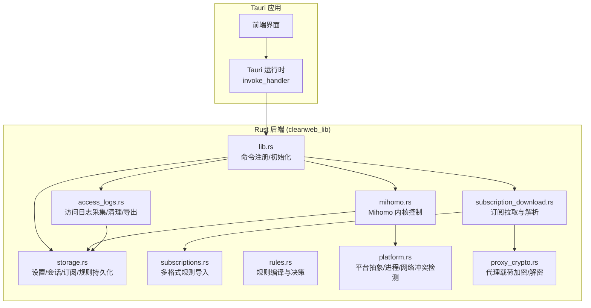
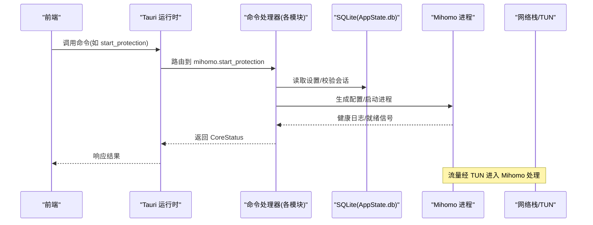
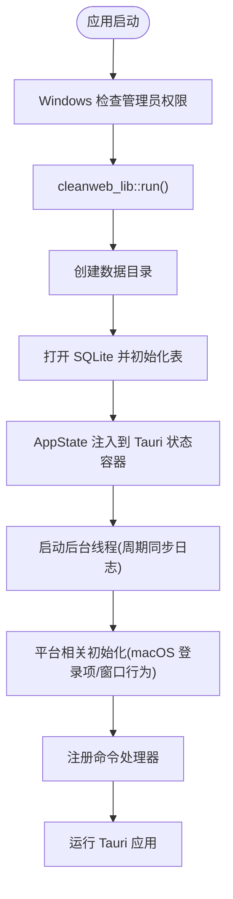
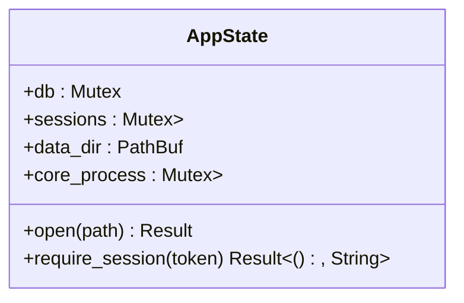
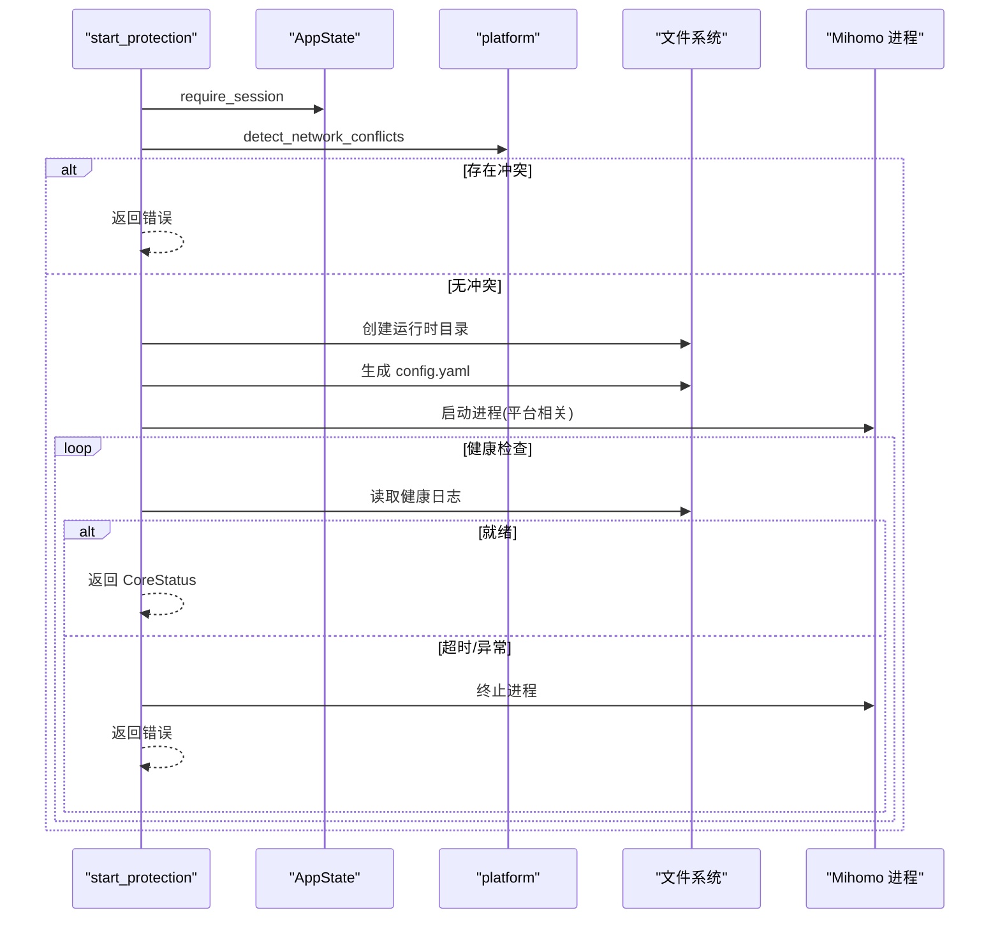
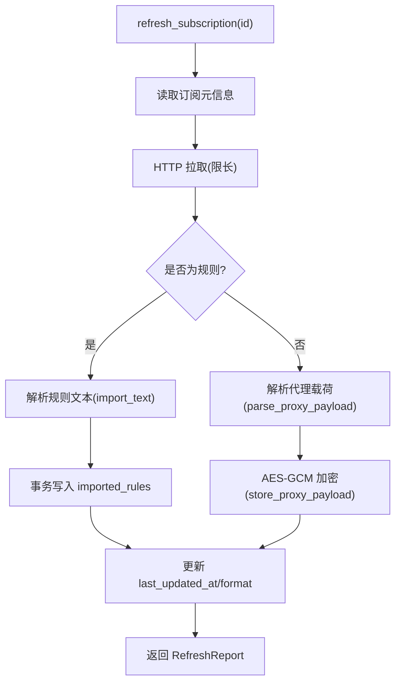
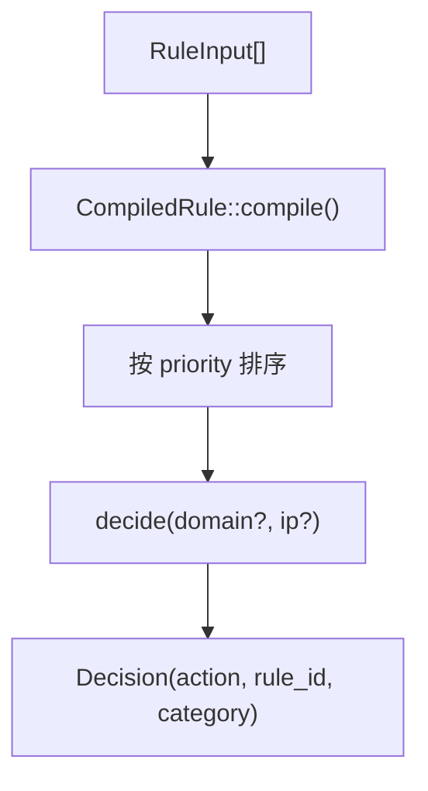
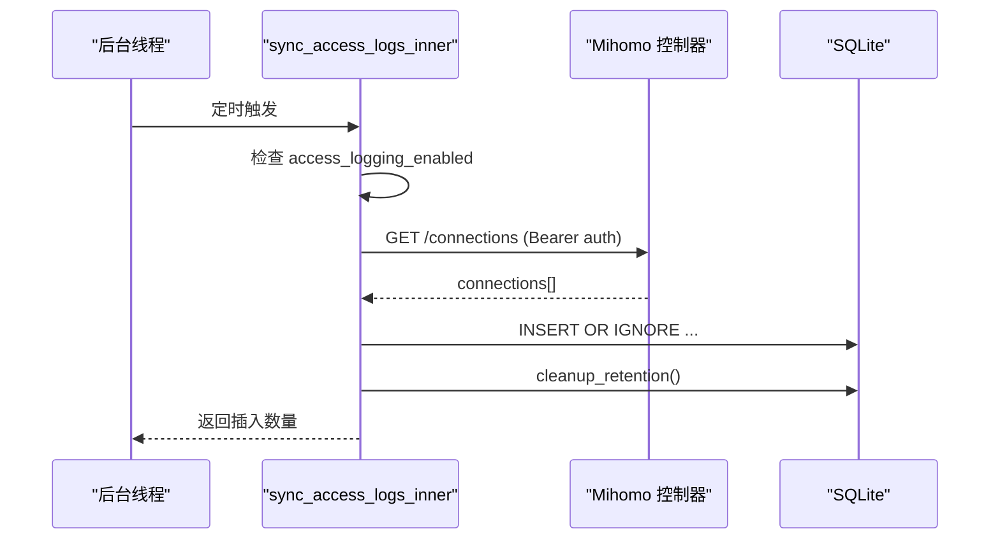
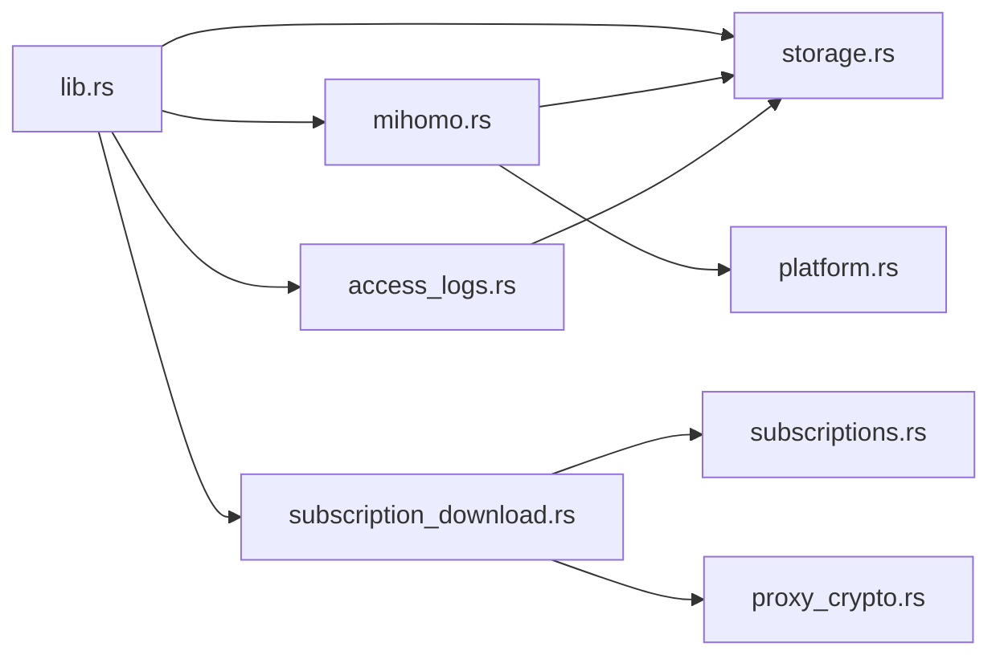

# 后端架构设计

<cite>
**本文引用的文件列表**
- [lib.rs](file://src-tauri/src/lib.rs)
- [main.rs](file://src-tauri/src/main.rs)
- [storage.rs](file://src-tauri/src/storage.rs)
- [mihomo.rs](file://src-tauri/src/mihomo.rs)
- [access_logs.rs](file://src-tauri/src/access_logs.rs)
- [subscription_download.rs](file://src-tauri/src/subscription_download.rs)
- [subscriptions.rs](file://src-tauri/src/subscriptions.rs)
- [rules.rs](file://src-tauri/src/rules.rs)
- [platform.rs](file://src-tauri/src/platform.rs)
- [proxy_crypto.rs](file://src-tauri/src/proxy_crypto.rs)
- [Cargo.toml](file://src-tauri/Cargo.toml)
- [tauri.conf.json](file://src-tauri/tauri.conf.json)
- [architecture.md](file://docs/architecture.md)
</cite>

## 目录
1. [简介](#简介)
2. [项目结构](#项目结构)
3. [核心组件](#核心组件)
4. [架构总览](#架构总览)
5. [详细组件分析](#详细组件分析)
6. [依赖关系分析](#依赖关系分析)
7. [性能与并发模型](#性能与并发模型)
8. [故障排查指南](#故障排查指南)
9. [结论](#结论)
10. [附录](#附录)

## 简介
本文件为 CleanWeb 后端的架构设计文档，聚焦于基于 Tauri 2 + Rust 的后端实现。文档围绕命令处理器模式、异步处理机制、错误处理策略展开，详细说明 lib.rs 的命令注册机制、main.rs 的应用启动流程与模块化设计，并解释后端服务的生命周期管理、线程模型和资源管理。文末提供后端模块架构图与命令处理流程图，帮助读者快速理解系统结构与关键路径。

## 项目结构
CleanWeb 的桌面壳由 Tauri 2 承载，Rust 后端位于 src-tauri 目录中。前端通过 Tauri 命令通道调用后端能力。后端采用“命令处理器”模式：每个业务域（存储、代理内核、订阅下载、访问日志等）暴露一组 #[tauri::command] 函数，统一在应用初始化时注册到 invoke_handler。

图表来源
- [lib.rs:14-82](file://src-tauri/src/lib.rs#L14-L82)
- [storage.rs:23-28](file://src-tauri/src/storage.rs#L23-L28)
- [mihomo.rs:118-155](file://src-tauri/src/mihomo.rs#L118-L155)
- [subscription_download.rs:40-113](file://src-tauri/src/subscription_download.rs#L40-L113)
- [subscriptions.rs:44-95](file://src-tauri/src/subscriptions.rs#L44-L95)
- [rules.rs:67-147](file://src-tauri/src/rules.rs#L67-L147)
- [access_logs.rs:74-126](file://src-tauri/src/access_logs.rs#L74-L126)
- [platform.rs:49-73](file://src-tauri/src/platform.rs#L49-L73)
- [proxy_crypto.rs:24-66](file://src-tauri/src/proxy_crypto.rs#L24-L66)

章节来源
- [lib.rs:14-82](file://src-tauri/src/lib.rs#L14-L82)
- [tauri.conf.json:1-28](file://src-tauri/tauri.conf.json#L1-L28)

## 核心组件
- 命令注册与入口
  - lib.rs 负责构建 tauri::Builder，完成数据目录创建、AppState 注入、后台任务启动、平台相关逻辑（macOS 登录项安装、窗口隐藏），并通过 generate_handler! 集中注册所有命令。
- 状态与持久化
  - storage.rs 定义 AppState，封装 rusqlite 连接、会话缓存、数据目录、子进程句柄；提供密码初始化、解锁/锁定、设置读写、订阅 CRUD、父级规则管理等命令。
- 代理内核控制
  - mihomo.rs 负责 Mihomo 二进制文件的确保、配置生成、进程启停、健康检查、控制器 API 交互（获取代理组、选择节点、测速、重载配置）。
- 订阅下载与解析
  - subscription_download.rs 负责从远程 URL 拉取订阅，支持 Clash YAML、URI 列表、Base64 包裹等多种形态，并将结果持久化或转换为内部结构。
  - subscriptions.rs 提供多格式规则文本解析器（Clash、Hosts、DomainList、IpList、Adblock），输出统一的 RuleInput。
- 规则引擎
  - rules.rs 将 RuleInput 编译为 CompiledRule，按优先级排序，支持精确、后缀、包含、通配符、正则、IP、CIDR 匹配，返回确定性决策。
- 访问日志
  - access_logs.rs 定时轮询 Mihomo 控制器接口，同步连接记录至本地 SQLite，支持过滤查询、清空、CSV 导出，并按保留策略清理历史。
- 平台抽象
  - platform.rs 提供跨平台进程管理、网络冲突检测、macOS 特权启动、登录项安装等能力。
- 安全与密钥
  - proxy_crypto.rs 使用 AES-GCM 对代理订阅载荷进行加密封装，密钥保存在系统 Keychain，并在首次启动时对明文存量数据进行迁移。

章节来源
- [lib.rs:14-82](file://src-tauri/src/lib.rs#L14-L82)
- [storage.rs:23-28](file://src-tauri/src/storage.rs#L23-L28)
- [mihomo.rs:118-155](file://src-tauri/src/mihomo.rs#L118-L155)
- [subscription_download.rs:40-113](file://src-tauri/src/subscription_download.rs#L40-L113)
- [subscriptions.rs:44-95](file://src-tauri/src/subscriptions.rs#L44-L95)
- [rules.rs:67-147](file://src-tauri/src/rules.rs#L67-L147)
- [access_logs.rs:74-126](file://src-tauri/src/access_logs.rs#L74-L126)
- [platform.rs:49-73](file://src-tauri/src/platform.rs#L49-L73)
- [proxy_crypto.rs:24-66](file://src-tauri/src/proxy_crypto.rs#L24-L66)

## 架构总览
CleanWeb 后端遵循“命令处理器模式”，前端通过 Tauri 命令通道调用后端服务。后端以 AppState 为中心共享状态，各模块通过 State<'_, AppState> 访问数据库与会话信息。Mihomo 作为外部独立进程被管理，CleanWeb 仅通过其外部控制器 API 进行配置与状态交互。

图表来源
- [lib.rs:46-79](file://src-tauri/src/lib.rs#L46-L79)
- [mihomo.rs:157-258](file://src-tauri/src/mihomo.rs#L157-L258)
- [storage.rs:468-506](file://src-tauri/src/storage.rs#L468-L506)

## 详细组件分析

### 命令注册与启动流程
- main.rs 在 Windows Release 模式下自动请求管理员权限（因 TUN 需要），随后调用 cleanweb_lib::run()。
- lib.rs 的 run() 中：
  - 初始化数据目录并打开 SQLite，注入 AppState。
  - 启动后台线程周期性同步访问日志。
  - macOS 下安装登录项、处理窗口关闭事件与后台运行参数。
  - 通过 generate_handler! 注册所有命令。

图表来源
- [main.rs:92-98](file://src-tauri/src/main.rs#L92-L98)
- [lib.rs:14-45](file://src-tauri/src/lib.rs#L14-L45)
- [lib.rs:46-82](file://src-tauri/src/lib.rs#L46-L82)

章节来源
- [main.rs:1-99](file://src-tauri/src/main.rs#L1-L99)
- [lib.rs:14-82](file://src-tauri/src/lib.rs#L14-L82)

### 状态管理与会话控制
- AppState 持有：
  - 数据库连接（Mutex 保护）
  - 会话映射（token -> 过期时间）
  - 数据目录路径
  - 子进程句柄（Mihomo）
- 会话 TTL 固定，unlock 生成 token 并写入会话表，require_session 校验并刷新 TTL。
- 敏感操作需携带 session_token，否则拒绝。

图表来源
- [storage.rs:23-28](file://src-tauri/src/storage.rs#L23-L28)
- [storage.rs:248-277](file://src-tauri/src/storage.rs#L248-L277)

章节来源
- [storage.rs:23-28](file://src-tauri/src/storage.rs#L23-L28)
- [storage.rs:248-277](file://src-tauri/src/storage.rs#L248-L277)

### 代理内核（Mihomo）生命周期管理
- 启动流程：
  - 停止旧进程，检测网络冲突，准备运行时目录。
  - 确保二进制文件存在，生成 controller secret 与配置文件。
  - 根据平台选择启动方式（macOS 特权启动，其他平台直接 spawn）。
  - 轮询健康日志判断 TUN 是否就绪，失败则清理并返回错误。
- 停止流程：
  - 尝试优雅终止，必要时强制杀死，清理 PID 文件。
- 配置重载：
  - 校验新配置，通过控制器 API 热重载。

图表来源
- [mihomo.rs:157-258](file://src-tauri/src/mihomo.rs#L157-L258)
- [platform.rs:154-204](file://src-tauri/src/platform.rs#L154-L204)

章节来源
- [mihomo.rs:157-258](file://src-tauri/src/mihomo.rs#L157-L258)
- [mihomo.rs:565-607](file://src-tauri/src/mihomo.rs#L565-L607)
- [platform.rs:154-204](file://src-tauri/src/platform.rs#L154-L204)

### 订阅下载与解析
- 拉取：
  - 限制最大大小，支持 Base64 包裹内容，解析为 Clash YAML 或 URI 列表。
- 存储：
  - 代理载荷使用 AES-GCM 加密后存入 proxy_payloads。
- 规则导入：
  - 将文本按行解析为 RuleInput，写入 imported_rules，保留来源行号。

图表来源
- [subscription_download.rs:40-113](file://src-tauri/src/subscription_download.rs#L40-L113)
- [subscription_download.rs:115-125](file://src-tauri/src/subscription_download.rs#L115-L125)
- [subscriptions.rs:44-95](file://src-tauri/src/subscriptions.rs#L44-L95)
- [proxy_crypto.rs:24-66](file://src-tauri/src/proxy_crypto.rs#L24-L66)

章节来源
- [subscription_download.rs:40-113](file://src-tauri/src/subscription_download.rs#L40-L113)
- [subscriptions.rs:44-95](file://src-tauri/src/subscriptions.rs#L44-L95)
- [proxy_crypto.rs:24-66](file://src-tauri/src/proxy_crypto.rs#L24-L66)

### 规则引擎与决策
- 输入：RuleInput（id、action、priority、kind、pattern、category）
- 编译：CompiledRule 将 pattern 预编译为高效匹配器（域名、包含、正则、IP、CIDR）
- 决策：RuleSet 按 priority 升序匹配，返回首个命中规则的 Decision

图表来源
- [rules.rs:67-147](file://src-tauri/src/rules.rs#L67-L147)

章节来源
- [rules.rs:67-147](file://src-tauri/src/rules.rs#L67-L147)

### 访问日志同步与清理
- 同步：
  - 后台线程每 750ms 调用 sync_access_logs_inner，若开启访问日志则拉取控制器 /connections，去重写入 access_logs。
- 清理：
  - 依据 log_retention 配置删除过期记录。
- 查询与导出：
  - 支持按 decision 和搜索词过滤，限制最大行数，导出 CSV。

图表来源
- [lib.rs:21-25](file://src-tauri/src/lib.rs#L21-L25)
- [access_logs.rs:74-126](file://src-tauri/src/access_logs.rs#L74-L126)
- [access_logs.rs:219-241](file://src-tauri/src/access_logs.rs#L219-L241)

章节来源
- [lib.rs:21-25](file://src-tauri/src/lib.rs#L21-L25)
- [access_logs.rs:74-126](file://src-tauri/src/access_logs.rs#L74-L126)
- [access_logs.rs:219-241](file://src-tauri/src/access_logs.rs#L219-L241)

### 平台抽象与特权启动
- 进程管理：
  - pid_running、terminate_process、kill_process 跨平台实现。
- 网络冲突检测：
  - macOS 通过 route/scutil 检测 VPN/TUN 接口与服务；Windows 暂为空集（fail-open）。
- macOS 特权启动：
  - 通过 osascript 请求管理员权限，复制二进制与配置到系统目录并以 root 启动。

章节来源
- [platform.rs:75-138](file://src-tauri/src/platform.rs#L75-L138)
- [platform.rs:154-204](file://src-tauri/src/platform.rs#L154-L204)
- [platform.rs:237-273](file://src-tauri/src/platform.rs#L237-L273)

### 代理载荷加密与迁移
- 加密：
  - 使用 AES-256-GCM，随机 nonce，密文前缀标识 cw1:aes-256-gcm:
- 密钥：
  - 从系统 Keychain 加载或生成并保存
- 迁移：
  - 启动时扫描未加密的 proxy_payloads 并批量迁移

章节来源
- [proxy_crypto.rs:24-66](file://src-tauri/src/proxy_crypto.rs#L24-L66)
- [proxy_crypto.rs:72-103](file://src-tauri/src/proxy_crypto.rs#L72-L103)

## 依赖关系分析
- 模块耦合
  - lib.rs 聚合所有命令，低内聚高内聚良好；各模块通过 State<'_, AppState> 解耦。
  - mihomo.rs 依赖 platform.rs 与 storage.rs；subscription_download.rs 依赖 subscriptions.rs 与 proxy_crypto.rs。
- 外部依赖
  - Tauri 2 运行时、rusqlite、reqwest、serde_yaml、aes-gcm、keyring、regex、ipnet 等。
- 潜在循环依赖
  - 当前未发现循环引用；模块边界清晰。

图表来源
- [lib.rs:1-8](file://src-tauri/src/lib.rs#L1-L8)
- [subscription_download.rs:10-14](file://src-tauri/src/subscription_download.rs#L10-L14)
- [mihomo.rs:21-25](file://src-tauri/src/mihomo.rs#L21-L25)
- [access_logs.rs:7-11](file://src-tauri/src/access_logs.rs#L7-L11)

章节来源
- [Cargo.toml:10-30](file://src-tauri/Cargo.toml#L10-L30)

## 性能与并发模型
- 线程模型
  - 主线程：Tauri 事件循环与命令调度。
  - 后台线程：每 750ms 同步访问日志，避免阻塞 UI。
  - 异步 IO：网络请求（订阅拉取、控制器 API）使用 reqwest 异步客户端。
- 资源管理
  - 数据库连接使用 Mutex 保护，避免并发写冲突。
  - 子进程句柄存储在 AppState，确保正确终止与清理。
- 优化建议
  - 访问日志同步可考虑增量拉取或分页以减少负载。
  - 规则编译可在订阅刷新时缓存，减少重复计算。
  - 大文件下载可使用流式处理降低内存峰值。

[本节为通用指导，不直接分析具体文件]

## 故障排查指南
- 启动失败
  - Windows 非管理员：Release 模式会自动提升权限；Debug 模式请使用管理员终端运行。
  - macOS 特权启动失败：检查用户授权弹窗与系统目录权限。
- 网络冲突
  - 检测到其他 VPN/TUN 时阻止启动，请关闭冲突服务后再试。
- 代理订阅解析失败
  - 确认订阅格式与大小限制，Base64 包裹需符合规范。
- 访问日志未更新
  - 检查 access_logging_enabled 设置与控制器连通性。
- 会话过期
  - unlock 后需在有效期内执行敏感操作，或重新解锁。

章节来源
- [main.rs:92-98](file://src-tauri/src/main.rs#L92-L98)
- [mihomo.rs:182-258](file://src-tauri/src/mihomo.rs#L182-L258)
- [platform.rs:49-73](file://src-tauri/src/platform.rs#L49-L73)
- [subscription_download.rs:40-113](file://src-tauri/src/subscription_download.rs#L40-L113)
- [access_logs.rs:74-126](file://src-tauri/src/access_logs.rs#L74-L126)
- [storage.rs:468-506](file://src-tauri/src/storage.rs#L468-L506)

## 结论
CleanWeb 后端采用清晰的命令处理器模式与模块化设计，借助 Tauri 2 提供的类型安全命令通道，将前端与后端紧密而松耦合地集成。通过 AppState 统一管理状态与资源，结合异步 IO 与后台线程，实现了良好的用户体验与稳定性。对外部内核 Mihomo 的控制严格限定在公开 API 层面，降低了耦合度与安全风险。整体架构具备良好的可扩展性与可维护性，适合后续功能增强与安全加固。

[本节为总结，不直接分析具体文件]

## 附录
- 产品与架构参考
  - 产品边界与 V1 范围见 docs/architecture.md。

章节来源
- [architecture.md:1-52](file://docs/architecture.md#L1-L52)