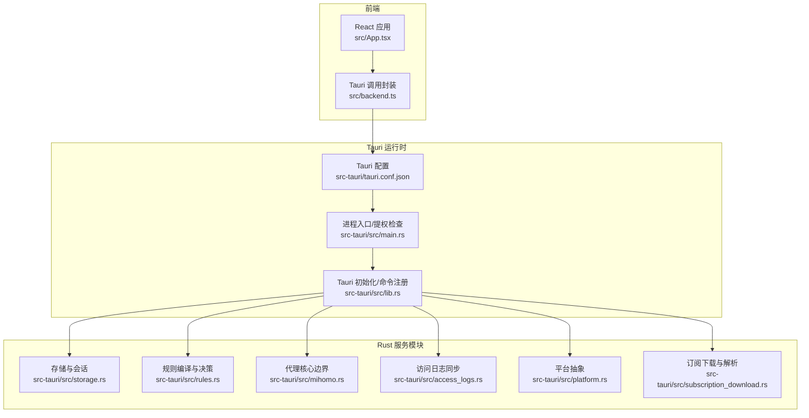
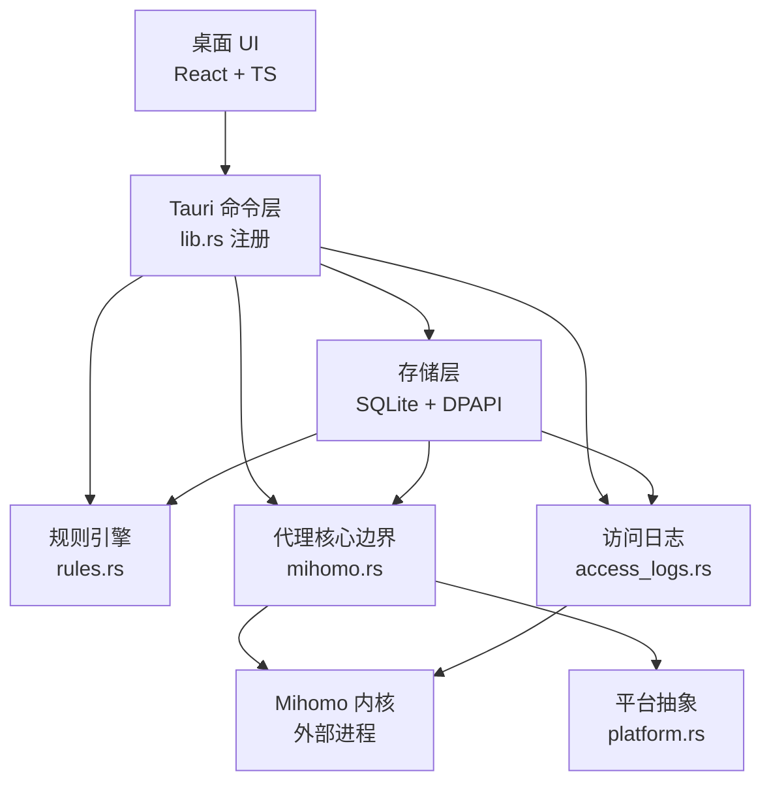
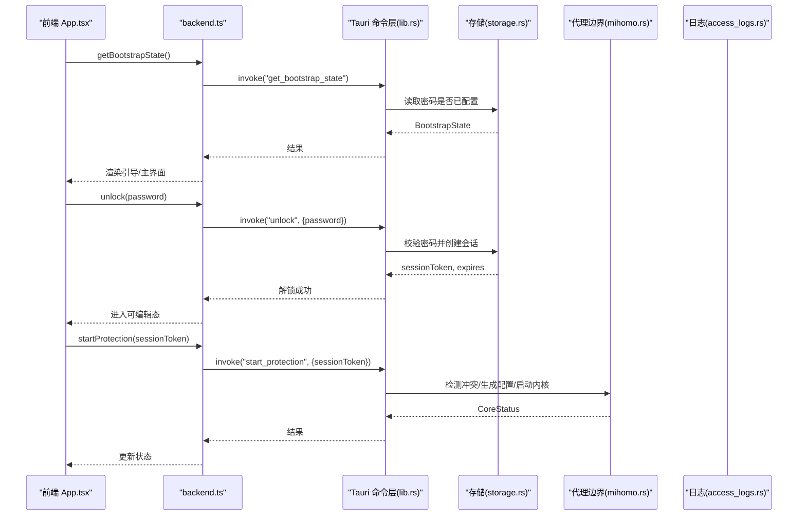
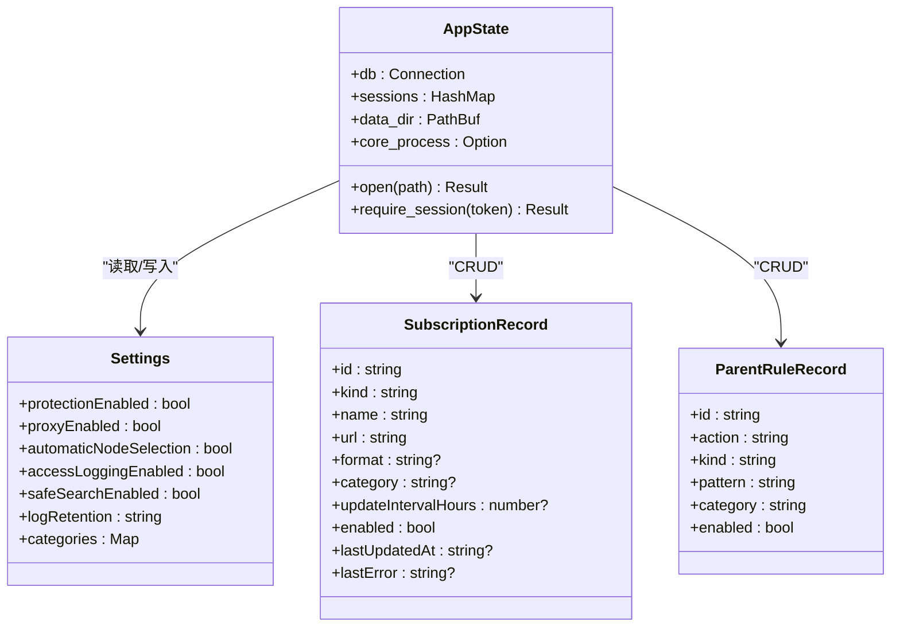
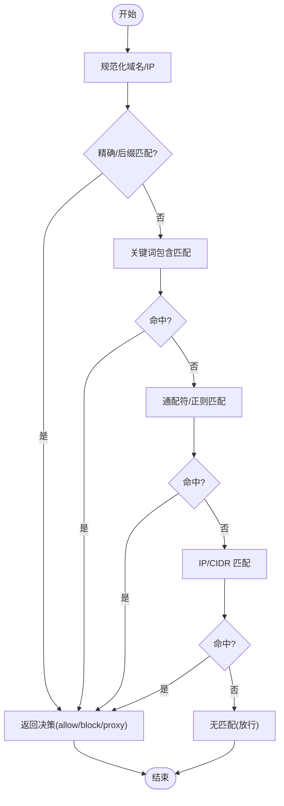
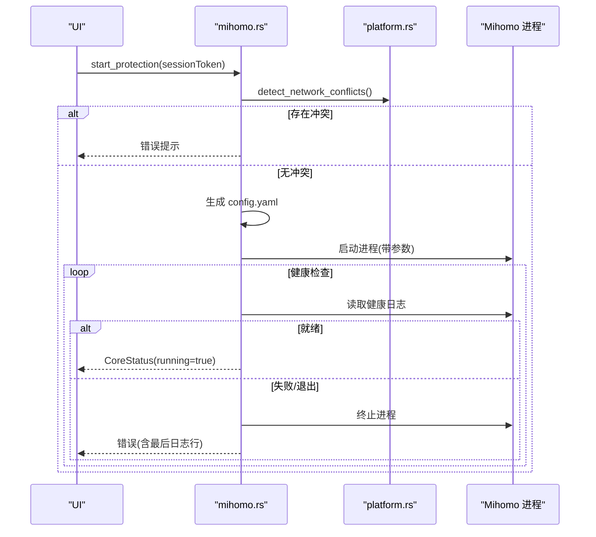
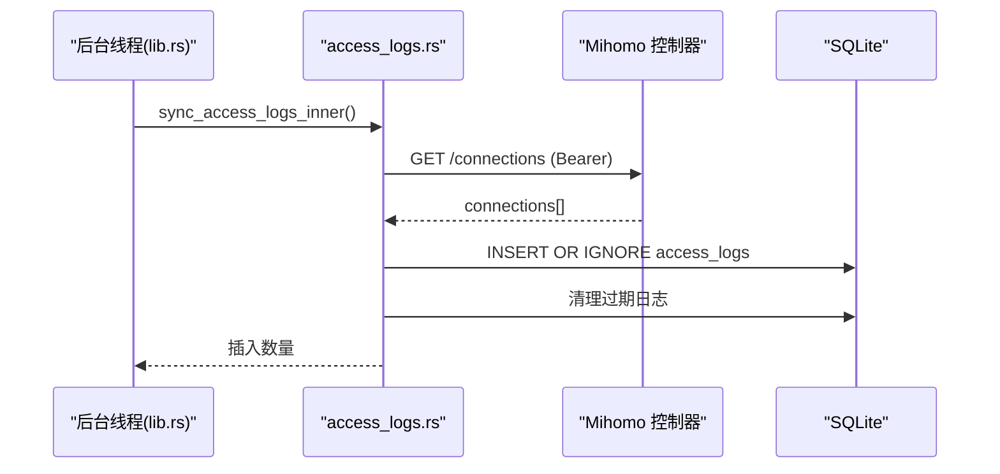
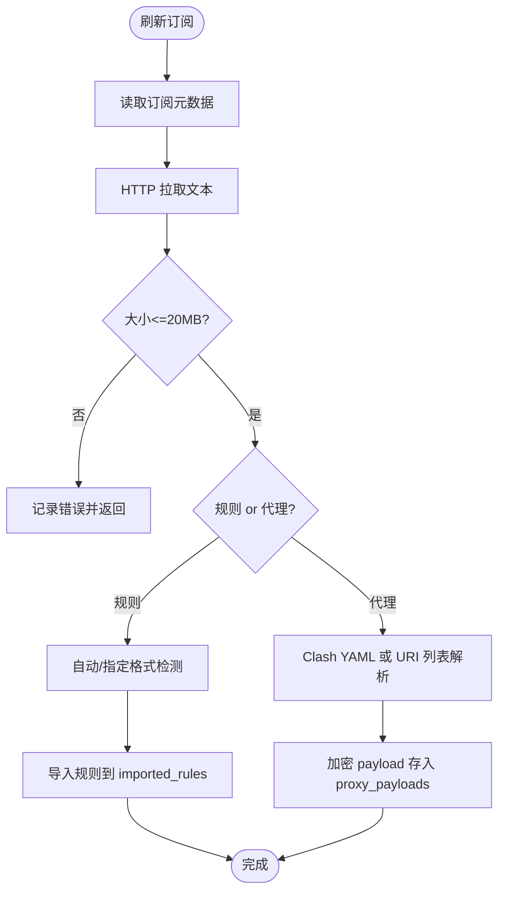
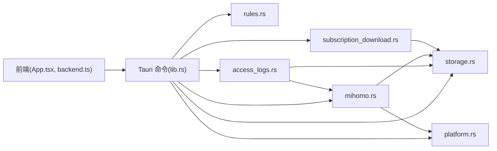

# 整体架构概览

<cite>
**本文引用的文件列表**
- [README.md](file://README.md)
- [docs/architecture.md](file://docs/architecture.md)
- [src-tauri/tauri.conf.json](file://src-tauri/tauri.conf.json)
- [src-tauri/src/main.rs](file://src-tauri/src/main.rs)
- [src-tauri/src/lib.rs](file://src-tauri/src/lib.rs)
- [src-tauri/src/storage.rs](file://src-tauri/src/storage.rs)
- [src-tauri/src/rules.rs](file://src-tauri/src/rules.rs)
- [src-tauri/src/mihomo.rs](file://src-tauri/src/mihomo.rs)
- [src-tauri/src/access_logs.rs](file://src-tauri/src/access_logs.rs)
- [src-tauri/src/platform.rs](file://src-tauri/src/platform.rs)
- [src-tauri/src/subscription_download.rs](file://src-tauri/src/subscription_download.rs)
- [src/App.tsx](file://src/App.tsx)
- [src/backend.ts](file://src/backend.ts)
- [package.json](file://package.json)
</cite>

## 目录
1. [简介](#简介)
2. [项目结构](#项目结构)
3. [核心组件](#核心组件)
4. [架构总览](#架构总览)
5. [详细组件分析](#详细组件分析)
6. [依赖关系分析](#依赖关系分析)
7. [性能与可靠性考量](#性能与可靠性考量)
8. [故障排查指南](#故障排查指南)
9. [结论](#结论)

## 简介
CleanWeb 是一款以 Windows 优先的家庭网络过滤客户端，采用 Tauri 2 前后端分离架构：前端使用 React + TypeScript 提供桌面 UI，后端使用 Rust 实现特权能力、规则引擎、代理核心边界与本地存储。系统通过“策略权威 + 独立代理内核”的方式，在启用网络代理的同时仍保持域名/IP/CIDR 等过滤能力，并提供家长锁定的配置入口、访问日志与安全搜索强制等功能。

本概览文档面向开发者，帮助快速理解系统的高层设计、职责划分、通信机制与数据流向，并给出架构图与关键流程时序图。

## 项目结构
仓库采用典型的前后端分离组织方式：
- 前端（React + Vite）位于 src 目录，通过 @tauri-apps/api 调用 Rust 暴露的命令。
- 后端（Tauri 2 + Rust）位于 src-tauri 目录，包含应用入口、模块与平台抽象。
- 资源与打包配置位于 assets、src-tauri/resources 与 tauri.conf.json。
- 产品与架构说明位于 docs。

图表来源
- [src-tauri/tauri.conf.json:1-28](file://src-tauri/tauri.conf.json#L1-L28)
- [src-tauri/src/main.rs:92-99](file://src-tauri/src/main.rs#L92-L99)
- [src-tauri/src/lib.rs:14-82](file://src-tauri/src/lib.rs#L14-L82)

章节来源
- [README.md:1-34](file://README.md#L1-L34)
- [docs/architecture.md:1-52](file://docs/architecture.md#L1-L52)
- [src-tauri/tauri.conf.json:1-28](file://src-tauri/tauri.conf.json#L1-L28)
- [package.json:1-31](file://package.json#L1-L31)

## 核心组件
- 桌面 UI（React + TypeScript）
  - 负责展示状态、收集用户输入、发起管理操作；不直接编辑生成的代理配置，仅调用受控的命令接口。
- 特权 Windows 服务（Tauri 进程）
  - 拥有策略存储、规则编译、日志、生命周期检查以及与网络核心的通信能力；独立于 UI 运行，关闭窗口不影响保护。
- 规则引擎
  - 将导入格式转换为规范记录，维护来源溯源、构建索引，返回确定性决策与解释；精确与后缀匹配优先于通配符与正则。
- 代理核心边界
  - 将 Mihomo 视为外部 GPLv3 程序，通过配置文件与公开 API 控制；仅提取节点与代理组，生成锁定 DNS/TUN/过滤/路由配置。
- 存储层
  - SQLite 持久化策略、规则、订阅、代理元数据与访问日志；敏感信息使用 DPAPI 加密。

章节来源
- [docs/architecture.md:5-52](file://docs/architecture.md#L5-L52)

## 架构总览
下图展示了 CleanWeb 的整体上下文与组件交互：前端通过 Tauri 命令与后端交互；后端负责会话鉴权、规则处理、代理核心管理与日志采集；Mihomo 作为独立进程被启动并通过控制器 API 进行配置与查询。

图表来源
- [src-tauri/src/lib.rs:46-79](file://src-tauri/src/lib.rs#L46-L79)
- [src-tauri/src/storage.rs:23-28](file://src-tauri/src/storage.rs#L23-L28)
- [src-tauri/src/rules.rs:121-147](file://src-tauri/src/rules.rs#L121-L147)
- [src-tauri/src/mihomo.rs:118-155](file://src-tauri/src/mihomo.rs#L118-L155)
- [src-tauri/src/access_logs.rs:74-126](file://src-tauri/src/access_logs.rs#L74-L126)
- [src-tauri/src/platform.rs:49-73](file://src-tauri/src/platform.rs#L49-L73)

## 详细组件分析

### 组件 A：Tauri 命令与前端交互
- 职责
  - 前端通过 backend.ts 统一封装 invoke 调用；App.tsx 编排页面逻辑与状态。
  - lib.rs 集中注册所有命令，形成稳定的前后端契约。
- 关键路径
  - 前端：App.tsx 中获取引导状态、设置、核心状态，并在需要时解锁后执行变更。
  - 后端：lib.rs 将 storage、mihomo、access_logs、subscription_download 等模块的命令暴露给前端。
- 通信机制
  - 基于 Tauri 的 invoke/handler 模型，类型安全的数据传输。

图表来源
- [src/App.tsx:21-37](file://src/App.tsx#L21-L37)
- [src/backend.ts:34-50](file://src/backend.ts#L34-L50)
- [src-tauri/src/lib.rs:46-79](file://src-tauri/src/lib.rs#L46-L79)
- [src-tauri/src/storage.rs:430-466](file://src-tauri/src/storage.rs#L430-L466)
- [src-tauri/src/mihomo.rs:157-258](file://src-tauri/src/mihomo.rs#L157-L258)

章节来源
- [src/App.tsx:1-78](file://src/App.tsx#L1-L78)
- [src/backend.ts:1-137](file://src/backend.ts#L1-L137)
- [src-tauri/src/lib.rs:14-82](file://src-tauri/src/lib.rs#L14-L82)

### 组件 B：存储与会话管理
- 职责
  - 初始化数据库模式、默认设置；管理管理员密码、会话令牌与 TTL；读写订阅、父级规则、代理选择等。
- 关键点
  - 会话有效期固定时长，修改敏感设置需携带有效 token。
  - 支持批量设置键值校验与白名单。
- 数据结构
  - AppState 持有数据库连接、会话表、数据目录与子进程句柄。

图表来源
- [src-tauri/src/storage.rs:23-28](file://src-tauri/src/storage.rs#L23-L28)
- [src-tauri/src/storage.rs:45-53](file://src-tauri/src/storage.rs#L45-L53)
- [src-tauri/src/storage.rs:55-68](file://src-tauri/src/storage.rs#L55-L68)
- [src-tauri/src/storage.rs:228-246](file://src-tauri/src/storage.rs#L228-L246)

章节来源
- [src-tauri/src/storage.rs:248-277](file://src-tauri/src/storage.rs#L248-L277)
- [src-tauri/src/storage.rs:279-381](file://src-tauri/src/storage.rs#L279-L381)
- [src-tauri/src/storage.rs:468-506](file://src-tauri/src/storage.rs#L468-L506)

### 组件 C：规则引擎
- 职责
  - 将多种规则源标准化为 CompiledRule，按优先级排序，对域名/IP 进行匹配，返回 Action、rule_id 与 category。
- 算法要点
  - 精确与后缀匹配优先；通配符转正则；IP/CIDR 使用专用匹配器；IDNA 规范化域名。
- 复杂度
  - 编译阶段 O(n)；决策阶段按规则顺序查找，最坏 O(n)，可通过索引优化。

图表来源
- [src-tauri/src/rules.rs:67-119](file://src-tauri/src/rules.rs#L67-L119)
- [src-tauri/src/rules.rs:126-147](file://src-tauri/src/rules.rs#L126-L147)

章节来源
- [src-tauri/src/rules.rs:1-147](file://src-tauri/src/rules.rs#L1-L147)

### 组件 D：代理核心边界（Mihomo）
- 职责
  - 检测网络冲突、拉取/校验二进制、生成配置、启动/停止/重载内核、查询代理组与节点、测速、选择节点。
- 关键流程
  - 启动前检查冲突；生成 config.yaml；拉起进程并轮询健康日志；失败则清理 PID 并返回错误。
  - 通过控制器 API（Bearer Token）与 Mihomo 通信。
- 安全与健壮性
  - 配置校验后再热加载；失败回滚；跨平台进程管理。

图表来源
- [src-tauri/src/mihomo.rs:157-258](file://src-tauri/src/mihomo.rs#L157-L258)
- [src-tauri/src/platform.rs:49-73](file://src-tauri/src/platform.rs#L49-L73)

章节来源
- [src-tauri/src/mihomo.rs:118-155](file://src-tauri/src/mihomo.rs#L118-L155)
- [src-tauri/src/mihomo.rs:270-313](file://src-tauri/src/mihomo.rs#L270-L313)
- [src-tauri/src/mihomo.rs:565-607](file://src-tauri/src/mihomo.rs#L565-L607)

### 组件 E：访问日志
- 职责
  - 定时从 Mihomo 控制器拉取连接记录，落库并保留策略清理；提供查询与导出 CSV。
- 数据流
  - 后台线程周期性触发 sync_access_logs_inner；根据规则分类映射 enrich 日志；按保留策略删除旧记录。

图表来源
- [src-tauri/src/lib.rs:20-25](file://src-tauri/src/lib.rs#L20-L25)
- [src-tauri/src/access_logs.rs:74-126](file://src-tauri/src/access_logs.rs#L74-L126)
- [src-tauri/src/access_logs.rs:219-241](file://src-tauri/src/access_logs.rs#L219-L241)

章节来源
- [src-tauri/src/access_logs.rs:128-168](file://src-tauri/src/access_logs.rs#L128-L168)
- [src-tauri/src/access_logs.rs:184-217](file://src-tauri/src/access_logs.rs#L184-L217)

### 组件 F：订阅下载与解析
- 职责
  - 拉取规则或代理订阅，自动检测格式，解析并入库；代理订阅内容加密存储；支持 URI 列表到 Clash YAML 转换。
- 关键点
  - 大小限制、UTF-8 校验、事务写入；安全搜索映射严格校验目标域。

图表来源
- [src-tauri/src/subscription_download.rs:40-113](file://src-tauri/src/subscription_download.rs#L40-L113)
- [src-tauri/src/subscription_download.rs:148-182](file://src-tauri/src/subscription_download.rs#L148-L182)
- [src-tauri/src/subscription_download.rs:236-300](file://src-tauri/src/subscription_download.rs#L236-L300)

章节来源
- [src-tauri/src/subscription_download.rs:127-146](file://src-tauri/src/subscription_download.rs#L127-L146)
- [src-tauri/src/subscription_download.rs:184-234](file://src-tauri/src/subscription_download.rs#L184-L234)

### 组件 G：平台抽象
- 职责
  - 跨平台进程管理、版本探测、网络冲突检测、macOS 特权启动与登录项安装。
- 关键点
  - Windows 分支保持最小实现，V1 遵循 fail-open 策略；macOS 通过 osascript 请求管理员权限启动内核。

章节来源
- [src-tauri/src/platform.rs:1-73](file://src-tauri/src/platform.rs#L1-L73)
- [src-tauri/src/platform.rs:152-204](file://src-tauri/src/platform.rs#L152-L204)
- [src-tauri/src/platform.rs:211-235](file://src-tauri/src/platform.rs#L211-L235)

## 依赖关系分析
- 前端依赖
  - React + Vite 构建，@tauri-apps/api 调用后端命令。
- 后端依赖
  - Tauri 2 框架、rusqlite、reqwest、serde_yaml、regex/ipnet 等。
- 模块耦合
  - lib.rs 作为命令注册中心，聚合 storage、rules、mihomo、access_logs、subscription_download、platform。
  - mihomo 与 platform 强耦合（进程/网络），access_logs 依赖 mihomo 控制器 API。
  - storage 被多模块共享，承担唯一数据源。

图表来源
- [src-tauri/src/lib.rs:46-79](file://src-tauri/src/lib.rs#L46-L79)
- [src-tauri/src/mihomo.rs:21-25](file://src-tauri/src/mihomo.rs#L21-L25)
- [src-tauri/src/access_logs.rs:7-11](file://src-tauri/src/access_logs.rs#L7-L11)
- [src-tauri/src/subscription_download.rs:10-14](file://src-tauri/src/subscription_download.rs#L10-L14)

章节来源
- [package.json:1-31](file://package.json#L1-L31)
- [src-tauri/src/lib.rs:1-83](file://src-tauri/src/lib.rs#L1-L83)

## 性能与可靠性考量
- 规则匹配
  - 建议对高频规则建立精确/后缀索引，降低正则与通配符匹配开销。
- 日志同步
  - 后台周期任务避免阻塞 UI；保留策略定期清理，防止磁盘增长。
- 代理核心
  - 启动健康检查轮询与失败快速回退；配置校验先行，减少热加载失败。
- 并发与锁
  - 数据库访问使用 Mutex 保护；注意长时间持锁的风险，尽量缩小临界区。

[本节为通用指导，无需源码引用]

## 故障排查指南
- 无法启动内核
  - 检查是否存在其他 VPN/TUN 冲突；查看健康日志最后若干行；确认 PID 文件与进程存活一致性。
- 配置重载失败
  - 先执行配置校验，再调用热加载；关注控制器返回的错误信息。
- 订阅解析失败
  - 确认大小限制与 UTF-8 编码；URI 列表需包含支持的协议头；YAML 需包含 proxies 或 proxy-groups。
- 访问日志为空
  - 确认开关开启且内核运行；核对控制器地址与 Secret；检查后台任务是否执行。

章节来源
- [src-tauri/src/mihomo.rs:230-258](file://src-tauri/src/mihomo.rs#L230-L258)
- [src-tauri/src/mihomo.rs:270-313](file://src-tauri/src/mihomo.rs#L270-L313)
- [src-tauri/src/subscription_download.rs:76-113](file://src-tauri/src/subscription_download.rs#L76-L113)
- [src-tauri/src/access_logs.rs:74-126](file://src-tauri/src/access_logs.rs#L74-L126)

## 结论
CleanWeb 采用 Tauri 2 前后端分离架构，将 UI 与特权能力解耦，通过稳定命令接口协作。规则引擎与代理核心边界清晰分离，既保证了策略权威，又借助成熟内核提升网络能力。存储层提供一致性与安全性保障，平台抽象屏蔽了跨平台差异。该设计便于扩展与维护，适合家庭场景下的网络治理需求。