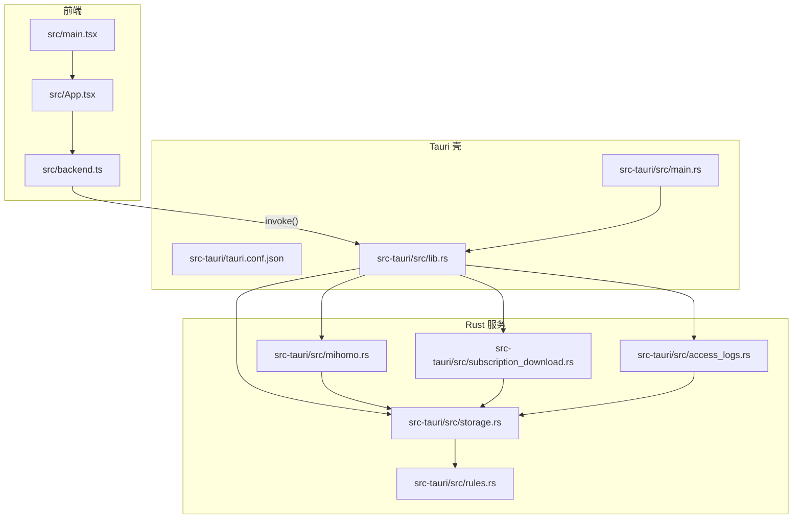
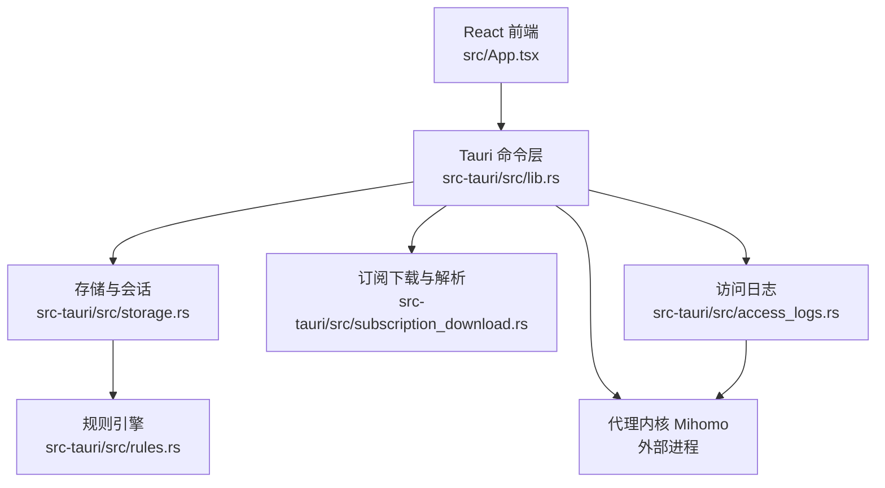
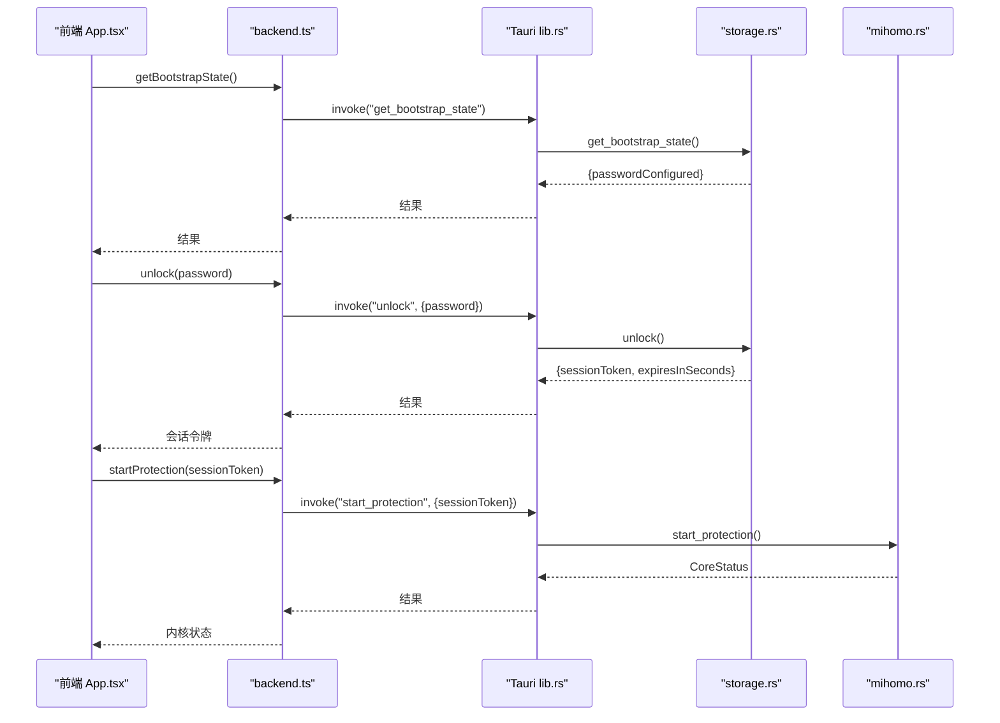
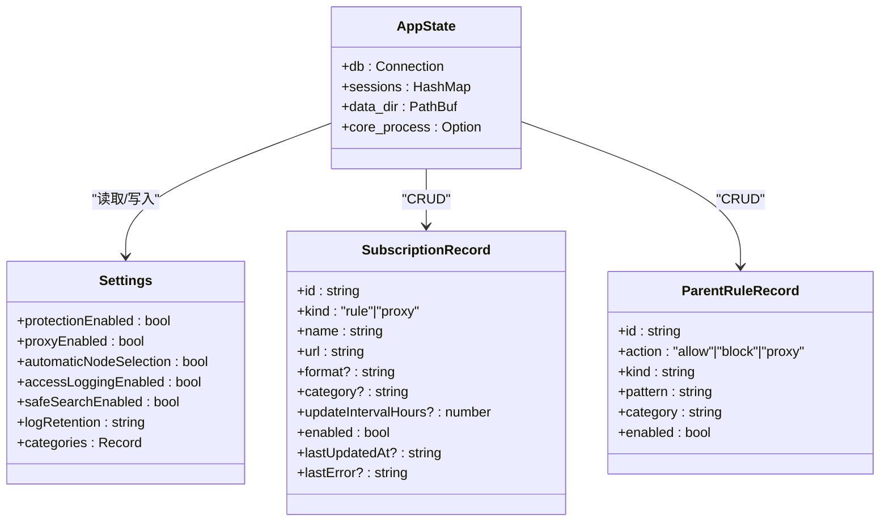
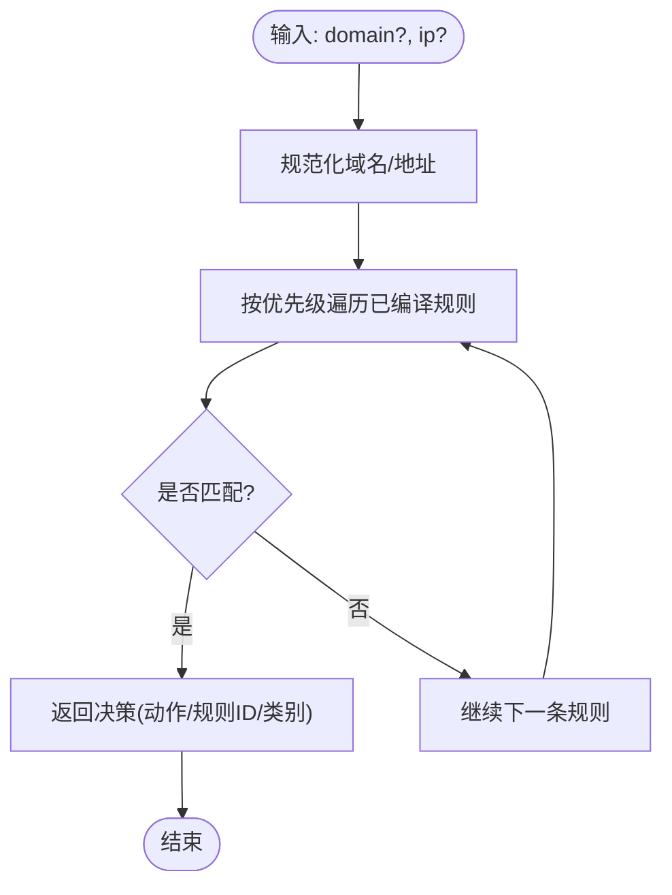
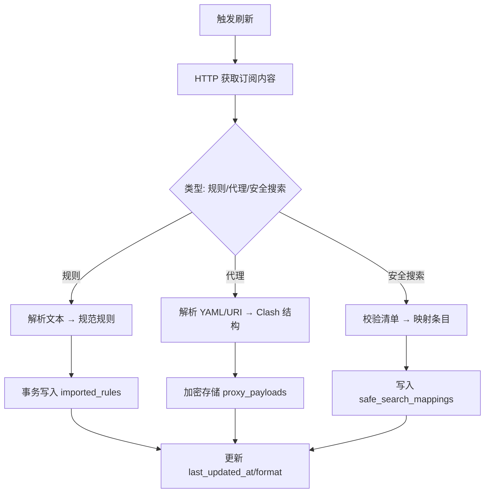
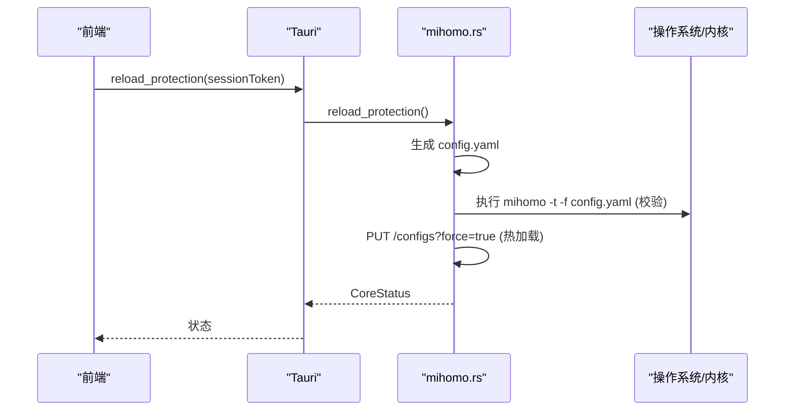
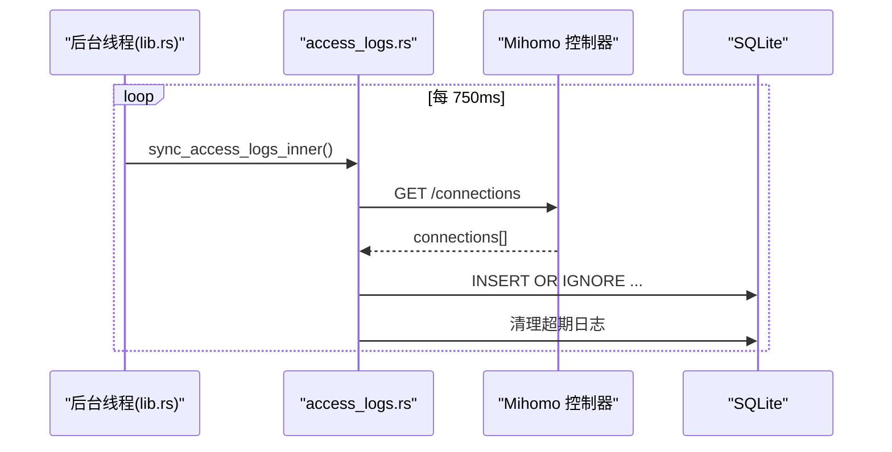
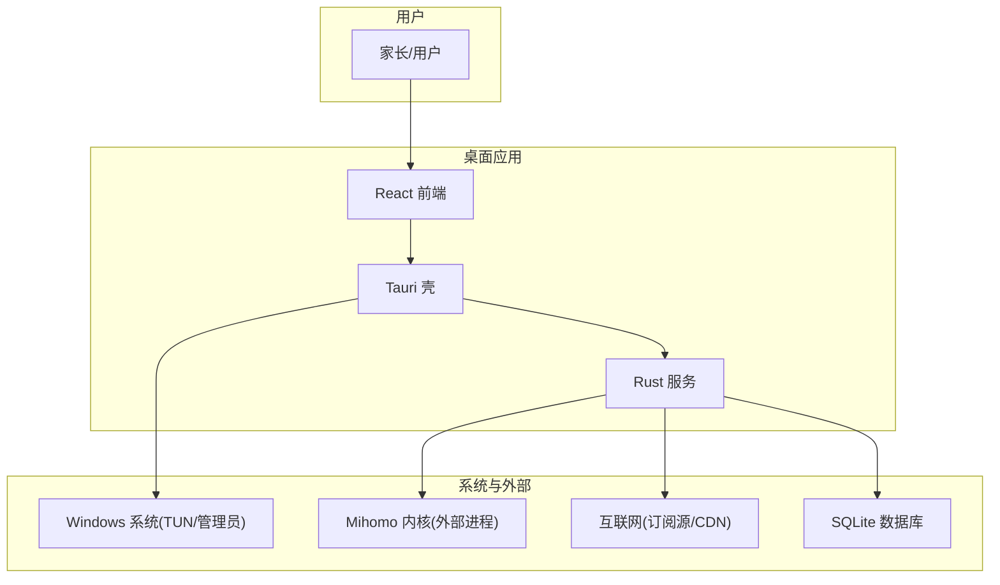
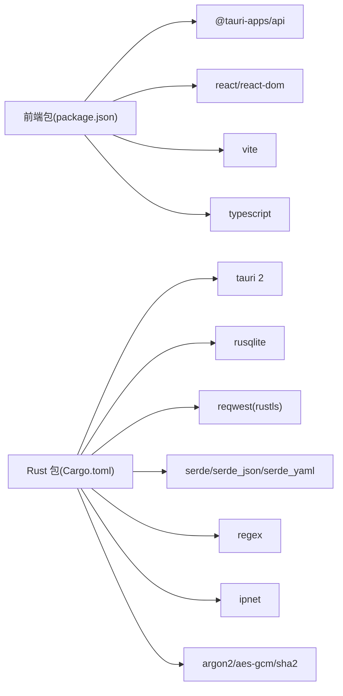

# 架构设计

<cite>
**本文引用的文件**   
- [README.md](file://README.md)
- [package.json](file://package.json)
- [vite.config.ts](file://vite.config.ts)
- [tsconfig.json](file://tsconfig.json)
- [index.html](file://index.html)
- [src/main.tsx](file://src/main.tsx)
- [src/App.tsx](file://src/App.tsx)
- [src/backend.ts](file://src/backend.ts)
- [src-tauri/Cargo.toml](file://src-tauri/Cargo.toml)
- [src-tauri/tauri.conf.json](file://src-tauri/tauri.conf.json)
- [src-tauri/src/main.rs](file://src-tauri/src/main.rs)
- [src-tauri/src/lib.rs](file://src-tauri/src/lib.rs)
- [src-tauri/src/storage.rs](file://src-tauri/src/storage.rs)
- [src-tauri/src/mihomo.rs](file://src-tauri/src/mihomo.rs)
- [src-tauri/src/rules.rs](file://src-tauri/src/rules.rs)
- [src-tauri/src/subscription_download.rs](file://src-tauri/src/subscription_download.rs)
- [src-tauri/src/access_logs.rs](file://src-tauri/src/access_logs.rs)
- [docs/architecture.md](file://docs/architecture.md)
</cite>

## 目录
1. [引言](#引言)
2. [项目结构](#项目结构)
3. [核心组件](#核心组件)
4. [架构总览](#架构总览)
5. [详细组件分析](#详细组件分析)
6. [依赖分析](#依赖分析)
7. [性能考虑](#性能考虑)
8. [故障排查指南](#故障排查指南)
9. [结论](#结论)
10. [附录](#附录)

## 引言
CleanWeb 是一款面向 Windows 的家庭网络过滤客户端，采用前后端分离的 Tauri 架构：前端使用 React + TypeScript，后端使用 Rust。系统通过本地策略引擎与独立分发的代理内核（Mihomo）协作，实现域名/IP/CIDR 等规则过滤、代理节点管理、访问日志与安全搜索强制等功能。V1 目标包括系统级流量捕获、家长锁定配置、订阅规则导入、本地访问日志与安全搜索强制等能力。

**章节来源**
- [README.md:1-34](file://README.md#L1-L34)
- [docs/architecture.md:1-52](file://docs/architecture.md#L1-L52)

## 项目结构
- 前端（React + Vite + TypeScript）
  - 入口：src/main.tsx
  - 应用根组件：src/App.tsx
  - 与后端通信封装：src/backend.ts
  - 构建与开发脚本：package.json、vite.config.ts、tsconfig.json
- 后端（Tauri + Rust）
  - 进程入口与权限提升：src-tauri/src/main.rs
  - Tauri 应用初始化与命令注册：src-tauri/src/lib.rs
  - 存储与会话、设置、订阅、家长规则：src-tauri/src/storage.rs
  - 代理内核（Mihomo）控制与配置生成：src-tauri/src/mihomo.rs
  - 规则编译与决策：src-tauri/src/rules.rs
  - 订阅下载与解析（规则/代理/安全搜索）：src-tauri/src/subscription_download.rs
  - 访问日志同步与导出：src-tauri/src/access_logs.rs
  - 打包与资源：src-tauri/tauri.conf.json、Cargo.toml

**图表来源**
- [src/main.tsx:1-9](file://src/main.tsx#L1-L9)
- [src/App.tsx:1-290](file://src/App.tsx#L1-L290)
- [src/backend.ts:1-137](file://src/backend.ts#L1-L137)
- [src-tauri/src/lib.rs:1-83](file://src-tauri/src/lib.rs#L1-L83)
- [src-tauri/src/main.rs:1-99](file://src-tauri/src/main.rs#L1-L99)
- [src-tauri/src/storage.rs:1-800](file://src-tauri/src/storage.rs#L1-L800)
- [src-tauri/src/mihomo.rs:1-800](file://src-tauri/src/mihomo.rs#L1-L800)
- [src-tauri/src/rules.rs:1-270](file://src-tauri/src/rules.rs#L1-L270)
- [src-tauri/src/subscription_download.rs:1-800](file://src-tauri/src/subscription_download.rs#L1-L800)
- [src-tauri/src/access_logs.rs:1-292](file://src-tauri/src/access_logs.rs#L1-L292)
- [src-tauri/tauri.conf.json:1-28](file://src-tauri/tauri.conf.json#L1-L28)

**章节来源**
- [src/main.tsx:1-9](file://src/main.tsx#L1-L9)
- [src/App.tsx:1-290](file://src/App.tsx#L1-L290)
- [src/backend.ts:1-137](file://src/backend.ts#L1-L137)
- [src-tauri/src/lib.rs:1-83](file://src-tauri/src/lib.rs#L1-L83)
- [src-tauri/src/main.rs:1-99](file://src-tauri/src/main.rs#L1-L99)
- [src-tauri/tauri.conf.json:1-28](file://src-tauri/tauri.conf.json#L1-L28)

## 核心组件
- 桌面 UI（React + TypeScript）
  - 负责展示概览、规则管理、代理节点页面；不直接编辑生成的代理配置，仅调用受控的 Tauri 命令。
- 特权 Windows 服务（概念边界）
  - 文档中定义的职责：策略存储、规则编译、日志、生命周期检查、与网络核心通信；与 UI 独立运行，关闭窗口不影响保护。
- 规则引擎
  - 将导入格式转换为规范记录，维护来源溯源、编译索引，返回确定性决策与解释；精确与后缀索引优先于通配符与正则。
- 代理内核边界（Mihomo）
  - 作为独立 GPLv3 程序，通过配置文件与外部 API 控制；CleanWeb 仅提取节点与代理组，并生成自身锁定的 DNS/TUN/过滤/路由配置。
- 存储（SQLite）
  - 持久化策略、规范规则、来源引用、订阅、代理元数据与访问日志；敏感信息使用平台加密（Windows DPAPI）。

**章节来源**
- [docs/architecture.md:1-52](file://docs/architecture.md#L1-L52)

## 架构总览
整体为“前端 UI ↔ Tauri 命令层 ↔ Rust 业务模块 ↔ SQLite/Mihomo”的分层架构。前端通过 Tauri invoke 调用后端命令，后端在需要时启动或控制 Mihomo 内核，并通过其控制器接口进行状态查询与配置热更新。

**图表来源**
- [src/App.tsx:1-290](file://src/App.tsx#L1-L290)
- [src-tauri/src/lib.rs:1-83](file://src-tauri/src/lib.rs#L1-L83)
- [src-tauri/src/storage.rs:1-800](file://src-tauri/src/storage.rs#L1-L800)
- [src-tauri/src/rules.rs:1-270](file://src-tauri/src/rules.rs#L1-L270)
- [src-tauri/src/subscription_download.rs:1-800](file://src-tauri/src/subscription_download.rs#L1-L800)
- [src-tauri/src/access_logs.rs:1-292](file://src-tauri/src/access_logs.rs#L1-L292)
- [src-tauri/src/mihomo.rs:1-800](file://src-tauri/src/mihomo.rs#L1-L800)

## 详细组件分析

### 前端与 Tauri 通信机制
- 前端通过 @tauri-apps/api/core.invoke 调用后端命令，并在浏览器预览模式下提供轻量模拟实现，保证无后端环境下的可开发性。
- 关键命令覆盖：引导状态、密码初始化/解锁/锁定、设置读写、订阅 CRUD、推荐源、规则刷新、内核状态/启停/重载、代理列表/选择/测速、访问日志同步/查询/导出等。

**图表来源**
- [src/App.tsx:1-290](file://src/App.tsx#L1-L290)
- [src/backend.ts:1-137](file://src/backend.ts#L1-L137)
- [src-tauri/src/lib.rs:1-83](file://src-tauri/src/lib.rs#L1-L83)
- [src-tauri/src/storage.rs:1-800](file://src-tauri/src/storage.rs#L1-L800)
- [src-tauri/src/mihomo.rs:1-800](file://src-tauri/src/mihomo.rs#L1-L800)

**章节来源**
- [src/backend.ts:1-137](file://src/backend.ts#L1-L137)
- [src-tauri/src/lib.rs:1-83](file://src-tauri/src/lib.rs#L1-L83)

### 存储与会话模型
- 会话：内存中维护 token→过期时间映射，所有写操作需校验会话有效性。
- 设置：键值对存储，包含布尔开关与分类开关、日志保留策略等。
- 订阅：支持规则与代理两类，含名称、URL、格式、分类、更新周期、启用状态、最近错误等。
- 家长规则：支持多种匹配类型与动作，保存前进行编译验证。
- 代理载荷：以加密形式存储，避免明文泄露。

**图表来源**
- [src-tauri/src/storage.rs:1-800](file://src-tauri/src/storage.rs#L1-L800)

**章节来源**
- [src-tauri/src/storage.rs:1-800](file://src-tauri/src/storage.rs#L1-L800)

### 规则引擎与决策流程
- 支持的匹配类型：精确、后缀、包含、通配符、正则、IP、CIDR。
- 决策优先级：按 priority 排序，低数值优先；父规则通常具有更高优先级。
- 决策输出：动作、命中规则 ID、类别。

**图表来源**
- [src-tauri/src/rules.rs:1-270](file://src-tauri/src/rules.rs#L1-L270)

**章节来源**
- [src-tauri/src/rules.rs:1-270](file://src-tauri/src/rules.rs#L1-L270)

### 订阅下载与解析
- 规则订阅：自动检测或指定格式（hosts/adblock/domain-list/ip-list/clash/safe-search），导入到 imported_rules 表，保留来源行号与类别。
- 代理订阅：支持 Clash YAML 与 URI 列表（ss/ssr/vmess/vless/trojan/hysteria/tuic/socks/http/https），统一转换为 Clash 内部结构后加密存储。
- 安全搜索：YAML 清单校验，限制目标域白名单，持久化映射供后续 DNS 策略使用。

**图表来源**
- [src-tauri/src/subscription_download.rs:1-800](file://src-tauri/src/subscription_download.rs#L1-L800)

**章节来源**
- [src-tauri/src/subscription_download.rs:1-800](file://src-tauri/src/subscription_download.rs#L1-L800)

### 代理内核（Mihomo）控制
- 启动流程：检测冲突 → 准备二进制与配置 → 启动进程 → 健康检查 → 返回状态。
- 配置生成：合并启用订阅中的 proxies/proxy-groups，去重与清洗，注入 DNS/TUN/SNIFFER 等策略，必要时排除 fake-ip 域名。
- 运行时交互：通过控制器 REST API 查询代理组/节点、延迟测试、选择节点、热加载配置。

**图表来源**
- [src-tauri/src/mihomo.rs:1-800](file://src-tauri/src/mihomo.rs#L1-L800)

**章节来源**
- [src-tauri/src/mihomo.rs:1-800](file://src-tauri/src/mihomo.rs#L1-L800)

### 访问日志采集与导出
- 定时任务：后台线程周期性拉取控制器连接信息，写入本地 access_logs，并按保留策略清理旧记录。
- 查询与导出：支持按决策/关键词筛选与 CSV 导出。

**图表来源**
- [src-tauri/src/lib.rs:1-83](file://src-tauri/src/lib.rs#L1-L83)
- [src-tauri/src/access_logs.rs:1-292](file://src-tauri/src/access_logs.rs#L1-L292)

**章节来源**
- [src-tauri/src/access_logs.rs:1-292](file://src-tauri/src/access_logs.rs#L1-L292)

### 系统上下文图与组件分解图

**图表来源**
- [src-tauri/src/main.rs:1-99](file://src-tauri/src/main.rs#L1-L99)
- [src-tauri/src/lib.rs:1-83](file://src-tauri/src/lib.rs#L1-L83)
- [src-tauri/src/mihomo.rs:1-800](file://src-tauri/src/mihomo.rs#L1-L800)
- [src-tauri/src/storage.rs:1-800](file://src-tauri/src/storage.rs#L1-L800)

## 依赖分析
- 前端依赖
  - React 19、@tauri-apps/api 2.x、Vite 6、TypeScript 5.7、测试工具链。
- 后端依赖
  - Tauri 2、rusqlite（bundled）、reqwest（rustls-tls）、serde/serde_json/serde_yaml、regex、ipnet、argon2、aes-gcm、uuid、keyring（可选）等。
- 构建与打包
  - tauri.conf.json 指定产物、图标、资源与前端构建路径。

**图表来源**
- [package.json:1-31](file://package.json#L1-L31)
- [src-tauri/Cargo.toml:1-37](file://src-tauri/Cargo.toml#L1-L37)

**章节来源**
- [package.json:1-31](file://package.json#L1-L31)
- [src-tauri/Cargo.toml:1-37](file://src-tauri/Cargo.toml#L1-L37)
- [src-tauri/tauri.conf.json:1-28](file://src-tauri/tauri.conf.json#L1-L28)

## 性能考虑
- 规则匹配顺序与索引：先精确/后缀，再通配/正则，降低昂贵匹配开销。
- 订阅大小限制：最大 20MB，避免大文件导致内存压力。
- 日志轮转：按保留策略定期清理，防止磁盘膨胀。
- 内核配置热加载：通过控制器接口增量更新，减少重启成本。
- 并发与异步：订阅刷新、日志同步使用异步 IO，避免阻塞 UI。

[本节为通用指导，无需具体文件分析]

## 故障排查指南
- 管理员权限（Windows）
  - Release 构建自动请求管理员权限；Debug 模式需在管理员终端运行。
- 内核启动失败
  - 检测其他 VPN/TUN 冲突；健康日志回读并提示最后若干行；超时或立即退出均会终止进程并清理 PID 文件。
- 会话过期
  - 所有写操作需有效 session_token，过期需重新解锁。
- 订阅解析失败
  - 检查 URL 合法性、内容编码、大小限制；查看 last_error 字段定位原因。
- 访问日志为空
  - 确认 access_logging_enabled 开关；检查控制器连通性与 secret。

**章节来源**
- [src-tauri/src/main.rs:1-99](file://src-tauri/src/main.rs#L1-L99)
- [src-tauri/src/mihomo.rs:1-800](file://src-tauri/src/mihomo.rs#L1-L800)
- [src-tauri/src/storage.rs:1-800](file://src-tauri/src/storage.rs#L1-L800)
- [src-tauri/src/subscription_download.rs:1-800](file://src-tauri/src/subscription_download.rs#L1-L800)
- [src-tauri/src/access_logs.rs:1-292](file://src-tauri/src/access_logs.rs#L1-L292)

## 结论
CleanWeb 采用清晰的 Tauri 分层架构，将 UI 与系统级能力解耦，通过严格的命令边界与数据持久化保障安全性与可维护性。规则引擎与代理内核职责清晰，订阅生态兼容广泛，具备可扩展性与良好的用户体验。未来可在 WFP callout/service 方向强化防绕过能力，并完善监控与告警体系。

[本节为总结，无需具体文件分析]

## 附录
- 技术栈与版本兼容性
  - 前端：React 19、Vite 6、TypeScript 5.7、@tauri-apps/api 2.x
  - 后端：Tauri 2、Rust 2021、rusqlite(bundled)、reqwest(rustls-tls)
  - 构建：npm scripts、tauri CLI
- 部署拓扑
  - 单主机桌面应用，内嵌 SQLite，外联 Mihomo 内核进程；订阅源来自互联网 HTTPS。
- 基础设施需求
  - Windows 管理员权限（Release）；可用磁盘空间用于数据库与日志；网络可达订阅源与 CDN。
- 可扩展性考虑
  - 新增规则格式/代理协议可通过订阅解析器扩展；新增设置项通过白名单校验；日志导出可按需增加字段。
- 横切关注点
  - 安全性：Argon2 密码哈希、会话 TTL、代理载荷加密、HTTPS 传输、最小权限原则。
  - 监控：内核健康日志、访问日志、订阅错误记录。
  - 灾难恢复：fail-open 行为、PID 文件与进程存活检测、配置校验失败回滚。

**章节来源**
- [README.md:1-34](file://README.md#L1-L34)
- [package.json:1-31](file://package.json#L1-L31)
- [src-tauri/Cargo.toml:1-37](file://src-tauri/Cargo.toml#L1-L37)
- [src-tauri/tauri.conf.json:1-28](file://src-tauri/tauri.conf.json#L1-L28)
- [docs/architecture.md:1-52](file://docs/architecture.md#L1-L52)