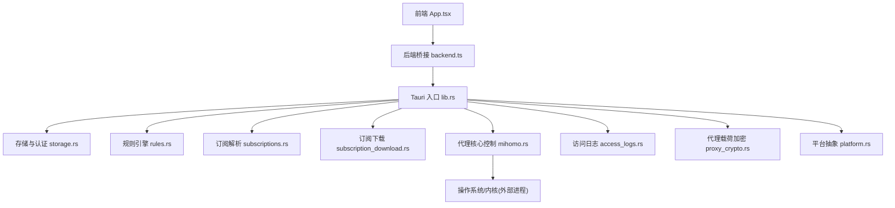
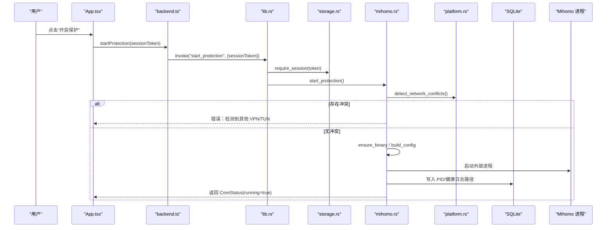
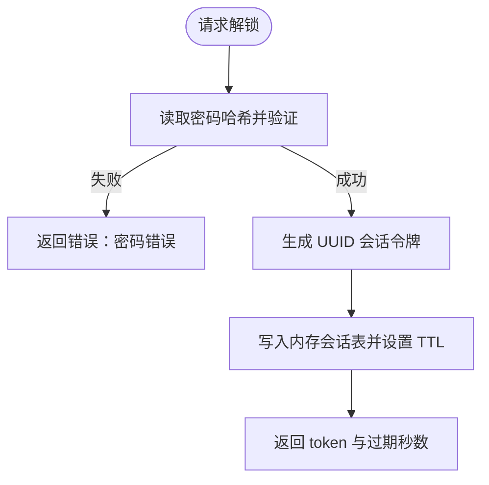
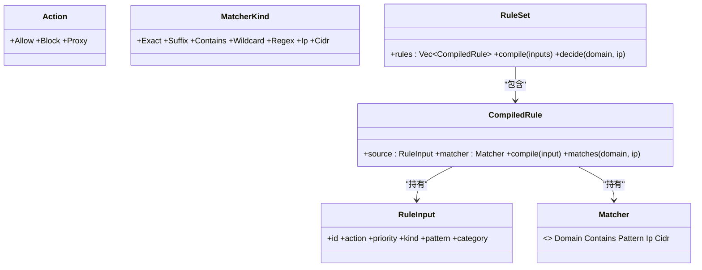
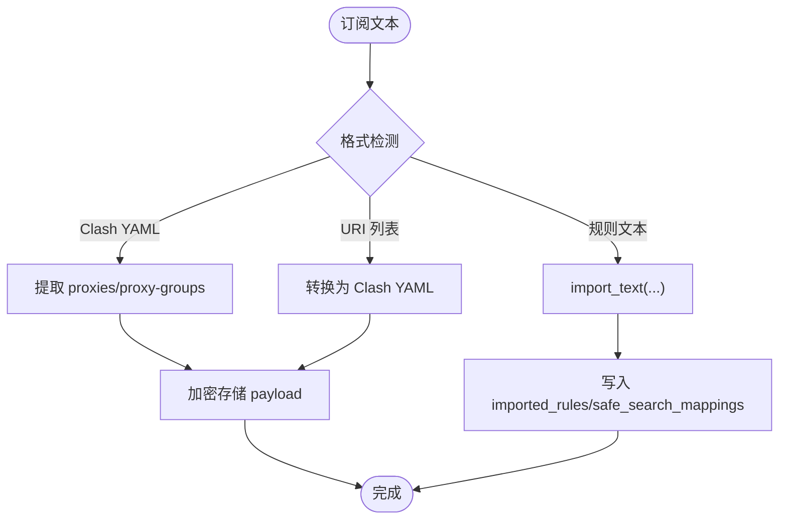
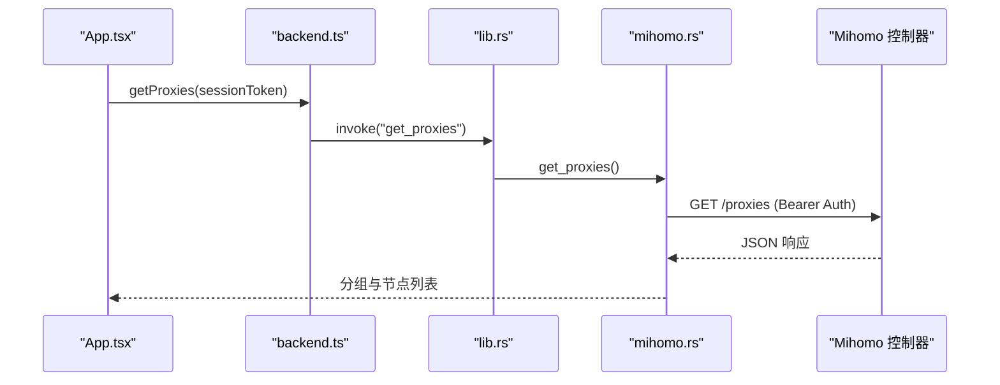
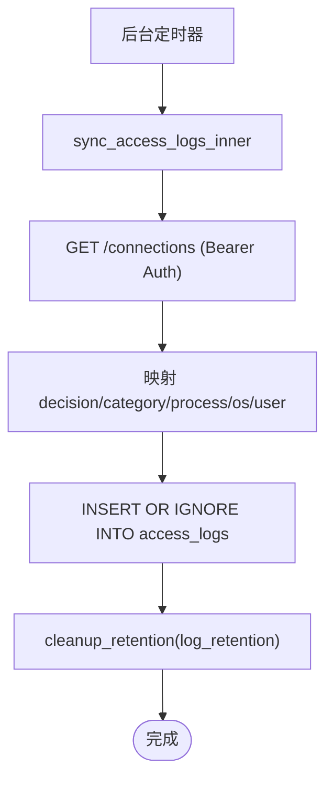
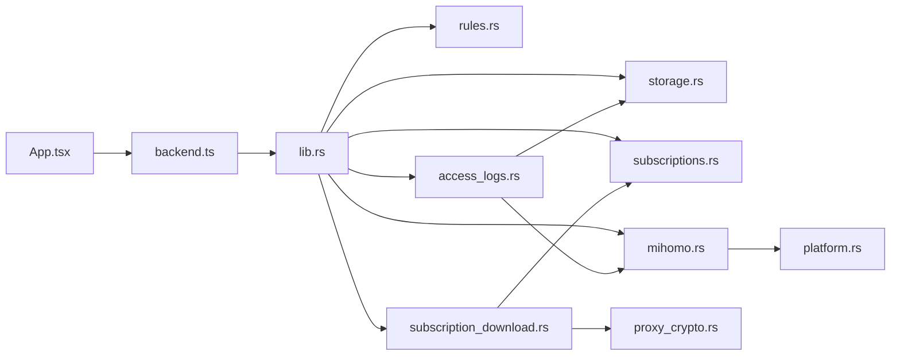

# 核心模块

<cite>
**本文引用的文件**   
- [README.md](file://README.md)
- [架构文档](file://docs/architecture.md)
- [前端入口 App.tsx](file://src/App.tsx)
- [后端桥接 backend.ts](file://src/backend.ts)
- [Tauri 应用入口 lib.rs](file://src-tauri/src/lib.rs)
- [存储与认证 storage.rs](file://src-tauri/src/storage.rs)
- [规则引擎 rules.rs](file://src-tauri/src/rules.rs)
- [订阅解析 subscriptions.rs](file://src-tauri/src/subscriptions.rs)
- [代理核心控制 mihomo.rs](file://src-tauri/src/mihomo.rs)
- [访问日志 access_logs.rs](file://src-tauri/src/access_logs.rs)
- [订阅下载 subscription_download.rs](file://src-tauri/src/subscription_download.rs)
- [代理载荷加密 proxy_crypto.rs](file://src-tauri/src/proxy_crypto.rs)
- [平台抽象 platform.rs](file://src-tauri/src/platform.rs)
</cite>

## 目录
1. [简介](#简介)
2. [项目结构](#项目结构)
3. [核心组件](#核心组件)
4. [架构总览](#架构总览)
5. [详细组件分析](#详细组件分析)
6. [依赖关系分析](#依赖关系分析)
7. [性能考量](#性能考量)
8. [故障排查指南](#故障排查指南)
9. [结论](#结论)
10. [附录：接口与配置速查](#附录接口与配置速查)

## 简介
CleanWeb 是一款面向家庭的网络过滤客户端，采用“本地策略引擎 + 独立代理内核”的架构。V1 目标包括系统级流量捕获、家长锁定配置、域名/IP/CIDR 等规则过滤、第三方规则订阅、代理节点导入、本地访问日志与安全搜索强制等。本文件聚焦于认证授权、规则引擎、订阅管理、代理核心控制与访问日志五大核心模块的实现细节、职责边界、接口设计、数据流转与常见问题处理，既适合初学者快速上手，也为有经验的开发者提供深入的技术参考。

## 项目结构
- 前端（React + TypeScript）通过 Tauri 调用 Rust 后端命令，完成 UI 交互与状态展示。
- 后端以 Tauri 2 为宿主，使用 SQLite 持久化配置、规则与日志；通过外部进程方式启动 Mihomo 作为网络核心。
- 关键模块按功能划分：storage（存储与认证）、rules（规则编译与决策）、subscriptions（订阅格式解析）、subscription_download（订阅拉取与增量更新）、mihomo（核心生命周期与外部 API 控制）、access_logs（连接记录同步与导出）、proxy_crypto（敏感载荷加密）、platform（跨平台能力）。

图表来源
- [前端入口 App.tsx:1-290](file://src/App.tsx#L1-L290)
- [后端桥接 backend.ts:1-137](file://src/backend.ts#L1-L137)
- [Tauri 应用入口 lib.rs:1-83](file://src-tauri/src/lib.rs#L1-L83)
- [存储与认证 storage.rs:1-853](file://src-tauri/src/storage.rs#L1-L853)
- [规则引擎 rules.rs:1-270](file://src-tauri/src/rules.rs#L1-L270)
- [订阅解析 subscriptions.rs:1-275](file://src-tauri/src/subscriptions.rs#L1-L275)
- [订阅下载 subscription_download.rs:1-1116](file://src-tauri/src/subscription_download.rs#L1-L1116)
- [代理核心控制 mihomo.rs:1-1373](file://src-tauri/src/mihomo.rs#L1-L1373)
- [访问日志 access_logs.rs:1-292](file://src-tauri/src/access_logs.rs#L1-L292)
- [代理载荷加密 proxy_crypto.rs:1-195](file://src-tauri/src/proxy_crypto.rs#L1-L195)
- [平台抽象 platform.rs:1-301](file://src-tauri/src/platform.rs#L1-L301)

章节来源
- [README.md:1-34](file://README.md#L1-L34)
- [架构文档:1-52](file://docs/architecture.md#L1-L52)

## 核心组件
- 认证授权系统：基于 Argon2 密码哈希与内存会话令牌，保护所有写操作与敏感查询。
- 规则引擎：将多源规则统一编译为可匹配对象，支持精确、后缀、包含、通配符、正则、IP、CIDR，并返回带类别的决定。
- 订阅管理：支持 Clash/Mihomo、Hosts、Adblock、域名列表、IP/CIDR、安全搜索清单等多种格式，自动检测或显式指定格式，增量导入与错误报告。
- 代理核心控制：封装 Mihomo 二进制生命周期、配置生成、外部 API 调用（测速、选择节点、获取组信息），以及冲突检测与权限提升。
- 访问日志：定时从 Mihomo 控制器抓取连接记录，落库并支持筛选、清空与 CSV 导出，同时按保留策略清理旧记录。

章节来源
- [存储与认证 storage.rs:383-466](file://src-tauri/src/storage.rs#L383-L466)
- [规则引擎 rules.rs:67-147](file://src-tauri/src/rules.rs#L67-L147)
- [订阅解析 subscriptions.rs:44-95](file://src-tauri/src/subscriptions.rs#L44-L95)
- [订阅下载 subscription_download.rs:40-113](file://src-tauri/src/subscription_download.rs#L40-L113)
- [代理核心控制 mihomo.rs:157-313](file://src-tauri/src/mihomo.rs#L157-L313)
- [访问日志 access_logs.rs:74-126](file://src-tauri/src/access_logs.rs#L74-L126)

## 架构总览
CleanWeb 采用前后端分离的桌面应用架构。UI 仅负责展示与用户输入，所有业务逻辑在 Rust 后端实现。Mihomo 作为独立进程运行，CleanWeb 通过其外部 API 进行控制与观测。SQLite 用于持久化，Keychain/DPAPI 用于密钥保护。

图表来源
- [Tauri 应用入口 lib.rs:46-79](file://src-tauri/src/lib.rs#L46-L79)
- [代理核心控制 mihomo.rs:157-258](file://src-tauri/src/mihomo.rs#L157-L258)
- [平台抽象 platform.rs:49-73](file://src-tauri/src/platform.rs#L49-L73)

章节来源
- [架构文档:1-52](file://docs/architecture.md#L1-L52)

## 详细组件分析

### 认证授权系统
职责边界
- 初始化与管理家长密码（Argon2 哈希）
- 解锁/锁定会话（内存中维护令牌有效期）
- 校验所有需要授权的命令（require_session）

接口设计
- get_bootstrap_state：返回是否已设置密码
- initialize_password：设置初始密码（长度校验）
- unlock：验证密码并返回 session_token 与过期时间
- lock：销毁当前会话
- update_setting/get_settings：受会话保护的读写设置

数据流
- 密码哈希存于 app_secrets
- 会话令牌存于内存 HashMap，定期清理过期项
- 设置项存于 settings 表，支持布尔与枚举值白名单校验

图表来源
- [存储与认证 storage.rs:400-466](file://src-tauri/src/storage.rs#L400-L466)

章节来源
- [存储与认证 storage.rs:279-381](file://src-tauri/src/storage.rs#L279-L381)
- [存储与认证 storage.rs:468-506](file://src-tauri/src/storage.rs#L468-L506)
- [存储与认证 storage.rs:756-796](file://src-tauri/src/storage.rs#L756-L796)

### 规则引擎
职责边界
- 定义动作与匹配类型
- 编译规则为高效匹配器
- 对域名/IP 输入返回决定（含规则 ID 与分类）

数据结构与复杂度
- CompiledRule 内部持有 Matcher（Domain/Contains/Regex/Ip/Cidr）
- RuleSet 按优先级排序后线性扫描，首次命中即返回
- 正则与通配符预编译，避免重复构建

依赖链
- 被 storage 用于父规则创建时的语法校验
- 被 access_logs 用于将 rule_payload 映射到 category

图表来源
- [规则引擎 rules.rs:7-147](file://src-tauri/src/rules.rs#L7-L147)

章节来源
- [规则引擎 rules.rs:67-147](file://src-tauri/src/rules.rs#L67-L147)
- [存储与认证 storage.rs:655-710](file://src-tauri/src/storage.rs#L655-L710)

### 订阅管理
职责边界
- 解析多种规则与代理订阅格式
- 将文本转换为标准规则条目或代理元数据
- 记录忽略行与原因，便于审计

支持的规则格式
- Clash/Mihomo（DOMAIN/DOMAIN-SUFFIX/DOMAIN-KEYWORD/IP-CIDR）
- Hosts（跳过 localhost/broadcasthost，www 前缀归一化为后缀匹配）
- Adblock（仅域名规则，支持 @@ 放行）
- 域名列表、IP/CIDR 列表

代理订阅
- 直接 YAML（proxies/proxy-groups）
- URI 列表（ss/ssr/vmess/vless/trojan/hysteria/tuic/socks/http/https）
- 自动 base64 解码与内容清洗

图表来源
- [订阅解析 subscriptions.rs:44-95](file://src-tauri/src/subscriptions.rs#L44-L95)
- [订阅下载 subscription_download.rs:236-300](file://src-tauri/src/subscription_download.rs#L236-L300)

章节来源
- [订阅解析 subscriptions.rs:97-198](file://src-tauri/src/subscriptions.rs#L97-L198)
- [订阅下载 subscription_download.rs:148-182](file://src-tauri/src/subscription_download.rs#L148-L182)
- [订阅下载 subscription_download.rs:184-234](file://src-tauri/src/subscription_download.rs#L184-L234)

### 代理核心控制
职责边界
- 检测网络冲突（VPN/TUN）
- 确保二进制可用（平台相关）
- 生成并校验 Mihomo 配置（DNS/TUN/Sniffer/规则注入）
- 启动/停止/重载核心进程
- 通过外部 API 获取代理组、延迟、选择节点

关键流程
- start_protection：冲突检查 → 准备运行时目录 → 生成配置 → 启动进程 → 健康轮询 → 返回状态
- reload_protection：生成新配置 → 校验 → 通过 REST 热加载
- test_proxy_group/test_all_proxy_delays：调用 /proxies/{group}/delay 或 /group/{group}/delay
- select_proxy：PUT /proxies/{group} 并持久化选择

图表来源
- [代理核心控制 mihomo.rs:349-416](file://src-tauri/src/mihomo.rs#L349-L416)
- [Tauri 应用入口 lib.rs:64-74](file://src-tauri/src/lib.rs#L64-L74)

章节来源
- [代理核心控制 mihomo.rs:182-313](file://src-tauri/src/mihomo.rs#L182-L313)
- [代理核心控制 mihomo.rs:526-563](file://src-tauri/src/mihomo.rs#L526-L563)
- [代理核心控制 mihomo.rs:486-524](file://src-tauri/src/mihomo.rs#L486-L524)

### 访问日志
职责边界
- 定时从 Mihomo 控制器抓取连接记录
- 合并系统信息与规则分类，落库
- 提供筛选、清空、CSV 导出
- 按保留策略清理旧记录

数据流
- 后台线程每 750ms 触发一次 sync_access_logs_inner
- 根据 decision 字段（block/warning/allow）与 rule_payload 映射 category
- 清理策略由 log_retention 控制（7d/30d/90d/forever）

图表来源
- [Tauri 应用入口 lib.rs:20-25](file://src-tauri/src/lib.rs#L20-L25)
- [访问日志 access_logs.rs:74-126](file://src-tauri/src/access_logs.rs#L74-L126)
- [访问日志 access_logs.rs:219-241](file://src-tauri/src/access_logs.rs#L219-L241)

章节来源
- [访问日志 access_logs.rs:128-168](file://src-tauri/src/access_logs.rs#L128-L168)
- [访问日志 access_logs.rs:184-217](file://src-tauri/src/access_logs.rs#L184-L217)

## 依赖关系分析
- 前端依赖后端桥接函数，后者通过 Tauri invoke 调用 Rust 命令。
- storage 模块提供会话校验与数据存取，被几乎所有命令复用。
- rules 被 storage（父规则校验）与 access_logs（category 映射）使用。
- subscriptions 被 subscription_download 调用进行文本解析。
- mihomo 依赖 platform 进行冲突检测与进程管理，依赖 storage 读取设置与选择。
- access_logs 依赖 mihomo 控制器 secret 与 storage 的设置项。
- proxy_crypto 被 subscription_download 与 mihomo 用于代理载荷的加解密。

图表来源
- [Tauri 应用入口 lib.rs:1-8](file://src-tauri/src/lib.rs#L1-L8)
- [代理核心控制 mihomo.rs:21-25](file://src-tauri/src/mihomo.rs#L21-L25)
- [订阅下载 subscription_download.rs:10-14](file://src-tauri/src/subscription_download.rs#L10-L14)
- [访问日志 access_logs.rs:7-11](file://src-tauri/src/access_logs.rs#L7-L11)

章节来源
- [Tauri 应用入口 lib.rs:46-79](file://src-tauri/src/lib.rs#L46-L79)

## 性能考量
- 规则匹配：优先精确与后缀匹配，正则/通配符预编译，减少运行时开销。
- 订阅解析：批量事务写入，避免频繁 IO；限制最大文件大小（20MB）。
- 日志同步：后台线程周期拉取，插入使用 INSERT OR IGNORE，避免重复；按保留策略定期清理。
- 代理核心：配置生成时去重命名、精简 proxy-groups，减少冗余；对外部 API 调用使用单次请求聚合结果。

[本节为通用指导，不直接分析具体文件]

## 故障排查指南
- 无法开启保护
  - 现象：提示检测到其他 VPN/TUN
  - 排查：查看 platform 冲突检测结果，关闭冲突服务后再试
  - 参考
    - [代理核心控制 mihomo.rs:182-196](file://src-tauri/src/mihomo.rs#L182-L196)
    - [平台抽象 platform.rs:49-73](file://src-tauri/src/platform.rs#L49-L73)

- 代理订阅导入失败
  - 现象：未找到支持的代理节点或代理组
  - 排查：确认订阅内容为 Clash YAML 或支持的 URI 列表；检查大小与编码
  - 参考
    - [订阅下载 subscription_download.rs:236-300](file://src-tauri/src/subscription_download.rs#L236-L300)

- 规则导入忽略较多
  - 现象：ignored_count 较大
  - 排查：查看 ignored 原因，修正格式或移除不支持的规则类型
  - 参考
    - [订阅解析 subscriptions.rs:44-95](file://src-tauri/src/subscriptions.rs#L44-L95)

- 访问日志为空
  - 现象：界面无记录
  - 排查：确认 access_logging_enabled 为 true；检查 Mihomo 控制器可达性与鉴权
  - 参考
    - [访问日志 access_logs.rs:74-95](file://src-tauri/src/access_logs.rs#L74-L95)

- 会话过期
  - 现象：操作提示“管理会话已过期”
  - 排查：重新解锁；注意默认会话 TTL 为 15 分钟
  - 参考
    - [存储与认证 storage.rs:265-276](file://src-tauri/src/storage.rs#L265-L276)

章节来源
- [代理核心控制 mihomo.rs:182-313](file://src-tauri/src/mihomo.rs#L182-L313)
- [订阅下载 subscription_download.rs:236-300](file://src-tauri/src/subscription_download.rs#L236-L300)
- [订阅解析 subscriptions.rs:44-95](file://src-tauri/src/subscriptions.rs#L44-L95)
- [访问日志 access_logs.rs:74-126](file://src-tauri/src/access_logs.rs#L74-L126)
- [存储与认证 storage.rs:265-276](file://src-tauri/src/storage.rs#L265-L276)

## 结论
CleanWeb 的核心模块围绕“安全可控的策略中心”展开：认证保障写操作安全，规则引擎提供稳定高效的决策，订阅管理兼容广泛生态，代理核心控制解耦且健壮，访问日志提供可观测性。各模块职责清晰、耦合度低，具备良好的扩展与维护性。

[本节为总结，不直接分析具体文件]

## 附录：接口与配置速查

- 认证与会话
  - get_bootstrap_state：返回是否已配置密码
  - initialize_password：设置初始密码（≥8 字符）
  - unlock：返回 session_token 与 expires_in_seconds
  - lock：销毁当前会话
  - 参考
    - [存储与认证 storage.rs:383-466](file://src-tauri/src/storage.rs#L383-L466)

- 设置项（受会话保护）
  - protection_enabled、proxy_enabled、automatic_node_selection、access_logging_enabled、safe_search_enabled
  - log_retention：7d/30d/90d/forever
  - category.*：布尔开关
  - 参考
    - [存储与认证 storage.rs:468-506](file://src-tauri/src/storage.rs#L468-L506)
    - [存储与认证 storage.rs:756-796](file://src-tauri/src/storage.rs#L756-L796)

- 订阅管理
  - list_subscriptions、create_subscription、set_subscription_enabled、delete_subscription
  - refresh_subscription、refresh_due_subscriptions
  - get_recommended_sources
  - 参考
    - [存储与认证 storage.rs:508-624](file://src-tauri/src/storage.rs#L508-L624)
    - [订阅下载 subscription_download.rs:40-146](file://src-tauri/src/subscription_download.rs#L40-L146)

- 代理核心控制
  - get_core_status、start_protection、stop_protection、reload_protection、auto_start_protection
  - get_proxies、get_subscription_proxies、select_proxy、test_proxy_group、test_all_proxy_delays
  - 参考
    - [代理核心控制 mihomo.rs:124-313](file://src-tauri/src/mihomo.rs#L124-L313)
    - [代理核心控制 mihomo.rs:349-563](file://src-tauri/src/mihomo.rs#L349-L563)

- 访问日志
  - sync_access_logs、list_access_logs、clear_access_logs、export_access_logs_csv
  - 参考
    - [访问日志 access_logs.rs:74-217](file://src-tauri/src/access_logs.rs#L74-L217)

- 规则引擎
  - 父规则创建与启用/禁用/删除
  - 参考
    - [存储与认证 storage.rs:626-754](file://src-tauri/src/storage.rs#L626-L754)
    - [规则引擎 rules.rs:67-147](file://src-tauri/src/rules.rs#L67-L147)

- 代理载荷加密
  - encrypt_proxy_payload、decrypt_proxy_payload、encrypt_existing_proxy_payloads
  - 参考
    - [代理载荷加密 proxy_crypto.rs:24-136](file://src-tauri/src/proxy_crypto.rs#L24-L136)

章节来源
- [存储与认证 storage.rs:383-754](file://src-tauri/src/storage.rs#L383-L754)
- [订阅下载 subscription_download.rs:40-146](file://src-tauri/src/subscription_download.rs#L40-L146)
- [代理核心控制 mihomo.rs:124-563](file://src-tauri/src/mihomo.rs#L124-L563)
- [访问日志 access_logs.rs:74-217](file://src-tauri/src/access_logs.rs#L74-L217)
- [规则引擎 rules.rs:67-147](file://src-tauri/src/rules.rs#L67-L147)
- [代理载荷加密 proxy_crypto.rs:24-136](file://src-tauri/src/proxy_crypto.rs#L24-L136)