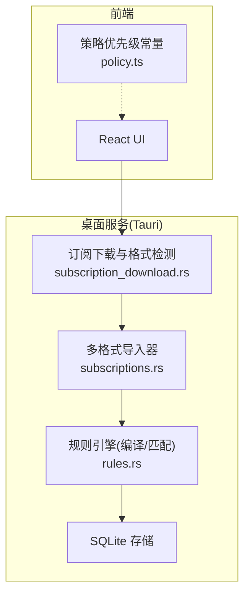
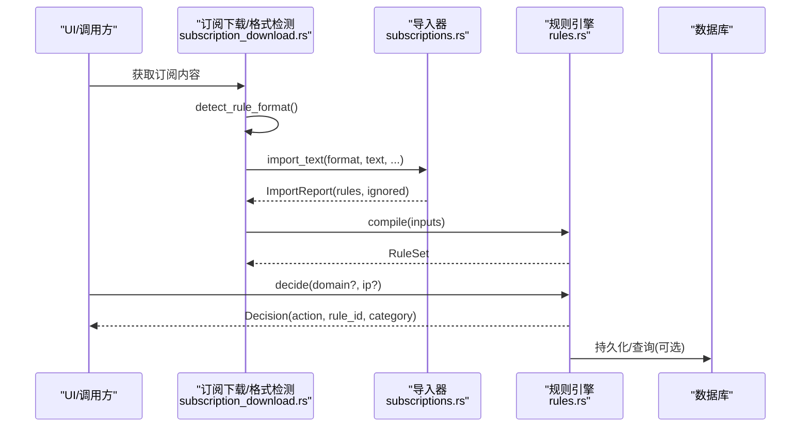
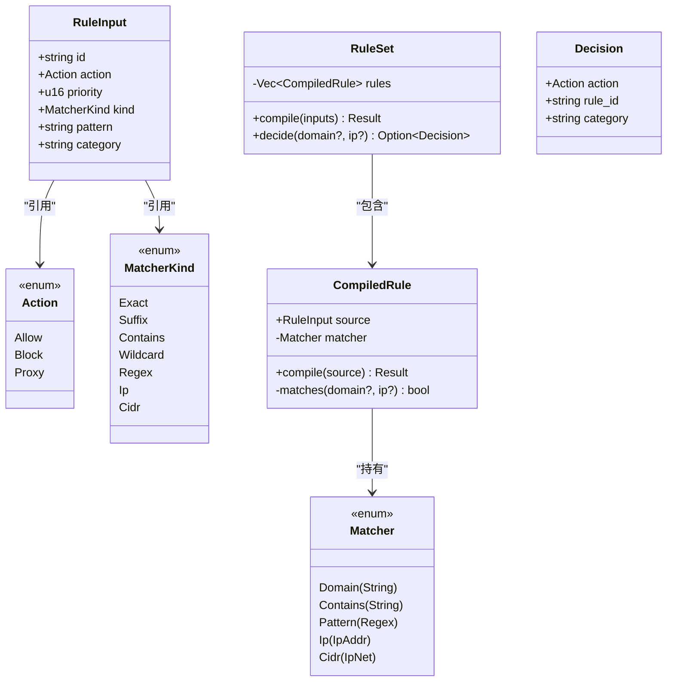
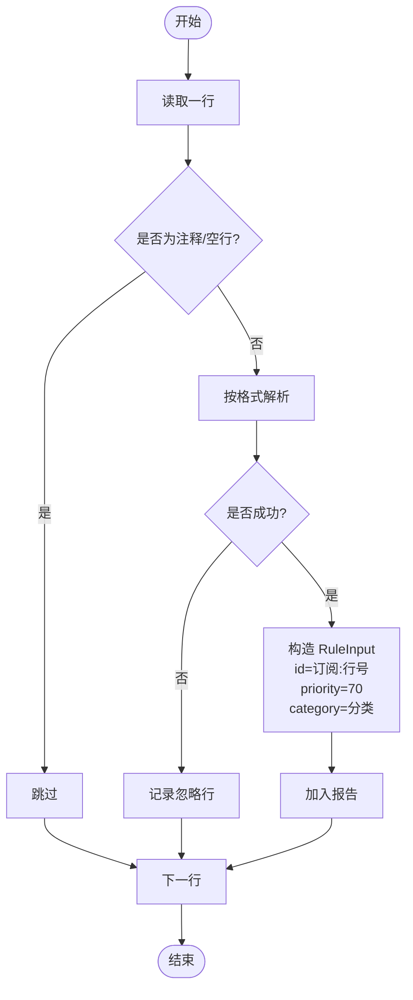
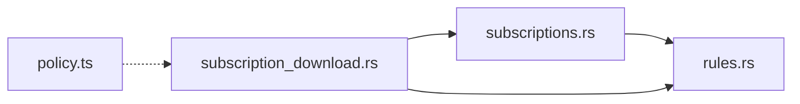

# 规则引擎

<cite>
**本文引用的文件**
- [rules.rs](file://src-tauri/src/rules.rs)
- [subscriptions.rs](file://src-tauri/src/subscriptions.rs)
- [subscription_download.rs](file://src-tauri/src/subscription_download.rs)
- [policy.ts](file://src/policy.ts)
- [architecture.md](file://docs/architecture.md)
- [product-spec.md](file://docs/product-spec.md)
</cite>

## 目录
1. [简介](#简介)
2. [项目结构](#项目结构)
3. [核心组件](#核心组件)
4. [架构总览](#架构总览)
5. [详细组件分析](#详细组件分析)
6. [依赖关系分析](#依赖关系分析)
7. [性能与内存管理](#性能与内存管理)
8. [调试与故障排除](#调试与故障排除)
9. [结论](#结论)
10. [附录：规则语法入门与示例](#附录规则语法入门与示例)

## 简介
本文件为 CleanWeb 的规则引擎提供系统化文档，覆盖多格式规则解析器（Clash、Adblock、Hosts、域名列表、IP/CIDR）的实现原理与编译过程；解释匹配算法、优先级排序与冲突解决机制；记录支持的匹配类型（精确、后缀、包含、通配符、正则、IP、CIDR）；给出规则编写示例与性能优化建议；说明规则编译缓存与内存管理策略；并提供调试工具与故障排除指南。同时为初学者提供规则语法入门，并为高级用户提供扩展点说明。

## 项目结构
CleanWeb 的规则引擎由 Rust 后端实现，前端 TypeScript 仅暴露策略优先级等元数据。核心模块包括：
- 规则定义与编译：rules.rs
- 多格式订阅导入：subscriptions.rs
- 自动格式检测与下载流程：subscription_download.rs
- 策略优先级常量（前端）：policy.ts
- 产品与架构说明：docs/architecture.md、docs/product-spec.md

图表来源
- [subscription_download.rs:815-853](file://src-tauri/src/subscription_download.rs#L815-L853)
- [subscriptions.rs:44-95](file://src-tauri/src/subscriptions.rs#L44-L95)
- [rules.rs:126-147](file://src-tauri/src/rules.rs#L126-L147)
- [policy.ts:1-10](file://src/policy.ts#L1-L10)

章节来源
- [architecture.md:17-23](file://docs/architecture.md#L17-L23)
- [product-spec.md:53-67](file://docs/product-spec.md#L53-L67)

## 核心组件
- 规则输入与动作
  - 动作：允许、阻止、代理
  - 匹配类型：精确、后缀、包含、通配符、正则、IP、CIDR
  - 规则输入包含：唯一标识、动作、优先级、匹配类型、模式、分类
- 编译后规则
  - 将文本模式预编译为高效匹配器（字符串或正则表达式、IP/CIDR对象）
  - 按优先级排序，决定匹配顺序
- 规则集
  - 对请求的域名/IP进行决策，返回首个命中规则的决策结果（含动作、规则ID、分类）

章节来源
- [rules.rs:7-33](file://src-tauri/src/rules.rs#L7-L33)
- [rules.rs:35-48](file://src-tauri/src/rules.rs#L35-L48)
- [rules.rs:121-147](file://src-tauri/src/rules.rs#L121-L147)

## 架构总览
规则引擎在“订阅下载与格式检测”之后运行，负责将不同格式的文本规则统一转换为内部规范化的 RuleInput，再编译为 CompiledRule 并构建 RuleSet。匹配时优先使用低成本匹配（精确/后缀），再考虑包含/通配符/正则，最后处理 IP/CIDR。

图表来源
- [subscription_download.rs:815-853](file://src-tauri/src/subscription_download.rs#L815-L853)
- [subscriptions.rs:44-95](file://src-tauri/src/subscriptions.rs#L44-L95)
- [rules.rs:126-147](file://src-tauri/src/rules.rs#L126-L147)

## 详细组件分析

### 规则引擎（rules.rs）
- 数据结构
  - Action：Allow、Block、Proxy
  - MatcherKind：Exact、Suffix、Contains、Wildcard、Regex、Ip、Cidr
  - RuleInput：id、action、priority、kind、pattern、category
  - CompiledRule：source + matcher（Domain/Contains/Pattern/Ip/Cidr）
  - RuleSet：CompiledRule 向量，按 priority 升序排列
  - Decision：action、rule_id、category
- 编译过程
  - Exact/Suffix：规范化域名为 ASCII 小写，去除尾部点号
  - Contains：去空白并转小写，空串视为无效
  - Wildcard：将 * 转为 .*，? 转为 .，其余字符转义，生成大小写不敏感的正则
  - Regex：直接构建大小写不敏感的正则
  - Ip/Cidr：解析为标准网络对象
- 匹配过程
  - 先对传入域名做规范化（同编译期一致）
  - 按规则顺序查找首个匹配项，返回其决策
- 错误处理
  - 非法域名、非法正则、非法 IP/CIDR 均抛出结构化错误

图表来源
- [rules.rs:7-33](file://src-tauri/src/rules.rs#L7-L33)
- [rules.rs:35-48](file://src-tauri/src/rules.rs#L35-L48)
- [rules.rs:121-147](file://src-tauri/src/rules.rs#L121-L147)

章节来源
- [rules.rs:67-118](file://src-tauri/src/rules.rs#L67-L118)
- [rules.rs:126-147](file://src-tauri/src/rules.rs#L126-L147)
- [rules.rs:149-168](file://src-tauri/src/rules.rs#L149-L168)

### 多格式订阅导入器（subscriptions.rs）
- 支持格式
  - Clash：DOMAIN、DOMAIN-SUFFIX、DOMAIN-KEYWORD、IP-CIDR/IP-CIDR6
  - Hosts：IP 地址+域名，跳过系统本地域名，去除 www. 前缀并使用后缀匹配
  - 域名列表：每行一个域名，默认后缀匹配
  - IP/CIDR 列表：IPv4/IPv6 与 CIDR 段
  - Adblock：仅支持 || 与 @@|| 开头的域名规则，忽略化妆脚本类规则
  - SafeSearch：以结构化 YAML 形式单独处理（不在本函数中解析）
- 导入流程
  - 逐行扫描，跳过注释与空行
  - 根据格式调用对应解析函数，产出 RuleInput
  - 记录被忽略的行及原因，保留来源溯源信息（订阅ID、URL、行号）
- 行为要点
  - 所有导入规则默认优先级 70（可被上层策略覆盖）
  - 对于 Clash 中的 REJECT/REJECT-DROP 映射为 Block
  - Hosts 条目若为本地回环或未指定地址，会被过滤

图表来源
- [subscriptions.rs:44-95](file://src-tauri/src/subscriptions.rs#L44-L95)
- [subscriptions.rs:97-198](file://src-tauri/src/subscriptions.rs#L97-L198)

章节来源
- [subscriptions.rs:7-16](file://src-tauri/src/subscriptions.rs#L7-L16)
- [subscriptions.rs:44-95](file://src-tauri/src/subscriptions.rs#L44-L95)
- [subscriptions.rs:97-198](file://src-tauri/src/subscriptions.rs#L97-L198)

### 自动格式检测（subscription_download.rs）
- 检测逻辑
  - 安全搜索清单：包含 mappings/target 关键字
  - Clash：包含 payload 或行首为 DOMAIN/DOMAIN-SUFFIX
  - Adblock：行首为 || 或包含 ##
  - IP/CIDR 列表：全部行均为合法 IP 或 CIDR
  - Hosts：至少两列且首列为合法 IP
  - 否则归为域名列表
- 作用
  - 在未知显式格式声明时，基于内容启发式推断格式，提高兼容性

章节来源
- [subscription_download.rs:815-853](file://src-tauri/src/subscription_download.rs#L815-L853)

### 策略优先级（policy.ts）
- 前端维护一组策略类别及其数值优先级，用于上层组合与展示
- 注意：当前规则引擎侧未直接使用这些常量，但可用于 UI 层显示与排序

章节来源
- [policy.ts:1-10](file://src/policy.ts#L1-L10)

## 依赖关系分析
- 外部库
  - regex/regex-builder：正则表达式构建与匹配
  - ipnet：IP/CIDR 集合判断
  - idna：国际化域名到 ASCII 转换
  - serde：序列化/反序列化
  - thiserror：错误类型定义
- 模块耦合
  - subscriptions.rs 依赖 rules.rs 的类型（Action、MatcherKind、RuleInput）
  - subscription_download.rs 依赖 subscriptions.rs 的格式枚举与导入接口
  - 前端 policy.ts 与后端无直接运行时依赖，仅作为配置参考

图表来源
- [subscriptions.rs:1-6](file://src-tauri/src/subscriptions.rs#L1-L6)
- [subscription_download.rs:815-853](file://src-tauri/src/subscription_download.rs#L815-L853)

章节来源
- [rules.rs:1-5](file://src-tauri/src/rules.rs#L1-L5)
- [subscriptions.rs:1-6](file://src-tauri/src/subscriptions.rs#L1-L6)
- [subscription_download.rs:815-853](file://src-tauri/src/subscription_download.rs#L815-L853)

## 性能与内存管理
- 匹配顺序与复杂度
  - 规则按 priority 升序排列，先匹配高优先级规则
  - 精确/后缀匹配为 O(1)/O(n) 字符串比较，成本低
  - 包含匹配为子串查找，成本中等
  - 通配符/正则需编译为正则对象，匹配成本较高，应谨慎使用
  - IP/CIDR 匹配使用 ipnet，效率高
- 编译期优化
  - 将通配符与正则提前编译为 Regex 对象，避免重复构建
  - 域名规范化（去尾点、ASCII 小写、IDNA 转换）在编译期完成，减少运行时开销
- 内存管理建议
  - CompiledRule 持有已编译的 Regex 与网络对象，应避免频繁重建 RuleSet
  - 大规模规则集下，可将高频匹配的域名/后缀建立哈希索引（如 HashMap<String, Vec<usize>>）以减少线性扫描
  - 对包含匹配，可考虑前缀树或倒排索引以降低误判与开销
  - 合理设置规则优先级，使常见路径快速命中，降低平均匹配时间
- 并发与线程安全
  - RuleSet 编译完成后只读，可在多线程环境下共享
  - 更新规则集时应采用原子替换或读写锁保护

[本节为通用性能指导，不直接分析具体代码文件]

## 调试与故障排除
- 常见问题
  - 规则不生效：检查规则优先级与匹配类型是否正确；确认域名规范化后是否仍匹配
  - 误拦截：检查包含/正则规则是否过于宽泛；优先使用精确/后缀匹配
  - 导入失败：查看 ImportReport.ignored 中的行号与原因，修正格式或移除不支持特性
- 定位手段
  - 使用 ImportReport 输出被忽略的行与原因，便于排查
  - 通过 Decision.rule_id 与 Decision.category 定位命中规则来源
  - 利用测试用例验证边界情况（后缀匹配不包含形似域名、正则捕获范围等）
- 日志与审计
  - 访问日志记录决策、规则、分类、进程、用户等信息，便于回溯
  - 结合策略优先级常量在前端展示规则来源与权重

章节来源
- [subscriptions.rs:38-95](file://src-tauri/src/subscriptions.rs#L38-L95)
- [rules.rs:126-147](file://src-tauri/src/rules.rs#L126-L147)
- [product-spec.md:79-94](file://docs/product-spec.md#L79-L94)

## 结论
CleanWeb 的规则引擎以“统一输入、严格编译、有序匹配”为核心设计，兼容主流规则格式，并通过明确的优先级与错误报告保障稳定性与可维护性。在生产环境中，建议优先使用精确/后缀匹配，谨慎使用包含/正则；对大规模规则集引入索引结构以提升性能；结合访问日志与导入报告完善可观测性与问题定位。

[本节为总结性内容，不直接分析具体代码文件]

## 附录：规则语法入门与示例

### 支持的匹配类型
- 精确匹配（Exact）：完全相等
- 后缀匹配（Suffix）：等于或以下划线分隔的子域匹配
- 包含匹配（Contains）：子串匹配（可能过杀）
- 通配符（Wildcard）：* 表示任意长度，? 表示单字符
- 正则表达式（Regex）：大小写不敏感
- IP 地址（Ip）：IPv4/IPv6
- CIDR（Cidr）：网段匹配

### 各格式规则示例
- Clash
  - 精确域名：DOMAIN,ads.example,REJECT
  - 后缀域名：DOMAIN-SUFFIX,bad.example,REJECT
  - 关键词：DOMAIN-KEYWORD,porn,REJECT
  - 网段：IP-CIDR,203.0.113.0/24,REJECT
- Adblock
  - 阻断：||ads.example^
  - 放行：@@||safe.ads.example^
  - 注：化妆脚本规则（##、#@#、$script）不被支持
- Hosts
  - 0.0.0.0 ads.example
  - 0.0.0.0 www.pornhub.com（会自动去除 www. 并转为后缀匹配）
- 域名列表
  - 每行一个域名，默认后缀匹配
- IP/CIDR 列表
  - 203.0.113.8
  - 2001:db8::1
  - 198.51.100.0/24

### 优先级与冲突解决
- 规则按 priority 升序匹配，数值越小优先级越高
- 当多条规则命中同一目标时，选择最先命中的规则（即最小 priority）
- 父级允许列表通常高于订阅规则，但不覆盖高风险安全规则（除非管理员明确开启覆盖）

章节来源
- [rules.rs:126-147](file://src-tauri/src/rules.rs#L126-L147)
- [subscriptions.rs:97-198](file://src-tauri/src/subscriptions.rs#L97-L198)
- [product-spec.md:53-67](file://docs/product-spec.md#L53-L67)

### 高级扩展点
- 新增匹配类型
  - 在 MatcherKind 中添加新枚举值，并在 CompiledRule::compile 与 matches 中实现相应逻辑
- 新增导入格式
  - 在 SubscriptionFormat 中添加新格式，并在 import_text 与 detect_rule_format 中增加分支
- 自定义优先级策略
  - 在上层聚合规则时，依据策略类别（category）与 policy.ts 中的优先级常量计算最终 priority
- 索引优化
  - 在 RuleSet 中为常用匹配类型（如 Suffix/Exact）建立哈希索引，加速决策

章节来源
- [rules.rs:14-23](file://src-tauri/src/rules.rs#L14-L23)
- [rules.rs:67-118](file://src-tauri/src/rules.rs#L67-L118)
- [subscriptions.rs:7-16](file://src-tauri/src/subscriptions.rs#L7-L16)
- [subscription_download.rs:815-853](file://src-tauri/src/subscription_download.rs#L815-L853)
- [policy.ts:1-10](file://src/policy.ts#L1-L10)