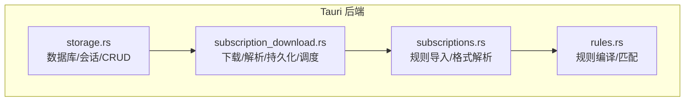
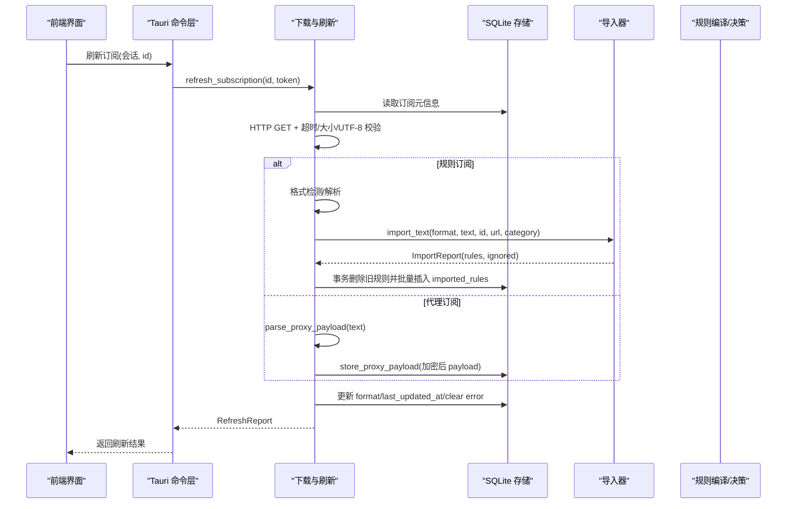
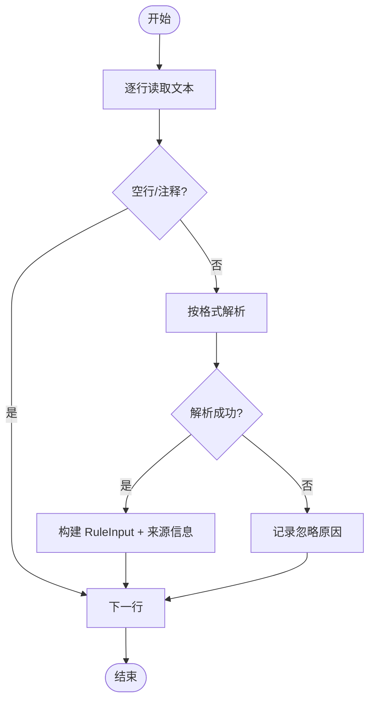
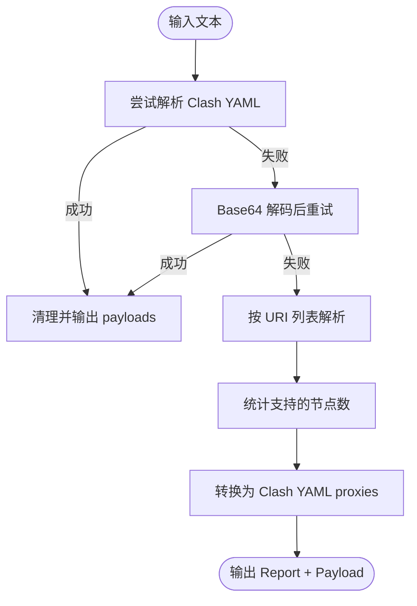
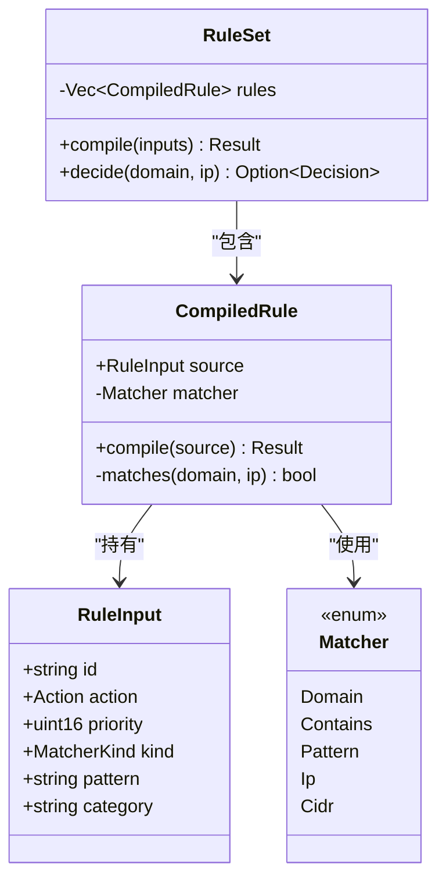
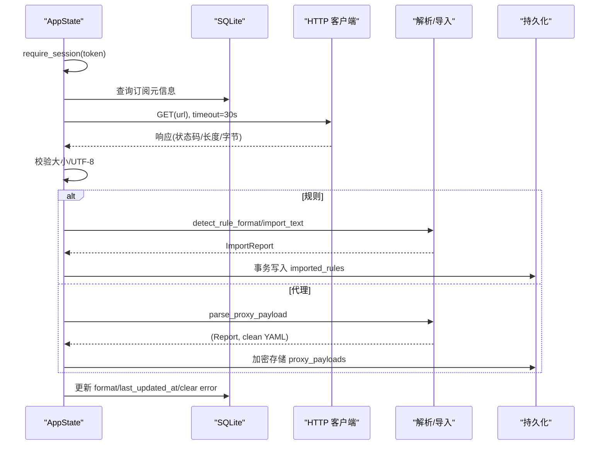
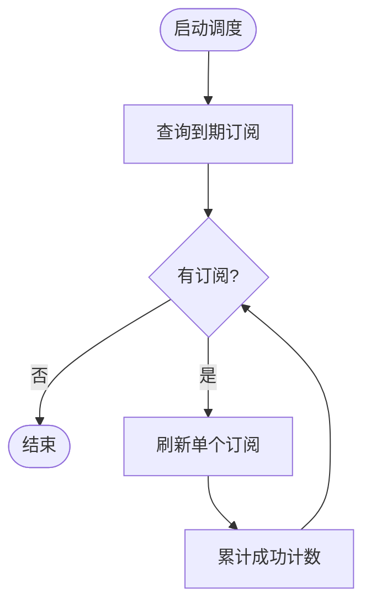
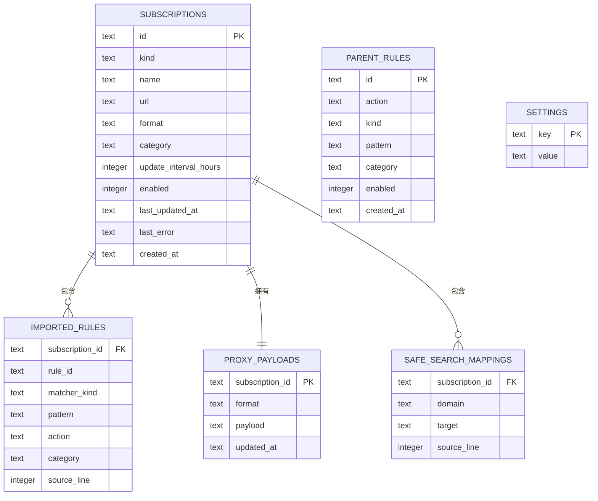
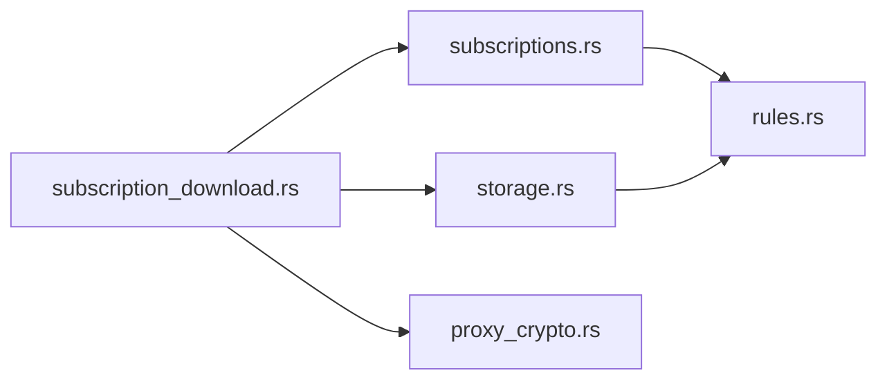

# 订阅管理系统

<cite>
**本文引用的文件**   
- [subscriptions.rs](file://src-tauri/src/subscriptions.rs)
- [subscription_download.rs](file://src-tauri/src/subscription_download.rs)
- [rules.rs](file://src-tauri/src/rules.rs)
- [storage.rs](file://src-tauri/src/storage.rs)
- [README.md](file://README.md)
</cite>

## 目录
1. [简介](#简介)
2. [项目结构](#项目结构)
3. [核心组件](#核心组件)
4. [架构总览](#架构总览)
5. [详细组件分析](#详细组件分析)
6. [依赖关系分析](#依赖关系分析)
7. [性能与可扩展性](#性能与可扩展性)
8. [故障诊断指南](#故障诊断指南)
9. [结论](#结论)
10. [附录：使用示例与扩展指南](#附录使用示例与扩展指南)

## 简介
本文件为 CleanWeb 的订阅管理子系统提供系统化文档，覆盖以下主题：
- 支持的订阅源格式（规则订阅、代理订阅）
- 增量更新机制与自动调度
- 错误处理策略与失败恢复
- 推荐规则源列表的管理
- 订阅配置校验与持久化存储
- 下载流程中的网络请求处理
- 数据清洗与格式转换逻辑
- 故障诊断与性能调优建议
- 面向初学者的使用指南与面向高级用户的扩展方法

CleanWeb 是一个以 Windows 为主的家长式网络过滤客户端，结合本地策略引擎与独立分发的代理核心，实现域名/IP 过滤与代理能力。

**章节来源**
- [README.md:1-18](file://README.md#L1-L18)

## 项目结构
订阅管理相关代码位于 Tauri 后端 Rust 模块中，主要涉及四个文件：
- subscriptions.rs：订阅导入与解析（规则文本到内部规则模型）
- subscription_download.rs：订阅下载、格式识别、代理载荷解析与持久化、定时刷新
- rules.rs：规则编译与匹配决策
- storage.rs：数据库模式、会话鉴权、订阅 CRUD、推荐源、父级规则等

**图示来源**
- [storage.rs:279-353](file://src-tauri/src/storage.rs#L279-L353)
- [subscription_download.rs:40-113](file://src-tauri/src/subscription_download.rs#L40-L113)
- [subscriptions.rs:44-95](file://src-tauri/src/subscriptions.rs#L44-L95)
- [rules.rs:126-147](file://src-tauri/src/rules.rs#L126-L147)

**章节来源**
- [storage.rs:279-353](file://src-tauri/src/storage.rs#L279-L353)
- [subscription_download.rs:40-113](file://src-tauri/src/subscription_download.rs#L40-L113)
- [subscriptions.rs:44-95](file://src-tauri/src/subscriptions.rs#L44-L95)
- [rules.rs:126-147](file://src-tauri/src/rules.rs#L126-L147)

## 核心组件
- 订阅格式枚举与导入报告：定义支持的订阅格式及导入结果统计
- 规则导入器：将不同格式的文本行转换为统一的 RuleInput 并记录来源行号
- 下载与刷新：HTTP 获取、大小限制、UTF-8 校验、格式检测、规则或代理分支处理
- 代理载荷解析：支持 Clash YAML、Base64 包裹、URI 列表转 Clash YAML
- 规则编译与决策：统一规则模型、优先级排序、匹配器集合
- 存储与会话：SQLite 模式、订阅 CRUD、推荐源、父级规则、设置项

**章节来源**
- [subscriptions.rs:7-42](file://src-tauri/src/subscriptions.rs#L7-L42)
- [subscription_download.rs:18-26](file://src-tauri/src/subscription_download.rs#L18-L26)
- [rules.rs:7-33](file://src-tauri/src/rules.rs#L7-L33)
- [storage.rs:55-89](file://src-tauri/src/storage.rs#L55-L89)

## 架构总览
订阅管理的端到端流程如下：
- 前端通过 Tauri 命令调用后端接口
- 后端校验会话与参数，查询订阅元信息
- 发起 HTTP 请求下载内容，执行大小与编码校验
- 根据订阅类型走“规则”或“代理”分支
- 规则分支：格式检测 → 文本解析 → 事务写入 imported_rules
- 代理分支：解析为 Clash YAML → 加密存储至 proxy_payloads
- 更新 last_updated_at 与 detected format，记录错误信息

**图示来源**
- [subscription_download.rs:40-113](file://src-tauri/src/subscription_download.rs#L40-L113)
- [subscription_download.rs:148-182](file://src-tauri/src/subscription_download.rs#L148-L182)
- [subscription_download.rs:236-300](file://src-tauri/src/subscription_download.rs#L236-L300)
- [subscription_download.rs:115-125](file://src-tauri/src/subscription_download.rs#L115-L125)
- [subscriptions.rs:44-95](file://src-tauri/src/subscriptions.rs#L44-L95)
- [rules.rs:126-147](file://src-tauri/src/rules.rs#L126-L147)

## 详细组件分析

### 订阅格式支持与导入器
- 支持的订阅格式
  - 规则订阅：Clash、Hosts、DomainList、IpList、Adblock、SafeSearch
  - 代理订阅：Clash YAML、Base64 包裹的 Clash YAML、URI 列表（ss/ssr/vmess/vless/trojan/hysteria/hy2/tuic/socks/http/https/wireguard）
- 导入器行为
  - 逐行解析，忽略空行与注释
  - 将每行映射为 RuleInput，附带来源信息（subscription_id、source_url、source_line）
  - 对不支持的规则类型或非法条目记录 IgnoredLine 原因
- 特殊处理
  - Hosts 跳过系统/本地域名，去除 www. 前缀并使用后缀匹配
  - Adblock 仅支持域名规则，屏蔽 cosmetic/script 规则
  - SafeSearch 采用结构化 YAML 清单，严格校验目标白名单

**图示来源**
- [subscriptions.rs:44-95](file://src-tauri/src/subscriptions.rs#L44-L95)
- [subscriptions.rs:97-198](file://src-tauri/src/subscriptions.rs#L97-L198)
- [subscription_download.rs:815-853](file://src-tauri/src/subscription_download.rs#L815-L853)

**章节来源**
- [subscriptions.rs:7-16](file://src-tauri/src/subscriptions.rs#L7-L16)
- [subscriptions.rs:44-95](file://src-tauri/src/subscriptions.rs#L44-L95)
- [subscriptions.rs:97-198](file://src-tauri/src/subscriptions.rs#L97-L198)
- [subscription_download.rs:815-853](file://src-tauri/src/subscription_download.rs#L815-L853)

### 代理载荷解析与转换
- 解析顺序
  - 尝试直接解析为 Clash YAML（保留 proxies/proxy-groups，剔除 dns/rules 等无关字段）
  - 尝试 Base64 解码后再解析 Clash YAML
  - 作为 URI 列表处理，统计支持的节点数量，并将各协议 URI 转换为 Clash YAML 的 proxies 条目
- 支持的协议
  - ss、ssr、vmess、vless、trojan、hysteria、hy2、tuic、socks、http、https、wireguard
- 输出
  - 返回 RefreshReport（包含检测到的格式、节点数、组数等）
  - 生成仅含 proxies/proxy-groups 的干净 Clash YAML 字符串

**图示来源**
- [subscription_download.rs:236-300](file://src-tauri/src/subscription_download.rs#L236-L300)
- [subscription_download.rs:302-368](file://src-tauri/src/subscription_download.rs#L302-L368)
- [subscription_download.rs:749-782](file://src-tauri/src/subscription_download.rs#L749-L782)

**章节来源**
- [subscription_download.rs:236-300](file://src-tauri/src/subscription_download.rs#L236-L300)
- [subscription_download.rs:302-368](file://src-tauri/src/subscription_download.rs#L302-L368)
- [subscription_download.rs:749-782](file://src-tauri/src/subscription_download.rs#L749-L782)

### 规则编译与决策
- 规则模型
  - Action：允许、阻止、代理
  - MatcherKind：精确、后缀、包含、通配符、正则、IP、CIDR
  - RuleInput：包含 id、action、priority、kind、pattern、category
- 编译过程
  - 规范化域名（IDNA 转 ASCII）、构建匹配器
  - 按 priority 升序排序，低数值优先
- 决策过程
  - 给定 domain/ip，返回首个匹配的 Decision（action、rule_id、category）

**图示来源**
- [rules.rs:7-33](file://src-tauri/src/rules.rs#L7-L33)
- [rules.rs:67-119](file://src-tauri/src/rules.rs#L67-L119)
- [rules.rs:121-147](file://src-tauri/src/rules.rs#L121-L147)

**章节来源**
- [rules.rs:7-33](file://src-tauri/src/rules.rs#L7-L33)
- [rules.rs:67-119](file://src-tauri/src/rules.rs#L67-L119)
- [rules.rs:121-147](file://src-tauri/src/rules.rs#L121-L147)

### 下载与刷新流程
- 会话校验：require_session 检查有效会话令牌
- 元信息查询：从 subscriptions 表读取 kind/url/format/category
- 网络请求：reqwest 客户端，30 秒超时，User-Agent 固定
- 安全校验：Content-Length 与响应体大小上限 20MB；UTF-8 校验
- 分支处理：
  - 规则：refresh_rules → detect_rule_format/import_text → 事务写入 imported_rules
  - 代理：parse_proxy_payload → store_proxy_payload（加密）→ 更新 metadata
- 错误记录：record_error 更新 last_error 字段

**图示来源**
- [subscription_download.rs:40-113](file://src-tauri/src/subscription_download.rs#L40-L113)
- [subscription_download.rs:148-182](file://src-tauri/src/subscription_download.rs#L148-L182)
- [subscription_download.rs:236-300](file://src-tauri/src/subscription_download.rs#L236-L300)
- [subscription_download.rs:115-125](file://src-tauri/src/subscription_download.rs#L115-L125)
- [subscription_download.rs:875-883](file://src-tauri/src/subscription_download.rs#L875-L883)

**章节来源**
- [subscription_download.rs:40-113](file://src-tauri/src/subscription_download.rs#L40-L113)
- [subscription_download.rs:148-182](file://src-tauri/src/subscription_download.rs#L148-L182)
- [subscription_download.rs:236-300](file://src-tauri/src/subscription_download.rs#L236-L300)
- [subscription_download.rs:115-125](file://src-tauri/src/subscription_download.rs#L115-L125)
- [subscription_download.rs:875-883](file://src-tauri/src/subscription_download.rs#L875-L883)

### 自动更新调度
- 定时任务：refresh_due_subscriptions 查询需要更新的订阅（enabled=1 且 update_interval_hours 非空且到期）
- 逐个刷新：循环调用 refresh_subscription_inner，统计成功次数
- 注意：当前未实现指数退避或并发控制，属于简单轮询

**图示来源**
- [subscription_download.rs:127-146](file://src-tauri/src/subscription_download.rs#L127-L146)

**章节来源**
- [subscription_download.rs:127-146](file://src-tauri/src/subscription_download.rs#L127-L146)

### 数据存储与同步策略
- 数据库模式
  - subscriptions：订阅元信息（id/kind/name/url/format/category/update_interval/enabled/last_updated_at/last_error）
  - imported_rules：规则导入结果（关联 subscription_id，主键 subscription_id+rule_id）
  - proxy_payloads：代理载荷（加密后的 Clash YAML，按 subscription_id 唯一）
  - safe_search_mappings：安全搜索映射（subscription_id+domain 主键）
  - parent_rules：父级规则（allow/block），用于覆盖策略
  - settings：应用设置与分类开关
- 同步策略
  - 规则：每次刷新先 DELETE 再 INSERT，保证幂等
  - 代理：INSERT ... ON CONFLICT DO UPDATE，确保最新覆盖
  - 错误：record_error 更新 last_error，便于前端展示

**图示来源**
- [storage.rs:279-353](file://src-tauri/src/storage.rs#L279-L353)

**章节来源**
- [storage.rs:279-353](file://src-tauri/src/storage.rs#L279-L353)

### 推荐规则源列表管理
- 内置推荐源：get_recommended_rule_sources 返回多类高质量源（hosts/adblock/domain-list/ip-list/clash），带名称、URL、格式、分类与描述
- 暴露接口：get_recommended_sources 供前端快速选择添加

**章节来源**
- [storage.rs:92-226](file://src-tauri/src/storage.rs#L92-L226)
- [storage.rs:622-624](file://src-tauri/src/storage.rs#L622-L624)

## 依赖关系分析
- 模块耦合
  - subscription_download 依赖 storage（AppState/DB）、subscriptions（import_text）、proxy_crypto（加密）
  - subscriptions 依赖 rules（RuleInput/MatcherKind/Action）
  - storage 依赖 rules（用于父级规则校验）
- 外部依赖
  - reqwest：HTTP 客户端
  - rusqlite：SQLite 本地存储
  - serde_yaml/serde_json：YAML/JSON 解析
  - base64：Base64 编解码
  - regex/idna/ipnet：规则匹配与网络地址处理

**图示来源**
- [subscription_download.rs:10-14](file://src-tauri/src/subscription_download.rs#L10-L14)
- [subscriptions.rs:5](file://src-tauri/src/subscriptions.rs#L5)
- [storage.rs:18-19](file://src-tauri/src/storage.rs#L18-L19)

**章节来源**
- [subscription_download.rs:10-14](file://src-tauri/src/subscription_download.rs#L10-L14)
- [subscriptions.rs:5](file://src-tauri/src/subscriptions.rs#L5)
- [storage.rs:18-19](file://src-tauri/src/storage.rs#L18-L19)

## 性能与可扩展性
- 网络请求
  - 固定 30 秒超时，无重试与指数退避；建议增加可配置的重试策略与并发度控制
- 大小限制
  - 20MB 限制避免内存压力；对于超大订阅建议分块处理或流式解析
- 数据库
  - WAL 模式提升并发读写；规则导入使用事务减少锁竞争
- 规则匹配
  - 编译阶段预构建匹配器，运行时 O(n) 扫描；可按类别或索引优化热点规则
- 代理载荷
  - 加密存储避免明文泄露；解析时仅保留必要字段，降低后续负载

[本节为通用指导，不直接分析具体文件]

## 故障诊断指南
- 常见错误
  - 订阅不存在/会话过期：检查 session_token 与订阅 id
  - 服务器返回非 2xx：查看 last_error 字段
  - 超过 20MB：确认订阅体积或启用压缩
  - 非 UTF-8：确认服务端编码
  - 未找到支持的代理节点：检查 URI 列表是否包含受支持协议
- 定位步骤
  - 查看 subscriptions.last_error
  - 检查 imported_rules 与 proxy_payloads 是否存在对应记录
  - 核对 recommended sources 的 URL 可达性与格式一致性
- 日志与审计
  - access_logs 表记录连接决策与错误，可用于回溯问题

**章节来源**
- [subscription_download.rs:875-883](file://src-tauri/src/subscription_download.rs#L875-L883)
- [storage.rs:314-331](file://src-tauri/src/storage.rs#L314-L331)

## 结论
CleanWeb 的订阅管理系统提供了完善的规则与代理订阅处理能力，涵盖多格式解析、增量更新、错误记录与安全存储。通过清晰的模块划分与事务化持久化，系统在可靠性与可维护性方面表现良好。未来可在网络层引入重试与并发控制，在规则匹配层引入索引与缓存，进一步提升性能与鲁棒性。

[本节为总结，不直接分析具体文件]

## 附录：使用示例与扩展指南

### 初学者：订阅使用指南
- 添加规则订阅
  - 选择推荐源或直接输入 URL，指定名称、分类与更新周期
  - 首次刷新后，可在 imported_rules 查看导入结果与忽略原因
- 添加代理订阅
  - 支持 Clash YAML、Base64 包裹、URI 列表
  - 刷新成功后，proxy_payloads 会保存加密后的 Clash YAML
- 启用与调度
  - 设置 update_interval_hours 为 6/12/24/168，系统将自动刷新到期订阅
- 常见问题
  - 若 last_error 显示“未找到支持的代理节点”，请检查 URI 列表是否包含受支持协议

**章节来源**
- [storage.rs:547-577](file://src-tauri/src/storage.rs#L547-L577)
- [subscription_download.rs:127-146](file://src-tauri/src/subscription_download.rs#L127-L146)
- [subscription_download.rs:236-300](file://src-tauri/src/subscription_download.rs#L236-L300)

### 高级用户：自定义订阅处理器扩展方法
- 新增订阅格式
  - 在 SubscriptionFormat 中添加新变体
  - 在 import_text 的 match 分支中实现解析函数，返回 Ok(Some((kind, pattern, action))) 或 Err(reason)
  - 在 detect_rule_format 中加入启发式判断，以便自动识别
- 新增代理协议
  - 在 parse_single_uri 中增加新的协议分支，解析参数并构造 Clash YAML 映射
  - 在 supported 列表中注册新协议前缀
- 自定义清洗与转换
  - 在 uri_list_to_clash_proxies 或 try_parse_clash_yaml 中调整字段映射与清理逻辑
- 错误与报告
  - 保持 ImportReport 语义一致，记录 ignored 原因，便于前端反馈

**章节来源**
- [subscriptions.rs:7-16](file://src-tauri/src/subscriptions.rs#L7-L16)
- [subscriptions.rs:44-95](file://src-tauri/src/subscriptions.rs#L44-L95)
- [subscription_download.rs:815-853](file://src-tauri/src/subscription_download.rs#L815-L853)
- [subscription_download.rs:302-368](file://src-tauri/src/subscription_download.rs#L302-L368)
- [subscription_download.rs:749-782](file://src-tauri/src/subscription_download.rs#L749-L782)