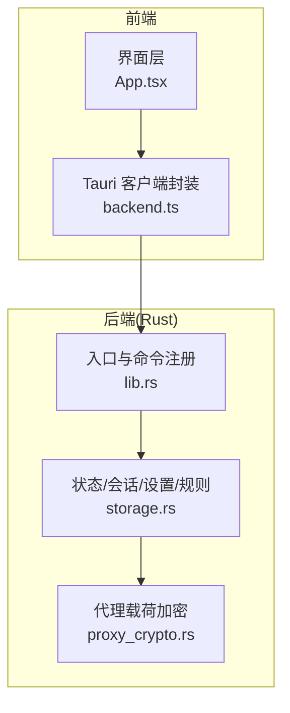
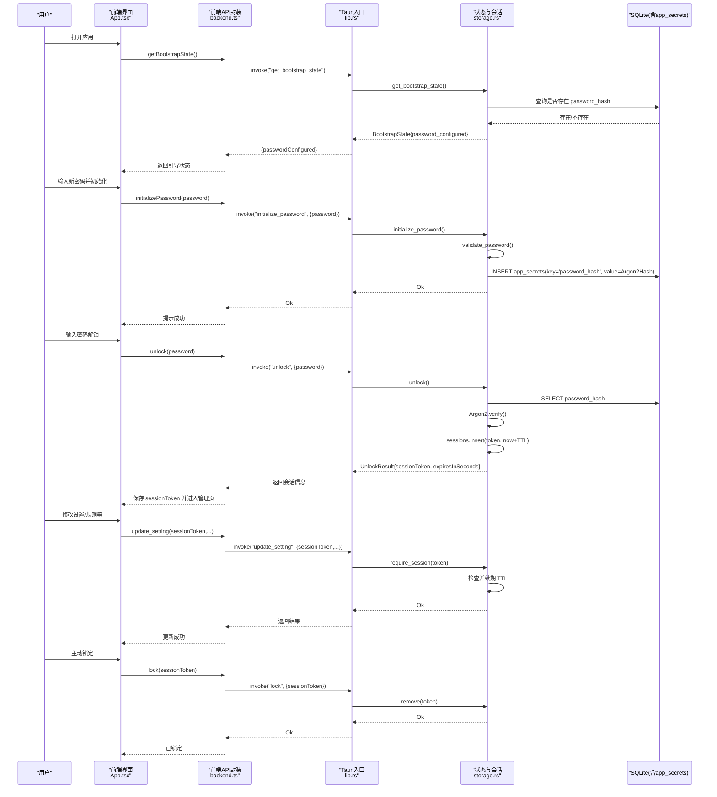
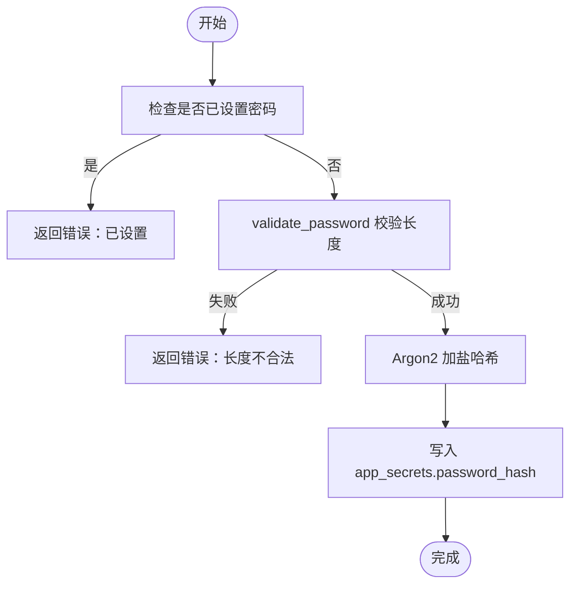
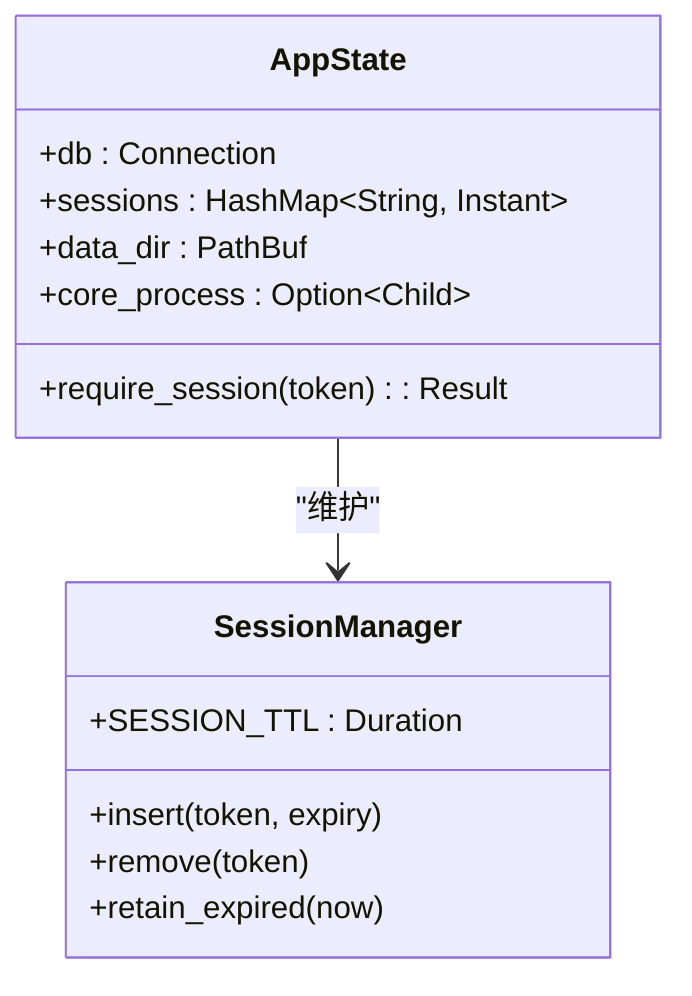
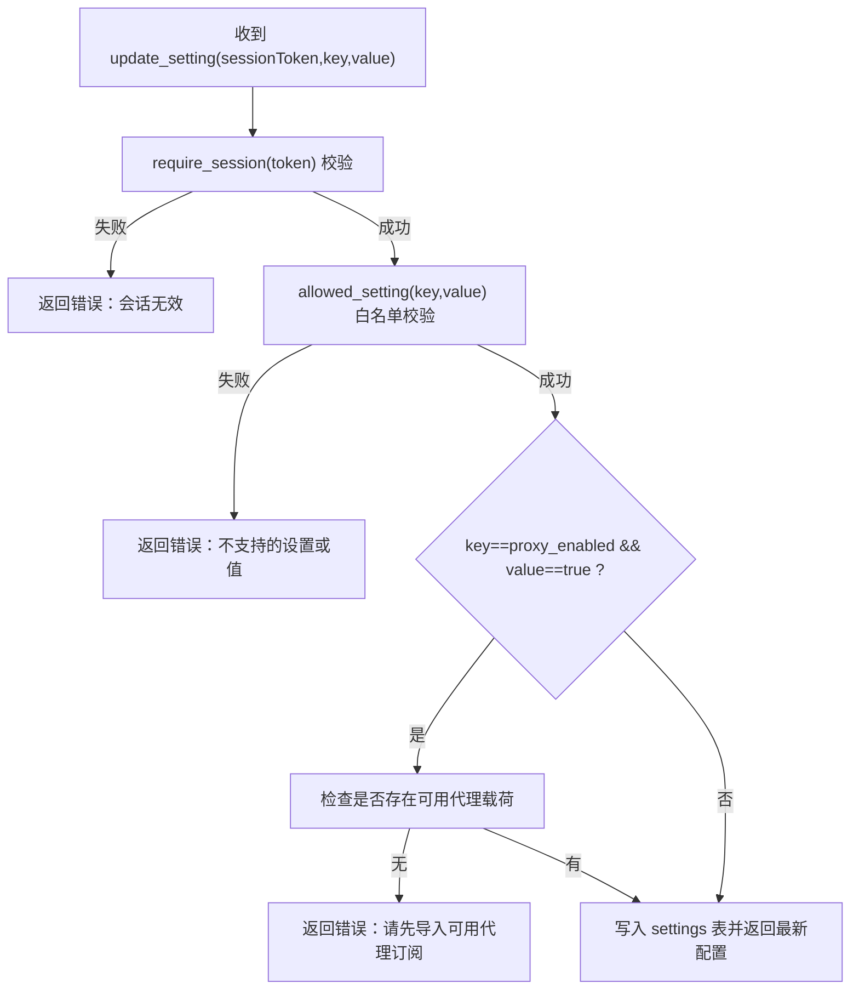
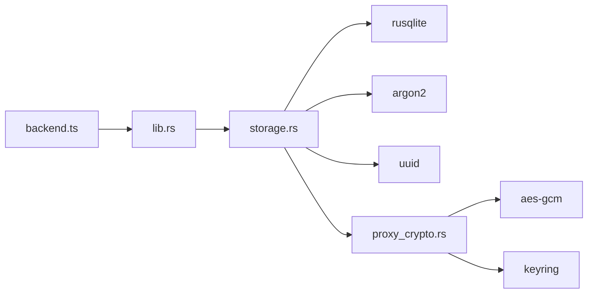

# 认证授权系统

<cite>
**本文引用的文件列表**
- [src-tauri/src/storage.rs](file://src-tauri/src/storage.rs)
- [src-tauri/src/lib.rs](file://src-tauri/src/lib.rs)
- [src/backend.ts](file://src/backend.ts)
- [src/policy.ts](file://src/policy.ts)
- [src/App.tsx](file://src/App.tsx)
- [src-tauri/src/proxy_crypto.rs](file://src-tauri/src/proxy_crypto.rs)
</cite>

## 目录
1. [简介](#简介)
2. [项目结构](#项目结构)
3. [核心组件](#核心组件)
4. [架构总览](#架构总览)
5. [详细组件分析](#详细组件分析)
6. [依赖关系分析](#依赖关系分析)
7. [性能与安全特性](#性能与安全特性)
8. [故障排查指南](#故障排查指南)
9. [结论](#结论)
10. [附录：使用示例与最佳实践](#附录使用示例与最佳实践)

## 简介
本文件面向 CleanWeb 的“家长身份验证、会话管理与权限控制”子系统，系统性阐述其安全模型与实现细节。内容涵盖：
- 家长密码初始化与校验（Argon2 哈希）
- 会话令牌生成、刷新与过期策略
- 基于会话的管理操作鉴权
- 敏感数据保护（代理订阅载荷加密）
- 错误处理策略与安全最佳实践
- 为初学者提供概念说明，为开发者提供代码级实现路径

## 项目结构
CleanWeb 采用 Tauri 架构：前端 TypeScript 通过 @tauri-apps/api 调用 Rust 后端命令；Rust 侧负责持久化、密码学、会话管理以及平台能力集成。

图表来源
- [src-tauri/src/lib.rs:14-82](file://src-tauri/src/lib.rs#L14-L82)
- [src-tauri/src/storage.rs:23-28](file://src-tauri/src/storage.rs#L23-L28)
- [src-tauri/src/proxy_crypto.rs:10-15](file://src-tauri/src/proxy_crypto.rs#L10-L15)

章节来源
- [src-tauri/src/lib.rs:14-82](file://src-tauri/src/lib.rs#L14-L82)
- [src-tauri/src/storage.rs:23-28](file://src-tauri/src/storage.rs#L23-L28)
- [src/backend.ts:1-50](file://src/backend.ts#L1-L50)

## 核心组件
- 应用状态与会话存储：AppState 持有数据库连接、内存会话表、数据目录与子进程句柄。会话以 token -> 过期时间映射形式驻留内存，每次受保护操作前进行有效性检查并续期。
- 密码学：
  - 家长密码：使用 Argon2 对明文密码加盐哈希后落库，仅存哈希。
  - 代理订阅载荷：使用 AES-256-GCM 在系统 Keychain 管理的密钥下加密存储，避免明文泄露。
- 权限控制：所有需要家长权限的操作均要求 session_token，并在后端统一校验会话是否有效且未过期。
- 前端桥接：backend.ts 暴露统一的异步函数，自动在 Tauri 环境调用后端命令，在非 Tauri 预览模式提供本地模拟行为。

章节来源
- [src-tauri/src/storage.rs:23-28](file://src-tauri/src/storage.rs#L23-L28)
- [src-tauri/src/storage.rs:265-276](file://src-tauri/src/storage.rs#L265-L276)
- [src-tauri/src/storage.rs:400-427](file://src-tauri/src/storage.rs#L400-L427)
- [src-tauri/src/storage.rs:429-456](file://src-tauri/src/storage.rs#L429-L456)
- [src-tauri/src/proxy_crypto.rs:24-66](file://src-tauri/src/proxy_crypto.rs#L24-L66)
- [src/backend.ts:34-50](file://src/backend.ts#L34-L50)

## 架构总览
下图展示了从前端到后端的认证与授权关键流程：初始化密码、解锁获取会话、受保护操作鉴权、锁定销毁会话。

图表来源
- [src-tauri/src/lib.rs:46-79](file://src-tauri/src/lib.rs#L46-L79)
- [src-tauri/src/storage.rs:383-427](file://src-tauri/src/storage.rs#L383-L427)
- [src-tauri/src/storage.rs:429-466](file://src-tauri/src/storage.rs#L429-L466)
- [src-tauri/src/storage.rs:474-506](file://src-tauri/src/storage.rs#L474-L506)
- [src/backend.ts:34-50](file://src/backend.ts#L34-L50)

## 详细组件分析

### 家长密码与 Argon2 哈希存储
- 初始化密码
  - 前端调用 initializePassword，后端执行 validate_password 强度校验，随后使用 Argon2 生成带随机盐的哈希并写入 app_secrets 表。
  - 若已存在密码记录则拒绝重复初始化。
- 解锁验证
  - 前端调用 unlock，后端读取存储的哈希，使用 Argon2 验证输入的明文密码。
  - 成功后生成 UUID 作为会话令牌，写入内存会话表，并返回令牌及过期秒数。
- 密码强度策略
  - 最小长度与最大长度限制，防止弱口令与超长输入。

图表来源
- [src-tauri/src/storage.rs:400-427](file://src-tauri/src/storage.rs#L400-L427)
- [src-tauri/src/storage.rs:798-806](file://src-tauri/src/storage.rs#L798-L806)

章节来源
- [src-tauri/src/storage.rs:400-427](file://src-tauri/src/storage.rs#L400-L427)
- [src-tauri/src/storage.rs:798-806](file://src-tauri/src/storage.rs#L798-L806)

### 会话管理机制
- 会话生命周期
  - 解锁成功后生成随机令牌，存入内存 HashMap<token, Instant>，初始过期时间为 SESSION_TTL（固定时长）。
  - 每次受保护操作前调用 require_session：若令牌存在则续期至当前时间 + SESSION_TTL；否则返回错误并要求重新解锁。
  - 锁定操作直接移除对应令牌。
- 会话超时
  - 后台定时清理过期条目，确保内存中仅保留活跃会话。
- 前端交互
  - App.tsx 提供“家长身份验证”弹窗，提交密码后由 backend.ts 调用 unlock 并缓存 sessionToken。

图表来源
- [src-tauri/src/storage.rs:23-28](file://src-tauri/src/storage.rs#L23-L28)
- [src-tauri/src/storage.rs:265-276](file://src-tauri/src/storage.rs#L265-L276)

章节来源
- [src-tauri/src/storage.rs:265-276](file://src-tauri/src/storage.rs#L265-L276)
- [src-tauri/src/storage.rs:458-466](file://src-tauri/src/storage.rs#L458-L466)
- [src/App.tsx:228-244](file://src/App.tsx#L228-L244)
- [src/backend.ts:42-50](file://src/backend.ts#L42-L50)

### 权限控制策略
- 统一鉴权入口
  - 所有需要家长权限的命令在入口处先调用 state.require_session(session_token)，通过后继续执行业务逻辑。
- 白名单设置项
  - update_setting 对 key/value 做白名单校验，仅允许特定布尔开关与日志保留策略值，防止任意键值注入。
- 业务前置校验
  - 例如启用代理时，需确保存在可用的 Clash/Mihomo 订阅载荷，否则拒绝开启。

图表来源
- [src-tauri/src/storage.rs:474-506](file://src-tauri/src/storage.rs#L474-L506)
- [src-tauri/src/storage.rs:785-796](file://src-tauri/src/storage.rs#L785-L796)

章节来源
- [src-tauri/src/storage.rs:474-506](file://src-tauri/src/storage.rs#L474-L506)
- [src-tauri/src/storage.rs:785-796](file://src-tauri/src/storage.rs#L785-L796)

### 敏感数据保护（代理订阅载荷）
- 加密方案
  - 使用 AES-256-GCM 对称加密，nonce 随机生成并与密文一起编码存储。
  - 密钥来源于系统 Keychain，首次启动自动生成并持久化，后续复用。
- 迁移机制
  - 应用启动时对历史明文载荷进行一次性迁移加密，保证向后兼容。
- 访问控制
  - 解密仅在受信任的后端模块中进行，前端不接触明文密钥。

章节来源
- [src-tauri/src/proxy_crypto.rs:24-66](file://src-tauri/src/proxy_crypto.rs#L24-L66)
- [src-tauri/src/proxy_crypto.rs:72-103](file://src-tauri/src/proxy_crypto.rs#L72-L103)
- [src-tauri/src/proxy_crypto.rs:105-130](file://src-tauri/src/proxy_crypto.rs#L105-L130)

### 策略优先级与访问观察
- 策略优先级常量定义在前端 policy.ts，用于指导不同来源规则的覆盖顺序，如 parentAllow 优先于 subscription，但 security 高于 parentAllow。
- classifyUnknownIp 用于将未知 IP 访问标记为 warning，辅助审计与告警。

章节来源
- [src/policy.ts:1-21](file://src/policy.ts#L1-L21)

## 依赖关系分析
- 前端依赖
  - backend.ts 通过 @tauri-apps/api/core.invoke 调用后端命令，非 Tauri 环境下回退为本地模拟。
- 后端依赖
  - lib.rs 集中注册所有 tauri::command，形成前后端契约。
  - storage.rs 依赖 rusqlite 进行持久化，argon2 进行密码哈希，uuid 生成会话令牌。
  - proxy_crypto.rs 依赖 aes-gcm、base64、keyring 实现载荷加密与密钥管理。

图表来源
- [src-tauri/src/lib.rs:46-79](file://src-tauri/src/lib.rs#L46-L79)
- [src-tauri/src/storage.rs:9-16](file://src-tauri/src/storage.rs#L9-L16)
- [src-tauri/src/proxy_crypto.rs:1-8](file://src-tauri/src/proxy_crypto.rs#L1-L8)

章节来源
- [src-tauri/src/lib.rs:46-79](file://src-tauri/src/lib.rs#L46-L79)
- [src-tauri/src/storage.rs:9-16](file://src-tauri/src/storage.rs#L9-L16)
- [src-tauri/src/proxy_crypto.rs:1-8](file://src-tauri/src/proxy_crypto.rs#L1-L8)

## 性能与安全特性
- 性能
  - 会话表为内存 HashMap，查找与续期为 O(1)。
  - 定期清理过期会话，避免内存泄漏。
  - 密码哈希与验证使用 Argon2，计算开销可控，适合本地桌面应用。
- 安全
  - 密码仅存储 Argon2 哈希，不存储明文。
  - 会话令牌随机且短生命周期，支持主动锁定。
  - 代理载荷使用 AES-256-GCM 加密，密钥由系统 Keychain 保管。
  - 设置项白名单校验，防止任意键值注入。
  - 输入长度与格式校验，降低注入与溢出风险。

[本节为通用讨论，无需列出具体文件]

## 故障排查指南
- 常见错误与定位
  - “尚未设置管理密码”：尝试解锁但未初始化密码。应首先调用 initializePassword。
  - “管理密码错误”：密码校验失败，请确认密码正确性。
  - “管理会话已过期，请重新解锁”：会话超时或被锁定，需再次 unlock。
  - “不支持的设置或设置值”：传入的 key/value 不在白名单内，检查 allowed_setting 规则。
  - “请先导入包含可用节点的 Clash/Mihomo 代理订阅”：启用代理前需准备有效载荷。
- 调试建议
  - 前端：在 backend.ts 的浏览器预览分支中，可临时放宽校验以便联调，但生产环境必须走 Tauri 通道。
  - 后端：关注 SQLite 错误与 Keychain 访问错误，必要时查看日志输出。

章节来源
- [src-tauri/src/storage.rs:429-456](file://src-tauri/src/storage.rs#L429-L456)
- [src-tauri/src/storage.rs:474-506](file://src-tauri/src/storage.rs#L474-L506)
- [src-tauri/src/storage.rs:785-796](file://src-tauri/src/storage.rs#L785-L796)

## 结论
CleanWeb 的认证授权体系围绕“家长密码 + 会话令牌 + 白名单权限”构建，结合 Argon2 与 AES-256-GCM 的密码学与加密方案，实现了本地桌面应用的高安全性与良好可用性。通过统一的前后端接口与严格的输入校验，系统在易用性与健壮性之间取得平衡。

[本节为总结，无需列出具体文件]

## 附录：使用示例与最佳实践

- 设置管理密码（初始化）
  - 前端调用：initializePassword(password)
  - 后端实现路径：storage.rs 中的 initialize_password 与 validate_password
  - 参考路径
    - [src/backend.ts:38-40](file://src/backend.ts#L38-L40)
    - [src-tauri/src/storage.rs:400-427](file://src-tauri/src/storage.rs#L400-L427)
    - [src-tauri/src/storage.rs:798-806](file://src-tauri/src/storage.rs#L798-L806)

- 解锁应用（获取会话）
  - 前端调用：unlock(password)
  - 后端实现路径：storage.rs 中的 unlock
  - 参考路径
    - [src/backend.ts:42-46](file://src/backend.ts#L42-L46)
    - [src-tauri/src/storage.rs:429-456](file://src-tauri/src/storage.rs#L429-L456)

- 验证会话状态（受保护操作）
  - 任何需要家长权限的操作均需携带 session_token，后端在入口处调用 require_session 校验并续期
  - 参考路径
    - [src-tauri/src/storage.rs:265-276](file://src-tauri/src/storage.rs#L265-L276)
    - [src-tauri/src/storage.rs:474-506](file://src-tauri/src/storage.rs#L474-L506)

- 锁定应用（销毁会话）
  - 前端调用：lock(sessionToken)
  - 后端实现路径：storage.rs 中的 lock
  - 参考路径
    - [src/backend.ts:48-50](file://src/backend.ts#L48-L50)
    - [src-tauri/src/storage.rs:458-466](file://src-tauri/src/storage.rs#L458-L466)

- 安全最佳实践
  - 密码策略：至少 8 字符，不超过 128 字符；建议使用强密码组合。
  - 会话管理：合理设置超时，及时锁定；避免在日志中打印敏感信息。
  - 数据保护：代理载荷使用 AES-256-GCM 加密，密钥由系统 Keychain 管理。
  - 输入校验：严格白名单与格式校验，防止注入与越权。

[本节为使用指引，无需列出具体文件]