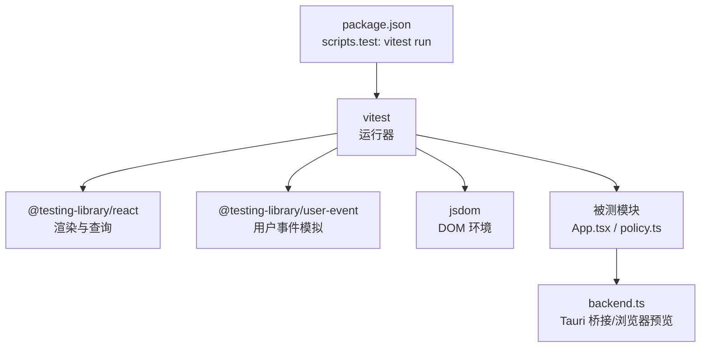
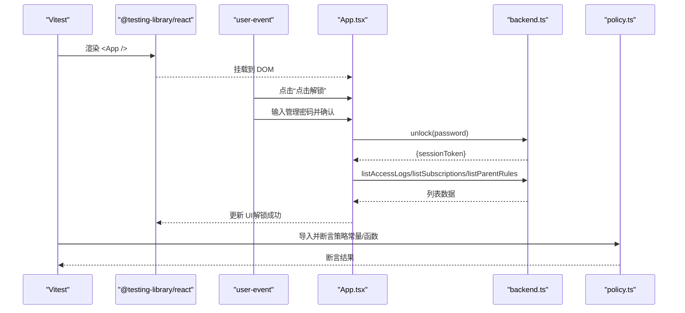
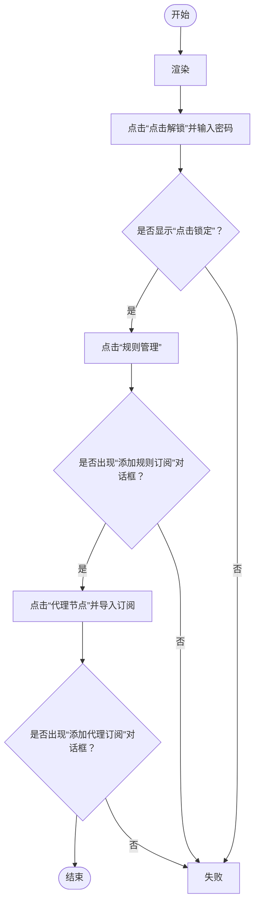
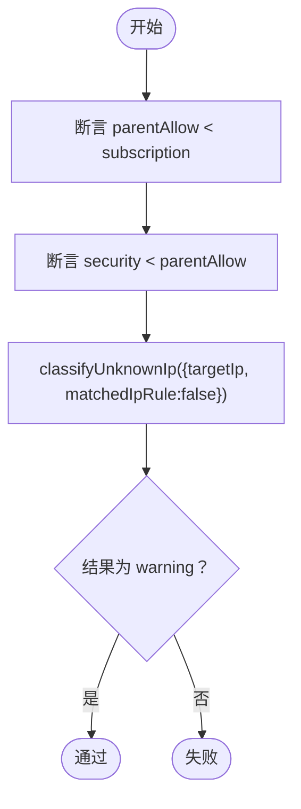
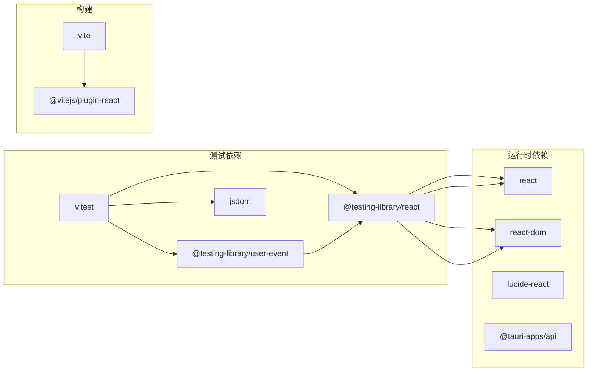

# 测试指南

<cite>
**本文引用的文件**
- [package.json](file://package.json)
- [vite.config.ts](file://vite.config.ts)
- [src/App.test.tsx](file://src/App.test.tsx)
- [src/policy.test.ts](file://src/policy.test.ts)
- [src/App.tsx](file://src/App.tsx)
- [src/backend.ts](file://src/backend.ts)
- [src/policy.ts](file://src/policy.ts)
</cite>

## 目录
1. [简介](#简介)
2. [项目结构](#项目结构)
3. [核心组件](#核心组件)
4. [架构总览](#架构总览)
5. [详细组件分析](#详细组件分析)
6. [依赖分析](#依赖分析)
7. [性能考虑](#性能考虑)
8. [故障排查指南](#故障排查指南)
9. [结论](#结论)
10. [附录](#附录)

## 简介
本指南面向 CleanWeb 前端与策略模块的测试实践，覆盖单元测试编写规范、测试框架配置、用例设计原则、集成与端到端策略、性能测试方法、测试数据与模拟对象使用、覆盖率要求以及持续集成建议。文档以现有测试样例 App.test.tsx 与 policy.test.ts 为基准，结合业务代码 App.tsx、后端桥接 backend.ts 与策略 policy.ts，给出可落地的最佳实践与扩展路径。

## 项目结构
CleanWeb 采用 Vite + React + Vitest 的前端工程化方案，测试相关要点如下：
- 测试运行脚本通过 npm scripts 暴露 test 命令，底层调用 vitest run。
- UI 测试使用 @testing-library/react 与 user-event，在 jsdom 环境中执行。
- 纯函数/策略逻辑测试直接导入被测模块进行断言。
- 后端交互通过 Tauri invoke 封装，浏览器预览模式提供轻量 mock 实现，便于无 Tauri 环境下的测试与开发。

图表来源
- [package.json:6-11](file://package.json#L6-L11)
- [src/App.test.tsx:1-6](file://src/App.test.tsx#L1-L6)
- [src/policy.test.ts:1-3](file://src/policy.test.ts#L1-L3)
- [src/backend.ts:1-5](file://src/backend.ts#L1-L5)

章节来源
- [package.json:6-11](file://package.json#L6-L11)
- [vite.config.ts:1-13](file://vite.config.ts#L1-L13)

## 核心组件
- 测试运行与脚本
  - 通过 package.json 的 scripts.test 统一入口，便于 CI 与本地一键运行。
- UI 测试（App.test.tsx）
  - 使用 @testing-library/react 渲染 App，配合 user-event 模拟点击与输入，验证解锁流程、页面导航与对话框打开等关键用户路径。
  - 使用 afterEach(cleanup) 清理 DOM，避免测试间状态污染。
- 策略测试（policy.test.ts）
  - 对策略优先级常量与未知 IP 分类函数进行断言，确保规则优先级与告警语义稳定。
- 后端桥接（backend.ts）
  - 在 Tauri 环境下调用原生能力；在非 Tauri 环境提供“浏览器预览”模式的轻量实现，返回默认数据或空集合，使 UI 测试无需真实后端即可运行。

章节来源
- [src/App.test.tsx:1-46](file://src/App.test.tsx#L1-L46)
- [src/policy.test.ts:1-17](file://src/policy.test.ts#L1-L17)
- [src/backend.ts:32-64](file://src/backend.ts#L32-L64)

## 架构总览
下图展示测试执行时各层关系：Vitest 驱动测试，UI 测试在 jsdom 中渲染 React 组件，用户事件由 user-event 注入；被测组件通过 backend.ts 访问后端能力，非 Tauri 模式下走浏览器预览实现。

图表来源
- [src/App.test.tsx:9-21](file://src/App.test.tsx#L9-L21)
- [src/backend.ts:42-46](file://src/backend.ts#L42-L46)
- [src/policy.test.ts:4-16](file://src/policy.test.ts#L4-L16)

## 详细组件分析

### 单元测试编写规范
- 命名与组织
  - 文件名以 .test.ts/.test.tsx 结尾，按功能域拆分（如 policy.test.ts）。
  - 使用 describe/it 分组与描述行为，保持“场景-动作-断言”的结构。
- 环境与环境隔离
  - UI 测试顶部声明 jsdom 环境，确保 DOM API 可用。
  - 使用 afterEach(cleanup) 清理 DOM，防止跨用例污染。
- 用户交互模拟
  - 使用 user-event 模拟点击、输入、键盘事件，尽量贴近真实用户操作。
  - 通过 role/name 等可访问性标识定位元素，提升稳定性与可维护性。
- 异步与等待
  - 对异步 UI 变更使用 findBy* 系列查询，避免硬编码 sleep。
- 断言策略
  - 优先断言可见 UI 状态与可访问性属性，其次断言内部状态变化。
  - 对纯函数/策略逻辑直接断言返回值与边界条件。

章节来源
- [src/App.test.tsx:1-7](file://src/App.test.tsx#L1-L7)
- [src/App.test.tsx:9-21](file://src/App.test.tsx#L9-L21)
- [src/policy.test.ts:1-17](file://src/policy.test.ts#L1-L17)

### 测试框架配置
- 运行器与插件
  - 使用 Vitest 作为测试运行器，React 插件用于 JSX 支持。
  - jsdom 作为 UI 测试环境，@testing-library/react 与 user-event 提供渲染与交互能力。
- 脚本入口
  - npm test 对应 vitest run，适合本地与 CI 统一执行。
- 构建与监听
  - vite.config.ts 中关闭清屏、固定端口、忽略 Tauri 目标目录，利于开发与测试体验。

章节来源
- [package.json:18-29](file://package.json#L18-L29)
- [package.json:6-11](file://package.json#L6-L11)
- [vite.config.ts:1-13](file://vite.config.ts#L1-L13)

### 测试用例设计原则
- 行为驱动
  - 从用户视角描述用例：例如“初始锁定，输入正确密码后解锁”。
- 最小必要依赖
  - 仅引入被测模块与其直接依赖，避免引入无关副作用。
- 可重复与幂等
  - 每个用例自包含初始化与清理，不依赖外部状态。
- 关注点分离
  - UI 交互与业务逻辑分层测试：UI 测试关注界面与流程，策略测试关注算法与优先级。

章节来源
- [src/App.test.tsx:17-30](file://src/App.test.tsx#L17-L30)
- [src/policy.test.ts:4-16](file://src/policy.test.ts#L4-L16)

### 现有测试模式与实践解析

#### App.test.tsx 模式
- 使用 describe 包裹“管理操作”场景，定义辅助函数 unlockManagement 复用解锁流程。
- 通过 findByRole 与 getByLabelText 定位按钮与输入框，模拟输入与点击，断言后续 UI 出现。
- 验证解锁后可进入“规则管理”，并可打开“添加订阅”对话框；再切换至“代理节点”打开“添加代理订阅”对话框。

图表来源
- [src/App.test.tsx:9-44](file://src/App.test.tsx#L9-L44)

章节来源
- [src/App.test.tsx:9-44](file://src/App.test.tsx#L9-L44)

#### policy.test.ts 模式
- 断言策略优先级常量大小关系，确保家长允许规则优于订阅但低于安全规则。
- 对 classifyUnknownIp 函数进行边界输入断言，未命中 IP 规则且无域名的情况应标记为警告。

图表来源
- [src/policy.test.ts:4-16](file://src/policy.test.ts#L4-L16)
- [src/policy.ts:1-22](file://src/policy.ts#L1-L22)

章节来源
- [src/policy.test.ts:4-16](file://src/policy.test.ts#L4-L16)
- [src/policy.ts:1-22](file://src/policy.ts#L1-L22)

### 集成测试方案
- 目标
  - 验证 App 与 backend.ts 的协作：解锁、设置更新、订阅创建/刷新、日志导出等。
- 策略
  - 在浏览器预览模式下，backend.ts 已提供轻量实现，可直接进行端到端流程测试。
  - 如需更贴近真实后端，可在测试中替换 backend.ts 的 isTauri 分支或使用模块替换机制（如 Vitest mocker）注入自定义实现。
- 建议
  - 将复杂流程拆分为多个小步骤的用例，逐步验证解锁→加载数据→操作→状态回写。
  - 对网络请求与耗时操作增加超时与错误路径断言。

章节来源
- [src/backend.ts:32-64](file://src/backend.ts#L32-L64)
- [src/App.tsx:21-53](file://src/App.tsx#L21-L53)

### 端到端测试策略
- 当前仓库未包含浏览器级 E2E 工具链。若需覆盖真实浏览器行为，可考虑引入 Playwright 或 Cypress，并与现有 Vitest 并行运行。
- 对于桌面应用特性（Tauri），可在 CI 中安装系统依赖后执行打包产物，或使用 tauri test 相关能力（如有）。

[本节为概念性内容，不直接分析具体文件]

### 性能测试方法
- 组件渲染性能
  - 使用 React Profiler 或 @testing-library/react 的 rerender 次数评估重渲染热点。
- 策略计算性能
  - 对 classifyUnknownIp 等函数构造大量输入样本，统计执行时间与内存占用。
- 大规模订阅与日志
  - 在浏览器预览模式下生成较大订阅与日志数据集，验证 UI 滚动与分页性能。

[本节为通用指导，不直接分析具体文件]

## 依赖分析
- 测试相关依赖
  - vitest、@testing-library/react、@testing-library/user-event、jsdom 均为 devDependencies。
- 运行时依赖
  - react、react-dom、lucide-react、@tauri-apps/api。
- 构建与插件
  - vite、@vitejs/plugin-react。

图表来源
- [package.json:12-29](file://package.json#L12-L29)

章节来源
- [package.json:12-29](file://package.json#L12-L29)

## 性能考虑
- 测试执行性能
  - 合理拆分测试文件，避免单用例过长导致阻塞。
  - 使用并发运行（Vitest 默认开启）提升整体速度。
- UI 渲染优化
  - 减少不必要的 re-render，利用 key、memo 等手段降低开销。
- 策略计算优化
  - 对高频调用的策略函数进行缓存或惰性计算，避免重复处理。

[本节为通用指导，不直接分析具体文件]

## 故障排查指南
- 常见问题
  - 找不到角色或标签：检查 aria-label/role 是否正确，必要时改用 data-testid。
  - 异步未就绪：使用 findBy* 替代 getBy*，避免竞态。
  - 环境差异：确认 jsdom 环境与浏览器差异，必要时补充 polyfill。
- 调试技巧
  - 打印屏幕快照与 HTML 树，定位元素缺失原因。
  - 针对 backend.ts 的浏览器预览实现，检查默认值是否符合预期。

章节来源
- [src/App.test.tsx:1-21](file://src/App.test.tsx#L1-L21)
- [src/backend.ts:32-64](file://src/backend.ts#L32-L64)

## 结论
CleanWeb 的测试体系以 Vitest 为核心，结合 Testing Library 与 jsdom，覆盖了关键的 UI 流程与策略逻辑。建议在现有基础上完善集成与端到端测试，建立覆盖率门槛与 CI 门禁，持续提升质量与交付效率。

[本节为总结性内容，不直接分析具体文件]

## 附录

### 测试数据准备
- 浏览器预览模式
  - backend.ts 在非 Tauri 环境提供默认设置、推荐源与空集合，可直接用于 UI 测试。
- 自定义数据
  - 可通过 Vitest 的模块替换或全局 setup 注入不同数据，覆盖更多分支。

章节来源
- [src/backend.ts:22-30](file://src/backend.ts#L22-L30)
- [src/backend.ts:82-106](file://src/backend.ts#L82-L106)

### 模拟对象使用
- 替换后端实现
  - 在测试中通过 Vitest mocker 或 import.meta.mock 替换 backend.ts 的 isTauri 分支，返回期望数据。
- 模拟定时器
  - 使用 vi.useFakeTimers 控制 setInterval/setTimeout，加速时间相关用例。

[本节为通用指导，不直接分析具体文件]

### 测试环境配置
- 环境变量
  - 可在测试中设置 __TAURI_INTERNALS__ 模拟 Tauri 环境，触发真实 invoke 分支（需要原生侧可用）。
- 配置文件
  - 如需集中配置 Vitest，可在根目录新增 vitest.config.ts，指定测试匹配模式、环境、覆盖率等。

[本节为通用指导，不直接分析具体文件]

### 测试覆盖率要求
- 建议指标
  - 行覆盖率 ≥ 80%，分支覆盖率 ≥ 70%，函数覆盖率 ≥ 80%。
- 报告输出
  - 在 CI 中生成覆盖率报告并上传至平台（如 Codecov），并在 PR 中展示增量覆盖率。

[本节为通用指导，不直接分析具体文件]

### 持续集成配置
- 基本步骤
  - 安装依赖 → 运行测试 → 生成覆盖率报告。
- 示例脚本
  - npm ci
  - npm test -- --coverage
- 并行与缓存
  - 启用依赖缓存与测试缓存，缩短流水线时长。

[本节为通用指导，不直接分析具体文件]

### 测试驱动开发（TDD）指导与最佳实践
- 先写失败用例，再实现最小满足逻辑，最后重构。
- 用例粒度适中，聚焦单一职责。
- 优先断言外部可见行为，避免耦合内部实现细节。
- 定期回归与快照对比，保障长期稳定性。

[本节为通用指导，不直接分析具体文件]