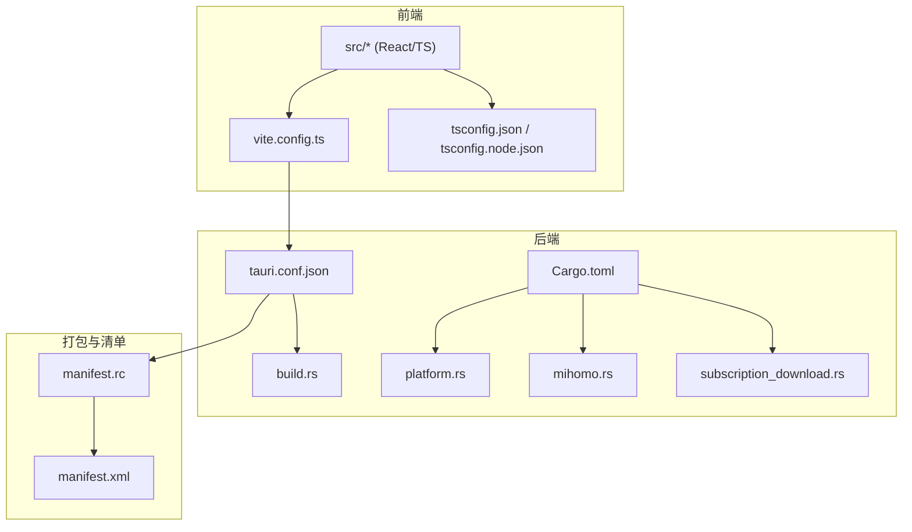
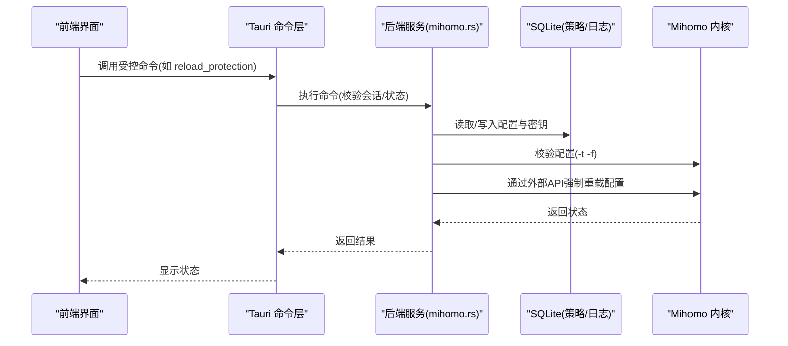
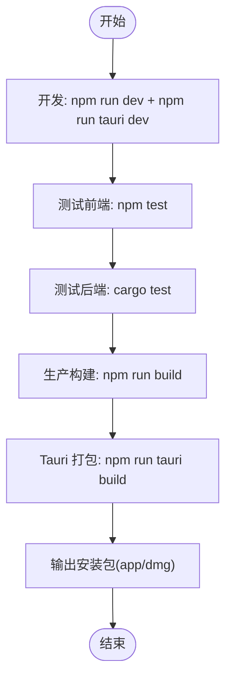
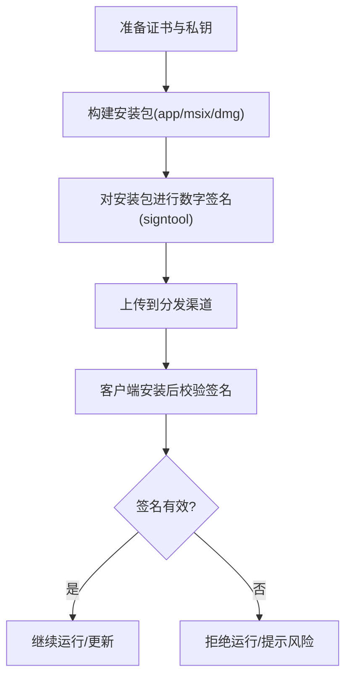
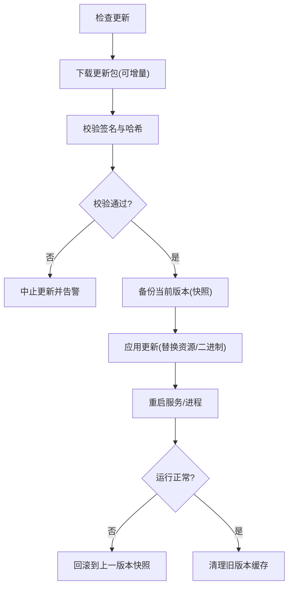
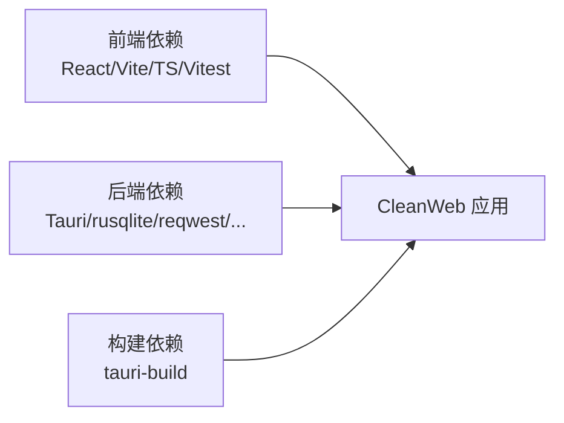

# 部署指南

<cite>
**本文引用的文件**   
- [README.md](file://README.md)
- [package.json](file://package.json)
- [vite.config.ts](file://vite.config.ts)
- [tsconfig.json](file://tsconfig.json)
- [tsconfig.node.json](file://tsconfig.node.json)
- [src-tauri/tauri.conf.json](file://src-tauri/tauri.conf.json)
- [src-tauri/Cargo.toml](file://src-tauri/Cargo.toml)
- [src-tauri/build.rs](file://src-tauri/build.rs)
- [src-tauri/manifest.rc](file://src-tauri/manifest.rc)
- [src-tauri/manifest.xml](file://src-tauri/manifest.xml)
- [src-tauri/src/platform.rs](file://src-tauri/src/platform.rs)
- [src-tauri/src/mihomo.rs](file://src-tauri/src/mihomo.rs)
- [src-tauri/src/subscription_download.rs](file://src-tauri/src/subscription_download.rs)
- [docs/architecture.md](file://docs/architecture.md)
- [docs/product-spec.md](file://docs/product-spec.md)
</cite>

## 目录
1. [简介](#简介)
2. [项目结构](#项目结构)
3. [核心组件](#核心组件)
4. [架构总览](#架构总览)
5. [详细组件分析](#详细组件分析)
6. [依赖分析](#依赖分析)
7. [性能考虑](#性能考虑)
8. [故障排除指南](#故障排除指南)
9. [结论](#结论)
10. [附录](#附录)

## 简介
本指南面向 CleanWeb 的构建、打包与部署，覆盖开发、测试与生产环境的构建配置；说明数字签名与验证流程（Windows 平台）；解释更新机制设计与实现（含增量更新与回滚策略）；记录不同平台的部署要求与注意事项；提供性能优化建议（资源压缩与启动时间优化）；并给出自动化脚本与持续交付流水线配置思路，以及常见问题排查方法。

CleanWeb 基于 Tauri 2 + React/TypeScript 前端与 Rust 后端，目标平台以 Windows 为主，后续扩展至 macOS。产品采用“本地策略引擎 + 独立代理内核”的边界设计，UI 通过受控命令与后端交互，不直接编辑生成的代理配置。

**章节来源**
- [README.md:1-34](file://README.md#L1-L34)
- [docs/architecture.md:1-52](file://docs/architecture.md#L1-L52)
- [docs/product-spec.md:1-106](file://docs/product-spec.md#L1-L106)

## 项目结构
仓库采用前后端分离的桌面应用结构：
- 前端：React + TypeScript + Vite，开发服务器默认端口 1420，Tauri 在开发模式下连接该地址。
- 后端：Rust（Tauri 2），负责策略存储、规则编译、日志、生命周期以及与网络核心的通信。
- 打包：Tauri 负责将前端产物与 Rust 二进制打包为各平台安装包。

**图表来源**
- [vite.config.ts:1-13](file://vite.config.ts#L1-L13)
- [tsconfig.json:1-22](file://tsconfig.json#L1-L22)
- [tsconfig.node.json:1-11](file://tsconfig.node.json#L1-L11)
- [src-tauri/tauri.conf.json:1-28](file://src-tauri/tauri.conf.json#L1-L28)
- [src-tauri/Cargo.toml:1-37](file://src-tauri/Cargo.toml#L1-L37)
- [src-tauri/build.rs:1-4](file://src-tauri/build.rs#L1-L4)
- [src-tauri/src/platform.rs:1-45](file://src-tauri/src/platform.rs#L1-L45)
- [src-tauri/src/mihomo.rs:270-313](file://src-tauri/src/mihomo.rs#L270-L313)
- [src-tauri/src/subscription_download.rs:50-146](file://src-tauri/src/subscription_download.rs#L50-L146)
- [src-tauri/manifest.rc:1-2](file://src-tauri/manifest.rc#L1-L2)
- [src-tauri/manifest.xml:1-11](file://src-tauri/manifest.xml#L1-L11)

**章节来源**
- [README.md:20-34](file://README.md#L20-L34)
- [package.json:1-31](file://package.json#L1-L31)
- [vite.config.ts:1-13](file://vite.config.ts#L1-L13)
- [src-tauri/tauri.conf.json:1-28](file://src-tauri/tauri.conf.json#L1-L28)

## 核心组件
- 前端构建与开发
  - 使用 Vite 作为开发与构建工具，React 插件启用，开发服务器固定端口 1420，严格占用端口，忽略 Rust target 目录热重载。
  - TypeScript 编译目标 ES2022，模块解析为 Bundler，开启严格模式与 JSX 转换。
- 后端与 Tauri 集成
  - Cargo 工程名 cleanweb，导出静态库、动态库与 rlib，供 Tauri 调用。
  - Tauri 配置定义产品名称、版本、标识符、窗口尺寸、打包目标（app、dmg）、图标与资源路径。
  - build.rs 调用 tauri_build::build() 完成代码生成。
- 系统能力与权限
  - Windows 清单声明需要管理员权限运行。
  - 跨平台抽象层 platform.rs 封装 OS 版本检测、网络冲突检测等。
- 代理内核交互
  - mihomo.rs 负责校验与下发配置到 Mihomo 内核，并通过其外部 API 触发重载。
- 订阅下载
  - subscription_download.rs 支持定时刷新订阅，包含大小限制与错误记录逻辑。

**章节来源**
- [package.json:6-11](file://package.json#L6-L11)
- [vite.config.ts:4-12](file://vite.config.ts#L4-L12)
- [tsconfig.json:1-22](file://tsconfig.json#L1-L22)
- [src-tauri/Cargo.toml:1-37](file://src-tauri/Cargo.toml#L1-L37)
- [src-tauri/build.rs:1-4](file://src-tauri/build.rs#L1-L4)
- [src-tauri/tauri.conf.json:1-28](file://src-tauri/tauri.conf.json#L1-L28)
- [src-tauri/manifest.xml:1-11](file://src-tauri/manifest.xml#L1-L11)
- [src-tauri/src/platform.rs:1-45](file://src-tauri/src/platform.rs#L1-L45)
- [src-tauri/src/mihomo.rs:270-313](file://src-tauri/src/mihomo.rs#L270-L313)
- [src-tauri/src/subscription_download.rs:50-146](file://src-tauri/src/subscription_download.rs#L50-L146)

## 架构总览
下图展示从 UI 到后端再到代理内核的关键调用链，体现“UI 不直接编辑配置，仅调用受控命令”的设计。

**图表来源**
- [src-tauri/src/mihomo.rs:270-313](file://src-tauri/src/mihomo.rs#L270-L313)
- [docs/architecture.md:1-52](file://docs/architecture.md#L1-L52)

## 详细组件分析

### 构建与打包流程（开发/测试/生产）
- 开发环境
  - 前端：npm run dev 启动 Vite 开发服务器（端口 1420）。
  - Tauri：npm run tauri dev 自动执行 beforeDevCommand 并连接 devUrl。
- 测试环境
  - 前端单元测试：npm test（Vitest）。
  - 后端单元测试：cargo test（由 Tauri 构建时触发 Rust 编译）。
- 生产环境
  - 前端构建：npm run build（tsc + vite build）。
  - Tauri 打包：npm run tauri build（会先执行 beforeBuildCommand 构建前端，再打包 app/dmg）。

**图表来源**
- [package.json:6-11](file://package.json#L6-L11)
- [vite.config.ts:7-11](file://vite.config.ts#L7-L11)
- [src-tauri/tauri.conf.json:6-11](file://src-tauri/tauri.conf.json#L6-L11)

**章节来源**
- [README.md:20-34](file://README.md#L20-L34)
- [package.json:6-11](file://package.json#L6-L11)
- [vite.config.ts:7-11](file://vite.config.ts#L7-L11)
- [src-tauri/tauri.conf.json:6-11](file://src-tauri/tauri.conf.json#L6-L11)

### 数字签名与完整性验证（Windows）
- 权限与清单
  - manifest.xml 声明 requireAdministrator，确保安装与运行时具备必要权限。
  - manifest.rc 将清单嵌入到资源中。
- 签名流程（建议）
  - 在 CI 中使用可信证书对最终安装包进行签名（例如 signtool）。
  - 发布前校验签名与哈希，确保未被篡改。
- 完整性校验（运行时）
  - 可在应用启动时对关键资源或配置文件计算哈希并与预期值比对。
  - 结合安全存储（DPAPI）保存密钥与校验信息。

**图表来源**
- [src-tauri/manifest.xml:1-11](file://src-tauri/manifest.xml#L1-L11)
- [src-tauri/manifest.rc:1-2](file://src-tauri/manifest.rc#L1-L2)

**章节来源**
- [src-tauri/manifest.xml:1-11](file://src-tauri/manifest.xml#L1-L11)
- [src-tauri/manifest.rc:1-2](file://src-tauri/manifest.rc#L1-L2)

### 更新机制设计与实现（含增量更新与回滚）
- 更新入口
  - 订阅下载模块支持按间隔拉取更新，可作为规则包或配置更新的参考实现。
- 增量更新
  - 建议对差异资源（规则、配置、二进制补丁）进行差分打包，并在客户端侧合并。
- 回滚策略
  - 保留上一版本的有效快照（文件或数据库备份），当新版本异常时快速回滚。
- 安全校验
  - 更新包需签名与哈希校验，失败则拒绝安装。

**图表来源**
- [src-tauri/src/subscription_download.rs:50-146](file://src-tauri/src/subscription_download.rs#L50-L146)
- [docs/product-spec.md:69-78](file://docs/product-spec.md#L69-L78)

**章节来源**
- [src-tauri/src/subscription_download.rs:50-146](file://src-tauri/src/subscription_download.rs#L50-L146)
- [docs/product-spec.md:69-78](file://docs/product-spec.md#L69-L78)

### 平台部署要求与注意事项
- Windows
  - 需要管理员权限（清单已声明）。
  - 首次运行可能触发 UAC 提示。
  - 若使用 TUN 捕获流量，需确保系统驱动与内核兼容性。
- macOS
  - 打包目标包含 dmg，需准备对应图标与签名证书。
  - 沙盒与安全策略会影响网络与文件系统访问。
- Linux
  - 当前未显式配置打包目标，如需支持需扩展 targets。

**章节来源**
- [src-tauri/tauri.conf.json:12-26](file://src-tauri/tauri.conf.json#L12-L26)
- [src-tauri/manifest.xml:1-11](file://src-tauri/manifest.xml#L1-L11)
- [docs/architecture.md:1-52](file://docs/architecture.md#L1-L52)

### 性能优化配置（资源压缩与启动时间）
- 前端
  - 保持 Vite 默认优化；可开启 gzip/brotli 压缩（在打包阶段或 CDN 层）。
  - 拆分路由与懒加载，减少首屏体积。
- 后端
  - 控制日志级别与轮转策略，避免 I/O 瓶颈。
  - 合理设置超时与并发，避免阻塞主线程。
- 启动时间
  - 延迟初始化非关键模块。
  - 预加载必要资源，避免冷启动时的网络请求。

[本节为通用指导，无需具体文件引用]

## 依赖分析
- 前端依赖
  - React、@tauri-apps/api、Vite、TypeScript、Vitest。
- 后端依赖
  - Tauri 2、rusqlite、reqwest、加密与序列化库等。
- 构建依赖
  - tauri-build 用于代码生成。

**图表来源**
- [package.json:12-29](file://package.json#L12-L29)
- [src-tauri/Cargo.toml:10-37](file://src-tauri/Cargo.toml#L10-L37)

**章节来源**
- [package.json:12-29](file://package.json#L12-L29)
- [src-tauri/Cargo.toml:10-37](file://src-tauri/Cargo.toml#L10-L37)

## 性能考虑
- 资源体积
  - 使用按需引入与 Tree Shaking，移除未使用依赖。
  - 图片与字体进行压缩与格式优化。
- 构建速度
  - 利用并行构建与缓存（esbuild、Rust 增量编译）。
- 运行时性能
  - 避免在主线程执行耗时任务，使用后台任务或消息队列。
  - 数据库查询加索引，减少全表扫描。

[本节为通用指导，无需具体文件引用]

## 故障排除指南
- 开发端口冲突
  - 现象：Vite 无法绑定 1420 端口。
  - 处理：释放端口或修改 vite.config.ts 中的端口配置。
- Tauri 无法连接前端
  - 现象：Tauri 启动后页面空白。
  - 处理：确认 devUrl 与端口一致，且 beforeDevCommand 成功。
- 权限不足
  - 现象：UAC 弹窗或功能不可用。
  - 处理：以管理员身份运行，检查 manifest.xml 的权限声明。
- 订阅下载失败
  - 现象：更新失败或报错。
  - 处理：检查网络连通性、响应码与大小限制，查看错误记录。
- 配置校验失败
  - 现象：reload_protection 返回校验错误。
  - 处理：根据错误信息修正配置，确保路径与参数正确。

**章节来源**
- [vite.config.ts:7-11](file://vite.config.ts#L7-L11)
- [src-tauri/tauri.conf.json:6-11](file://src-tauri/tauri.conf.json#L6-L11)
- [src-tauri/manifest.xml:1-11](file://src-tauri/manifest.xml#L1-L11)
- [src-tauri/src/subscription_download.rs:50-146](file://src-tauri/src/subscription_download.rs#L50-L146)
- [src-tauri/src/mihomo.rs:270-313](file://src-tauri/src/mihomo.rs#L270-L313)

## 结论
CleanWeb 的构建与打包流程清晰，依托 Tauri 2 与 Vite 实现了跨平台桌面应用的快速迭代。通过清单与签名机制保障可信度，结合订阅下载模块的思路可扩展为完整的更新与回滚体系。建议在 CI 中固化签名与校验步骤，完善增量更新与回滚策略，并根据平台特性调整打包目标与权限策略。

[本节为总结，无需具体文件引用]

## 附录

### 部署自动化脚本（示例思路）
- 本地一键构建
  - 脚本顺序：npm install → npm run build → npm run tauri build。
- CI 流水线（GitHub Actions 示例）
  - 触发条件：推送 tag 或合并到 main。
  - 步骤：
    - 设置 Node.js 与 Rust 环境。
    - 安装依赖并执行前端与后端测试。
    - 构建前端与后端。
    - 对安装包进行签名与校验。
    - 上传产物到发布渠道。
- 发布与回滚
  - 发布前进行签名与哈希校验。
  - 保留上一版本快照，出现异常时自动回滚。

[本节为通用指导，无需具体文件引用]