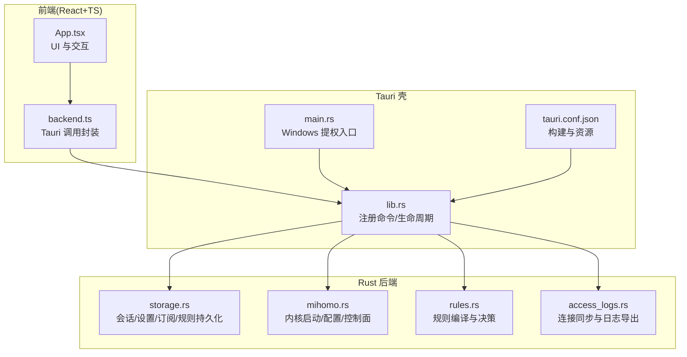
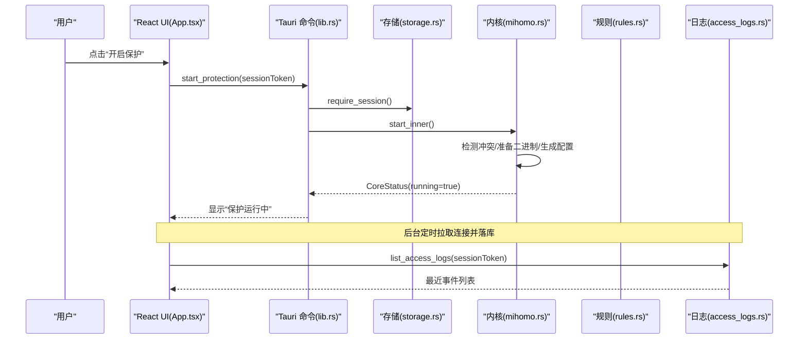
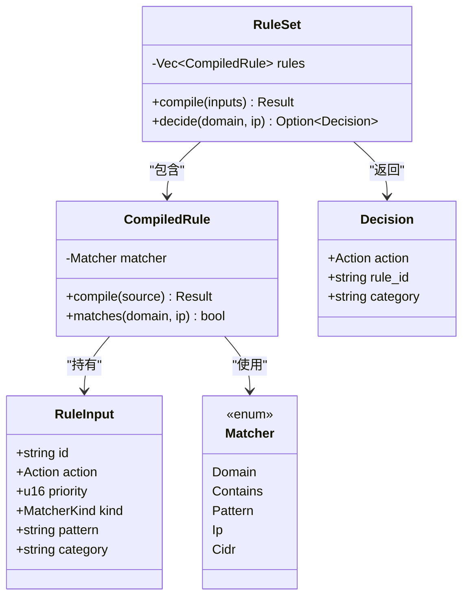
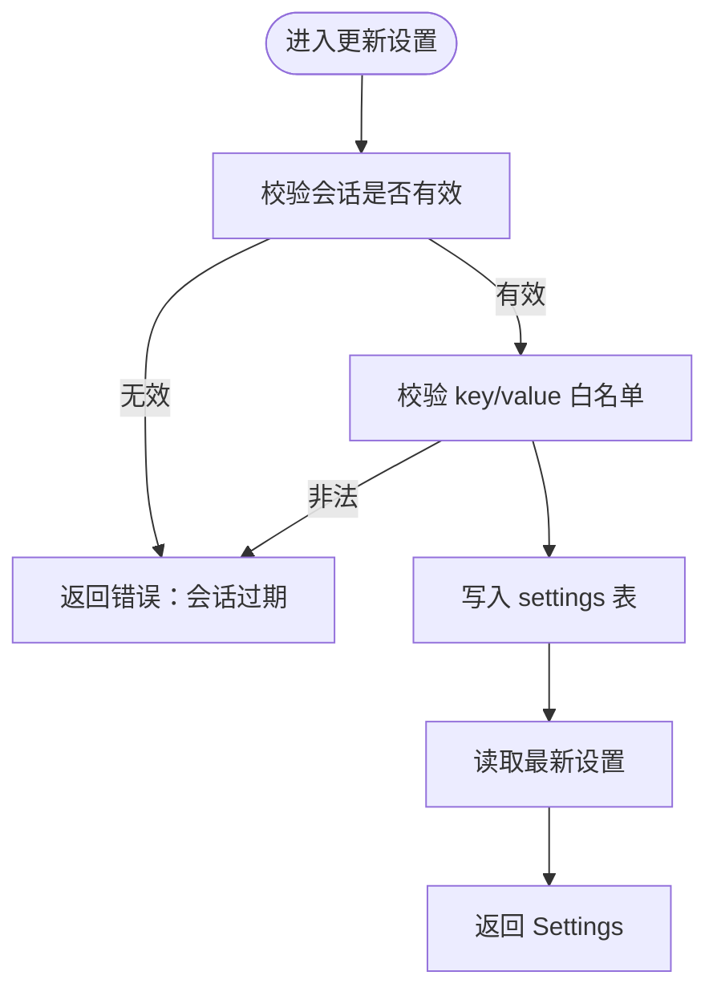
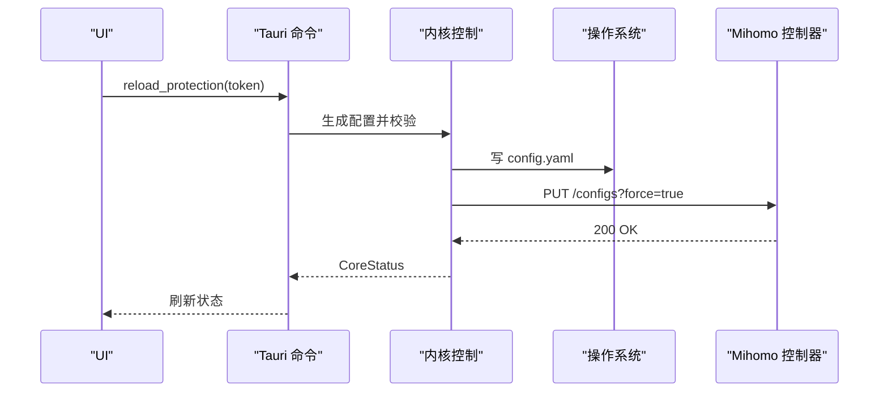
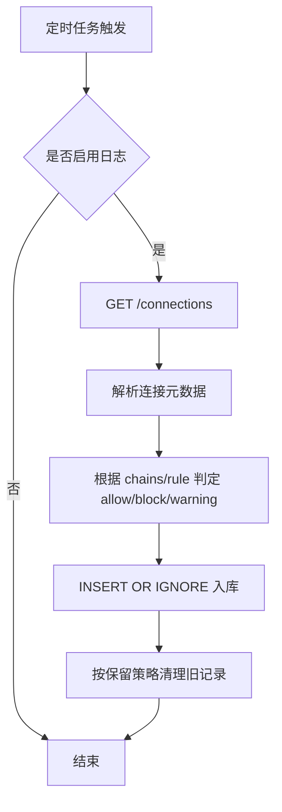
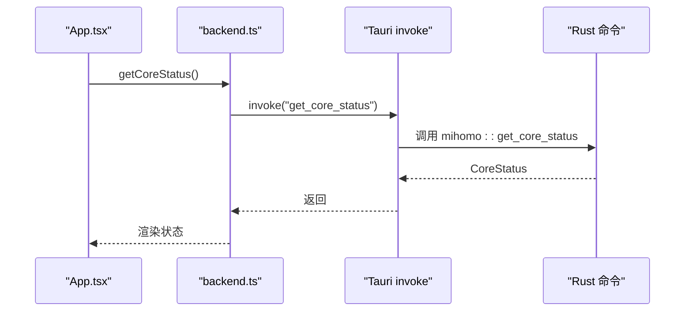
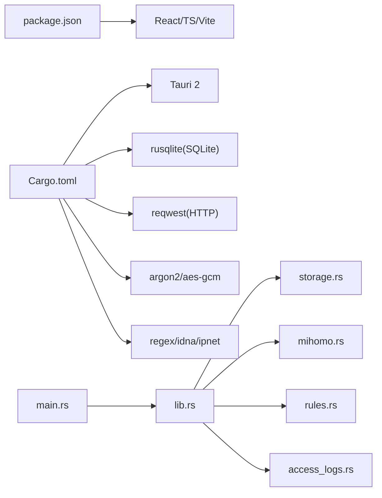

# 项目概述

<cite>
**本文引用的文件**   
- [README.md](file://README.md)
- [docs/product-spec.md](file://docs/product-spec.md)
- [docs/architecture.md](file://docs/architecture.md)
- [package.json](file://package.json)
- [src-tauri/Cargo.toml](file://src-tauri/Cargo.toml)
- [src-tauri/tauri.conf.json](file://src-tauri/tauri.conf.json)
- [src/App.tsx](file://src/App.tsx)
- [src/backend.ts](file://src/backend.ts)
- [src/policy.ts](file://src/policy.ts)
- [src-tauri/src/main.rs](file://src-tauri/src/main.rs)
- [src-tauri/src/lib.rs](file://src-tauri/src/lib.rs)
- [src-tauri/src/storage.rs](file://src-tauri/src/storage.rs)
- [src-tauri/src/mihomo.rs](file://src-tauri/src/mihomo.rs)
- [src-tauri/src/rules.rs](file://src-tauri/src/rules.rs)
- [src-tauri/src/access_logs.rs](file://src-tauri/src/access_logs.rs)
</cite>

## 目录
1. [简介](#简介)
2. [项目结构](#项目结构)
3. [核心组件](#核心组件)
4. [架构总览](#架构总览)
5. [详细组件分析](#详细组件分析)
6. [依赖关系分析](#依赖关系分析)
7. [性能与可扩展性](#性能与可扩展性)
8. [故障排查指南](#故障排查指南)
9. [结论](#结论)
10. [附录](#附录)

## 简介
CleanWeb 是一款 Windows 优先的家长网络过滤客户端，核心价值在于“内容安全优先于代理路由”。它通过本地策略引擎与独立分发的代理内核（Mihomo）协同工作，使家庭用户在使用网络代理的同时，仍能对域名、IP 和 CIDR 进行强管控。产品面向家长（管理员）与儿童（受控用户），提供系统级流量捕获、家长锁定配置、多维度过滤规则、订阅式规则与节点管理、访问日志与安全搜索强制等能力。V1 版本明确边界：不解密 HTTPS、未知域默认放行、服务失败时保持网络可用（fail-open）、不提供远程管理与多账户管理等高级特性。

## 项目结构
仓库采用前后端分离的桌面应用模式：前端使用 Tauri 2 + React + TypeScript，后端以 Rust 实现并通过 Tauri 命令暴露给前端；系统级能力由独立的 Windows 服务进程承载，确保 UI 关闭不影响保护运行。

图表来源
- [src/App.tsx:1-290](file://src/App.tsx#L1-L290)
- [src/backend.ts:1-137](file://src/backend.ts#L1-L137)
- [src-tauri/src/lib.rs:1-83](file://src-tauri/src/lib.rs#L1-L83)
- [src-tauri/src/main.rs:1-99](file://src-tauri/src/main.rs#L1-L99)
- [src-tauri/tauri.conf.json:1-28](file://src-tauri/tauri.conf.json#L1-L28)
- [src-tauri/src/storage.rs:1-800](file://src-tauri/src/storage.rs#L1-L800)
- [src-tauri/src/mihomo.rs:1-800](file://src-tauri/src/mihomo.rs#L1-L800)
- [src-tauri/src/rules.rs:1-270](file://src-tauri/src/rules.rs#L1-L270)
- [src-tauri/src/access_logs.rs:1-292](file://src-tauri/src/access_logs.rs#L1-L292)

章节来源
- [README.md:1-34](file://README.md#L1-L34)
- [docs/product-spec.md:1-106](file://docs/product-spec.md#L1-L106)
- [docs/architecture.md:1-52](file://docs/architecture.md#L1-L52)
- [package.json:1-31](file://package.json#L1-L31)
- [src-tauri/Cargo.toml:1-37](file://src-tauri/Cargo.toml#L1-L37)

## 核心组件
- 桌面 UI（React + TS）：提供概览、规则管理、代理节点三大页面，负责家长身份验证、开关保护、导入订阅、查看日志等交互。
- Tauri 命令层：将前端调用映射到 Rust 后端方法，统一会话校验与错误返回。
- 特权服务（Windows）：在 Release 自动请求管理员权限，保证 TUN 能力与系统级拦截。
- 规则引擎：将多种来源的规则标准化为可判定的记录，按优先级顺序匹配并返回决定与解释。
- 代理内核边界：Mihomo 作为独立分发程序，仅通过配置文件与外部 API 受控；CleanWeb 生成自身锁定的 DNS/TUN/过滤/路由配置。
- 存储层：SQLite 持久化策略、规则、订阅、代理元数据与访问日志；敏感信息经 DPAPI 加密。

章节来源
- [docs/architecture.md:1-52](file://docs/architecture.md#L1-L52)
- [src-tauri/src/main.rs:1-99](file://src-tauri/src/main.rs#L1-L99)
- [src-tauri/src/lib.rs:1-83](file://src-tauri/src/lib.rs#L1-L83)
- [src-tauri/src/storage.rs:1-800](file://src-tauri/src/storage.rs#L1-L800)
- [src-tauri/src/mihomo.rs:1-800](file://src-tauri/src/mihomo.rs#L1-L800)
- [src-tauri/src/rules.rs:1-270](file://src-tauri/src/rules.rs#L1-L270)
- [src-tauri/src/access_logs.rs:1-292](file://src-tauri/src/access_logs.rs#L1-L292)

## 架构总览
CleanWeb 采用“前后端分离”的桌面应用模式：前端专注体验与可视化，后端承担高内聚的系统能力与策略执行。该模式带来以下优势：
- 职责清晰：UI 不直接编辑生成的代理配置，仅通过类型安全的命令操作后端。
- 稳定性强：UI 关闭不影响后台服务与保护运行。
- 安全性好：特权操作集中在后端，最小化暴露面。
- 可维护性高：前后端可独立迭代，便于测试与扩展。

图表来源
- [src/App.tsx:1-290](file://src/App.tsx#L1-L290)
- [src-tauri/src/lib.rs:1-83](file://src-tauri/src/lib.rs#L1-L83)
- [src-tauri/src/storage.rs:1-800](file://src-tauri/src/storage.rs#L1-L800)
- [src-tauri/src/mihomo.rs:1-800](file://src-tauri/src/mihomo.rs#L1-L800)
- [src-tauri/src/access_logs.rs:1-292](file://src-tauri/src/access_logs.rs#L1-L292)

## 详细组件分析

### 组件一：规则引擎（rules.rs）
规则引擎负责将输入规则编译为可快速匹配的判定器，并按优先级顺序返回首个命中项。支持精确、后缀、包含、通配符、正则、IP、CIDR 等多种匹配方式，并对域名进行规范化处理。

图表来源
- [src-tauri/src/rules.rs:1-270](file://src-tauri/src/rules.rs#L1-L270)

章节来源
- [src-tauri/src/rules.rs:1-270](file://src-tauri/src/rules.rs#L1-L270)

### 组件二：存储与会话（storage.rs）
存储模块负责：
- 初始化数据库与默认设置
- 管理家长密码哈希与会话令牌（带过期时间）
- 增删改查订阅、父级规则、代理选择
- 限制允许的设置键值范围，防止越权修改

图表来源
- [src-tauri/src/storage.rs:1-800](file://src-tauri/src/storage.rs#L1-L800)

章节来源
- [src-tauri/src/storage.rs:1-800](file://src-tauri/src/storage.rs#L1-L800)

### 组件三：代理内核控制（mihomo.rs）
内核控制模块负责：
- 检测网络冲突（其他 VPN/TUN）
- 下载/校验 Mihomo 二进制
- 生成并原子写入配置（含 TUN/DNS/Sniffer/Proxy 等）
- 启动/停止/重载内核，轮询健康日志
- 通过控制器 API 查询/选择节点、测速

图表来源
- [src-tauri/src/mihomo.rs:1-800](file://src-tauri/src/mihomo.rs#L1-L800)

章节来源
- [src-tauri/src/mihomo.rs:1-800](file://src-tauri/src/mihomo.rs#L1-L800)

### 组件四：访问日志（access_logs.rs）
访问日志模块周期性从内核控制器拉取连接信息，合并分类与路由信息后落库，并提供筛选、清空与 CSV 导出能力。

图表来源
- [src-tauri/src/access_logs.rs:1-292](file://src-tauri/src/access_logs.rs#L1-L292)

章节来源
- [src-tauri/src/access_logs.rs:1-292](file://src-tauri/src/access_logs.rs#L1-L292)

### 组件五：前端与命令桥接（App.tsx + backend.ts）
前端通过 backend.ts 封装所有 Tauri 调用，并在浏览器预览模式下提供轻量模拟数据，便于开发调试。App.tsx 组织页面导航、解锁流程、设置变更与实时状态轮询。

图表来源
- [src/App.tsx:1-290](file://src/App.tsx#L1-L290)
- [src/backend.ts:1-137](file://src/backend.ts#L1-L137)
- [src-tauri/src/lib.rs:1-83](file://src-tauri/src/lib.rs#L1-L83)

章节来源
- [src/App.tsx:1-290](file://src/App.tsx#L1-L290)
- [src/backend.ts:1-137](file://src/backend.ts#L1-L137)

## 依赖关系分析
- 前端依赖：React、Tauri API、图标库与构建工具链。
- 后端依赖：Tauri 运行时、SQLite、HTTP 客户端、加密与序列化库、正则与 IP 解析库。
- 平台能力：Windows 提权与进程管理、macOS 登录代理安装与窗口隐藏。

图表来源
- [package.json:1-31](file://package.json#L1-L31)
- [src-tauri/Cargo.toml:1-37](file://src-tauri/Cargo.toml#L1-L37)
- [src-tauri/src/main.rs:1-99](file://src-tauri/src/main.rs#L1-L99)
- [src-tauri/src/lib.rs:1-83](file://src-tauri/src/lib.rs#L1-L83)

章节来源
- [package.json:1-31](file://package.json#L1-L31)
- [src-tauri/Cargo.toml:1-37](file://src-tauri/Cargo.toml#L1-L37)

## 性能与可扩展性
- 规则匹配优化：先评估精确与后缀索引，再回退到通配符与正则，降低昂贵匹配开销。
- 配置热重载：通过控制器 API 增量更新，避免重启内核带来的抖动。
- 日志批处理：后台线程周期同步连接并批量入库，减少 UI 阻塞。
- 可扩展点：新增规则源格式、新增安全搜索引擎映射、扩展代理组展示与测速指标。

[本节为通用指导，无需源码引用]

## 故障排查指南
- 无法启动内核
  - 现象：提示检测到其他 VPN/TUN 或启动后立即退出。
  - 排查：关闭冲突软件，检查健康日志最后若干行，确认 TUN 设备名与端口占用。
  - 参考路径：[src-tauri/src/mihomo.rs:182-258](file://src-tauri/src/mihomo.rs#L182-L258)
- 会话过期或无法解锁
  - 现象：提示“管理会话已过期，请重新解锁”。
  - 排查：确认密码正确且未超时；必要时重新初始化密码。
  - 参考路径：[src-tauri/src/storage.rs:265-276](file://src-tauri/src/storage.rs#L265-L276), [src-tauri/src/storage.rs:430-456](file://src-tauri/src/storage.rs#L430-L456)
- 规则不生效
  - 现象：期望拦截但被放行。
  - 排查：检查规则优先级与来源覆盖关系；确认父级规则与订阅分类是否正确。
  - 参考路径：[src-tauri/src/rules.rs:126-147](file://src-tauri/src/rules.rs#L126-L147), [docs/product-spec.md:53-68](file://docs/product-spec.md#L53-L68)
- 日志为空或无变化
  - 现象：访问记录未更新。
  - 排查：确认“访问日志”开关与保留策略；检查后台同步是否运行。
  - 参考路径：[src-tauri/src/access_logs.rs:79-126](file://src-tauri/src/access_logs.rs#L79-L126), [src-tauri/src/access_logs.rs:219-241](file://src-tauri/src/access_logs.rs#L219-L241)

章节来源
- [src-tauri/src/mihomo.rs:182-258](file://src-tauri/src/mihomo.rs#L182-L258)
- [src-tauri/src/storage.rs:265-276](file://src-tauri/src/storage.rs#L265-L276)
- [src-tauri/src/storage.rs:430-456](file://src-tauri/src/storage.rs#L430-L456)
- [src-tauri/src/rules.rs:126-147](file://src-tauri/src/rules.rs#L126-L147)
- [docs/product-spec.md:53-68](file://docs/product-spec.md#L53-L68)
- [src-tauri/src/access_logs.rs:79-126](file://src-tauri/src/access_logs.rs#L79-L126)
- [src-tauri/src/access_logs.rs:219-241](file://src-tauri/src/access_logs.rs#L219-L241)

## 结论
CleanWeb 以“内容安全优先”的产品定位，结合 Tauri 2 + React + Rust 的前后端分离架构，实现了稳定可靠的系统级网络过滤与代理管理能力。V1 版本聚焦 Windows 场景，明确了功能边界与 fail-open 策略，既保障用户体验，又兼顾家长的可控性与可审计性。后续可在规则生态、跨平台适配与更强反绕过能力上持续演进。

[本节为总结，无需源码引用]

## 附录

### V1 产品边界与技术约束
- 平台与环境：Windows 优先，macOS 后续跟进；管理员为家长，受控者为儿童。
- 能力清单：系统级流量捕获、家长锁定配置、多维过滤规则、订阅兼容、代理节点与分组导入、本地访问日志、安全搜索强制。
- 明确不在范围内：未知与新注册域名默认放行、直连未知 IP 告警但不阻断、HTTPS 不解密、无中间页、服务失败保持网络可用、多账户/云端管理/OpenVPN 共存等。
- 策略优先级：完整性与反绕过 > 高风险安全 > 家长黑名单 > 家长白名单 > 核心内容安全 > 可选内容 > 第三方订阅 > 代理路由 > 默认放行。

章节来源
- [docs/product-spec.md:1-106](file://docs/product-spec.md#L1-L106)
- [README.md:1-34](file://README.md#L1-L34)

### 术语对照
- 规则来源：Clash/Mihomo、Adblock、Hosts、域名/IP 列表、安全搜索映射。
- 动作：拦截（阻止访问）、代理放行（走代理）、直连放行（不走代理）。
- 匹配方式：精确域名、域名及子域名、关键词包含、通配符、正则表达式、IP、CIDR。
- 代理组类型：手动选择、自动测速、Fallback、LoadBalance 等。

章节来源
- [src-tauri/src/storage.rs:1-800](file://src-tauri/src/storage.rs#L1-L800)
- [src-tauri/src/mihomo.rs:1-800](file://src-tauri/src/mihomo.rs#L1-L800)
- [src-tauri/src/rules.rs:1-270](file://src-tauri/src/rules.rs#L1-L270)